# Part 5: Lecture 19 to Lecture 25

!!! Abstract "Table of Contents"

    - [x] [Lecture 19: Generative Models I](#lecture-19-generative-models-i)
    - [x] [Lecture 20: Generative Models II](#lecture-20-generative-models-ii)
    - [ ] [Lecture 21: Visualizing Models & Generative Images](#lecture-21-visualizing-models-generative-images)
    - [ ] [Lecture 22: Self-Supervised Learning](#lecture-22-self-supervised-learning)
    - [ ] [Lecture 23: 3D Vision](#lecture-23-3d-vision)
    - [ ] [Lecture 24: Videos](#lecture-24-videos)
    - [ ] [Lecture 25: Conclusion & Open Problems](#lecture-25-conclusion-open-problems)

## Lecture 19: Generative Models I

首先我们区分**监督学习/Supervised Learning** 和 **无监督学习/Unsupervised Learning** 两种范式：

- 监督学习：接受的数据为 $(x, y)$，x 是输入、y 是标签，目标是学习一个函数 $f: x \to y$，给定输入预测标签。典型的例子有：分类/Classification、回归/Regression、物体检测/Object Detection、语义分割/Semantic Segmentation、图像描述/Image Captioning 等等。
- 无监督学习：接受的数据只有 $x$，目标是学习到数据的潜在结构。典型的例子有：聚类/Clustering、降维/Dimensionality Reduction、特征学习/Feature Learning、自编码器/Autoencoders、密度估计/Density Estimation 等等。

监督学习和无监督学习的区别在于数据是否有标签标注，生成模型是实现无监督学习、学习数据潜在结构的一种重要方法。下面我们可以根据使用的潜在概率结构的模型分为三类：

- 判别模型/Discriminative Model：学习条件概率分布 $p(y \mid x)$，给定输入 $x$ 预测标签 $y$。由于 $\displaystyle \int_y p (y \mid x)\, \mathrm{d}y = 1$，对于一个输入，其可能的标签类别会互相竞争。但是判别模型无法拒绝不合理的输入，比如我们的标签只有猫和狗，但是输入是一个猴子的图片，模型仍然会强行给出一个分类结果，而无法拒绝这个输入。
- 生成模型/Generative Model：学习数据的分布 $p(x)$，给定一个输入 $x$，输出这个输入发生的概率，这意味着生成模型对输入进行建模，这就要求模型必须深入理解视觉信息和潜在结构。生成模型内所有的可能输入会相互竞争，合理的输入会被分配高概率，而不合理的输入会被分配低概率，因此生成模型可以拒绝不合理的输入。注意到生成模型实际上对输入进行建模，实际上我们可以通过从 $p(x)$ 中采样来生成新的数据。
- 条件生成模型/Conditional Generative Model：学习条件概率分布 $p(x \mid y)$，给定标签 $y$，输出符合该标签的输入 $x$ 的概率分布，比如给定标签猫，生成模型建模输入为猫的图像分布。回忆贝叶斯法则：$p(x \mid y) = \dfrac{p(y \mid x)}{p(y)} p(x)$，我们可以使用生成模型、判别模型和标签的先验概率 $p(y)$ 来构建条件生成模型。

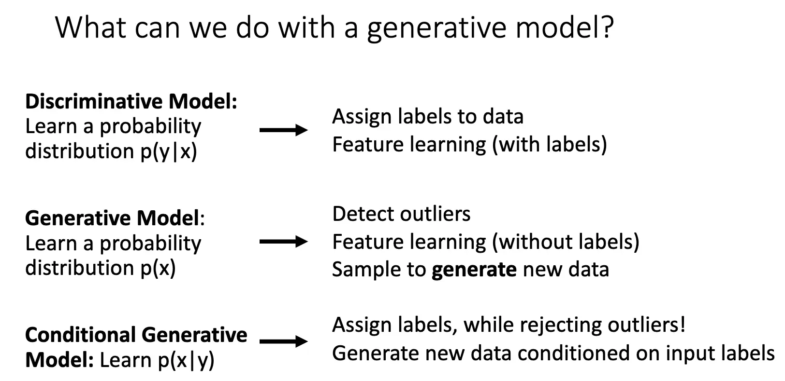

本节讨论生成模型，生成模型可以按照是否能够显式计算出数据的概率分布 $p(x)$ 来分类：Autoregressive Models 可以显式计算出 $p(x)$ 的具体数值，另一种是计算出 $p(x)$ 的近似值，如果使用变分推断，那么就得到了变分自编码器/Variational Autoencoder/VAE，如果使用马尔可夫链方法，那我们就得到了玻尔兹曼机/Boltzmann Machine；另一种类型是不直接计算出 $p(x)$，而是通过采样来生成数据，比如生成对抗网络/Generative Adversarial Networks/GANs。

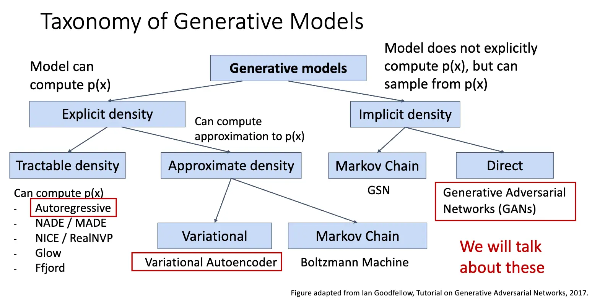

本节我们主要讨论 Autoregressive Models 和 VAE，下一节是 GAN 的内容。

自回归模型/Autoregressive Models 的目标是直接建模数据的概率分布 $p(x) = f(x, W)$，其中 $x$ 是输入数据，$W$ 是模型的参数，对于一系列的训练数据 $x^{(1)}, x^{(2)}, \ldots, x^{(N)}$，使用最大似然估计/Maximum Likelihood Estimation/MLE 来训练模型，寻找一个可以以最大的概率输出训练数据的参数集合：

$$
\begin{aligned}
W^* &= \operatorname*{\arg\max}_W \prod_{i=1}^N p(x^{(i)}) \\
&= \operatorname*{\arg\max}_W \sum_{i=1}^N \log p(x^{(i)}) \\
&= \operatorname*{\arg\max}_W \sum_{i=1}^N \log f(x^{(i)}, W)
\end{aligned}
$$

最后一行就是我们优化的目标，令 $f$ 为参数为 $W$ 的神经网络，我们使用梯度方法来优化它。

假设 $x$ 由不同部分组成——这是比较符合逻辑的，比如图像由像素组成，文本由单词组成，我们可以将 $x$ 看作一个序列 $(x_1, x_2, \ldots, x_T)$，使用概率的链式法则/Chain Rule 将联合概率分解为条件概率的乘积：

$$
\begin{aligned}
p(x) &= p(x_1, x_2, \ldots, x_T) \\
&= p(x_1) \cdot p(x_2 \mid x_1) \cdot p(x_3 \mid x_1, x_2) \cdots p(x_T \mid x_1, \ldots, x_{T-1}) \\
&= \prod_{t=1}^T p(x_t \mid x_1, \ldots, x_{t-1}) \\
\end{aligned}
$$

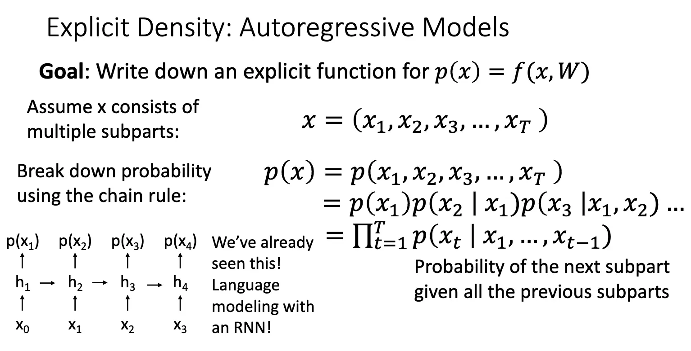

这个式子的基石是整个内容的下一部分在某种意义上依赖于前面内容的假设/事实，将图像生成问题转化成了一个预测问题，每一次只需要预测下一个像素是什么就可以，而自回归的名字就来源于此，模型通过预测/回归自身的历史部分来定义整个分布。我们使用 RNN 来进行建模，这就是 PixelRNN。

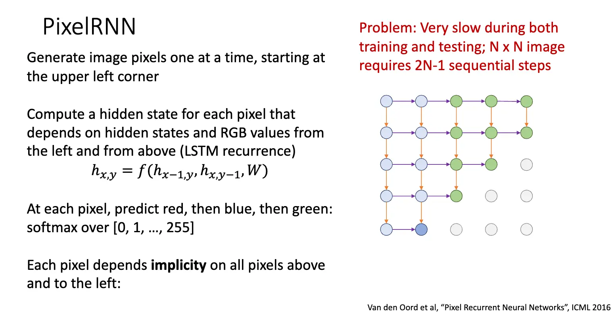

PixelRNN 从左上角的像素开始生成图像，一点一点向外扩展，每次生成一些像素，生成当前像素的时候，依赖于它左边和上边的像素，这样每一次生成的像素都隐式地依赖于其左面和上面的所有像素。

方法是一个好方法，但是其问题在于其训练和测试的时候都需要串行地逐个生成像素，使得其速度非常慢，比如生成一个 $N \times N$ 的图像需要进行 $2N-1$ 次计算。并且在我看来，像素之间的关系未必有这么强烈，尽管相邻的像素之间存在很强的相关性，但是未必可以使用条件概率进行建模，从左到右生成依赖性也未必是最好的选择，大概只是一种架构上的设计。

PixelCNN 是 PixelRNN 的改进版本，使用卷积神经网络/CNN 来进行建模，将像素之间的依赖通过卷积核进行建模，在训练模型的时候，我们认为每一个像素都依赖于以它为中心的卷积核覆盖的区域内的像素，这样训练就可以高度并行化，大大加快训练速度。在生成图像的时候，认为每一个像素都依赖于它左边和上边的像素，这样生成图像的时候仍然需要串行地逐个生成像素。

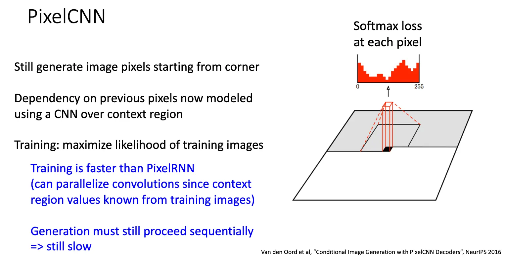

与自回归模型不同，变分自编码器/Variational Autoencoder/VAE 并不直接对数据的概率分布 $p(x)$ 进行建模，其定义了一个隐式的、无法直接计算或者优化的密度函数，我们通过优化该密度函数的下界来进行间接优化。

要理解 VAE，我们首先需要理解自编码器/Autoencoder：常规的/非变分的自编码器希望从输入数据 $x$ 中无监督地提取数据的特征向量 $z$/隐含表示，这样的自编码器提取的表示应该是对下游工作有意义的，比如分类、检测等任务。训练自编码器的方法也很直接——如果我们可以一起训练一个解码器，使得其可以从特征向量 $z$ 重构出原始数据 $x$，那么或许我们就可以认为提取出的特征是有意义的或者者说包含了数据的潜在结构。

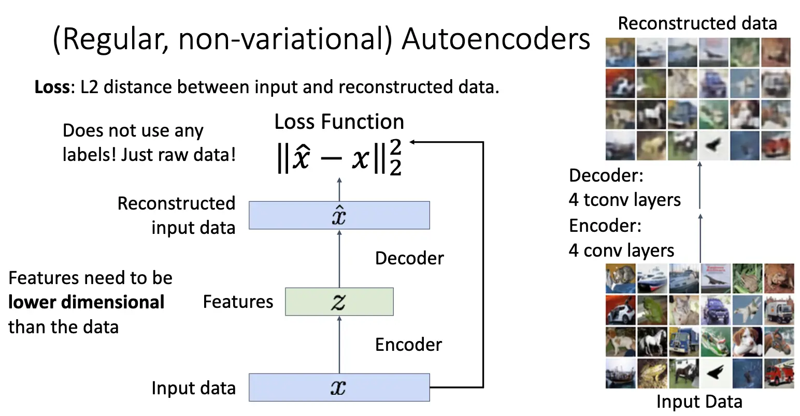

上张图展示了一个简单的自编码器架构以及训练方式，直接使用重构出来的数据和原来的输入数据的 L2 损失作为训练目标，现在常见的架构是使用卷积神经网络/CNN 作为编码器和解码器。在训练结束之后，我们丢弃解码器，保留编码器作为特征提取器使用，将其接入下面的分类等任务或者用来初始化一个监督模型。

当然我们不希望模型全程学习到的是一个简单的恒等映射，因此我们需要对编码器提取的特征向量 $z$ 进行瓶颈处理，比如限制 $z$ 的维度小于 $x$ 的维度，迫使模型学习到数据的潜在结构。

如果只从提取潜在表示的角度来看，这样的自编码器是有意义的，但是它有一个很大的缺陷：它不是概率性的模型，我们无法从中采样出新的数据点，而我们希望使用更强大的方式构建出一个带有结构的样本空间，进而可以进行插值或者采样。我们使用变分推断的方法改进这样的模型，得到变分自编码器/VAE：

在变分自编码器上，我们做的事情略有不同，我们将隐变量 $z$ 视为一个概率分布，当要采样新的数据的时候，我们首先从隐变量的先验分布 $p_{\theta^*}(z)$ 中采样一个 $z$，然后将 $z$ 输入解码器，解码器输出数据的概率分布 $p_{\theta^*}(x \mid z)$，从这个分布中采样出新的数据点。这个先验分布 $p_{\theta^*}(z)$ 和条件分布 $p_{\theta^*}(x \mid z)$ 都应该比较简单，比如高斯分布（这样解码器输出的实际上就是该高维高斯分布的均值 $\mu_{x|z}$ 和协方差 $\Sigma_{x|z}$，另外，更多的时候我们指定这个协方差矩阵是一个对角矩阵，这样可以简化计算和存储），而隐变量的先验分布应该提前指定好——这恰符合先验分布之名，其一般是一个标准正态分布，指定了隐变量空间的结构，要求所有的有意义的隐变量都处在原点附近。解码器的参数通过训练习得。

在训练的时候，自然而然的想法就是通过最大似然估计来训练模型，如果对每一个 $x$ 都可以观测出对应的 $z$，那么我们就可以训练出来条件分布 $p_\theta(x \mid z)$，这样就可以最大化

$$
p_\theta (x) = \int_z p_\theta (x \mid z) p(z) \, \mathrm{d}z
$$

来训练参数 $\theta$，虽然 $p_\theta (x \mid z)$ 和 $p(z)$ 都比较简单，但是我们无法对所有的 $z$ 进行积分，积分完全无法进行计算，这个想法行不通。但是我们可以使用贝叶斯定理将其转化为后验概率 $p_\theta (z \mid x)$ 的形式：

$$
p_\theta (x) = \frac{p_\theta (x \mid z) p(z)}{p_\theta (z \mid x)} \approx \frac{p_\theta (x \mid z) p(z)}{q_\phi (z \mid x)}
$$

对于第一个分式，首先 $p_\theta (x \mid z)$ 是解码器输出的条件概率，完全可以计算，先验分布 $p(z)$ 也是已知的，因此分子部分是可以计算的，问题在于后验概率 $p_\theta (z \mid x)$，我们无法计算出这个概率，因此我们引入一个新的神经网络 $q_\phi (z \mid x)$ 来近似这个后验概率，这个网络称为编码器，编码器接受输入 $x$，输出隐变量 $z$ 的概率分布，通常也是高斯分布，其均值 $\mu_{z|x}$ 和协方差 $\Sigma_{z|x}$ 由编码器网络输出。这样，如果我们可以近似 $p_\theta (z \mid x) \approx q_\phi (z \mid x)$，那么我们就可以计算出 $p_\theta (x)$ 了。训练方式也比较直接，我们可以使用最大似然一起训练编码器和解码器。

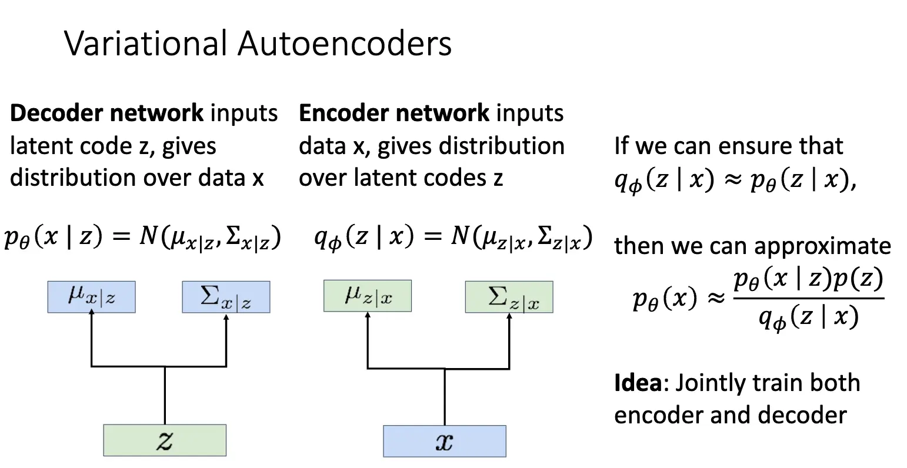

下面我们开始对似然 $p_\theta (x)$ 进行数学推导，推导的目标是得到一个可计算的、并且和 $\log p_\theta (x)$ 相关的新的目标函数，这个新的目标函数称为证据下界/Evidence Lower Bound/ELBO。

$$\begin{aligned}
\log p_\theta (x) &= \log \frac{p_\theta (x \mid z) p(z)}{p_\theta (z \mid x)} = \log \frac{p_\theta (x \mid z) p(z) q_\phi (z \mid x)}{p_\theta (z \mid x) q_\phi (z \mid x)} \\
&= \log p_\theta (x \mid z) - \log \frac{q_\phi (z \mid x)}{p (z)} + \log \frac{q_\phi (z \mid x)}{p_\theta (z \mid x)} \\
\end{aligned}$$

注意到对一个与 $z$ 无关的取期望不会改变其值，我们对上式两边同时取期望：

$$\begin{aligned}
\log p_\theta (x) &= \mathbb{E}_{z \sim q_\phi (z \mid x)} [\log p_\theta (x)] \\
&= \mathbb{E}_z [\log p_\theta (x \mid z)] - \mathbb{E}_z \left[ \log \frac{q_\phi (z \mid x)}{p (z)} \right] + \mathbb{E}_z \left[ \log \frac{q_\phi (z \mid x)}{p_\theta (z \mid x)} \right] \\
&= \mathbb{E}_{z \sim q_\phi (z \mid x)} [\log p_\theta (x \mid z)] - D_{KL}(q_\phi (z \mid x) \parallel p(z)) + D_{KL}(q_\phi (z \mid x) \parallel p_\theta (z \mid x)) \\
&\geq \mathbb{E}_{z \sim q_\phi (z \mid x)} [\log p_\theta (x \mid z)] - D_{KL}(q_\phi (z \mid x) \parallel p(z))\\
\end{aligned}$$

对于倒数第二行，这三项都是有意义的：第一项代表数据重构/Data Reconstruction，表示从隐变量 $z$ 重构出数据 $x$ 的能力；第二项是先验分布和解码器输出的隐变量分布之间的 KL 散度，表示隐变量分布和先验分布之间的差异，我们希望这个差异尽可能小，这样隐变量分布就会接近先验分布，从而可以从先验分布中采样出合理的隐变量；第三项是编码器输出的隐变量分布和解码器输出的隐变量客观的后验分布之间的 KL 散度，根本无法计算，但是 KL 散度非负，因此我们得到了一个下界，这个下界就是 ELBO，我们可以最大化 ELBO 来间接地最大化 $\log p_\theta (x)$，进而一起训练编码器网络和解码器网络。

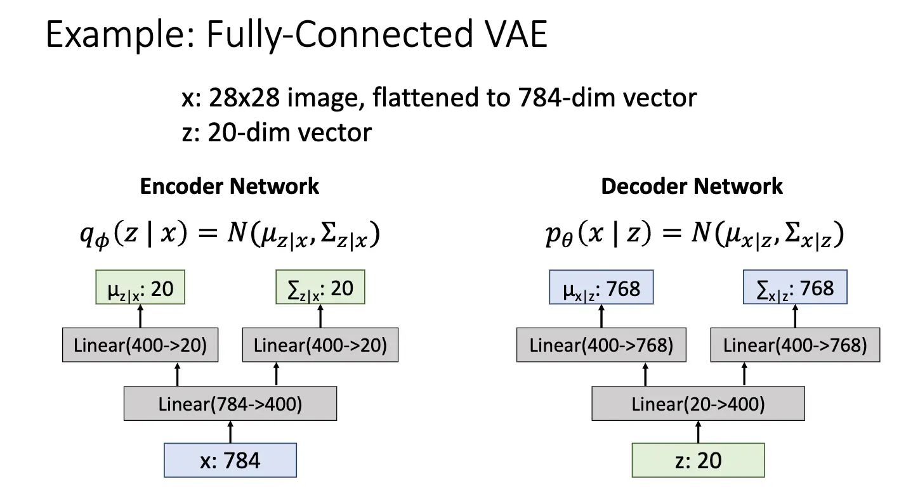

训练过程如下：我们需要知道 KL 散度部分是具有闭式解的：

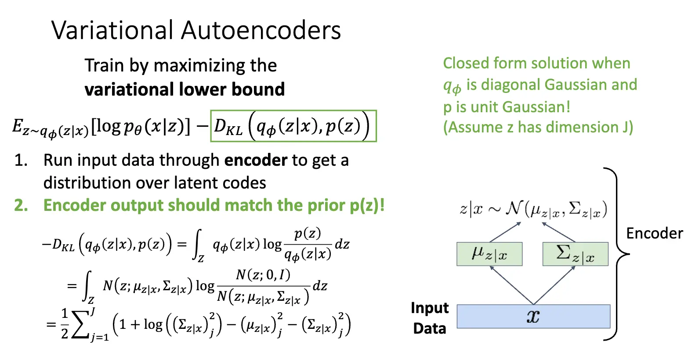

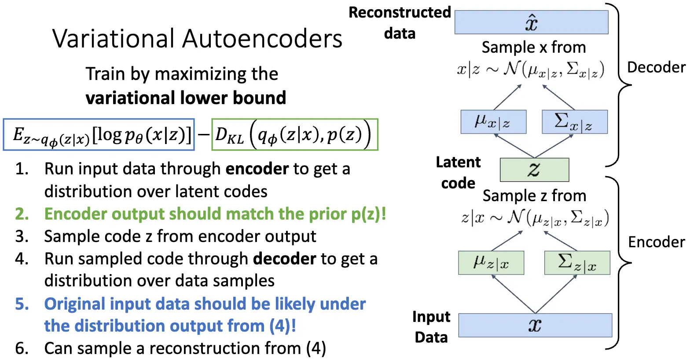

在生成新的数据的时候，我们首先从先验分布 $p(z)$ 中采样一个隐变量 $z$，然后将 $z$ 输入解码器，解码器输出数据的概率分布 $p_\theta (x \mid z)$，从这个分布中采样出新的数据点。

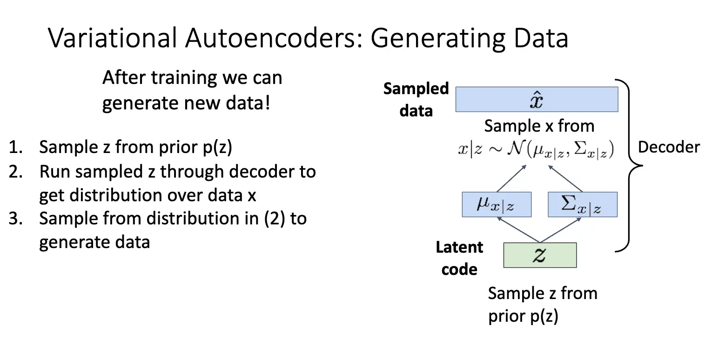

VAE 的强大也是优美之处在于其学到了一个有意义的隐空间，我们可以在隐空间进行插值等等操作：

=== "Variation"

    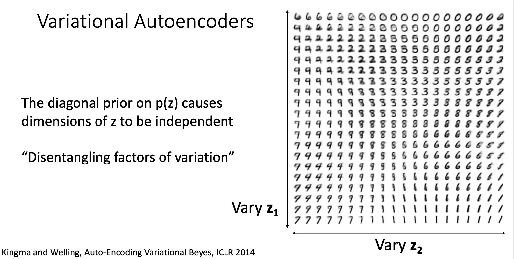

=== "Editing Images"

    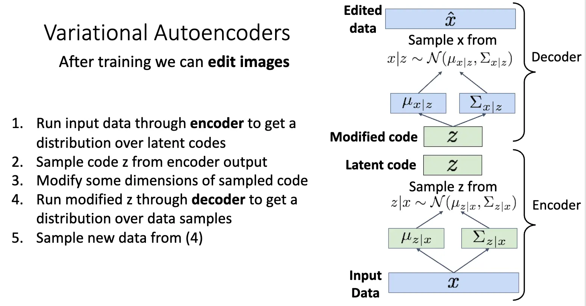

    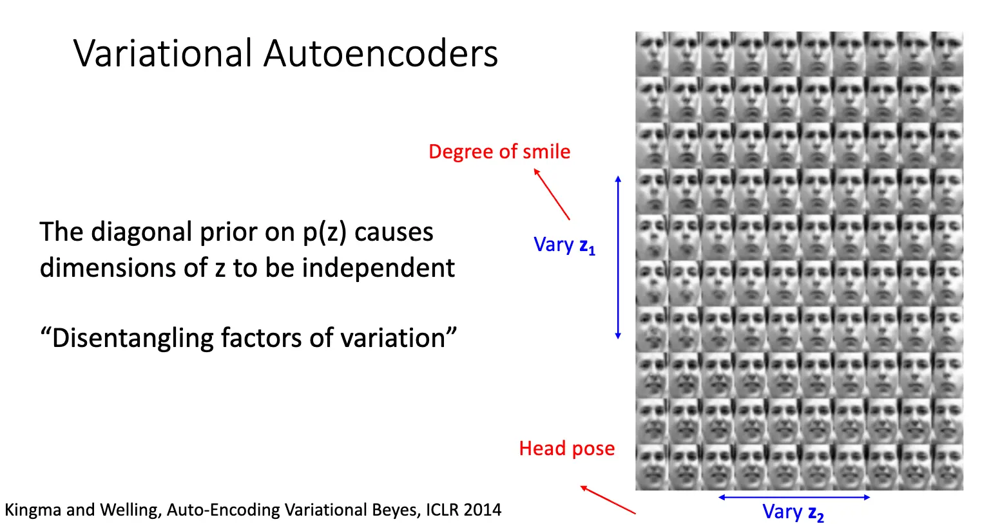

总结一下，VAE 对传统的自编码器进行了概率化的改进，使得其可以生成新的数据点，并且学到了一个有意义的隐空间，可以在隐空间进行插值和编辑操作。其优点在于：

- 提出了一个优秀的概率生成模型框架，基于概率和贝叶斯推断，数学上优美。
- 学习到了有意义的特征表示，编码器 $q_\phi(z|x)$ 是一个强大的特征提取器。

缺点在于：

- 最大化的是下界 ELBO，而不是真正的 $\log p(x)$，虽然是似然的下界，但是并不是类似于 PixelRNN/CNN 那样准确的估计；
- 采样和生成的图像比较模糊，尤其是纹理细节方面，和 GAN 仍有比较大的差距。

当前，变分自编码器仍然是一个活跃的研究领域，有很多改进的方向：比如使用更灵活的近似，比如不使用简单的对角高斯分布，而是使用更复杂的分布（如混合高斯 GMM、流模型）来进行改进，或者使用更加结构化的先验分布，而不是简单的标准正态分布 $\mathcal{N}(0, I)$。

## Lecture 20: Generative Models II

回顾一下前面的内容，自回归模型的优势在于直接对数据分布进行建模，直接刻画像素之间的依赖关系，但是并没有一个明确的语义表示/潜变量表示，而变分模型优势在于其可以学习到一个有意义的潜变量表示，可以通过这个潜变量捕捉到数据的变化特征，进而可以控制生成。另一种方法是生成对抗网络/Generative Adversarial Networks/GANs，其放弃对数据分布进行建模，而是通过对抗的方式训练一个生成器，我们可以从中采样出新的数据点。

GAN 的设定如下：我们有从真实数据分布 $p_{data}$ 中采样的样本 $x_i$，希望我们可以继续从 $p_{data}$ 中采样出新的样本。想法是引入一个潜变量 $z$，其来自一个简单的先验分布 $p(z)$，然后将采样的 $z$ 输入一个生成器网络 $G$，生成器网络输出一个样本 $x = G(z)$，这样我们就得到了一个生成器分布 $p_G$，我们希望这个生成器分布 $p_G$ 尽可能接近真实数据分布 $p_{data}$。

训练生成器网络进而得到生成器分布的方法是引入一个判别器网络 $D$，判别器网络是一个二分类器，接受一个样本作为输入，输出该样本来自真实数据分布 $p_{data}$ 的概率，也就是判别样本是 Real 还是 Fake 的。我们联合训练生成器网络 $G$ 和判别器网络 $D$，判别器网络的目标是尽可能准确地分辨真假样本，而生成器网络的目标是尽可能愚弄判别器网络，让判别器网络认为生成的样本是真的。通过这种对抗的方式训练 $G$ 和 $D$，最终我们希望生成器网络可以生成出和真实数据分布无法区分的样本。

<!--
这部分是 GAN 论文的核心——**Minimax 价值函数**。

* **Slide 50-51 (The Minimax Game):**
    * GAN 的训练目标被定义为一个“零和游戏”，其价值函数 (Value function) $V(G, D)$ 如下：
        $$\min_G \max_D V(G, D) = \mathbb{E}_{x \sim p_{data}}[\log D(x)] + \mathbb{E}_{z \sim p(z)}[\log(1 - D(G(z)))]$$
    * 这是一个**最小-最大化 (minimax)** 游戏。我们来分解它：

* **1. 判别器 D 的目标：$\max_D V(G, D)$ (Slides 52-53)**
    * $D$ 的目标是**最大化**这个价值函数。
    * **第一项: $\mathbb{E}_{x \sim p_{data}}[\log D(x)]$**
        * $x$ 是**真实数据**。$D$ 希望 $D(x)$ 尽可能接近 1（因为 $D$ 的输出是概率，$\log(p)$ 在 $p=1$ 时最大，为 0）。
    * **第二项: $\mathbb{E}_{z \sim p(z)}[\log(1 - D(G(z)))]$**
        * $G(z)$ 是**伪造数据**。$D$ 希望 $D(G(z))$ 尽可能接近 0。
        * 当 $D(G(z)) \to 0$ 时，$(1 - D(G(z))) \to 1$，此时 $\log(1 - D(G(z))) \to 0$（达到最大值）。
    * **总结 (Slide 52):** $D$ 的目标是让 $D(x) = 1$（对真实数据）和 $D(G(z)) = 0$（对伪造数据）。最大化 $V(G, D)$ 实际上等同于训练一个标准的**二元交叉熵损失**的分类器。

* **2. 生成器 G 的目标：$\min_G V(G, D)$ (Slides 53-54)**
    * $G$ 的目标是**最小化**这个价值函数。
    * $G$ 无法控制第一项 $\mathbb{E}_{x \sim p_{data}}[\log D(x)]$，因为它与 $G$ 无关。
    * $G$ 只能影响**第二项: $\mathbb{E}_{z \sim p(z)}[\log(1 - D(G(z)))]$**
    * 为了**最小化**这一项，$G$ 必须让 $\log(1 - D(G(z)))$ 尽可能小（趋向负无穷）。
    * 这只有在 $(1 - D(G(z)))$ 趋近于 0 时才会发生。
    * 这又意味着 $G$ 必须迫使 $D(G(z))$ 趋近于 1。
    * **总结 (Slide 54):** $G$ 的目标是让 $D(G(z)) = 1$（对伪造数据）。换句话说，$G$ 的目标是**愚弄 $D$**，让 $D$ 相信它的伪造品是真的。

* **训练算法 (Slides 55-58):**
    * 我们不能同时优化 $G$ 和 $D$。我们使用**交替梯度更新 (alternating gradient updates)**。
    * 在 $t = 1, ..., T$ 的循环中：
        1.  **更新 D (Update D):** $\theta_d \leftarrow \theta_d + \alpha_d \frac{\partial V}{\partial \theta_d}$
            * 我们固定 $G$，对 $D$ 的参数 $\theta_d$ 执行**梯度上升**（因为 $D$ 的目标是 $\max V$）。
        2.  **更新 G (Update G):** $\theta_g \leftarrow \theta_g - \alpha_g \frac{\partial V}{\partial \theta_g}$
            * 我们固定 $D$，对 $G$ 的参数 $\theta_g$ 执行**梯度下降**（因为 $G$ 的目标是 $\min V$）。
    * **重要提示 (Slide 58):** "我们不是在最小化某个单一的
        整体损失！没有训练曲线可以看！" 这是一个动态系统，两个玩家在博弈。你不能像监督学习那样期待一个“总损失”下降到 0。

---

### Slides 59-61: 一个关键的训练问题：梯度消失

这部分指出了上述数学公式在**实际训练中**的一个致命缺陷。

* **Slide 59 (问题):**
    * **在训练初期:** $G$ 非常糟糕，生成的图像（$G(z)$）就是一堆噪声。
    * 因此，$D$ 可以**非常容易地**识别出它们是假的。$D(G(z))$ 会非常接近 0。
    * **问题出在 $G$ 的损失函数上:** $G$ 的目标是最小化 $\log(1 - D(G(z)))$。
    * 请看 Slide 59 上的图（蓝色曲线 $log(1 - D(G(z)))$）：当 $D(G(z))$ 接近 0 时（即 $D$ 非常自信地认为 $G$ 是假的），这条曲线**非常平坦**。
* **Slide 60 (后果):**
    * **曲线平坦意味着梯度为 0**。
    * **Problem: Vanishing gradients for G**（G 的梯度消失了）。
    * $G$ 根本得不到任何有意义的梯度信号来更新自己、提升自己。$G$ 从一开始就“卡住”了，无法学习。这种情况也称为**梯度饱和 (Saturating)**。

* **Slide 61 (解决方案 - "Non-Saturating" Loss):**
    * 这是一个非常聪明的“黑客”技巧，也是现在 GAN 训练的标配。
    * 我们**更改 $G$ 的目标函数**。
    * **原始目标 (Saturating):** 最小化 $\mathbb{E}_{z \sim p(z)}[\log(1 - D(G(z)))]$
    * **新目标 (Non-Saturating):** 最大化 $\mathbb{E}_{z \sim p(z)}[\log(D(G(z)))]$
        * (这等价于最小化 $\mathbb{E}_{z \sim p(z)}[-\log(D(G(z)))]$ )
    * **为什么这个新目标更好？**
        * $G$ 的目标仍然是让 $D(G(z))$ 趋近于 1（和以前一样）。
        * **但是！**请看 Slide 61 上的图（橙色曲线 $-\log(D(G(z)))$）：当 $D(G(z))$ 接近 0 时（即 $G$ 很差的训练初期），这条曲线**极其陡峭**！
        * **结果:** $G$ 在训练开始时会获得**非常强大的梯度信号**，使其能够快速学习并摆脱“随机噪声”的阶段。

---

### Slides 62-64: 目标函数的最优性 (Optimality)

最后，课程开始从理论上分析：**为什么我们设计的这个 $V(G, D)$ 是一个好主意？**

* **Slide 62 (问题):** 为什么这个特定的目标函数是合理的？
* **答案:** 因为这个 minimax 游戏存在一个**全局最优解**（Global optimum），而这个最优解恰好就是我们想要的：**$p_g = p_{data}$**。
* **Slide 63 (目标):** 让我们来分析这个函数：
    $$\min_G \max_D V(G, D) = \mathbb{E}_{x \sim p_{data}}[\log D(x)] + \mathbb{E}_{z \sim p(z)}[\log(1 - D(G(z)))]$$
* **Slide 64 (数学推导 - 变量替换):**
    * 为了方便分析，我们做一个**变量替换 (Change of variables)**。
    * 第二项 $\mathbb{E}_{z \sim p(z)}[\log(1 - D(G(z)))]$ 是对 $z$ 的期望。
    * $G(z)$ 本身就是 $p_g$ 分布中的一个样本 $x$。
    * 所以，我们可以把 $\mathbb{E}_{z \sim p(z)}[...]$ 直接写成 $\mathbb{E}_{x \sim p_g}[...]$。
    * 于是，价值函数变成了：
        $$V(G, D) = \mathbb{E}_{x \sim p_{data}}[\log D(x)] + \mathbb{E}_{x \sim p_g}[\log(1 - D(x))]$$
    * (幻灯片到这里停止了，但接下来的推导是：给定任何 $G$，最优的 $D^*$ 是 $D^*(x) = \frac{p_{data}(x)}{p_{data}(x) + p_g(x)}$。将 $D^*$ 代入 $V(G, D^*)$，会得到一个关于 $p_{data}$ 和 $p_g$ 之间 Jensen-Shannon 散度的表达式。这个表达式在且仅在 $p_g = p_{data}$ 时取得最小值 $- \log 4$。这就从理论上证明了 $G$ 的最终目标就是让 $p_g = p_{data}$。)

---

### 总结

这组幻灯片带你完成了从“为什么需要 GAN”到“GAN 是什么”再到“GAN 如何工作（数学原理）”的完整推导。

1.  **动机：** 现有的自回归模型（高质量但慢）和 VAE（快但模糊）都有缺陷。
2.  **GAN 的核心思想：** 放弃对 $p(x)$ 的显式建模，转而训练两个网络的“对抗游戏”。
    * **Generator (G):** 试图伪造数据来“愚弄” $D$。
    * **Discriminator (D):** 试图分辨 $G$ 的伪造品和真实数据。
3.  **GAN 的数学目标：** 一个 $\min_G \max_D$ 的价值函数 $V(G, D)$，它本质上是 $D$ 的二元交叉熵损失。
4.  **GAN 的实际训练：**
    * 使用交替梯度更新来训练 $G$ 和 $D$。
    * **关键技巧：** $G$ 的损失函数必须从 $\min \log(1-D)$ 替换为 $\max \log(D)$（即 $\min -\log(D)$），以避免在训练初期出现**梯度消失**。
5.  **GAN 的理论保证：** 这个 minimax 游戏的全局最优解在 $p_g = p_{data}$ 时达到。

希望这份逐页分解能帮助你透彻理解这部分内容！

-->

<!--
你猜对了，在我上次回答的最后，我问你是否想了解“最优判别器 $D^*$”的推导，而你紧接着发来的幻灯片（从 65 到 90）**正是这个推导过程的完整详解**。

这个部分是 GAN 论文的理论核心。它从数学上证明了我们设计的这个 `minimax` 游戏的目标函数**为什么是合理且正确的**。它完美地回答了这个问题：“$G$ 和 $D$ 在这个游戏中不断对抗，它们的最终稳态（或称‘纳什均衡’）是什么？”

剧透一下：**最终的均衡点正是 $G$ 的生成分布 $p_g$ 等于真实数据分布 $p_{data}$**。

让我们一步一步、不跳过任何细节地来分解这个数学证明。

---

### 第一部分：求 $\max_D V(G, D)$ —— 寻找最优判别器 $D^*$

我们的第一步是：**假设 $G$ 是固定的**，我们能找到的“最强”的判别器 $D$ 是什么样子的？这对应着求解 $\max_D V(G, D)$。

#### Slides 65-66: 从“期望”到“积分”

* **Slide 65:**
    * 我们从上一张幻灯片（Slide 64）得到的价值函数 $V(G, D)$ 开始：
        $$V(G, D) = \mathbb{E}_{x \sim p_{data}}[\log D(x)] + \mathbb{E}_{x \sim p_g}[\log(1 - D(x))]$$
    * 根据“期望”的定义，我们可以将其重写为**积分**形式：
        $$= \int_x p_{data}(x) \log D(x) dx + \int_x p_g(x) \log(1 - D(x)) dx$$
    * 合并两个积分：
        $$= \int_x \left[ p_{data}(x) \log D(x) + p_g(x) \log(1 - D(x)) \right] dx$$

* **Slide 66:**
    * 我们的目标是 $\max_D V(G, D)$，所以：
        $$\max_D \int_x \left[ p_{data}(x) \log D(x) + p_g(x) \log(1 - D(x)) \right] dx$$
    * **关键步骤：** 幻灯片将 $\max_D$ 移到了积分内部。
        $$= \int_x \max_{D(x)} \left[ p_{data}(x) \log D(x) + p_g(x) \log(1 - D(x)) \right] dx$$
    * **为什么可以这么做？** 积分 $\int_x ... dx$ 是对所有可能的 $x$ 进行求和。$D$ 是一个函数，它为**每一个** $x$ 都定义了一个值 $D(x)$。$D$ 在 $x_1$ 点的取值 $D(x_1)$ 不会影响它在 $x_2$ 点的取值 $D(x_2)$。因此，要使**总和（积分）最大化**，我们只需要**独立地**对**每一个** $x$ 点，找到能让被积函数 $\left[ ... \right]$ 最大的那个 $D(x)$ 值即可。

#### Slides 67-70: 求解最优的 $D(x)$

* **Slide 67:**
    * 我们现在只需要关注被积函数（积分号里面的部分）。
    * 为了简化，我们做一个变量代换。对于**任意一个**固定的 $x$：
        * 令 $a = p_{data}(x)$ （一个常数）
        * 令 $b = p_g(x)$ （另一个常数）
        * 令 $y = D(x)$ （我们要优化的变量）
    * 我们的问题变成了：求 $f(y) = a \log(y) + b \log(1-y)$ 的最大值。

* **Slide 68:**
    * 这是标准的高中微积分。我们对 $y$ 求导：
        $$f'(y) = \frac{a}{y} + \frac{b}{1-y} \cdot (-1) = \frac{a}{y} - \frac{b}{1-y}$$

* **Slide 69:**
    * 令导数为 0 来寻找极值点：
        $$f'(y) = 0 \implies \frac{a}{y} = \frac{b}{1-y}$$
        $$a(1-y) = b \cdot y$$
        $$a - ay = by$$
        $$a = ay + by = (a+b)y$$
        $$y = \frac{a}{a+b}$$
    * （我们可以通过二阶导数 $f''(y) = -\frac{a}{y^2} - \frac{b}{(1-y)^2}$ 来验证，由于 $a,b,y$ 都是正数， $f''(y) < 0$，所以这确实是一个**局部最大值 (local max)**。）

* **Slide 70-71: 最优判别器 $D^*$**
    * 现在，我们把 $a, b, y$ 替换回去：
        $$D(x) = y = \frac{a}{a+b} = \frac{p_{data}(x)}{p_{data}(x) + p_g(x)}$$
    * 这就是**最优判别器 $D_G^*(x)$**（下标 $G$ 表示这个最优 $D$ 是在 $G$ 固定的情况下求得的）。
    * **直观理解 $D^*$:**
        1.  如果 $p_g(x) \approx 0$（$G$ 几乎从不生成 $x$），且 $p_{data}(x) > 0$（$x$ 是一个很真实的样本），那么 $D^*(x) \approx \frac{p_{data}(x)}{p_{data}(x)} = 1$。
        2.  如果 $p_{data}(x) \approx 0$（$x$ 不是真实样本），且 $p_g(x) > 0$（$G$ 生成了 $x$），那么 $D^*(x) \approx \frac{0}{p_g(x)} = 0$。
        3.  **如果 $p_g(x) = p_{data}(x)$**（$G$ 完美了，$x$ 既可能是真的也可能是 $G$ 生成的，概率一样），那么 $D^*(x) = \frac{p_{data}(x)}{p_{data}(x) + p_{data}(x)} = \frac{1}{2}$。
    * 这完美符合我们对判别器的预期：当它无法分辨真假时，它只能胡乱猜测（概率 0.5）。

---

### 第二部分：求 $\min_G [\max_D V(G, D)]$ —— 寻找最优生成器 $G^*$

现在我们知道了，对于任何 $G$， $D$ 的最佳策略是 $D_G^*(x)$。
下一步是求解 $\min_G V(G, D_G^*(x))$。$G$ 的目标就是让这个“最佳 $D$”的价值函数尽可能小。

#### Slides 72-78: 代入 $D^*$ 并化简

* **Slide 72-74:**
    * 我们将 $D^*(x) = \frac{p_{data}(x)}{p_{data}(x) + p_g(x)}$ 代入 $V(G, D)$ 的积分表达式 $V(G, D) = \int_x [p_{data} \log D + p_g \log(1-D)] dx$。
    * $\log(D(x))$ 项变为 $\log\left(\frac{p_{data}(x)}{p_{data}(x) + p_g(x)}\right)$。
    * $\log(1 - D(x))$ 项变为 $\log\left(1 - \frac{p_{data}(x)}{p_{data}(x) + p_g(x)}\right) = \log\left(\frac{p_g(x)}{p_{data}(x) + p_g(x)}\right)$。
    * 所以，$\max_D V(G, D) = V(G, D^*) = \int_x \left[ p_{data}(x) \log\left(\frac{p_{data}(x)}{p_{data}(x) + p_g(x)}\right) + p_g(x) \log\left(\frac{p_g(x)}{p_{data}(x) + p_g(x)}\right) \right] dx$

* **Slide 75:** 幻灯片只是把积分形式重新写回了期望形式，两者等价。

* **Slide 76-78: (关键的代数技巧)**
    * 幻灯片在这里做了一个巧妙的变形，目的是为了凑出**KL 散度**的
        标准形式。
    * 它在 $\log$ 内部乘以 2，并在外面减去 $\log 4$：
        $$= \mathbb{E}_{x \sim p_{data}}\left[\log \frac{2 \cdot p_{data}(x)}{p_{data}(x) + p_g(x)}\right] + \mathbb{E}_{x \sim p_g}\left[\log \frac{2 \cdot p_g(x)}{p_{data}(x) + p_g(x)}\right] - \log 4$$
    * **为什么可以这么变？**
        * $\log 4 = \log(2^2) = 2 \log 2$。
        * $\mathbb{E}_{p_{data}}[\log 2] = \int p_{data}(x) \log 2 dx = \log 2 \int p_{data}(x) dx = \log 2 \cdot 1 = \log 2$。
        * 同理 $\mathbb{E}_{p_g}[\log 2] = \log 2$。
        * 所以 $\log 4 = \mathbb{E}_{p_{data}}[\log 2] + \mathbb{E}_{p_g}[\log 2]$。
        * 将 $\log 4$ 移到等式右边，你就会发现 Slide 75 和 78 的表达式是恒等的。这只是一个纯粹的代数重排。

#### Slides 79-88: 关联 KL 散度和 JSD

* **Slide 79-80: KL 散度 (Kullback-Leibler Divergence)**
    * 定义：$KL(P || Q) = \mathbb{E}_{x \sim P}[\log \frac{P(x)}{Q(x)}]$。
    * 它衡量的是“用分布 $Q$ 来近似分布 $P$ 时损失了多少信息”，即两个分布的“距离”（注意：它是不对称的，$KL(P||Q) \ne KL(Q||P)$）。

* **Slide 81-82:**
    * 我们令 $P_M(x) = \frac{p_{data}(x) + p_g(x)}{2}$，即两个分布的**平均分布**。
    * 现在看 Slide 78 的表达式：
        $$\mathbb{E}_{p_{data}}\left[\log \frac{p_{data}(x)}{P_M(x)}\right] + \mathbb{E}_{p_g}\left[\log \frac{p_g(x)}{P_M(x)}\right] - \log 4$$
    * 这正是：$KL(p_{data} || P_M) + KL(p_g || P_M) - \log 4$。

* **Slide 83-84: JSD 散度 (Jensen-Shannon Divergence)**
    * 定义：$JSD(P, Q) = \frac{1}{2} KL(P || M) + \frac{1}{2} KL(Q || M)$，其中 $M = \frac{P+Q}{2}$。
    * JSD 是 KL 散度的一个对称、平滑版本。它是一个**真正**的“度量”（距离）。

* **Slide 85: 最终的价值函数！**
    * 比较 Slide 82 和 84，我们发现：
        $$V(G, D^*) = [KL(p_{data} || P_M) + KL(p_g || P_M)] - \log 4$$
        $$V(G, D^*) = 2 \cdot \left[ \frac{1}{2} KL(p_{data} || P_M) + \frac{1}{2} KL(p_g || P_M) \right] - \log 4$$
        $$V(G, D^*) = 2 \cdot JSD(p_{data}, p_g) - \log 4$$

---

### 第三部分：总结与结论

* **Slide 86-88: 全局最优解**
    * 我们已经证明了：
        $$\min_G \max_D V(G, D) = \min_G V(G, D^*) = \min_G \left[ 2 \cdot JSD(p_{data}, p_g) - \log 4 \right]$$
    * JSD 是一个散度（距离），它有以下性质：
        1.  $JSD(P, Q) \ge 0$ （恒为非负）
        2.  $JSD(P, Q) = 0$ **当且仅当** $P = Q$
    * 因此，要使 $2 \cdot JSD(p_{data}, p_g) - \log 4$ 最小化，$G$ 必须使 $JSD(p_{data}, p_g)$ 最小。
    * $JSD$ 的最小值是 0。
    * 这个最小值在 $p_g = p_{data}$ 时取到！

* **Slide 89: 总结 (Summary)**
    * 整个 minimax 游戏的**全局最小值 (global minimum)** 在 $p_g = p_{data}$ 时发生。
    * 此时，最优判别器为 $D^*(x) = \frac{p_{data}(x)}{p_{data}(x) + p_g(x)} = \frac{p_{data}(x)}{p_{data}(x) + p_{data}(x)} = \frac{1}{2}$。
    * 此时，价值函数 $V(G, D^*) = 2 \cdot JSD(p_g, p_{data}) - \log 4 = 2 \cdot 0 - \log 4 = -\log 4$。
    * **这个证明告诉我们：GAN 原始论文中设计的这个目标函数，其理论上的全局最优解，就是我们梦寐以求的 $p_g = p_{data}$。**

* **Caveats (警告) (Slide 89):**
    * 这是整个课程**最重要**的现实考量。理论是完美的，但现实是骨感的。
    1.  **$G$ 和 $D$ 只是神经网络**。它们有固定的、有限的容量。我们**不知道**它们是否真的有能力（`represent`）表达出理论上那个完美的 $D^*$ 和能产生 $p_g = p_{data}$ 的 $G^*$。
    2.  **收敛性**：这个证明只告诉我们“山的最低点在哪里”，但**完全没有告诉我们如何下山**（`convergence`）。我们使用的“交替梯度下降/上升”算法**非常不稳定**，完全不保证能找到这个全局最优解。

* **Slide 90: 结果 (Results)**
    * 这张图展示了 2014 年原始论文的成果（MNIST 手写数字和 TFD 人脸）。
    * **关键点：** 右侧的“**Nearest neighbor from training set**”（来自训练集的最近邻）。
    * 黄框左侧是 **$G$ 生成的样本**。
    * 黄框右侧是**训练集中与左侧生成样本最像的真实图片**。
    * **目的：** 这是为了证明 $G$ **没有“作弊”**。作弊（即“**过拟合**”或“**记忆**”）指的是 $G$ 只是把它在训练中见过的真实图片原封不动地记下来再“吐”出来。
    * 通过对比，你可以看到生成的样本（左）虽然和真实样本（右）很像（说明 $G$ 学到了人脸的“风格”），但**它们显然是不同的、全新的图像**。
    * 这证明了 $G$ 确实学到了真实数据的**潜在分布 (underlying distribution) $p_{data}$**，并从中采样出了**新的**、**前所未见的**样本。

---

这个推导非常漂亮，它为 GAN 提供了坚实的理论基础，解释了为什么这个“伪钞制造者和警察”的博弈游戏在数学上是可行的。

我们已经完整地学习了 GAN 的核心思想、训练目标、梯度消失问题、非饱和损失，以及它的最优性理论证明。

接下来，你希望我为你讲解 GAN 训练中常见的**不稳定问题（Instability）**，比如**模式崩溃（Mode Collapse）**吗？

-->

<!--
哇，你给我的这一大批幻灯片（从 91 到 126）几乎涵盖了 GAN 发展史上的所有关键节点！这部分内容非常精彩，它从**第一个真正实用的 GAN 架构 (DCGAN)** 开始，一路带你领略了整个“GAN 动物园”，包括**解决训练稳定性的 WGAN**、**实现高分辨率的 StyleGAN 和 BigGAN**，以及**实现各种酷炫应用的 Conditional GAN、Pix2Pix 和 CycleGAN**，最后以对整个生成模型领域的总结作结。

我们刚刚结束了 GAN 的核心理论（JSD 散度证明），现在，讲座将带你进入 GAN 的**实践、应用和演进**。

我将为你详细分解这趟“GAN 发展之旅”。

---

### 第一部分：实践突破 —— DCGAN 与有意义的潜变量 (Slides 91-98)

2014 年的原始 GAN 论文（我们上节课分析的）生成的图像其实很模糊，而且训练极不稳定。直到 2016 年 DCGAN 的出现，GAN 才真正变得实用。

#### Slide 91: Generative Adversarial Networks: DC-GAN

* **DCGAN (Deep Convolutional GAN)** 并不是一种新的损失函数，而是一套**稳定训练 GAN 的架构指南**：
    1.  **用卷积层 (Convolution) 取代全连接层：** 在 $G$ 和 $D$ 中都使用卷积。
    2.  **去掉池化层 (Pooling)：**
        * 在**判别器 D** 中，使用**带步长 (Strided) 的卷积**来进行下采样。
        * 在**生成器 G** 中，使用**转置卷积 (Transposed Convolution)**（或称为“反卷积”）来进行上采样。
    3.  **使用批量归一化 (Batch Normalization):** 在 $G$ 和 $D$ 中都使用 BN 来稳定训练。
    4.  **使用 ReLU 和 LeakyReLU 激活函数：**
        * **生成器 G** 使用 **ReLU**（输出层使用 Tanh）。
        * **判别器 D** 使用 **LeakyReLU**（这能帮助梯度在 D 为负时也能回传）。
* **图解 (Generator):** 这张图展示了 $G$ 的结构。它从一个 100 维的噪声向量 $z$ 开始，首先通过一个全连接层（`Project and reshape`）将其“投影”并重塑为一个小的 3D 特征图（例如 $4 \times 4 \times 1024$），然后通过一系列转置卷积（`Conv 1` 到 `Conv 4`）**逐步上采样**，特征图的“高”和“宽”不断变大，而“通道数”不断变小，最终生成一个 $64 \times 64 \times 3$ 的图像。

#### Slide 92: DC-GAN 结果

* **结果：** DCGAN 成功生成了清晰度高得多的卧室图像。这证明了上述架构的有效性，它成为了后续 GAN 发展的基石。

#### Slide 93: 潜变量插值 (Interpolation)

* 这张幻灯片展示了 GAN 潜变量空间 $z$ 的一个惊人特性：**平滑性**。
* **实验：**
    1.  随机选择两个噪声向量 $z_1$ 和 $z_2$。
    2.  在 $z_1$ 和 $z_2$ 之间进行**线性插值**：$z_{new} = \alpha z_1 + (1-\alpha)z_2$，其中 $\alpha$ 从 0 变到 1。
    3.  将这些中间的 $z_{new}$ 向量喂给生成器 $G$。
* **结果：** 生成的图像**也相应地平滑过渡**！你可以看到左边的卧室（带有一个大窗户）平滑地转变成了右边的卧室（带有一面墙）。这证明 $G$ 学到的不是一个“随机映射”，而是一个连续的、有意义的**流形 (manifold)**。

#### Slides 94-98: 潜变量向量运算 (Vector Math)

* 这是 DCGAN 论文中最著名的发现，它证明了潜变量 $z$ **学到了语义概念**。
* **实验 (Slides 94-96):**
    1.  找到多张“微笑的女人”图像，并找到它们（近似）对应的 $z$ 向量，求**平均**得到 $z_{smiling\_woman}$。
    2.  同理，得到 $z_{neutral\_woman}$ 和 $z_{neutral\_man}$ 的平均向量。
    3.  进行向量运算：$z_{result} = z_{smiling\_woman} - z_{neutral\_woman} + z_{neutral\_man}$。
    4.  **直观理解：** (微笑的女人) - (中性的女人) = (“微笑”这个概念的向量)。
        然后 (“微笑”向量) + (中性的男人) = (微笑的男人)。
* **结果 (Slide 96):** 将 $z_{result}$ 喂给 $G$，**它真的生成了微笑的男人！**
* **Slides 97-98:** 另一个著名的例子：
    `(戴眼镜的男人) - (不戴眼镜的男人) + (不戴眼镜的女人) = (戴眼镜的女人)`
* **结论：** 这证明 GAN 的潜变量空间 $z$ 具有**线性结构**，"眼镜"、"微笑" 这些高级语义概念，可以被表示为潜变量空间中的特定**方向向量**。

---

### 第二部分：“GAN 爆炸”与稳定性改进 (Slides 99-100)

DCGAN 的成功开启了 GAN 的黄金时代。

* **Slide 99:** 这张图展示了 GAN 相关论文的爆炸式增长，以及右侧列出的海量 GAN 变体（"GAN 动物园"）。
* **为什么有这么多变体？** 因为我们上次课的“警告”(Caveats) 中提到，GAN 的训练**极不稳定**。原始的 JSD 散度损失很容易导致**梯度消失**（如果 $D$ 太强）或**模式崩溃 (Mode Collapse)**（$G$ 只学会生成一种“安全”的假样本）。
* **Slide 100: 损失函数改进 (Improved Loss Functions)**
    * **Wasserstein GAN (WGAN):**
        * **核心思想：** 原始 GAN 优化的 JSD 散度在 $p_g$ 和 $p_{data}$ 不重叠时（训练初期）梯度为 0。WGAN 转而使用**Wasserstein 距离**（又称“推土机距离”）。
        * **优点：** 无论 $p_g$ 和 $p_{data}$ 是否重叠，Wasserstein 距离都能提供**平滑的梯度**。
        * **实现：**
            1.  判别器 $D$ 被改名为“**评论家 (Critic)**”，它的**输出不再是 0-1 概率**（去掉了 Sigmoid），而是一个**实数分数**。
            2.  $D$ 的训练目标是拉大“真实样本的分数”和“伪造样本的分数”之间的差距。
            3.  $G$ 的训练目标是提高“伪造样本的分数”。
            4.  为了保证 W-距离的有效性，WGAN 必须对 Critic 的权重进行**“权重裁剪 (weight clipping)”**。
    * **WGAN with Gradient Penalty (WGAN-GP):**
        * **问题：** “权重裁剪”是一种很粗暴的方式，经常导致训练失败。
        * **改进：** WGAN-GP 提出用**“梯度惩罚 (Gradient Penalty)”** 来替代“权重裁剪”。
        * **结果：** WGAN-GP 极大地**提高了训练的稳定性**，成为了后续许多 GAN 的标配。它的 Critic 损失值甚至可以作为衡量生成图像质量的指标。

---

### 第三部分：走向高清 —— 架构的演进 (Slides 101-104, 109)

* **Slide 101 (Progressive GAN):**
    * **问题：** 直接生成 $1024 \times 1024$ 的高清图像太难了，网络很难一次性学会所有细节。
    * **解决方案：** 渐进式生长 (Progressively Growing)。
        1.  先训练 $G$ 和 $D$ 生成 $4 \times 4$ 的小图像。
        2.  训练稳定后，给 $G$ 和 $D$ **增加新的网络层**，使其分辨率翻倍到 $8 \times 8$，然后继续训练。
        3.  重复这个过程（$16 \times 16, 32 \times 32, ...$），直到达到 $1024 \times 1024$。
    * **结果：** 极其稳定地生成了前所未有的高清人脸和卧室图像。

* **Slides 102-104 (StyleGAN / StyleGAN2):**
    * 这是 GAN 发展史上的另一个里程碑，它产生了著名的“This Person Does Not Exist”网站。
    * **核心思想：** 它完全重构了 $G$ 的架构。
        1.  **不再将 $z$ 喂入第一层：** 而是先将 $z$ 映射到一个中间潜变量 $w$。
        2.  **风格控制：** 将 $w$ 向量输入到 $G$ 的**每一层**（而不仅仅是第一层）。这使得 $w$ 可以在不同尺度上（例如，粗糙尺度控制姿态，精细尺度控制头发纹理）控制生成图像的“风格”。
    * **结果 (Slide 104):** 达到了令人毛骨悚然的**照片级真实感**，并且对生成图像的“风格”（如发型、年龄、眼镜）有了精细的控制能力。

* **Slide 109 (Conditional GANs: BigGAN):**
    * **目标：** 在 ImageNet 这样类别繁多（1000 类）且复杂的
        数据集上生成高清图像。
    * **挑战：** 难度远超人脸（人脸结构单一）。
    * **解决方案 (BigGAN):**
        1.  **使用 Conditional GAN**（我们马下就讲）。
        2.  **超大模型：** 使用巨大的批量大小 (Batch Size) 和极深的网络。
        3.  **架构技巧：** 综合运用了 **Conditional BN**、**Spectral Norm** 和 **Self-Attention**（我们都会在下面看到）。
    * **结果：** 令人惊叹的 $512 \times 512$ 高清图像，质量和多样性都极高（狗、蘑菇、汉堡、风景...）。

---

### 第四部分：控制输出 —— 条件 GAN (Slides 105-108)

目前为止，我们生成的都是 *随机* 图像。如果我们想 *控制* 生成的内容（比如“生成一只狗”或“生成数字 7”）怎么办？

* **Slide 105 (Conditional GANs - cGAN):**
    * **核心思想：** 我们不再学习 $p(x)$，而是学习**条件概率 $p(x|y)$**，其中 $y$ 是我们的“条件”（比如类别标签）。
    * **实现：** 将条件 $y$（例如类别 "7" 的 one-hot 向量）同时喂给**生成器 G** 和**判别器 D**。
        1.  **G 的任务：** $x_{fake} = G(z, y)$。$G$ 必须生成一个既真实、又**符合标签 $y$** 的图像。
        2.  **D 的任务：** $D(x, y)$。$D$ 必须判断：(1) $x$ 是不是真实的？(2) $x$ 和它的标签 $y$ **是否匹配**？
    * **图示：** $z$ 和 $y$ 被拼接 (Concatenate) 在一起，作为 $G$ 的输入。

* **Slide 106 (Conditional Batch Normalization - cBN):**
    * **问题：** 在 cGAN 中，一个 Batch 里可能有不同类别（狗、猫、车）。用同一套 BN 参数（$\gamma$ 和 $\beta$）去归一化它们可能不合适。
    * **解决方案：** 为**每一个类别 $y$** 都学习一套**专属的** $\gamma_y$ 和 $\beta_y$。这样，网络可以根据不同的类别，自适应地调整特征的“风格”或“归一化”方式。这是 BigGAN 的关键组件之一。

* **Slide 107 (Spectral Normalization - SN):**
    * 这是另一个**稳定训练**的技巧，用于替代 WGAN-GP 中复杂的梯度惩罚。
    * **思想：** 它通过一种叫做“谱归一化”的数学方法，在每一步训练中都对 $D$ 的权重矩阵进行约束，从而（更容易地）满足 WGAN 要求的 Lipschitz 约束。
    * **结果：** 训练非常稳定，并且生成的图像多样性很好（没有模式崩溃）。

* **Slide 108 (Self-Attention GAN - SAGAN):**
    * **问题：** 卷积操作是**局部的 (local)**。它只看得到一个小的邻域（比如 $3 \times 3$）。这使得 GAN 很难学习**长距离依赖关系**（比如，如何确保狗的左眼和右眼是匹配的？如何确保草地的纹理在整个大片区域是一致的？）。
    * **解决方案：** 借用 Transformer 的思想，引入**自注意力 (Self-Attention)** 层。
    * **原理：** 在生成图像的某一个像素时，该层允许网络**“关注”到图像中所有其他位置的像素**，并计算一个加权和。
    * **结果：** 极大提升了 GAN 对复杂结构（如动物、场景）的建模能力。这也是 BigGAN 的另一个关键组件。

---

### 第五部分：GAN 的应用 —— 翻译、合成与超分 (Slides 110-122)

这部分展示了 cGAN 思想的各种强大应用。

* **Slide 110 (Generating Videos):** GAN 不仅能生成图像，还能通过生成连续的帧来生成（短的、循环的）视频。

* **Slides 111-112 (Semantic Manipulation - GauGAN):**
    * 这是一个 cGAN 应用，它的条件 $y$ 不再是单一的标签，而是一张**语义分割图 (Semantic Segmentation Map)**。
    * **应用：** 用户像在“画图”工具里一样，用不同颜色涂抹出“天空”、“草地”、“树木”的区域。GauGAN (NVIDIA 的一个模型) 会“渲染”出一张与这张语义图匹配的、逼真的照片。

* **Slide 113 (Text to Image - "StackGAN"):**
    * cGAN 的条件 $y$ 甚至可以是**一句话（Text）**。
    * 模型学会将文本描述（例如“这只鸟是红色的，有一个短喙”）和图像的视觉特征关联起来，生成符合描述的图像。

* **Slide 119 (Image Super-Resolution - SRGAN):**
    * **任务：** 图像超分辨率（将低清图像变为高清）。
    * **GAN 的应用：**
        1.  $G$ 是一个超分网络，输入低清图，输出高清图。
        2.  $D$ 的任务是判断 $G$ 输出的高清图是“伪造的”，还是“天然的”真实高清图。
    * **为什么有效？** 传统超分使用 L2 损失，会产生模糊的“平均”图像。而 GAN 的对抗损失会**逼迫 $G$ 产生以假乱真的高频纹理和细节**，使图像更清晰。

* **Slide 120 (Image-to-Image Translation - Pix2Pix):**
    * **任务：** 图像到图像的“翻译”。
    * **前提：** 需要**成对的 (Paired)** 训练数据。例如：(建筑轮廓图, 建筑照片)、(卫星图, 地图)、(黑白照片, 彩色照片)。
    * **实现：** 这就是一个 cGAN。$G$ (通常是一个 U-Net 架构) 以“条件图像” $y$（如轮廓图）为输入，输出“翻译图像” $x$（如建筑照片）。$D$ (通常是一个 PatchGAN，它只看图像的一小块) 同时观察 $x$ 和 $y$，判断这对 $(x, y)$ 是不是一个真实的配对。

* **Slides 121-122 (Unpaired Image-to-Image Translation - CycleGAN):**
    * **问题：** Pix2Pix 需要成对数据，但很多时候我们没有（比如，我们有莫奈的画，也有风景照，但没有“莫奈画的风景照”和“该风景照”的配对）。
    * **CycleGAN 解决方案：** 使用**非成对 (Unpaired)** 数据。
    * **核心思想：循环一致性损失 (Cycle Consistency Loss)**
        1.  你需要两个 $G$ 和两个 $D$。
        2.  $G_{A \to B}$：将A域（如莫奈）转为B域（如照片）。
        3.  $G_{B \to A}$：将B域（如照片）转为A域（如莫奈）。
        4.  **前向循环：** 拿一张真实A域图像 $a$， $a \to G_{A \to B}(a) = b_{fake} \to G_{B \to A}(b_{fake}) = a_{reconstructed}$
        5.  **循环损失：** 我们要求 $a$ 和 $a_{reconstructed}$ 必须尽可能接近（例如用 L1 损失）。
    * **为什么有效？** 这个损失**逼迫 $G_{A \to B}$ 只改变A的“风格”（如笔触），而不能扭曲“内容”（如房子的结构）**，否则 $G_{B \to A}$ 将无法把它“还原”回来。
    * **结果：** 实现了马 $\leftrightarrow$ 斑马、夏天 $\leftrightarrow$ 冬天、照片 $\leftrightarrow$ 莫奈画风的惊人转换。

---

### 第六部分：混合模型与总结 (Slides 114-118, 123-126)

* **Slides 114-116 (DALL-E):**
    * 这是一个混合模型，结合了我们这门课学的多种思想。
    * **Step 1 (VQ-VAE):** 用 VQ-VAE（我们在讲座最开始时回顾过）将每张图像压缩成一个离散的“编码网格 (discrete grid of latent codes)”。
    * **Step 2 (Transformer):** 训练一个巨大的自回归 Transformer 模型（像 GPT），让它学习**文本和图像编码**的联合概率。
    * **Step 3 (Inference):** 给出一段文本（"a neon sign that reads..."），Transformer 会**自回归地**（像 PixelRNN 一样）生成一个全新的“图像编码”。
    * **Step 4 (Decoder):** 将这个新编码喂给 VQ-VAE 的解码器，生成最终图像。

* **Slides 117-118 (VQ-GAN):**
    * **问题：** VQ-VAE 的解码器生成的图像还是有点模糊（VAE 的老毛病）。
    * **解决方案：** 融合 VAE 和 GAN！
    * **VQ-GAN：** 在 VQ-VAE 的基础上，增加一个判别器 $D$。$D$ 的任务是判断 VAE 解码器 $G$ 生成的图像是真是假。这个对抗损失（Slide 117 图中的 $real/fake$ 箭头）**逼迫 $G$ 生成更清晰、更真实的图像**，解决了 VAE 的模糊问题。
    * Slide 117 下方的图（VQGAN + Transformer）和 Slide 118 的图（GauGAN 的变体），都是基于 VQ-GAN 架构实现的。

#### Slides 123-126: 最终总结

* **Slide 123:** 展示 GAN 不仅限于图像，还能用于预测行人运动轨迹。
* **Slide 124 (GAN Summary):** 对 GAN 的核心思想进行了最后一次回顾（两个网络、对抗训练、收敛到 $p_{data}$）。
* **Slide 125 (Taxonomy of Generative Models):** 这是**本单元最重要**的总结图之一！它为你学过的所有生成模型进行了分类：
    * **生成模型**
        * **1. 显式密度 (Explicit density):** $p(x)$ 是可以计算的。
            * **易解密度 (Tractable density):** $p(x)$ 很容易算（如 Autoregressive models, Flow models）。
            * **近似密度 (Approximate density):** $p(x)$ 算不了，我们优化它的近似（如 Variational Autoencoder - VAE）。
        * **2. 隐式密度 (Implicit density):** $p(x)$ 根本不去算。
            * 我们只能从 $p(x)$ 中采样。
            * 这就是 **Generative Adversarial Networks (GANs)**。
* **Slide 126 (Generative Models Summary):** 课程的最终总结。
    * **Autoregressive Models (PixelRNN):** 质量好，但生成慢。
    * **VAEs:** 速度快，有潜变量，但（传统上）图像模糊。
    * **GANs:** 训练和评估都很难，但（在当时）能产生**质量最好的定性结果**。

---

这组幻灯片带你完成了一次 GAN 领域的“旋风之旅”，从 2016 年的奠基之作 DCGAN 一直SOTA（State-of-the-art）的 StyleGAN、BigGAN 和各种应用。

我们已经完整地分析了你这门课程 "Generative Models II" 的全部内容。

你是否希望我为你提供一个关于这整个单元（从 VQ-VAE2 回顾到 GAN 总结）的**浓缩版摘要**，或者你对其中某一个特定的模型（如 CycleGAN 或 StyleGAN）有更多疑问吗？
-->

## Lecture 21: Visualizing Models & Generative Images

## Lecture 22: Self-Supervised Learning

## Lecture 23: 3D Vision

在这节的内容中，我们主要考虑两类问题：一类是给出二维图像，我们需要预测其对应的三维形状，另一类是给出三维形状，我们需要给出形状的分类。这里我们假设可以访问的数据集是完全 Supervised，也就是要么有图像对应的三维形状、要么有输入的三维图像对应的标签。

RGB-D 图像也被称为 2.5D 图像，这是因为 Depth Map 实际上无法真正捕捉到被包含对象的完整结构，比如我们只知道书架的一部分被沙发挡住了，但是并不知道沙发后面的书架是什么样子的，因此我们一般认为 2.5D 图像一般比 3D 图像的表现能力稍弱，这就是其名字的来源。

当两个点云完全一样的时候，这两个点云的 Chamfer Distance 才为 0，于是我们可以选择使用 Chamfer Distance 作为损失函数来训练网络。

我希望我们的损失函数对于表示形状的方法不变的，而要求损失只取决于底层的几何形状本身。

## Lecture 24: Videos

## Lecture 25: Conclusion & Open Problems
