# Introduction to Computer Vision in ZJU

## Lec 1: Introduction & Linear Algebra Review

罗列一下需要知道的点：

- 向量：向量的范数、单位向量/归一化、向量的加减、点积
- 矩阵：加减（矩阵之间、矩阵和标量）、乘法（满足结合律和分配律，但是不满足交换律）、单位矩阵，矩阵的逆（可逆矩阵必须是方阵，必须满足行秩等于列秩等于矩阵的秩，换句话说必须满秩），矩阵代表一个线性变换

=== "Scale"

    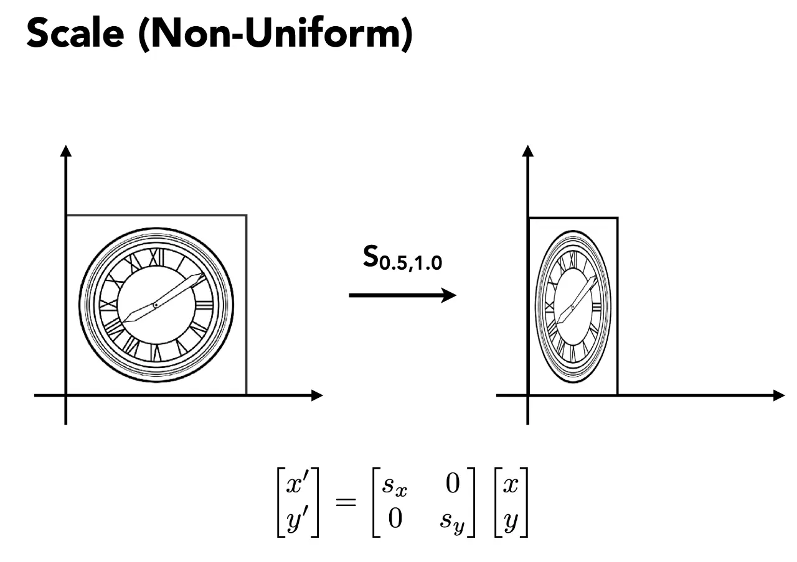

=== "Reflection"
 
    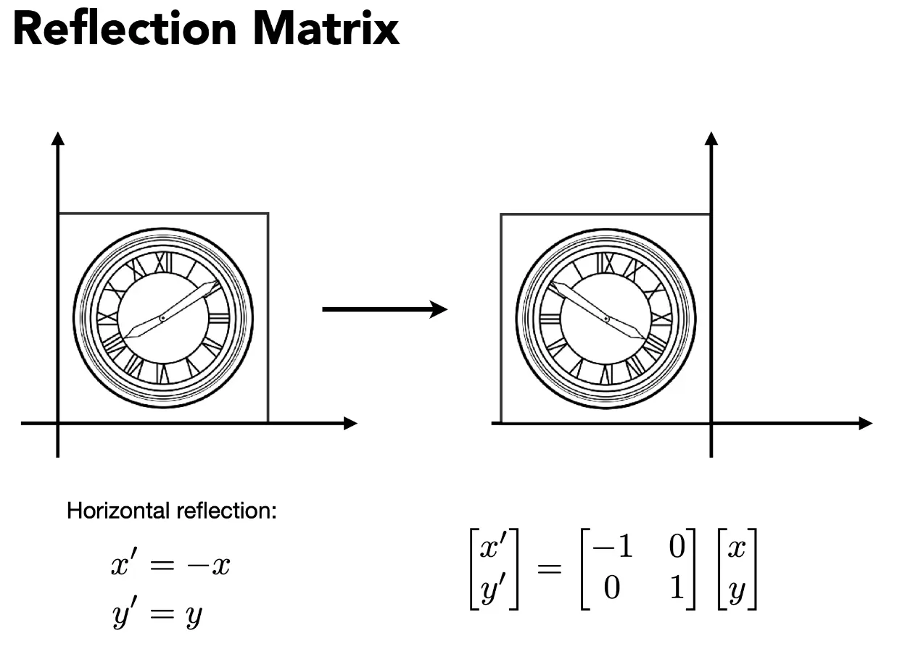

=== "Shear"

    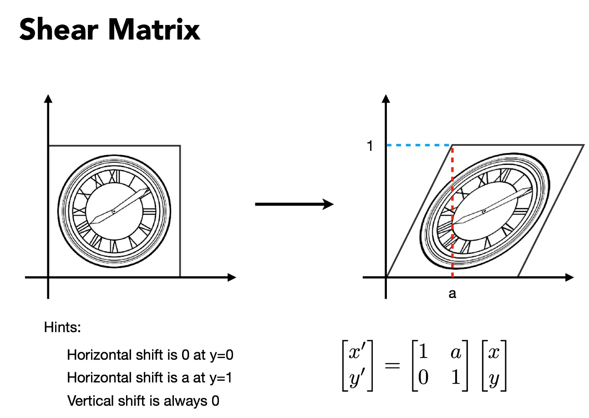

=== "Rotation"

    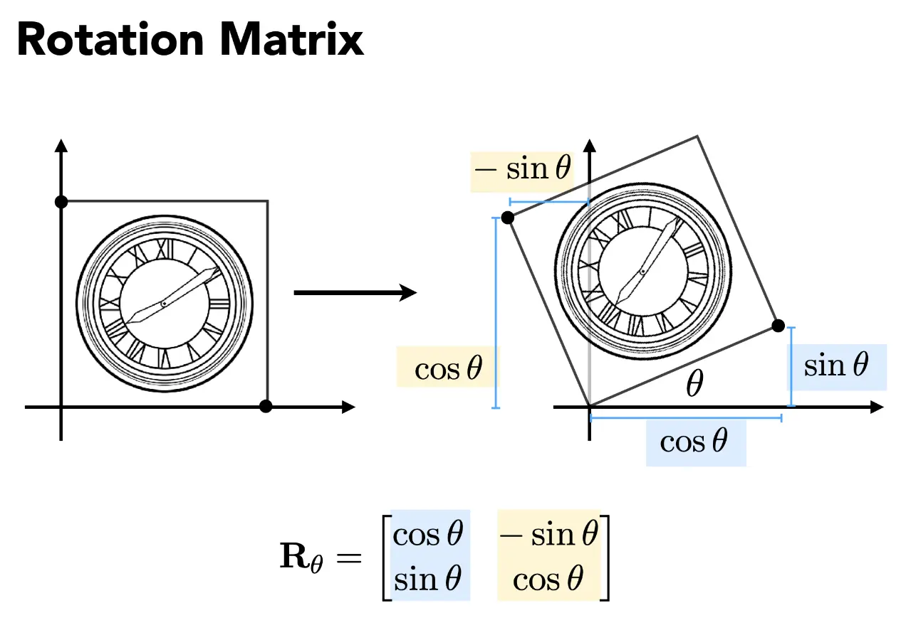

=== "Affine Transformation"

    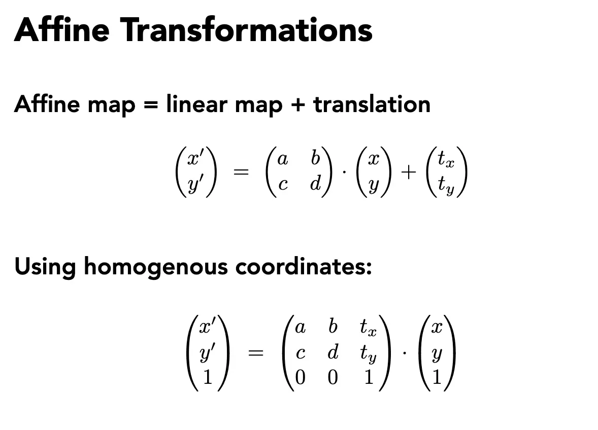

- 特征值与特征向量：$Ax = \lambda x$，这里的 $x$ 就是 $A$ 的特征向量，$\lambda$ 是对应的特征值。特征值分解：$A = V \Lambda V^{-1}$，其中 $V$ 是特征向量组成的矩阵，$\Lambda$ 是对角矩阵，对角线上是对应的特征值。
- 主成分分析/PCA：作为特征值和特征向量的应用，算法流程为计算去中心化后的数据矩阵 $A_\text{centered}$ 的协方差矩阵 $C = \frac{1}{n-1} A_\text{centered}^T A_\text{centered}$，然后对 $C$ 进行特征值分解，选择最大的 $k$ 个特征值对应的特征向量作为新的基底，将数据投影到这个新的基底上，从而实现降维。

## Lec 2: Image Formation

成像就是一个从三维空间到二维空间的投影过程，但是投影过程没那么简单。如果直接将胶片放在物体前面曝光，那么基本上不能得到一个清晰的图像，因为每一个胶片上的点都并不一一对应一个物体表面的点，太多的点的光线混合在一起了，这样的图片势必不能清晰。一个简单的想法是在胶片和物体之间放一个小孔，那么这就大幅过滤了进入胶片的光线数量，从而使得每一个胶片上的点更有可能对应物体表面的一个点—至少不会有太多点混合在一起。

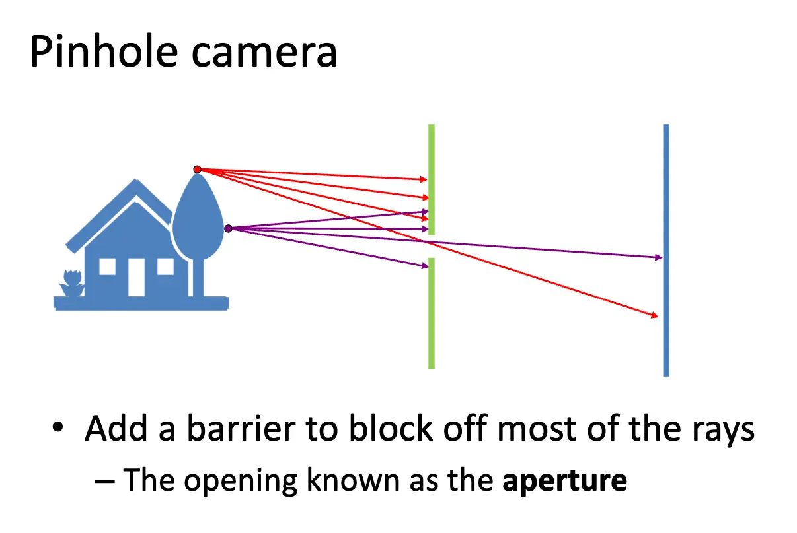

这个开的孔叫做**光圈/Aperture**，光圈越小，成像越清晰，但是透过光线的数量会更少，图像会更暗，如果变得实在太小也会发生**衍射/Diffraction**。

本质上，光圈的想法是过滤光线，使得一个点发出的光线只有可能出现在胶片上的一小部分，从而减少混合的可能性。**透镜/Lens/镜头** 的作用是类似的，它通过折射光线，使得一个点发出的光线更有可能聚集在胶片上的一个点上，不光减少了混合的可能性，还增加了透过光线的数量，从而使得图像更亮。

镜头是一个凸透镜，有汇聚光线的作用。镜头的重要参数是**焦距/Focal Length** $f$，高斯成像公式 $\frac{1}{f} = \frac{1}{d_o} + \frac{1}{d_i}$ 描述了物距 $d_o$，像距 $d_i$ 和焦距 $f$ 之间的关系。

**放大率/Magnification** $M$ 定义为 $M = \frac{h_i}{h_o} = \frac{d_i}{d_o}$，其中 $h_i$ 是像的高度，$h_o$ 是物体的高度。物体离得越远，放大率就越小，成像就越小，这就是近大远小。绝大多数时候，我们可以认为像距 $d_i$ 就是焦距 $f$，因为物体离得很远，$d_o \gg f$，这就是长焦镜头比短焦镜头成像更大的原因。 

**视野/Field of View/FOV** 定义为镜头能够看到的角度范围，视野越大，镜头能够看到的范围就越大。大致满足下面关系 $\tan(\mathit{FOV} / 2) = w/2f$，其中 $w$ 是传感器的宽度，$f$ 是焦距，也就是说，如果传感器越大、焦距越小，视野就越大。

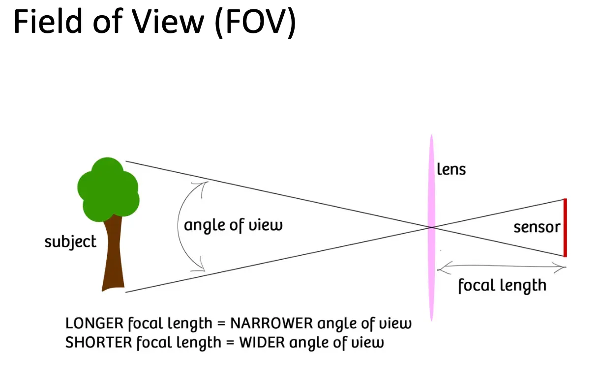

镜头也有光圈/Aperture，光圈大小直接由直径 $D$ 表示，但是更方便的是用**光圈数值/F-number** $N = f/D$ 来表示，F-number 越大，光圈直径越小，但是图像越暗。

**失焦/Defocus** 是由于物体不在焦平面上导致的模糊现象。对焦错误的物体在成像平面上形成一个模糊圆圈，如果对焦错误的物体物距为 $o'$，焦距为 $f$，像距为 $i'$，则模糊圆圈的直径 $b = D / i' \cdot \lvert i' - i \rvert$，这里面 $i$ 是正确对焦时的像距。

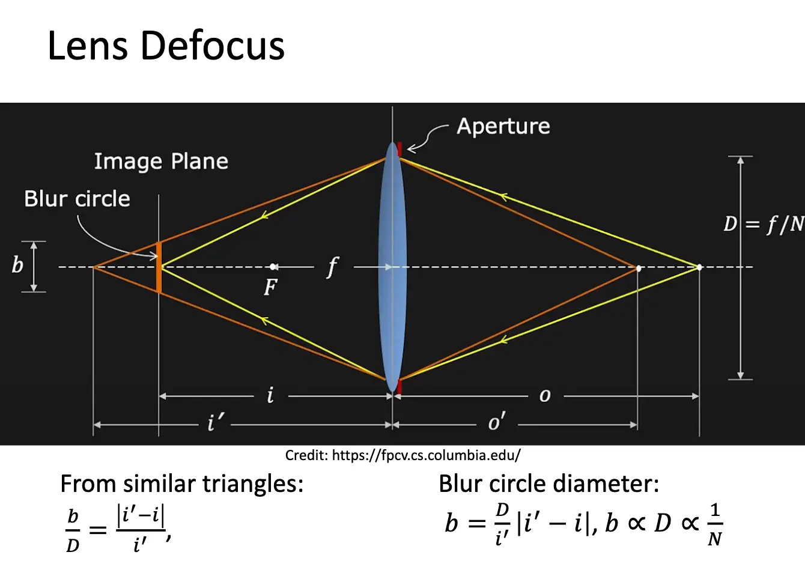

**景深/Depth of Field/DOF** 是指在成像时，物体可以偏离焦平面多少距离而仍然保持清晰的范围，意思是说，即使物体出现一定的失焦，但是其模糊圆圈的直径仍然小于某个允许的最大值 $c$，这个值一般是像素点的大小或者人眼能够分辨的最小尺寸。计算公式比较复杂，但是一般来讲，**焦距越大，景深越小**，所以长焦镜头更容易拍出来背景虚化的照片；**物距越小，景深越小**，所以拍远处的物体更容易清晰，拍近处的物体更容易虚化；$N$ 越小，**光圈越大，景深越小**，越容易虚化。所以拍人像的时候一般使用大光圈、长焦距、近前景、远背景的组合。

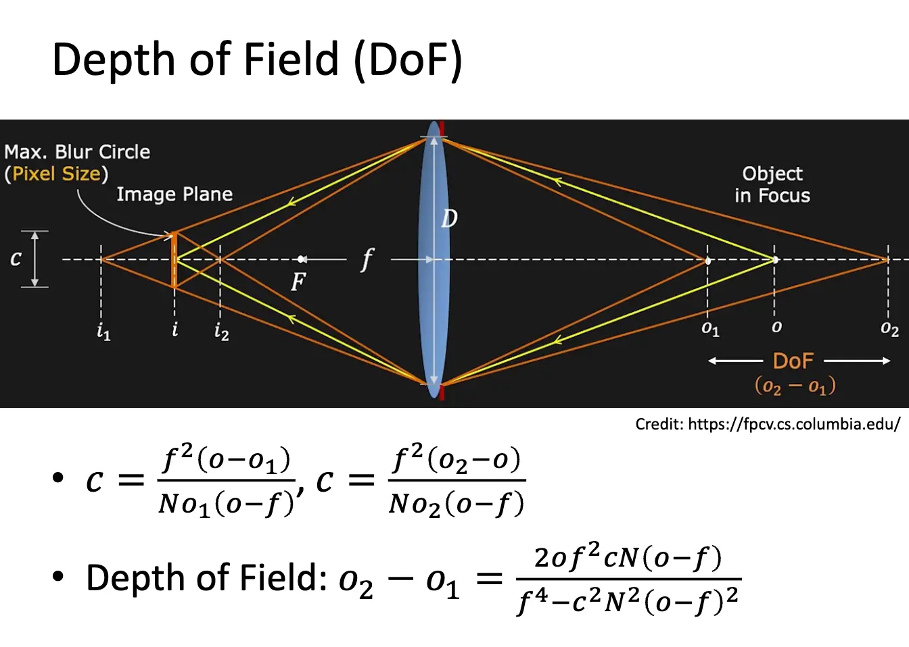

具体到成像，成像其实就是三维世界坐标到二维图像坐标的映射过程：对于小孔成像相机，假设三维点 $P_w = (x, y, z)$，焦距/孔到相片的距离为 $f$，那么二维图像点 $p = (u, v)$ 的坐标为：$(fx/z, fy/z)$。在齐次坐标系下，原三维坐标为 $(x, y, z, 1)$，投影矩阵/变换为：

$$
\begin{bmatrix}
f & 0 & 0 & 0 \\
0 & f & 0 & 0 \\
0 & 0 & 1 & 0
\end{bmatrix} \cdot \begin{bmatrix}
x \\ y \\ z \\ 1
\end{bmatrix}
= \begin{bmatrix}
fx \\ fy \\ z
\end{bmatrix}
= \begin{bmatrix}
fx/z \\ fy/z \\ 1
\end{bmatrix}
$$

在齐次坐标下，投影过程/透视投影/Perspective Projection 是线性的。

透视投影丢失掉了很多信息：首先深度信息丢失了，图像中的一个点对应三维空间中的一条射线；其次，长度关系、角度关系都丢失了，虽然直线仍然是直线，但是平行线不再平行了，垂直的线可能不在垂直了。

**Vanishing Points/灭点**：一组平行线在透视投影后会汇聚到一个点上，这个点叫做灭点。灭点的位置和这组平行线的方向有关，不同方向的平行线会有不同的灭点。一个平面上所有组平行线对应的所有灭点构成了**灭点线/Vanishing Line**。

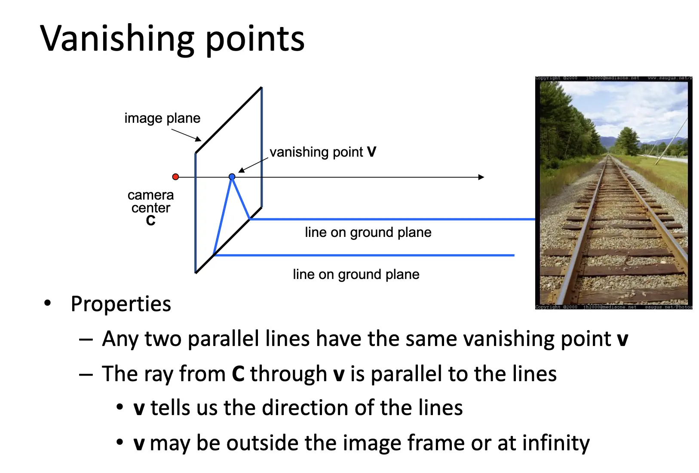

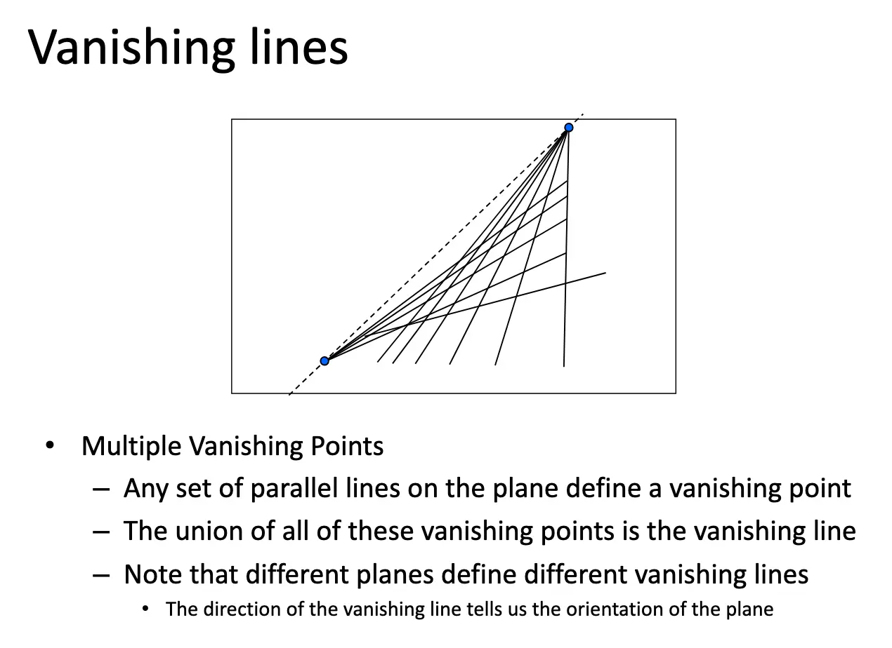

注意到不同的平面会产生不同的灭线，灭线的方向告诉我们这个平面的方向。

**Perspective Distortion/透视畸变**：由于透视投影的关系，靠近相机的物体会显得更大，远离相机的物体会显得更小，这就是透视畸变。注意到透视畸变来自于物的平面和成像平面的不平行关系，但如果相机与物平面垂直，那么地平线就不可避免的在画面的中间，解决方法是使用 View Camera 以及 Perspective Control Lens。作为结果，透视畸变会导致形状的变化，比如球会投影为椭圆，而且越靠边缘越明显。

**Radial Distortion/径向畸变**：由于镜头的制造工艺问题，光线在透过透镜边缘的时候，弯曲的程度和经过中心的时候不同，这样的畸变是沿着图像中心向外的半径方向造成的，因此称为径向畸变。某些超广角镜头拍照时会有明显的桶形畸变，使得地平线向外凸起。径向畸变可以通过相机标定进行校正。

**Orthographic Projection/正交投影**：直接将三维点向二维平面投影，不考虑深度的影响，这样投影后的二维点为 $(x, y)$。计算过程为：

$$
\begin{bmatrix}
1 & 0 & 0 & 0 \\
0 & 1 & 0 & 0 \\
0 & 0 & 0 & 1
\end{bmatrix} \cdot \begin{bmatrix}
x \\ y \\ z \\ 1
\end{bmatrix}
= \begin{bmatrix}
x \\ y \\ 1
\end{bmatrix}
$$

**Shutter Speed/快门速度**：快门速度决定了相机曝光的时间长短，快门速度越快，曝光时间越短，图像越暗，但是能够捕捉快速运动的物体而不模糊；快门速度越慢，曝光时间越长，图像越亮，但是容易因为物体运动而模糊。

**Rolling Shutter Effect/卷帘快门效应**：大多数数码相机使用滚动快门技术，一般拍视频时会出现这种效应。滚动快门是指相机传感器不是同时曝光所有像素，而是逐行曝光，这样如果物体在曝光过程中移动，就会导致图像变形。全局快门是指所有像素同时曝光，避免了这种效应，但是成本更高。

**RGB/HSV Color Spaces**：对于 RGB 颜色空间，每个颜色由红、绿、蓝三个通道的强度值表示，通常每个通道的取值范围是 0 到 255，这样就可以表示 $256^3$ 个不同的颜色，虽然容易表示，但是不符合人类的感知习惯。HSV 颜色空间将颜色表示为色调/Hue、饱和度/Saturation、明度/Value，更符合人类的感知习惯，便于进行颜色的调整和处理。

现代摄像机使用 Bayer Filter 来捕捉颜色信息，本质方法就是加滤镜。每一个像素只能捕捉红、绿、蓝三种颜色中的一种。至于为什么绿的数量是红蓝的两倍，是因为人眼对绿光更敏感。然后使用插值来恢复完整的 RGB 图像。

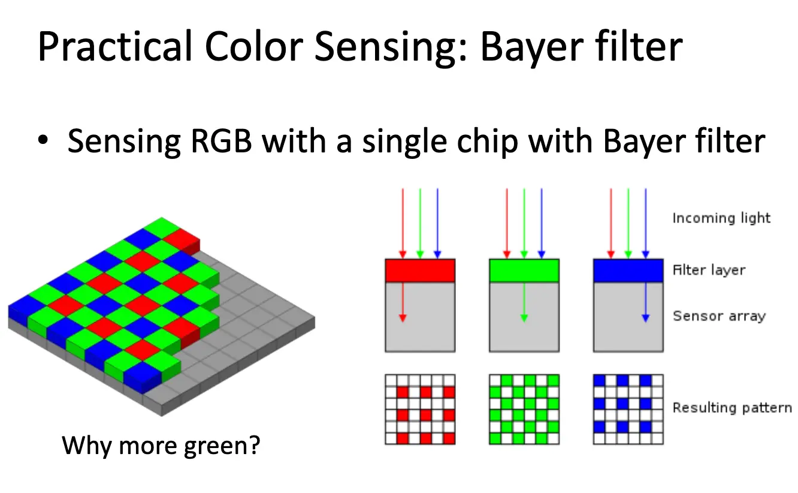

## Lec 3: Image Processing

**Contrast/对比度**：对比度是指图像中最亮和最暗部分之间的差异。高对比度图像具有明显的亮暗差异，而低对比度图像则显得平淡无奇。可以将修改对比度的过程看作一个函数变换：$o(x, y) = f(i(x, y))$，其中 $i(x, y)$ 是输入图像的像素值，$o(x, y)$ 是输出图像的像素值，$f$ 是一个单调函数。使用一个经典的 sigmoid 可以增加对比度，让白的更白，黑的更黑。

**Invert/反相**：反相是将图像的每个像素值 $i(x, y)$ 转换为 $o(x, y) = 255 - i(x, y)$，这样白色变为黑色，黑色变为白色。

除此之外我们经常使用卷积来处理图像。定义不重复书写。重点知道卷积核的作用：

- Gaussian Blur/高斯模糊：使用高斯函数作为卷积核 $f(i, j) = \frac{1}{2\pi\sigma^2} e^{-\frac{i^2 + j^2}{2\sigma^2}}$，可以平滑图像，减少噪声，大小为 3 的卷积核为 $\begin{bmatrix}.075 & .124 & .075 \\ .124 & .204 & .124 \\ .075 & .124 & .075\end{bmatrix}$。
- Sharpen/锐化：使用锐化卷积核可以增强图像的边缘和细节，典型的锐化卷积核为 $\begin{bmatrix}0 & -1 & 0 \\ -1 & 5 & -1 \\ 0 & -1 & 0\end{bmatrix}$。这个卷积核可以理解为一个增强中心像素值并减去一个模糊滤波的过程，从而突出边缘。
- Edge Detection/边缘检测：使用边缘检测卷积核可以突出图像边缘，检测横向/Horizontal 边缘的卷积核为 $\begin{bmatrix}-1 & -2 & -1 \\ 0 & 0 & 0 \\ 1 & 2 & 1\end{bmatrix}$，检测纵向/Vertical 边缘的卷积核为 $\begin{bmatrix}-1 & 0 & 1 \\ -2 & 0 & 2 \\ -1 & 0 & 1\end{bmatrix}$。
    - 一个最牛逼的事情是，这两次卷积计算出来的实际上是图像像素在垂直和水平方向的梯度，求几何平均之后就得到了图像的梯度。
- Bilateral Filter/双边滤波：非线性滤波器，每一个点的权重和空间距离以及图像内容相似度有关，可以在平滑图像的同时保留边缘信息，出自 SIGGRAPH 2002 的论文，考试不考。

**Image Sampling/图像采样**：图像采样是要在保持图像特征的情况下对图像进行缩放，变小就是下采样/Downsampling，变大就是上采样/Upsampling。

**Image Aliasing/图像走样**：比如细纹理的衬衫在采样的时候出现摩尔纹，拍车轮的视频可能出现车轮倒转的现象。走样的本质是高频信号被低采样率采样，导致频谱重叠。

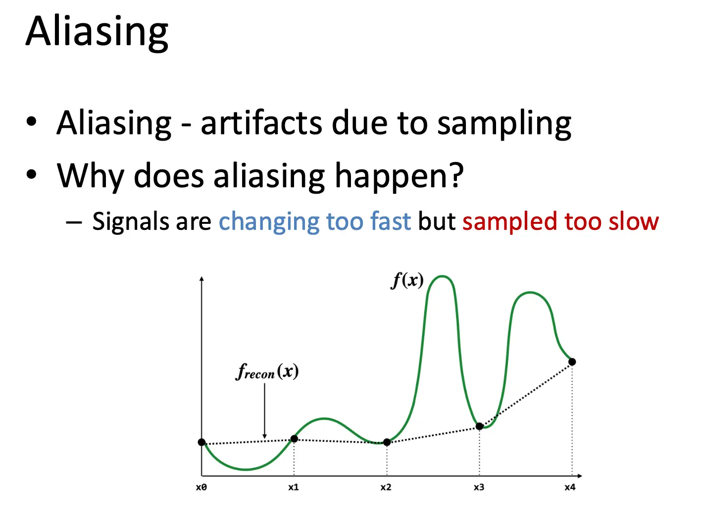

**Convolution Theorem/卷积定理**：空间域的卷积对应频域的乘法，空间域的乘法对应频域的卷积。使用傅立叶变换得到图片的频谱，坐标为 $(x, y)$ 大小为 $v$ 代表沿 $x$ 方向频率为 $x$，沿 $y$ 方向频率为 $y$ 的频率成分的强度。然后在频域进行处理，乘以一个滤波器，再进行逆傅立叶变换得到处理后的图像。因此只在中间低频部分进行保留，高频部分进行滤除，就可以实现低通滤波器，运用一些数学知识，卷积核越宽，频域的滤波器越窄，就可以得到频率越低的滤波器。

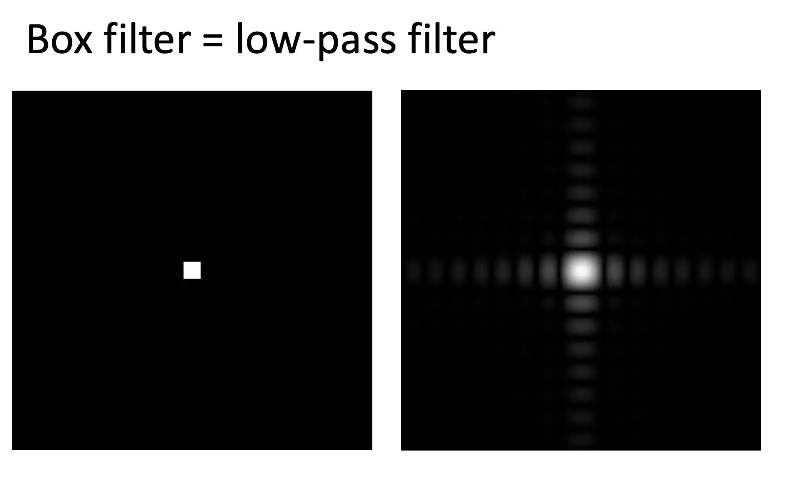

在傅里叶变换的语境下，采样就是在空间域将图像乘以一个周期性的采样函数，这样的脉冲函数经过傅立叶变换后变成另一个周期性的脉冲函数，只不过频率变成了原来的倒数。这样看，走样就是稀疏采样导致的采样结果在频率域中出现了交集（注意到频率域的采样间隔为空间域采样间隔的倒数），从而导致频率混叠，从而无法通过傅立叶逆变换恢复出原始信号。

因此就出现了两种抗走样的方法：一个是增加采样率，根据 Nyquist-Shannon 采样定理，采样率至少是信号中最高频率的两倍；另一个是使用低通滤波器滤除高频成分，从而避免频率混叠。这就是在下采样之前要做好模糊处理的原因。

至于上采样，上采样是在空间域插入更多的像素点，最简单的方法就是插值，比如最近邻插值，方法是使用最近的像素值，但是最近邻插值不连续也不光滑；线性插值，方法是左右像素的加权平均，连续但是不光滑；多项式插值，方法是每一段使用一个多项式进行拟合，可以做到连续且光滑，但是计算量大，保持一阶光滑需要三次多项式。对于二维也有类似的方法，比如双线性插值，使用周围四个点的加权平均，先在水平方向插值，再在垂直方向插值；双三次插值等等。

现在还在使用一些更高级的方法，比如超分辨率/Super Resolution，使用深度学习模型从低分辨率图像中恢复高分辨率图像，引入一些先验知识，从而得到更好的效果。

至于改变图像的长宽比，可以使用 **Seam Carving/缝合雕刻**的方法，这种方法通过找到图像中能量最低的路径/不会显著变化的路径，然后将这些路径删除  ，从而改变图像的宽度或者高度，而不会显著影响图像的内容。

## Lec 4: Model Fitting & Optimization

一般的优化问题可以表示为：

$$
\begin{aligned}
& \underset{x}{\text{minimize}} & & f(x) \\
& \text{subject to} & & g_i(x) \leq 0, \quad i = 1, \ldots, m \\
& & & h_j(x) = 0, \quad j = 1, \ldots, p
\end{aligned}
$$

**Model Fitting/模型拟合**：数学上的模型就是一个函数，描述了输入和输出的关系。模型拟合就是通过调整模型的参数，使得模型的输出尽可能接近观测数据。典型的方法是最小化均方误差/MSE：$\hat{\theta} = \arg\min_\theta \sum_{i} (y_i - f(x_i; \theta))^2$。

一般的优化过程可以看作下面流程：

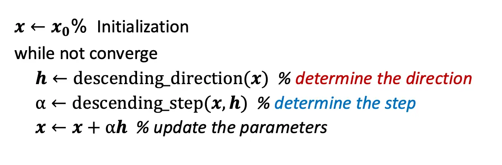

基本上所有梯度优化的方法都具有上述形式，只不过在计算梯度方向和步长上有所不同：

- 最速梯度下降/Steepest Gradient Descent：每一步都沿着当前梯度的反方向前进，步长可以通过线搜索确定。线搜索是一个回溯过程，先假设一个较大的步长 $\alpha$，一直减少 $\alpha$，直到满足 Armijo 条件 $\phi(x_k + \alpha) \leq \phi(x_k) + \gamma \alpha \phi'(x_k)$，其中 $\gamma \in (0, 1)$ 是一个小的常数。最速梯度下降优点是容易实现，当离极小值点较远时收敛较快，缺点是当接近极小值点时收敛变慢，可能出现锯齿形路径，这是由于其只考虑了一阶梯度信息，没有考虑二阶信息。
- 牛顿法/Newton's Method：使用二阶导数信息来调整搜索方向，更新公式为 $x_{k+1} = x_k - H^{-1} \cdot J$，其中 $H$ 是 Hessian 矩阵，$J$ 是梯度向量。牛顿法优点是收敛速度快，尤其是在接近极小值点时，缺点是计算 Hessian 矩阵和其逆矩阵的计算量大。
- 高斯-牛顿法/Gauss-Newton Method：计算残差平方和的一阶近似，使用 $J^T J$ 代替 Hessian 矩阵，优点是不需要计算二阶导数，收敛也很快，但是当 $J^T J$ 不可逆时会失败。
- Levenberg-Marquardt Method：加入正则化，Hessian 矩阵使用 $J^T J + \lambda I$，其中 $\lambda$ 是一个调节参数，优点是结合了最速梯度下降和高斯-牛顿法的优点，当 $\lambda$ 较大时类似于最速梯度下降，当 $\lambda$ 较小时类似于高斯-牛顿法，缺点是需要调节参数 $\lambda$，在离最小值的时候可以调高 $\lambda$，在接近最小值的时候调低 $\lambda$。

**Robust Estimation/鲁棒估计**：在实际数据中，往往会存在一些异常值/Outliers，这些异常值会对模型拟合产生较大的影响。为了减小异常值的影响，可以使用鲁棒估计方法。一种方法相较于使用 MSE，使用类似 L1、Huber 损失的损失函数，这样对于异常值的惩罚较小。另一种方法是 RANSAC/Random Sample Consensus，随机选择数据子集进行模型拟合，然后评估模型在所有数据上的表现，重复多次，选择表现最好的模型。

**Overfitting and Underfitting/过拟合与欠拟合**：过拟合是指模型过于复杂，以至于不仅捕捉到了数据的真实模式，还捕捉到了噪声，导致在新数据上的表现较差。欠拟合是指模型过于简单，无法捕捉到数据的真实模式，导致在训练数据和新数据上的表现都较差。为了避免过拟合，可以使用正则化方法，比如使用 L1/L2 正则化，L1 正则化倾向于产生稀疏解，L2 正则化倾向于产生平滑解。

## Lec 5: Image Matching & Motion Estimation

特征匹配的基本步骤：特征检测/Detection，检测出 Interest Points/兴趣点/Feature Points；特征描述/Description，计算每个兴趣点的描述子/Descriptor；特征匹配/Matching，使用某种距离度量方法将两个图像中的特征点进行匹配。

**Detection**：目标是找出具有唯一性的点，如果我们以这个点为中心构造一个窗口，如果将这个窗口在各个方向上移动，图像内容会发生显著变化，那么这个点就是一个好的兴趣点。在数学上，我们根据图像的梯度信息来判断一个点是否是兴趣点，尤其关注梯度的方向分布。使用主成分分析/PCA 来分析梯度的分布，如果梯度的两个主成分都很大，那么这个点就是一个角点/Corner Point。如果只有一个主成分很大，那么这个点就是边缘/Edge Point，如果两个主成分都很小，那么这个点就是平坦区域/Flat Region。**Harris 角点检测器**就基于这个思想，计算出 $f = \lambda_1 \cdot \lambda_2 / (\lambda_1 + \lambda_2) = \det(M) / \operatorname{trace}(M)$，这玩意叫角点响应。设定出阈值，选择 $f$ 大于阈值的点作为兴趣点。注意我们需要使用**非极大值抑制/Non-maximum Suppression** 来去除相邻的兴趣点，只保留局部最大的那个。

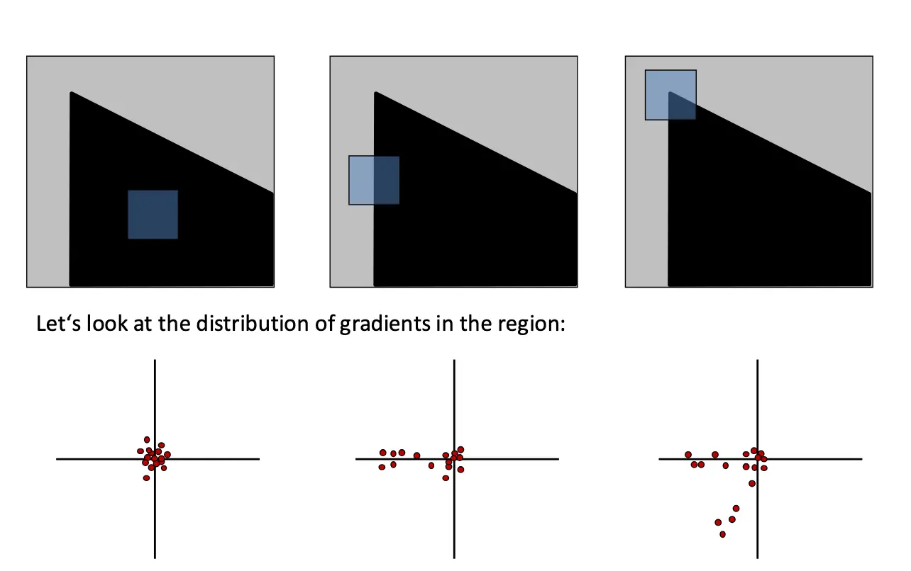

经典的图像变换包括：强度变换、旋转、平移和缩放。理想的兴趣点检测器应该对这些变换具有不变性。对于亮度变化，如果变换是整体的，都变化一个常数，那么梯度信息不变，因此具有不变性，但是如果变化是成倍的，那么梯度就会成倍的变化，因此不具有不变性。对于旋转变换，梯度的大小不变，因此 Harris 角点检测器对旋转具有不变性。对于旋转和平移变换，Harris 角点检测器都具有不变性，虽然协方差矩阵在旋转后会发生变化，但是其特征值不变，因此角点响应也不变。

对于缩放变换，同样的窗口在不同尺度的曲线上可能表现不同，可能一个角在变化之后就变成了一个边，因此 Harris 角点检测器**对缩放不具有不变性**。解决方法是结合使用 Automatic Scale Selection/自动尺度选择，不同的窗口大小都会有不同的响应值，选择响应值最大的那个作为兴趣点的尺度。一般在实现上，我们固定一个确定的窗口大小，但是对图像进行缩放。

**Blob Detection/斑点检测**：斑点在图像中具有比较大的二阶导数，因此可以计算出图像的 Laplacian，寻找 Laplacian 的极值点作为斑点。Laplacian 的计算可以使用 Laplacian of Gaussian Filter/LoG 滤波器，先对图像进行高斯模糊，然后计算 Laplacian，计算 Laplacian 的过程实际上是使用卷积核 $\begin{bmatrix}0 & 1 & 0 \\ 1 & -4 & 1 \\ 0 & 1 & 0\end{bmatrix}$，这个卷积核长得就像一个斑点，因此可以检测出斑点。但是连续用两个卷积核的计算还是太奢侈了，根据 $\nabla^2(f \star g) = f \star \nabla^2 g$，可以先计算 LoG 卷积核，然后直接对图像进行卷积。但是 LoG 也是具有尺度的，因此还是使用一个自动尺度选择的方法，在图像金字塔中进行卷积。

LoG 具有一个更简单的实现方法，叫做 Difference of Gaussians/DoG，可以证明 LoG 的形状可以近似成两个方差不一样的高斯函数的差，因此可以先对图像并行进行两次不同方差的高斯模糊，然后相减，得到的结果近似于 LoG 的结果。再说在计算图像金字塔的时候本来就需要先进行高斯模糊再进行下采样，因此计算 DoG 非常方便。

**Description**：具有相似内容的图片区域应该具有相似的描述子。描述子的计算一般是基于兴趣点周围的图像内容，计算一个向量来表示这个区域的特征。经典的方法是 SIFT/Scale-Invariant Feature Transform，其本质是计算兴趣点周围的梯度直方图，统计出梯度朝向的分布/朝向某某角度有多少个梯度。SIFT 显然对于平移和强度变换具有不变性。对于旋转不变性，SIFT 会计算出兴趣点的主方向/梯度方向最多的方向，然后将描述子旋转到这个方向，从而实现旋转不变性。对于缩放不变性，SIFT 先使用 DoG 描述子检测兴趣点，确定每一个兴趣点的尺度，然后在这个尺度下计算描述子，从而实现缩放不变性。

**Matching**：使用某种距离度量方法将两个图像中的特征点进行匹配。最简单的方法是使用欧氏距离/Euclidean Distance，找出 Nearest Neighbor，但是如果出现重复性纹理的时候就会出现问题。为了消除歧义性，可以使用 Ratio Test/比率测试，计算出 $\lVert f_1 - f_2 \rVert / \lVert f_1 - f_2' \rVert$，其中 $f_2$ 是距离 $f_1$ 最近的描述子，$f_2'$ 是距离 $f_1$ 第二近的描述子，如果这个比率很大，那么我们认为这个描述子匹配是具有歧义性的，舍弃这个匹配。注意比率测试实际上只是滤除掉一些不可靠的匹配点。

还有一种方法是使用交互最近邻/Mutual Nearest Neighbor，要求找出来 $f_1$ 的最近邻 $f_2$，同时 $f_2$ 的最近邻也是 $f_1$，这样可以保证匹配的唯一性。

两个方法并不互斥，完全可以结合使用。

对于 **Motion Estimation/运动估计**：我们的目标是追踪兴趣点的变化/Feature Tracking，给出描述运动的运动矢量，或者估计出整个图像是怎么变的/Optical Flow。最经典的方法是 Lucas-Kanade/LK 方法：其关键先验是下面三个

- Small Motion：相邻的的每一个点的位移运动都很小；
- Brightness Constancy：一样的点在每一个帧的亮度是不变的，RGB 值是几乎不变的；
- Spatial Coherence：相邻的点具有相似的运动。

根据这些假设可以做泰勒展开，列一系列方程进行求解。但是 LK 算法并不是万能的，存在一些失败的情况：

- Low Texture Regions/低纹理区域：在低纹理区域，图像的梯度信息不足，导致 $A^T A$ 不满秩，无法准确测量运动，容易出现无穷多解的情况，噪声也会对结果产生较大影响；
- 孔径问题/Aperture Problem：平行于边缘的运动分量无法测量，一条直线在图像中只能测量垂直于直线的运动分量，平行于直线的运动分量无法测量，因为照不全，一个例子是 Barber Pole Illusion；
- 打破假设/Violation of Assumptions：光照一致性被打破，比如突然开灯，从隧道出来；运动过大，可以减少分辨率，从低分辨率到高分辨率进行从粗到细的估计，迭代的是使用 LK 算法增量的计算。

## Lec 6: Image Stitching

**Image Warping/图像变形**：分两种，一种是改变图像的亮度/Intensity，另一种是改变图像的形状/Shape。对于形状的变换，线性变换可以表示为 $x' = M x$，这里坐标可以不是齐次坐标。仿射变换添加了一个平移项 $x' = M x + t$，齐次坐标下表示为：

$$
\begin{bmatrix}
x' \\ y' \\ 1
\end{bmatrix}
= \begin{bmatrix}
a & b & t_x \\
c & d & t_y \\
0 & 0 & 1
\end{bmatrix}
\cdot \begin{bmatrix}
x \\ y \\ 1
\end{bmatrix}
$$

注意到仿射变换的矩阵的最后一行一定是 $[0 \quad 0 \quad 1]$。如果最后一行不是这样，那么这个变换就是透视变换/Projective Transformation/Homography/单应变换：

$$
\begin{bmatrix}
x' \\ y' \\ 1
\end{bmatrix}
\simeq
\begin{bmatrix}
h_{00} & h_{01} & h_{02} \\
h_{10} & h_{11} & h_{12} \\
h_{20} & h_{21} & h_{22}
\end{bmatrix}
\cdot \begin{bmatrix}
x \\ y \\ 1
\end{bmatrix}
$$

单应变换很重要，相机换个角度拍摄同一个平面，两个图像之间的变换就是单应变换。**单应变换对于尺度具有不变性，可以随便乘以一个标量，因此有 8 个自由度**，有效参数只有 8 个。

基本只有两种情况是单应变换：一个是相机旋转拍摄一个平面，但是中心不动；另一个是相机移动了，但是拍摄的是一个平面。这是因为单应变换本质上是描述平面到平面的映射，是一个一一映射，所以如果相机移动了但是拍摄的不是一个平面，就有一些点在两张图像中找不到对应点，因此不可逆/不是一一映射。因此手机要求拍摄全景图的时候，必须要求相机在一个位置旋转拍摄，不能移动。

这几个变换的自由度分别是：平移具有 2 个自由度；欧式变换是平移加旋转，具有 3 个自由度；相似变换是平移加旋转加缩放，具有 4 个自由度；仿射变换具有 6 个自由度；单应变换具有 8 个自由度。

**Inverse Warping/反向变形**：对于正向变换，我们一般有一个变换 $T$ 和原图像，我希望得到变换后的图像。但是正向变换会出现一些问题：一个整数坐标下的点经过变换后可能不是整数坐标，因此需要反向变换，对于一个输出图像的像素点 $p'$，我们需要找到其对应的输入图像的像素点 $p = T^{-1}(p')$，然后使用插值方法计算出 $p$ 的像素值。这样就避免了正向变换中可能出现的空洞问题。这就解决了 **Image Warping/图像变形** 的问题。

**Image Stitching/图像拼接**：图像拼接的目标是经过图像变形将两张图像对齐。我们假设两张图像之间的变换是全局变换，因此只需要求解 $X' = H X$ 中的 $H$ 矩阵就可以。方法是先进行特征匹配，得到一系列匹配点对 $(x_i, y_i) \leftrightarrow (x_i', y_i')$，然后列方程求解 $H$ 矩阵/使用 RANSAC 进行鲁棒估计。

- 对于仿射变换，我们有六个自由度，因此有六个方程，每一个匹配点对可以提供两个方程，因此需要至少三个匹配点对来求解 $H$ 矩阵。对于多个匹配点对，可以使用最小二乘法进行求解。
- 对于单应变换，我们有八个自由度，因此需要至少四个匹配点对来求解 $H$ 矩阵，多个匹配也是使用最小二乘法进行求解。

对于 Outliers/异常值，我们可以使用 RANSAC 方法进行鲁棒估计:

- 随机选择最小数量的匹配点对来估计 $H$ 矩阵；
- Fit 一个模型，计算出正常值的数目；
- 重复上述过程多次，选择具有最多正常值的模型作为最终模型。

对于全景图，我们有时候需要投影到一个圆柱面上，这样可以减少变形。

## Lec 7: Structure from Motion

核心问题：已知一个场景的很多图像，如何恢复出场景的三维结构以及每个图像对应的相机参数/位置。

成像步骤：

- 坐标变换：世界坐标系 -> 相机坐标系
- 透视投影：相机坐标系 -> 二维图像平面
- 图像平面到图像传感器的映射：以毫米为单位的二维坐标 -> 以像素为单位的像素坐标

第一部分和相机的外参矩阵决定：相机的外参矩阵由其位置 $c_w$ 和朝向 $R$ 决定，朝向是一个 3x3 的旋转矩阵，每一行代表相机的三个轴在世界坐标系的朝向，位置是一个三维向量，代表相机在世界坐标系的位置。相机坐标系下的点 $P_c$ 的坐标为 $x_c = R (x_w - c_w) = R x_w - R c_w = R x_w + t$，其中 $t = -R c_w$，详细写来为

$$
\mathbf{x}_c = \begin{bmatrix}
x_c \\ y_c \\ z_c
\end{bmatrix}
= \begin{bmatrix}
r_{11} & r_{1 2} & r_{1 3} \\
r_{21} & r_{2 2} & r_{2 3} \\
r_{31} & r_{3 2} & r_{3 3}
\end{bmatrix} \cdot \begin{bmatrix}
x_w \\ y_w \\ z_w
\end{bmatrix} + \begin{bmatrix}
t_x \\ t_y \\ t_z
\end{bmatrix}
$$

写作齐次坐标为：

$$
\tilde{\mathbf{x}}_c = \begin{bmatrix}
x_c \\ y_c \\ z_c \\ 1
\end{bmatrix}
= \begin{bmatrix}
r_{11} & r_{1 2} & r_{1 3} & t_x \\
r_{21} & r_{2 2} & r_{2 3} & t_y \\
r_{31} & r_{3 2} & r_{3 3} & t_z \\
0 & 0 & 0 & 1
\end{bmatrix} \cdot \begin{bmatrix}
x_w \\ y_w \\ z_w \\ 1
\end{bmatrix}
$$

这个 4x4 的矩阵就是相机的**外参矩阵**，外参矩阵实际上只有 6 个自由度，表示相机的位置和朝向。至于后面两步我们已经熟悉了，透视投影为：

$$
\begin{bmatrix}
u \\ v \\ 1
\end{bmatrix}
\simeq
\begin{bmatrix}
\tilde{u} \\ \tilde{v} \\ \tilde{w}
\end{bmatrix}
= 
\begin{bmatrix}
f_x & 0 & c_x & 0 \\
0 & f_y & c_y & 0 \\
0 & 0 & 1 & 0
\end{bmatrix} \cdot \begin{bmatrix}
x_c \\ y_c \\ z_c \\ 1
\end{bmatrix}
$$

这里**内参矩阵**是考虑了分辨率和主点位置的，分辨率作用为 $f_x = m_x \times f$。总结如下：

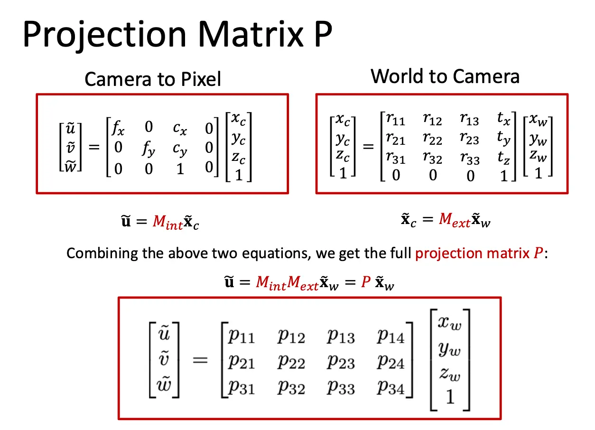

**相机的标定/Calibration** 就是求解内参矩阵和外参矩阵的过程。一般使用棋盘格标定板进行标定，反正就是确定出来一堆点解方程 $A p = 0$，然后限定 $\lVert p \rVert = 1$ 来限定只有一个解，然后使用 QR 分解求解。

**Visual Localization/视觉定位**：已知三维点和二维点，求解相机位姿。我们一般知道内参矩阵，因此问题就变成了 PnP/Perspective-n-Point 问题，这个问题的自由度只有 6，因为相机的位姿由位置和朝向决定，位置有 3 个自由度，朝向有 3 个自由度。一种方法是当做我不知道内参矩阵，使用 DLT/Direct Linear Transform 方法求解 11 个自由度的投影矩阵，然后分解得到内外参矩阵，但是这里的变量个数远大于实际需要的参数个数，我们需要 6 对点来求解。另一种方法是使用 P3P/ Perspective-3-Point 方法，使用 3 对点来求解相机的位姿，这里有 4 个解，需要使用第 4 对点来消除歧义性。更一般的方法是使用 n 对点来进行非线性优化，最小化重投影误差 $\sum_i \lVert p_i - K (R P_i + t) \rVert^2$，对 $R$ 和 $t$ 进行优化。

**Structure from Motion/SfM**：已知多张图像，求解每张图像的相机位姿和三维点的位置。这里我们假设已经知道了相机的内参。流程如下：先找到可靠的点匹配，然后算出相对的相机朝向和位置变化，然后通过三角化计算出三维点的位置，最后使用 Bundle Adjustment 进行全局优化。

Epipolar Geometry/极线几何：描述了两个视角下的点之间的几何关系。对于一个三维点 $P$，其在两个坐标系中的位置为 $(x_l, y_l, z_l)$ 和 $(x_r, y_r, z_r)$，其在两个图像中的投影点为 $u_l$ 和 $u_r$。极点/Epipole 是将两个相机连线，与图像平面相交的点，含义是两个相机互相成像的位置。极平面/Epipolar Plane 是由三维点 $P$ 和两个相机中心构成的平面，极线/Epipolar Line 是极平面与图像平面的交线。

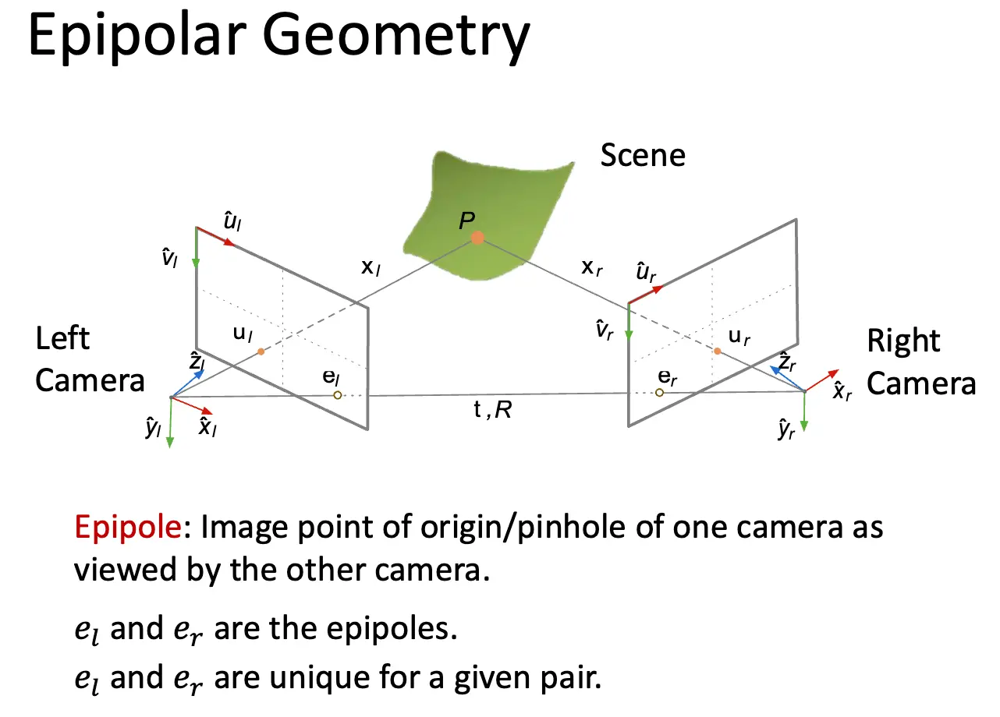

最后只需要记住 Epipolar Constraint/对极约束，左相机坐标系下的点坐标乘以 Essential Matrix 再乘以右相机坐标系下的点坐标的转置等于 0，也就是 $\mathbf{x}_r^T E \mathbf{x}_l = 0$，其中 $E = T_\times R$。

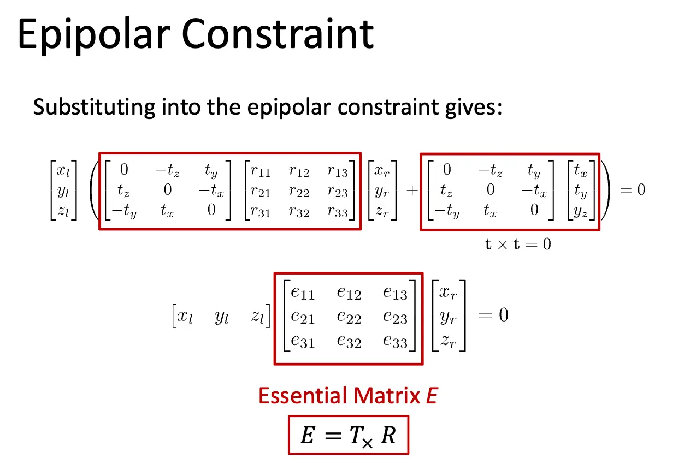

根据对极约束我们可以求出来 Essential Matrix/本质矩阵 $E$ 和 Fundamental Matrix/基础矩阵 $F$，它们的关系为 $F = K^{T}_l F K_r$，然后从 Essential Matrix 中使用奇异值分解得出相机的相对位姿 $(R, t)$。

最后使用三角化/Triangulation 方法计算出三维点的位置。三角化可以通过最小化重投影误差来实现，这时候相机所有信息都知道了，只需要最小化三维点位置就可以。整体的 SfM 是一个增量的过程，先从两张图像开始，计算出相对位姿和三维点，然后逐渐加入新的图像，计算出新的相机位姿和三维点。最后使用 Bundle Adjustment 进行全局优化，最小化所有图像的重投影误差：$E(P_{proj}, \mathbf{P}) = \sum_{i=1}^{M} \sum_{j=1}^{N} \lVert u_j^{(i)} - P_{proj}^{(i)}(P^{(j)}) \rVert^2$，意思是每一个点在每一个图像中的重投影误差之和。

## Lec 8: Depth Estimation & 3D Reconstruction

深度图为每一个像素点提供了一个深度值，表示该像素点对应的三维点到相机平面的距离。深度图可以通过主被动两种方式进行估计：主动方法包括使用雷达、结构光，必须要主动地发射波来感知；被动方法包括立体视觉、单目深度估计。

双目视觉来进行深度估计说白了就是三角化：先找出两个图像中的匹配点，双目相机的相对位姿是固定的且已知，然后三角化就得了。但是一个难点是给出图像中所有点的匹配和深度，然后计算出深度图。

非常好的一点是我们已经知道了 Essential Matrix 以及 Fundamental Matrix，对于照片中的一个点 $x_l$，其在右图像中的对应点 $x_r$ 必须满足对极约束 $x_l^T F x_r = 0$，因此左边的点对应右边的一个极线，我们只需要在极线上寻找匹配点就可以了，大大减少了搜索空间。最简单的情况就是极线实际上是水平线，这种情况在双目相机中是成立的：

- 相机的相平面互相平行、和基线/Baseline 也就是两个相机中心的连线平行；
- 相机中心在一个高度上；
- Focal Length/焦距相同；

这样极线实际上就是图像的水平线，因此我们只需要在同一行上寻找最优的匹配点就可以了，这里直接计算 RGB 差值就可以，方法很多。在我们找到匹配点之后，计算视差 $d = x_l - x_r$，然后根据公式 $Z = f \cdot B / d$ 计算出深度值 $Z$，其中 $B$ 是基线长度/两个相机中心的距离，$f$ 是焦距。

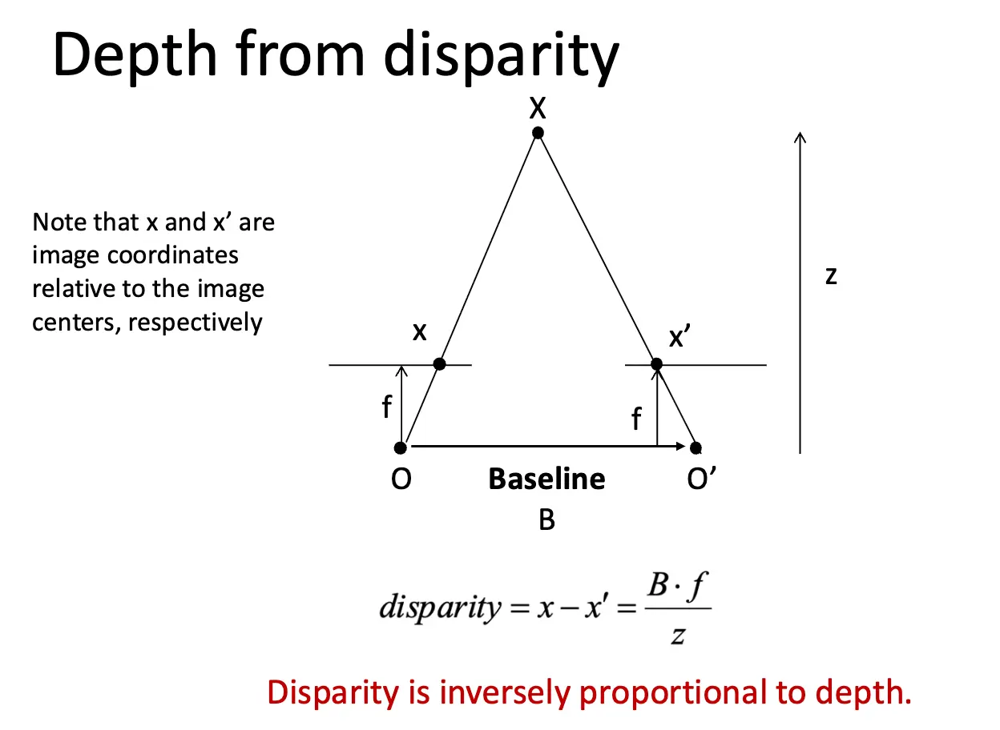

当两张图片歪歪扭扭的时候，我们需要先进行 Rectification/图像矫正，将两张图像变换到一个新的平面上，使得极线变成水平线。具体矫正过程就此略去。有几个因素会影响深度估计的效果：

- Baseline：基线越长，视差越大，深度估计越准确；基线越小，视差越小，视线交叉的地方深度越大，深度估计越不准确。一般来讲基线比较大比较好，但是基线过大可能会导致匹配困难。
- 标定有可能也错误、图像分辨率不够/光束很宽，出现了遮挡，光线变化、纹理重复等问题。

结构光相机只需要一个相机就可以，因为 Projector/投影仪会投射出一个已知的图案到场景中，然后相机拍摄这个图案，根据图案的变形来计算出深度信息。结构光相机的原理和双目视觉类似，投影仪相当于第二个相机，只不过它投射的是一个已知的图案，因此匹配点是已知的。

**Multi-View Stereo/MVS**：优点是约束更强，因为有更多的视角；如果有多个潜在的 Neighbor，可以选择一个最优的子集；可以根据每一个参考帧重建一个深度图，然后融合成一个完整的点云。

基本想法是：准确的深度会给出更一致的投影结果，但是错误的深度会导致投影结果不一致。给定一个参考帧，可以将问题建模成在一条射线上寻找最优的深度值。对于每一个像素点 $p$，我们假设其深度为 $d$，然后将其投影到其他视角中，计算出投影点 $p_i$，然后计算出投影点和实际观测点之间的差异，使用某种代价函数进行衡量，最优的深度值就是误差最小的深度值。PatchMatch 是一种高效的 MVS 方法。

3D 表示有四种方式：点云、体素/Volume、网格/Mesh。点云是一堆三维点的集合，表示简单，但是不连续，没有表面信息。体素可以将空间划分成一个个小立方体，每一个小立方体有一个值，表示该位置是否被占据，或者距离表面的距离/Signed Distance Function/SDF。Mesh 是一种连续的表示方式，使用顶点和面来表示三维表面，常用的格式是三角网格。

- Point Cloud/Depth Maps -> Volume：使用 Poisson Surface Reconstruction/泊松重建方法；
- Volume -> Mesh：使用 Marching Cubes：

三维重建一般包括以下几个步骤：

- 计算出每一张图像的深度图，可以使用 MVS 方法；
- 将深度图反投影到三维空间，将深度图转换到点云，再使用泊松重建得到体素表示，最后提取出网格；
- 最后进行纹理映射。

## Lec 9: Others

<!--
9. 深度学习：记住概念 公式不用记（唯一记住神经网络的数学表达式）历史网络结构(network arch）不考
10. 识别：分类检测分割 人体的姿态估计 知道任务是在干嘛（输入输出格式），代表性方法的名字
-->

## Lec 10: Computational Photography

**HDR/High Dynamic Range Imaging/高动态范围成像**：Exposure = Gain x Irradiance x Time。Gain 是传感器的灵敏度，被 ISO/感光度控制；Irradiance 是场景的亮度，也就是光强，可以通过光圈控制；Time 是曝光时间，可以使用快门控制。ISO 越高，传感器越灵敏，但是噪点也越多。

动态范围/Dynamic Range 是指图像中一个量的最高值和最低值之比，人眼的动态范围非常大，但是 8bit 的 RGB 图像动态范围只有 256:1，原始的单反相机/SLR 传感器动态范围大概在 4096:1 左右，因为其使用 RAW 格式保存图像数据，一般使用 12 位保存数据。

HDR 的想法是：拍摄多张不同曝光时间的图像，然后将这些图像合成为一张 HDR 图像。合并的过程对每一个像素点进行处理：

- 首先选择每张图像中曝光合适的像素点，过曝和欠曝的像素点不考虑；
- 然后将这些像素点的值根据曝光时间的倒数进行加权平均，得到一个更准确的像素值。

**Deblurring/去模糊**：图像模糊常见有两种原因：失焦模糊/Defocus Blur 和运动模糊/Motion Blur。失焦模糊是因为相机对焦不准，导致图像中的点被模糊成一个圆盘；运动模糊是因为相机或者物体在曝光时间内发生了运动，导致图像中的点被模糊成一条线段。先不管去模糊的算法，我们尽可能还是避免模糊的产生，比如使用更短的曝光时间、更大的光圈、更高的 ISO，或者用单反。

模糊其实可以建模成一个卷积的过程，模糊图像是清晰图像和一个模糊核/Blur Kernel 的卷积，模糊核决定了模糊的原因。去模糊的目标是已知模糊图像和模糊核，求解清晰图像，这个问题可以使用反卷积/Deconvolution 方法进行求解。Deconvolution 可以根据是否知道卷积核分为两种情况：

- Non-blind Deconvolution/非盲去卷积/NBID：已知模糊图像 G 和模糊核 H，求解清晰图像 F。
    - 使用傅立叶变换进行求解：$\mathcal{F}(G) = \mathcal{F}(F \ast H) = \mathcal{F}(F) \cdot \mathcal{F}(H)$，因此 $F = \mathcal{F}^{-1}(\mathcal{F}(G) \div \mathcal{F}(H))$。但是由于模糊核实际上是一个低通滤波器，因此 Inverse Filter/逆滤波器会放大高频噪声，因此需要使用 Wiener Filter/维纳滤波器进行改进，在分母上加入常数项，抑制高频噪声的影响。
    - 可以使用优化方法进行求解：优化变量为 $F$，建模模糊过程为 $G = F \ast H + N$，其中 $N$ 是高斯噪声，然后最小化 MSE 重建误差 $\lVert G - F \ast H \rVert^2$，但是这个优化问题是病态的，因此需要加入正则化项，对于一个自然图像，其梯度一般是稀疏的，因此可以使用 L1 正则化对梯度进行正则 $\lambda \lVert \nabla F \rVert_1$，最终的优化目标为 $\lVert G - F \ast H \rVert^2 + \lambda \lVert \nabla F \rVert_1$。
- Blind Deconvolution/盲去卷积/BID：不知道卷积核，需要先验知识：比如卷积核一般是稀疏且非负的，可以使用优化方法进行求解：$\min_{F, H} \lVert G - F \ast H \rVert^2 + \lambda_1 \lVert \nabla F \rVert_1 + \lambda_2 \lVert H \rVert_1$，限制条件为 $H \geq 0$。
