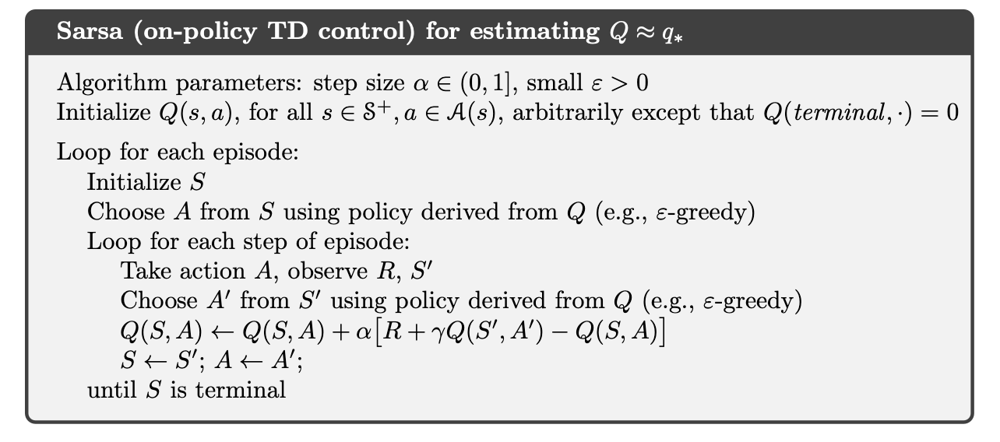

# Chapter 6: Temporal-Difference Learning

## 6.1 TD Prediction

## 6.2 Advantages of TD Prediction

## 6.3 Optimality of TD(0)

## 6.4 Sarsa: On-Policy TD Control

第一步需要学习的是动作价值哈数，我们必须对所有状态 $s$ 和动作 $a$ 估计出在当前行动策略下所有对应的 $q_\pi(s, a)$，Sarsa 使用更新公式 

$$
Q(S_t, A_t) \leftarrow Q(S_t, A_t) + \alpha [R_{t+1} + \gamma Q(S_{t+1}, A_{t+1}) - Q(S_t, A_t)]
$$

更新动作价值函数，每当从非终止状态的 $S_t$ 中出现一次转移之后，就进行上面的一次更新，如果 $S_{t+1}$ 是终止状态，则 $Q(S_{t+1}, A_{t+1})$ 的值为 0。这样的更新规则使用了描述整个事件的五元组 $(S_t, A_t, R_{t+1}, S_{t+1}, A_{t+1})$，因此被称为 Sarsa。

基于上述的 Sarsa 预测方法设计一个同轨策略的控制方法是直接的，首先持续为行动策略 $\pi$ 估计其动作价值函数 $q_\pi$，然后根据估计的 $q_\pi$ 朝着贪心优化的方向转化 $\pi$。下面是具体算法伪代码：

只要所有状态-动作二元组都被访问过无限次，并且贪心策略在极限情况下可以收敛，那么 Sarsa 可以以概率 1 收敛到最优的策略和动作价值函数。

记状态-动作二元组的 TD 误差为 $\delta_t = R_{t+1} + \gamma Q(S_{t+1}, A_{t+1}) - Q(S_t, A_t)$，这里可以估计出

$$
G(S_t, A_t) - Q(S_t, A_t) = \sum\limits_{k=t}^{T-1} \gamma^{k-t} \delta_{k}
$$

其中 $T$ 是事件的终止时间。计算很简单。

## 6.5 Q-Learning: Off-Policy TD Control

## 6.6 Expected Sarsa

## 6.7 Maximization Bias and Double Learning

## 6.8 Games, Afterstates, and Other Special Cases

