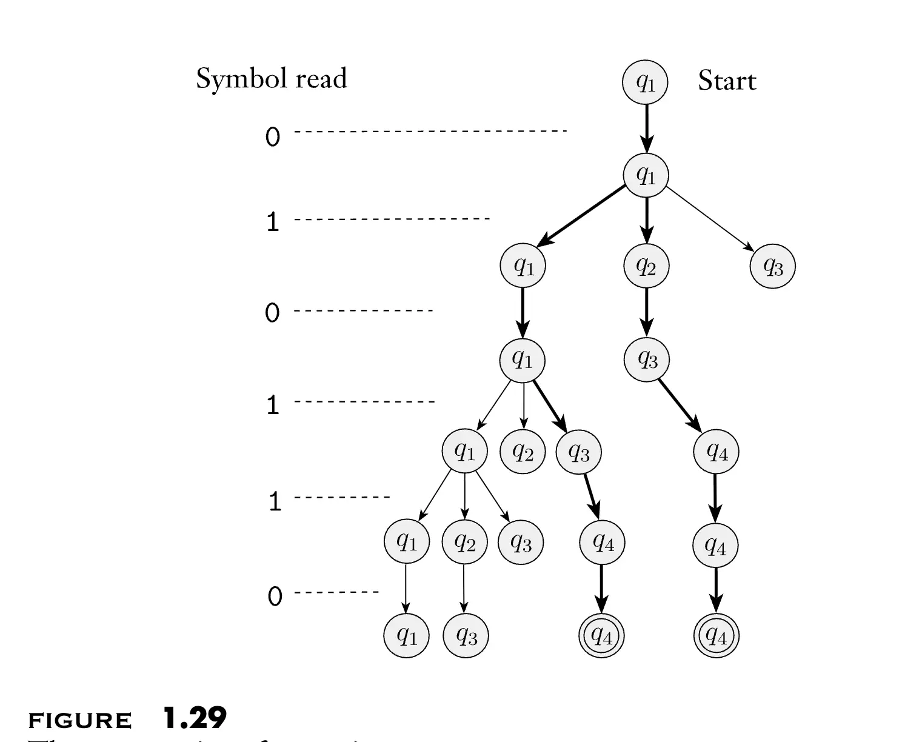
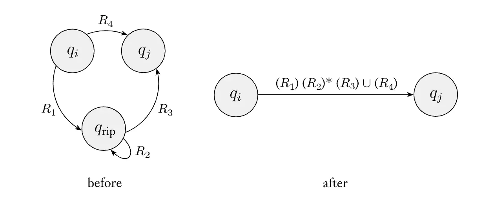
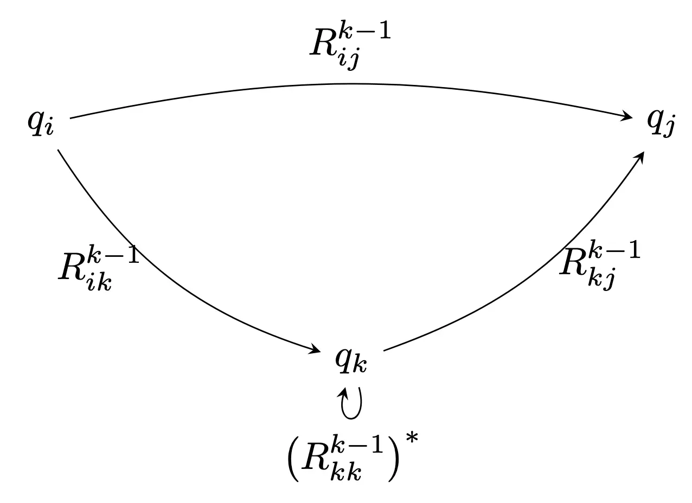

# Part 3: Regular Languages and Automata

!!! Info "Outline"

    - 将计算无限长函数的问题转化为一个计算任意长度输入的布尔函数的问题，进而将计算任务转化为判定任务，定义出形式语言以及形式语言的判定问题。
    - 定义了有限自动机/DFA 和非确定性有限自动机/NFA，并证明了它们是等价的，使用是否能被自动机判定这一判据定义正则语言。
    - 注意到 DFA 的数目是可数的，但是语言的数目是不可数的，因此一定存在非正则语言，从而我们探究正则语言的结构，发现正则语言在正则运算下是封闭的。
    - 使用正则表达式描述正则语言，证明正则表达式和自动机是等价的。
    - 引入 Pumping Lemma 证明正则语言的必要条件，给出了判定语言是否正则的一个重要判据。

## 1. Function with Variable Input Length

传统的布尔电路模型/NAND-CIRC 程序有一个显著的缺陷，只能计算有限函数 $f: \{0,1\}^n \rightarrow \{0,1\}^m$，对于任意别的长度的输入，我们都需要一个新的电路/程序来进行计算：比如我们设计一个 32 位的乘法器，就不能直接使用它计算 64 位的乘法，表现能力非常有限，因此我们需要一个新的计算模型来处理任意长度输入的计算任务，比如处理任何位数的加法、乘法，或者判断一个字符串是否是回文串等任务。

直观上，我们需要处理的函数为 $f: \{0,1\}^* \rightarrow \{0,1\}^*$，但是输出是任意位的函数有点难以处理，因此我们先考虑布尔函数 $F: \{0,1\}^* \rightarrow \{0,1\}$，如果将输出的每一位拆开来看，我们或许可以使用一堆/最好是一个专门的布尔函数来计算这个输出的每一位，从而实现对任意位输出的计算。这就是下面的定理：

!!! Danger "Theorem: Booleanizing Functions"

    对于任意的函数 $F:\{0,1\}^* \rightarrow \{0,1\}^*$，存在一个函数 $BF:\{0,1\}^* \times \mathbb{N} \times \{0,1\} \rightarrow \{0,1\}$，使得对于任意的 $x \in \{0,1\}^*$，$i \in \mathbb{N}$ 和 $b \in \{0,1\}$，都有：

    $$
    BF(x,i,b) = \begin{cases}
                F(x)_i & i<|F(x)|, b=0 \\
                1      & i<|F(x)|, b=1 \\
                0      & i \geq |F(x)|
                \end{cases}
    $$

    使得任意一个 $F$ 都可以通过 $BF$ 计算出来，反之亦然。

**Proof：**
只需要验证性的证明就可以。如果 $b = 1$，那么 $BF$ 可以告诉我们 $F(x)$ 的长度，因为当且仅当 $i < |F(x)|$ 的时候，$BF(x,i,1) = 1$。如果 $b = 0$，那么 $BF$ 可以告诉我们 $F(x)$ 的第 $i$ 位是什么。因此，给定 $BF$，我们可以通过不断地询问 $BF(x,i,1)$ 来获得 $F(x)$ 的长度，然后再询问 $BF(x,i,0)$ 来获得 $F(x)$ 的每一位，从而计算出 $F(x)$。

反过来，给定 $F$，我们可以直接按照定义来计算 $BF$。

这样，不管我们要计算什么函数，我们只需要计算一个布尔函数 $F:\{0,1\}^* \rightarrow \{0,1\}$ 就可以了，基于此，我们可以为新的计算模型提出一个新的任务，我们希望新的计算模型可以处理语言的判定问题，或者说可以计算布尔函数 $F:\{0,1\}^* \rightarrow \{0,1\}$。

## 2. Formal Languages

对于每一个布尔函数 $F:\{0,1\}^* \rightarrow \{0,1\}$，其实际上判定了每一个字符串 $x \in \{0,1\}^*$ 是否满足某一个性质，输出为布尔值。考虑布尔值的运算与或非，我们发现其实际上和集合论中的并交补有着一一对应的关系，因此对于每一个布尔函数 $F$，我们可以定义集合 $L_F = \{ x \mid F(x) = 1 \}$，该集合包含了所有使得 $F$ 输出 $1$ 的字符串。这样的集合称为 **语言/Languages**。一个 **形式语言/Formal Language** 是一个子集 $L \subseteq \{0,1\}^*$，或者更一般地在一个有限的 **字母表/Alphabet** $\Sigma$ 上，$L \subseteq \Sigma^*$。

语言的判定问题为，给定一个字符串 $x \in \{0,1\}^*$，判断 $x$ 是否属于语言 $L$。如果我们可以计算函数 $F$，那么我们就可以判定语言 $L_F$ 的 Membership，反之亦然。因此，计算布尔函数的任务也被称为判定语言/Deciding a Language。我们一般混用这两种定义。

后面我们将考虑，如果两个布尔函数 $F$ 和 $G$ 可以被某一种计算模型计算出来，那么是否它们的组合（比如与或非）也可以被这种计算模型计算出来，从而研究这种计算模型的封闭性，而这种封闭性恰好和语言在集合论运算下的封闭性是遥遥相望的。

## 3. Deterministic Finite Automaton

有限自动机就是一种简单而具有很强表现力的计算模型，将有限规模的部分和随输入增长的部分解耦。

!!! Info "Definition: Deterministic Finite Automaton/DFA"

    一个具有 $C$ 个状态的 **确定性有限自动机/Deterministic Finite Automaton/DFA** 是一个二元组 $(T,\mathcal{S})$，其中 $T:[C]\times \{0,1\} \rightarrow [C]$ 为该 DFA 的转义函数，$\mathcal{S} \subseteq [C]$ 是接受状态的集合。

    设 $F:\{0,1\}^* \rightarrow \{0,1\}$ 是一个定义在无限域 $\{0,1\}^*$ 上的布尔函数。如果对于每一个 $n\in\mathbb{N}$ 和 $x\in \{0,1\}^n$，我们定义初始状态 $s_0=0$，并且对于每一个 $i\in [n]$ 定义 $s_{i+1} = T(s_i,x_i)$，那么如果有且仅有当且仅当 $s_n \in \mathcal{S}$ 时 $F(x)=1$，我们就说 $(T,\mathcal{S})$ 计算函数 $F:\{0,1\}^* \rightarrow \{0,1\}$。这意味着这个状态机可以判断任意长度的字符串是否属于某一个语言/布尔函数是否输出 1，并且其接受当且仅当这个字符串属于这个语言/布尔函数输出 1。

    DFA 也可以按照如下方式定义：一个 DFA 是一个五元组 $(Q, \Sigma, T, q_0, F)$，其中 $Q$ 是状态集合，$\Sigma$ 是字母表，$T: Q \times \Sigma \rightarrow Q$ 是转移函数，$q_0 \in Q$ 是初始状态，$F \subseteq Q$ 是接受状态集合。在本书中，我们将状态集合总是定义为 $Q = \{0, 1, \ldots, C-1\}$，并且初始状态总是 $q_0 = 0$，这不会影响模型的计算能力。另外，我们将字母表限制为 $\Sigma = \{0,1\}$。

    在课堂上，我们将 DFA 定义为 $M = (K, S, F, \delta)$，分别为状态、起始状态、接受状态和转移函数。

对于我们考虑的自动机，下面几个量和输入长度无关：

- 状态机中状态的数量 $C$；
- 转移函数 $T$：函数只有 $C \times 2$ 个输入，因此可以使用一个 $2C$ 行的表格来表示；
- 接受状态集合 $\mathcal{S}$：可以使用一个长度为 $C$ 的二进制字符串来表示，每一个位表示对应状态是否为接受状态。

因此我们可以使用有限个符号完整地描述一台自动机——这也是我们对任何算法概念要求的性质，我们必须准确地写下它如何从输入产生输出的完整规范。另一方面，我们意识到如果每一台 DFA 是完全由有限个符号描述的，那么任何一台 DFA 都可以进行编码，能编码的东西自然是可数的，因此 **DFA 的数目是可数的**。 

DFA 的性质决定了其可以使用有限处理无限，对于一个 DFA，下面量不受任何常数限制，给定任意确定输入，其仍然是有限的：

- DFA 的输入字符串 $x \in \{0,1\}^*$ 的长度，虽然输入长度应该是有限的，但是多长都可以；
- DFA 执行的步数，DFA 对输入字符串进行单遍扫描，因此其执行步数等于输入字符串的长度。

对于一个 DFA $M$ 和一个布尔函数 $f$，如果对于任意的输入 $x$，$M$ 接受 $x$ 当且仅当 $f(x) = 1$，那么我们就说 DFA $M$ 计算/Computes 布尔函数 $f$，同样可以定义 DFA 判定/Decides 一个语言 $A$。每一个 DFA $M$ 判定的语言 $L(M)$ 是所有被 $M$ 接受的字符串的集合 $\{ x \in \{0,1\}^* \mid M \text{ accepts } x \}$。

进而，我们可以定义 **DFA 可计算函数/DFA-computable functions**：如果存在一个 DFA $M$ 计算布尔函数 $F:\{0,1\}^* \rightarrow \{0,1\}$，那么我们就说 $F$ 是 DFA 可计算的。每一个 DFA 可计算函数都对应一个形式语言 $L$，如果一个语言 $L$ 可以被某一个 DFA 判定，那么我们就说 $L$ 是 **正则语言/Regular Language**。

很自然的一个问题是：是否所有的语言都是正则语言？是否每一个语言都可以被一个 DFA 判定？答案是否定的，因为 DFA 的数目是可数的，而语言的数目是不可数的，因此一定存在某一个语言无法被任何一个 DFA 判定。

!!! Danger "Existence of DFA-uncomputable functions"

    存在一个布尔函数 $F:\{0,1\}^* \rightarrow \{0,1\}$，使得没有任何 DFA 可以计算 $F$。

    换句话说，并不是所有形式语言都是正则的。

既然并不是所有形式语言都是正则的，那么我们需要考虑正则语言的结构，在开始讨论之前，我们需要先引入另一种自动机：非确定性有限自动机/Nondeterministic Finite Automaton/NFA。

## 4. Non-deterministic Finite Automaton

!!! Info "Definition: Nondeterministic Finite Automaton/NFA"

    一个非确定性有限自动机/Nondeterministic Finite Automaton/NFA 是一个五元组 $(Q, \Sigma, \delta, q_0, F)$，其中 $Q$ 是状态集合，$\Sigma$ 是字母表，$\delta: Q \times \Sigma_\varepsilon \rightarrow \mathcal{P}(Q)$ 是转移函数，$q_0 \in Q$ 是初始状态，$F \subseteq Q$ 是接受状态集合。这里 $\Sigma_\varepsilon = \Sigma \cup \{\varepsilon\}$，$\mathcal{P}(Q)$ 是 $Q$ 的幂集。

    在课上，我们定义的 NFA 为 $N = (K, S, F, \Delta)$，分别为状态、起始状态、接受状态和转移关系 $\Delta \subseteq K \times \{0, 1, e\} \times K$，这仨分别为当前状态、输入符号以及下一个状态，限定了所有可能的转移。

NFA 和 DFA 的区别是很直接的：DFA 中，转移函数接受一个状态和一个输入符号，并且输出下一个状态；而在 NFA 中，转移函数接受一个状态和一个输入符号或者空字符串 $\varepsilon$，并且输出可能的下一个状态的集合。NFA 的转移从函数变成了关系，这就是非确定性的来源。我们可以想象，当 NFA 每读取一个输入符号之后，自动机将自己复制成很多个副本，这些副本并行的遵循转移关系进行状态转移，覆盖所有可能的路径，如果下一个输入符号没有出现在任何一个转移关系中，这个机器就停止，只要有一个副本最终到达了接受状态，那么整个 NFA 就接受这个输入字符串。

非确定性对计算理论产生了很深远的影响，在某种意义上，非确定性是确定性的一种泛化或者扩展，DFA 实际上也是一个 NFA。非确定性可以视为一种并行计算，很多个进程或者线程在同时运行，覆盖所有可能的计算路径，只要一个成功，那么整个计算就成功了。

我们形式化地确定一下接受的定义：如果自动机 $N$ 接受一个字符串 $w = y_1 y_2 \ldots y_n$，其中 $y_i \in \Sigma_\varepsilon$，那么存在一个状态序列 $s_0, s_1, \ldots, s_n$，使得 $s_0 = q_0$，对于每一个 $i = 0, 1, \ldots, n-1$，都有 $s_{i+1} \in \delta(s_i, y_{i+1})$，并且 $s_n \in F$。也就是说，存在一条路径使得从初始状态出发，经过输入字符串的每一个符号，最终到达一个接受状态。

同理可以定义一个 NFA 判定一个语言或者计算一个布尔函数。

NFA 和 DFA 实际上判定了同一类语言，这个结果是非常重要的。直接推论就是：一个语言是正则的，当且仅当存在一个 NFA 判定它。

直观上看，NFA 的“并行计算能力”似乎比 DFA 更强大，因此我们可能认为 NFA 可以判定更多的语言，然而事实并非如此。NFA 和 DFA 判定了同一类语言。这个结果很重要，因为 NFA 更加灵活，很多时候为一个语言描述一个 NFA 比描述一个 DFA 要容易得多，但是两种自动机又是等价的，我们就不需要考虑到底使用哪一种自动机了。

!!! Danger "Theorem: Equivalence of NFA and DFA"

    如果两个自动机识别一样的语言，那么这两个自动机是等价的。每一个 NFA 都存在一个等价的 DFA。

    反过来是显然的，因为每一个 DFA 都是一个 NFA。

**Proof：**
我们的目标是将一个 NFA 转换为一个等价的 DFA，想法是使用一个 DFA 模拟 NFA 类似于树一样的计算过程，进而将 NFA 转化成一个等价的 DFA。令 $N = (Q, \Sigma, \delta, q_0, F)$ 为一个 NFA，我们构造一个 DFA $M = (Q', \Sigma, \delta', q_0', F')$ 来识别一样的语言。首先考虑 $N$ 内没有 $\varepsilon$ 转移的情况，之后我们再考虑 $\varepsilon$ 转移的情况。我们现在一步步地构造 DFA $M$：

- 状态集合 $Q' = \mathcal{P}(Q)$。DFA $M$ 的每一个状态是 NFA $N$ 的状态的一个子集。想法是这样：如果按上图一样可视化 NFA 的计算过程，可以发现其实 NFA 还是有确定性的状态转移的，我们将这个树的每一个 level 视为 NFA 读取了一个输入符号之后的状态，那么我们就可以将这个 level 上的所有状态的集合视为 DFA 的一个状态。
- 转移函数 $\delta'$：对任意 $R \in Q'$ 和 $a \in \Sigma$，令 $\delta'(R, a) = \{ q \in Q \mid q \in \delta(r, a) \text{ for some } r \in R \}$。如果 $R$ 是 DFA $M$ 的一个状态，那么它也是 NFA $N$ 的一组状态的集合。当 $M$ 在状态 $R$ 读取符号 $a$ 的时候，它展示了 $N$ 在 $R$ 中的每一个状态读取符号 $a$ 会到达哪里。因为每一个状态可能会到达一组状态，我们取这些组状态的并集。另一种写法是 $\delta'(R, a) = \bigcup_{r \in R} \delta(r, a).$
- 初始状态 $q_0' = \{ q_0 \}$。$M$ 从包含 $N$ 的初始状态的集合对应的状态开始。
- 接受状态集合 $F' = \{ R \in Q' \mid R \text{ contains an accept state of } N \}$. 如果 $R$ 包含了 $N$ 的一个接受状态，那么 $M$ 就可以接受。

接下来我们需要考虑 $\varepsilon$ 转移。为此，我们引入一个额外的符号。对于 NFA $N$ 的任意状态集合 $R$，我们定义 $E(R)$ 为可以通过仅沿着 $\varepsilon$ 箭头从 $R$ 的成员到达的状态的集合，包括 $R$ 的成员本身。形式上，对于 $R \subseteq Q$，令

$$
E(R) = \{ q \mid q \text{ can be reached from } R \text{ by traveling along } 0 \text{ or more } \varepsilon \text{ arrows} \}
$$

由于 NFA 可以经历 $\varepsilon$ 转移，我们需要修改得到的 DFA 的转移函数，使得其可以处理 $\varepsilon$ 转移。修改很简单，可以改为

$$
\delta'(R, a) = \{ q \in Q \mid q \in E(\delta(r, a)) \text{ for some } r \in R \}
$$

再将初始状态改成 $q_0' = E(\{ q_0 \})$ 即可。我们现在构造出来了一个 DFA $M$ 来模拟 NFA $N$。构造出来的 DFA 显然可以正确的识别和 NFA 一样的语言。

万事俱备，我们可以研究正则语言的结构了。

## 5. Regular Languages

在算术中，基本对象是数字，工具是操作它们的运算符，比如 + 和 ×。在计算理论中，基本对象是语言，工具包括专门设计用来操作它们的运算。我们定义了三种语言上的运算，称为 **正则运算/Regular Operations**，我们使用正则运算来研究正则语言的性质。

!!! Info "Definition: Regular Operations"

    设 $A$ 和 $B$ 为语言。我们定义正则运算 **并/Union**、**连接/Concatenation** 和 **闭包/Star** 如下：

    - 并：$A \cup B = \{ x \mid x \in A \text{ or } x \in B \}$。
    - 连接：$A \circ B = \{ xy \mid x \in A \text{ and } y \in B \}$。
    - 闭包：$A^* = \{ x_1 x_2 \ldots x_k \mid k \geq 0 \text{ and each } x_i \in A \}$。

我们将证明：正则语言在正则运算下是封闭的，我将分别构造 DFA 和 NFA 完成证明——这可以表现出 NFA 和 DFA 不同的表现能力，在处理连接运算的时候，我们也可以看到为什么不确定性的表现能力更加强。

!!! Danger "Theorem: Closure of Regular Languages under Union"

    正则语言在并运算下是封闭的。换句话说，如果 $A_1$ 和 $A_2$ 是正则语言，那么 $A_1 \cup A_2$ 也是正则语言。

**Proof：**
想法如下：若 $A_1$ 和 $A_2$ 分别能被 DFA $M_1$ 和 $M_2$ 判定，那么我们可以构造一个新的 DFA $M$ 来同时模拟 $M_1$ 和 $M_2$，只要其中一个接受，那么 $M$ 就接受。如果先对 $M_1$ 和 $M_2$ 进行串行模拟，那么我们需要两次读取输入字符串，由于 FA 不允许类似倒带的操作，这显然是不允许的。于是我们需要并行的模拟，每读入一个输入符号，我们同时更新 $M_1$ 和 $M_2$ 的状态。为了做到这一点，我们需要在 DFA $M$ 中记住 $M_1$ 和 $M_2$ 当前的状态，因此 $M$ 的状态将是 $M_1$ 和 $M_2$ 状态的有序对。

我们形式化这一点：令 $M_1 = (Q_1, \Sigma, \delta_1, q_{0,1}, F_1)$ 和 $M_2 = (Q_2, \Sigma, \delta_2, q_{0,2}, F_2)$ 分别为判定语言 $A_1$ 和 $A_2$ 的 DFA。我们构造 DFA $M = (Q, \Sigma, \delta, q_0, F)$ 来判定语言 $A_1 \cup A_2$，其中：

- 状态集合 $Q = Q_1 \times Q_2$。$M$ 的每一个状态是 $M_1$ 和 $M_2$ 状态的有序对。
- 字母表 $\Sigma$ 与 $M_1$ 和 $M_2$ 相同。就算这两个 DFA 的字母表不同，我们也可以将它们合并成一个更大的字母表，这个定理也不影响正确性。
- 转移函数 $\delta$：对于任意 $(r_1, r_2) \in Q$ 和 $a \in \Sigma$，令 $\delta((r_1, r_2), a) = (\delta_1(r_1, a), \delta_2(r_2, a))$。也就是说，$M$ 在状态 $(r_1, r_2)$ 读取符号 $a$ 的时候，将 $M_1$ 和 $M_2$ 分别从状态 $r_1$ 和 $r_2$ 读取符号 $a$ 并转移到下一个状态，然后将这两个状态组成一个有序对作为下一个状态。
- 初始状态 $q_0 = (q_{0,1}, q_{0,2})$。
- 接受状态集合 $F = \{ (r_1, r_2) \in Q \mid r_1 \in F_1 \text{ or } r_2 \in F_2 \}$。也就是说，只要 $M_1$ 或者 $M_2$ 处于接受状态，$M$ 就接受。

这个构造的正确性是显然的，不需要过多的证明。同理我们可以证明**正则语言在交运算下是封闭的**，这是 2025 年秋学期第一次小测的题目。

!!! Danger "Theorem: Closure of Regular Languages under Concatenation"

    正则语言在连接运算下是封闭的。换句话说，如果 $A_1$ 和 $A_2$ 是正则语言，那么 $A_1 \circ A_2$ 也是正则语言。

我们可以先尝试上个证明的一些想法：如果 $A_1$ 和 $A_2$ 分别能被 DFA $M_1$ 和 $M_2$ 判定，那么我们可以构造一个新的 DFA $M$ 来先模拟 $M_1$，当 $M_1$ 接受的时候，切换到模拟 $M_2$。然而这个想法有一个问题：DFA 无法知道什么时候 $M_1$ 接受了。如果我们尝试将输入分为两部分，那么 DFA 也无法知道在哪里切分输入字符串。因此我们需要使用 NFA ，引入一些非确定性来完成这个证明。

**Proof：**
想法是这样的：如果 $A_1$ 和 $A_2$ 分别能被 NFA $N_1$ 和 $N_2$ 判定，那么我们可以将这两个 NFA 连接在一起，只有先被 $N_1$ 接受，然后才能切换到 $N_2$。于是我们可以构造从 $N_1$ 的接受状态到 $N_2$ 的初始状态的 $\varepsilon$ 转移，这样 NFA 就可以在任何时候从 $N_1$ 切换到 $N_2$，只要 $N_1$ 接受了输入字符串的前一部分。

令 $N_1 = (Q_1, \Sigma, \delta_1, q_{1}, F_1)$ 和 $N_2 = (Q_2, \Sigma, \delta_2, q_{2}, F_2)$ 分别为判定语言 $A_1$ 和 $A_2$ 的 NFA。我们构造 NFA $N = (Q, \Sigma, \delta, q_0, F)$ 来判定语言 $A_1 \circ A_2$，其中：

- 状态集合 $Q = Q_1 \cup Q_2$。$N$ 的状态是 $N_1$ 和 $N_2$ 的所有状态的并集。
- 字母表 $\Sigma$ 与 $N_1$ 和 $N_2$ 相同。就算这两个 NFA 的字母表不同，我们也可以将它们合并成一个更大的字母表，这个定理也不影响正确性。
- 起始状态 $q_0 = q_{1}$。$N$ 从 $N_1$ 的起始状态开始。
- 接受状态 集合 $F = F_2$。$N$ 只有在 $N_2$ 接受的时候才接受。
- 转移函数 $\delta$：对于任意 $q \in Q$ 和 $a \in \Sigma_\varepsilon$，定义

    $$
    \delta(q, a) = \begin{cases}
    \delta_1(q, a) & \text{if } q \in Q_1 \text{ and } q \notin F_1 \\
    \delta_1(q, a) & \text{if } q \in F_1 \text{ and } a \neq \varepsilon \\
    \delta_1(q, a) \cup \{ q_{2} \} & \text{if } q \in F_1 \text{ and } a = \varepsilon \\
    \delta_2(q, a) & \text{if } q \in Q_2
    \end{cases}
    $$

这个自动机一定可以识别语言 $A_1 \circ A_2$。当输入字符串可以被分为两部分 $xy$，其中 $x$ 被 $N_1$ 接受，$y$ 被 $N_2$ 接受的时候，NFA $N$ 可以先在 $N_1$ 中处理 $x$，当 $N_1$ 接受之后，NFA 可以通过 $\varepsilon$ 转移切换到 $N_2$ 的初始状态，然后处理输入的剩余部分 $y$。如果 $y$ 被 $N_2$ 接受，那么整个输入字符串就被接受了。

我们发现，在一个自动机的接受状态和另一个自动机的起始状态之间添加 $\varepsilon$ 转移，是链接两个自动机的一种有效方法，得到的自动机可以识别连接运算得到的语言。如果我们将一个自动机的接受状态和它自己的起始状态之间添加 $\varepsilon$ 转移，那么得到的自动机可以识别闭包运算得到的语言，当一段字符串被这个自动机接受的时候，它可以选择回到开始，继续处理下一段字符串。

!!! Danger "Theorem: Closure of Regular Languages under Star"

    正则语言在闭包运算下是封闭的。换句话说，如果 $A$ 是正则语言，那么 $A^*$ 也是正则语言。

**Proof：**
想法在上一段已经讲过了，允许自动机在接受状态和起始状态之间进行 $\varepsilon$ 转移，就可以实现闭包运算。但是我们需要注意一点：闭包运算还包含了空字符串 $\varepsilon$，因此我们需要确保自动机可以接受空字符串。一个不太好的方法是将起始状态也设为接收状态，但是**这种方法可能会导致自动机接受一些不应该接受的字符串**，进而导致构造出来的 NFA 接受的语言不等于 $A^*$。正确的方法是添加一个新的起始状态，并且将其设为接受状态，同时从这个新的起始状态到旧的起始状态添加一个 $\varepsilon$ 转移。

令 $N_1 = (Q_1, \Sigma, \delta_1, q_{1}, F_1)$ 为判定语言 $A$ 的 NFA。我们构造 NFA $N = (Q, \Sigma, \delta, q_0, F)$ 来判定语言 $A^*$，其中：

- 状态集合 $Q = \{ q_0 \} \cup Q_1$。$N$ 的状态是 $N_1$ 的所有状态加上一个新的起始状态。
- 起始状态 $q_0$ 为新的起始状态。
- 接受状态集合 $F = \{ q_0 \} \cup F_1$。$N$ 的接受状态是 $N_1$ 的接受状态加上新的起始状态。
- 转移函数 $\delta$：对于任意 $q \in Q$ 和 $a \in \Sigma_\varepsilon$，定义

    $$
    \delta(q, a) = \begin{cases}
    \delta_1(q, a) & \text{if } q \in Q_1 \text{ and } q \notin F_1 \\
    \delta_1(q, a) & \text{if } q \in F_1 \text{ and } a \neq \varepsilon \\
    \delta_1(q, a) \cup \{ q_{1} \} & \text{if } q \in F_1 \text{ and } a = \varepsilon \\
    \{ q_{1} \} & \text{if } q = q_0 \text{ and } a = \varepsilon \\
    \emptyset & \text{if } q = q_0 \text{ and } a \neq \varepsilon
    \end{cases}
    $$

这个自动机一定可以识别语言 $A^*$。当输入字符串可以被分为多段 $x_1 x_2 \ldots x_k$，其中每一段 $x_i$ 都被 $N_1$ 接受的时候，NFA $N$ 可以先在 $N_1$ 中处理第一段 $x_1$，当 $N_1$ 接受之后，NFA 可以通过 $\varepsilon$ 转移切换到 $N_1$ 的初始状态，然后处理下一段字符串 $x_2$，依此类推，直到处理完所有的段。如果所有的段都被 $N_1$ 接受，那么整个输入字符串就被接受了。另外，如果输入字符串为空字符串 $\varepsilon$，那么 NFA $N$ 直接处于起始状态 $q_0$，而 $q_0$ 是一个接受状态，因此空字符串也被接受了。

对于上面提到的将起始状态设为接受状态的方法，我们可以举一个反例来说明其错误性。设语言 $A = (00)^*1$，我们可以构造一个 DFA 来判定 $A$，可以简单验证构造出的 NFA 可以额外接受字符串 $(00)^*$，这是不正确的。

## 6. Regular Expressions

虽然我们已经给出了正则语言的结构，但是我们并没有一个简洁的方式来描述正则语言，或者说我们没有直观的给出正则语言到底长什么样子。为此，我们引入 **正则表达式/Regular Expressions** 来描述正则语言。

!!! Info "Definition: Regular Expressions"

    我们归纳地定义正则表达式。如果 $R$ 满足下面的任意一条，那么我们说 $R$ 是一个正则表达式：

    - $a$，其中 $a \in \Sigma$；
    - $\varepsilon$，也就是空字符串；
    - $\emptyset$，也就是空语言（不包含任何字符串）；
    - $(R_1 \cup R_2)$，其中 $R_1$ 和 $R_2$ 是正则表达式；
    - $(R_1 \circ R_2)$，其中 $R_1$ 和 $R_2$ 是正则表达式；
    - $(R_1^*)$，其中 $R_1$ 是正则表达式。

这种定义实际上并非 循环定义/Circular Definition，因为在定义一个正则表达式 $R$ 的时候，$R_1$ 和 $R_2$ 总是比 $R$ 更小，因此我们实际上是通过更小的正则表达式来定义正则表达式，避免了循环定义。这种定义方式称为 **归纳定义/Inductive Definition**。

表达式内的括号可以不写，如果不写，那么按照优先级进行计算，优先级顺序为：星号最高，其次是连接，最后是并。为了方便，我们定义 $R^+$ 为 $RR^*$ 的简写。也就是说，$R^*$ 包含了从 $R$ 中取出 0 段或者多段字符串进行连接得到的字符串，而 $R^+$ 则包含了从 $R$ 中取出 1 段或者更多段字符串进行连接得到的字符串。所以 $R^+ \cup \varepsilon = R^*$。另外，我们定义 $R^k$ 为 $k$ 个 $R$ 连接在一起的简写。

直观上，每一个正则表达式都描述/对应一个形式语言，形式上，给定一个正则表达式 $R$，我们可以定义一个语言 $L(R)$，该语言包含了所有被 $R$ 匹配的字符串。接下来我们证明正则表达式和正则语言的等价性，也就是说，每一个正则语言都和一个 NFA 相匹配，我们将一个正则语言转化成一个 NFA，并将 DFA 转化成一个正则表达式。

!!! Danger "Theorem: Equivalence of Regular Expressions and Regular Languages"

    一个形式语言是正则的当且仅当一个正则表达式可以描述它。

**Proof：**
首先我们将一个正则表达式转化成一个 NFA。只需要考虑下面六种情况就可以：

- $R = a$，其中 $a \in \Sigma$，那么 $L(R) = \{ a \}$，对应的 NFA 有一个起始状态和一个接受状态，从起始状态读取 $a$ 转移到接受状态。
- $R = \varepsilon$，那么 $L(R) = \{ \varepsilon \}$，对应的 NFA 只有一个状态，该状态既是起始状态也是接受状态。
- $R = \emptyset$，那么 $L(R) = \emptyset$，对应的 NFA 只有一个状态，该状态是起始状态但不是接受状态。
- $R = R_1 \cup R_2$、$R = R_1 \circ R_2$ 和 $R = R_1^*$，我们使用正则语言在并、连接和闭包运算下封闭的性质，使用之前的构造方法将 $R_1$ 和 $R_2$ 对应的 NFA 连接起来，得到 $R$ 对应的 NFA。

然后我们将一个 DFA 转化成一个正则表达式。想法是逐步消除 DFA 的状态，直到只剩下起始状态和接受状态，然后起始状态到接受状态的路径就对应了一个正则表达式。详细可以看 [这个严谨的证明](https://cs.brown.edu/courses/csci1810/fall-2023/resources/ch2_readings/Sipser_Introduction.to.the.Theory.of.Computation.3E.pdf#page=96.60)，写的就跟挂了个尿袋似的，但是感觉听懂毛哥在课上讲的方法就可以了（第五节课一小时十分处）。

我将毛哥在课上的证明复述一下：

假设我们处理的是这样一个 NFA：$N = (K, S, F, \Delta)$，其中 $K = \{q_1, q_2, \ldots, q_n\}$，$S = \{q_{n-1}\}$，$F = \{q_n\}$。也就是说，NFA 只有一个起始状态和一个接受状态。

且要求 $(p, a, q_{n-1}) \notin \Delta$ 对任意 $p \in K$ 和 $a \in \{0,1,e\}$ 成立，也就是说没有任何状态可以转移到起始状态。同理，要求 $(q_n, a, p) \notin \Delta$ 对任意 $p \in K$ 和 $a \in \{0,1,e\}$ 成立，也就是说没有任何状态可以从接受状态转移出去。对于不满足要求的 NFA，我们可以添加一个独立的起始状态和接收状态，并且添加 $\varepsilon$ 转移来满足要求。

我们的目标是使用动态规划来建模状态消除的过程。可以定义子问题 $L_{i, j}^{k}$ 为

$$
L_{i, j}^{k} = \{ x \in \{0,1\}^* \mid x \text{ drives } N \text{ from } q_i \text{ to } q_j \text{ w/o passing through any state } q_m \text{ with } m > k \}
$$

其对应的正则表达式为 $R_{i, j}^{k}$。也就是说，$L_{i, j}^{k}$ 包含了所有可以将 NFA 从状态 $q_i$ 转移到状态 $q_j$ 的字符串，这些字符串在转移过程中不会经过任何编号大于 $k$ 的状态。

我们的目标是计算 $R_{n-1, n}^{n-2}$，也就是从起始状态 $q_{n-1}$ 到接受状态 $q_n$ 的正则表达式，并且在转移过程中不会经过任何编号大于 $n-2$ 的状态。使用动态规划，首先我们肯定可以知道 $L_{i, j}^{0}$，也就是不经过任何中间状态的转移对应的正则表达式，这个正则表达式就是直接从 $q_i$ 到 $q_j$ 的转移所对应的符号的并集，如果没有直接转移，那么对应的正则表达式就是 $\emptyset$。

接下来我们希望构建出 $L_{i, j}^{k}$，也就是允许经过编号不大于 $k$ 的状态的转移对应的正则表达式。我们可以将这些字符串/字符串对应的路径分为两类：

- 第一类，如果字符串转移的过程中没有经历过编号大于等于 $k$ 的状态，那么这些字符串就属于 $L_{i, j}^{k-1}$，对应正则表达式为 $R_{i, j}^{k-1}$。
- 第二类，如果字符串转移的过程中经历过编号为 $k$ 的状态，我们可以把字符串分为三段 $xyz$，其中 $x$ 将 NFA 从 $q_i$ 转移到 $q_k$，$y$ 将 NFA 从 $q_k$ 转移回 $q_k$，$z$ 将 NFA 从 $q_k$ 转移到 $q_j$。这三段合一起可以得到对应的字符串为 $L_{i, k}^{k-1} (L_{k, k}^{k-1})^* L_{k, j}^{k-1}$，对应的正则表达式为 $R_{i, k}^{k-1} (R_{k, k}^{k-1})^* R_{k, j}^{k-1}$。

最后，我们就可以一步一步算出来 $R_{n-1, n}^{n-2}$ 了。这就完成了构造。

到现在我们发现，DFA、NFA 和正则表达式实际上是等价的，我们也知道正则语言在并、连接和闭包运算下是封闭的，因此我们得到了一类很庞大的集合。但是至此我们还不知道如何证明一个语言不是正则语言，下面介绍的 **Pumping Lemma** 提供了一个语言是正则语言的必要条件，如果一个语言不满足这个条件，那么它就不是正则语言。

!!! Danger "Theorem: Pumping Lemma"

    设 $A$ 为一个正则语言，那么存在一个整数 $p \geq 1$，使得对于任意字符串 $s \in A$，如果 $|s| \geq p$，$s$ 可以被分为三段 $s = xyz$，满足下面三个条件：

    1. $|y| > 0$；
    2. $|xy| \leq p$；
    3. 对任意整数 $i \geq 0$，字符串 $xy^iz \in A$。

Pumping Lemma 的直观含义是：对于一个正则语言来讲，足够长的字符串可以被分块，并且中间的一块可以被重复任意多次，得到的字符串仍然属于该语言。这恰好符合 NFA/DFA 的结构：由于 NFA/DFA 的状态数是有限的，当处理足够长的字符串时，必然会经过某个状态多次，换句话说就是循环多次，因此这部分对应的字符串自然就会被重复多次。

**Proof：**
令 $M = (Q, \Sigma, \delta, q_1, F)$ 为一个识别语言 $A$ 的 DFA，$p$ 为 $M$ 的状态数。令 $s = s_1 s_2 \ldots s_n$ 为 $A$ 中的一个字符串，且 $n \geq p$。令 $r_1, r_2, \ldots, r_{n+1}$ 为 $M$ 在处理字符串 $s$ 时经过的状态序列，因此对于 $1 \leq i \leq n$，都有 $r_{i+1} = \delta(r_i, s_i)$。这个序列的长度为 $n + 1$，至少为 $p + 1$。

根据 **抽屉原理/Pigeonhole Principle**，在序列的前 $p + 1$ 个元素中，至少有两个状态是相同的。我们称第一个这样的状态为 $r_j$，第二个为 $r_l$。由于 $r_l$ 出现在从 $r_1$ 开始的序列的前 $p + 1$ 个位置中，因此 $l \leq p + 1$。

我们让 $x = s_1 s_2 \ldots s_{j-1}$，$y = s_j s_{j+1} \ldots s_{l-1}$，$z = s_l s_{l+1} \ldots s_n$。由于 $x$ 将 $M$ 从 $r_1$ 转移到 $r_j$，$y$ 将 $M$ 从 $r_j$ 转移到 $r_l$（其实也是 $r_j$），$z$ 将 $M$ 从 $r_j$ 转移到 $r_{n+1}$，而 $r_{n+1}$ 是一个接受状态，因此对于任意 $i \geq 0$，$M$ 都会接受字符串 $xy^iz$。我们知道 $j \neq l$，因此 $|y| > 0$；并且由于 $l \leq p + 1$，因此 $|xy| \leq p$。因此我们满足了泵引理的所有条件。证明就此结束。

我们使用 Pumping Lemma 来证明一个语言不是正则语言。证明的思路是反证法，假设一个语言是正则语言，那么它就满足泵引理的条件，我们通过构造一个字符串来推导出矛盾，从而证明该语言不是正则语言。

比如我们证明 $B = \{0^n1^n \mid n \geq 0\}$ 不是正则语言。假设 $B$ 是正则语言，那么根据泵引理，存在一个整数 $p \geq 1$，使得对于任意字符串 $s \in B$，如果 $|s| \geq p$，$s$ 可以被分为三段 $s = xyz$，满足泵引理的三个条件。

我们选择字符串 $s = 0^p1^p$，显然 $s \in B$ 并且 $|s| = 2p \geq p$。根据泵引理，$s$ 可以被分为三段 $s = xyz$，满足泵引理的三个条件。根据条件 2，$|xy| \leq p$，因此字符串 $xy$ 只包含 0，不包含 1。根据条件 1，$|y| > 0$，因此字符串 $y$ 至少包含一个 0，假设 $y = 0^k$，其中 $k \geq 1$。那么 $xy^iz = 0^{p + (i - 1)k}1^p$。当 $i = 0$ 时，$xy^0z = 0^{p - k}1^p$，显然 $p - k < p$，因此字符串 $xy^0z$ 中 0 的个数少于 1 的个数，因此 $xy^0z \notin B$，这与泵引理的条件 3 矛盾。因此假设不成立，$B$ 不是正则语言。

形式语言与自动机的内容就到这里，接下来我们将讨论更加强大的计算模型。
