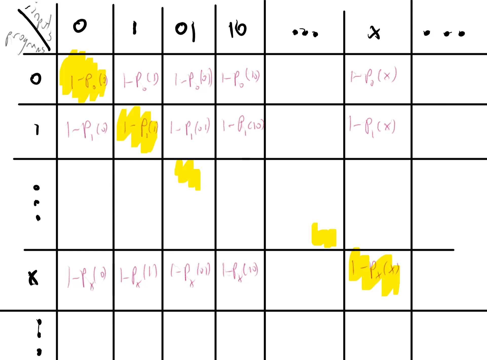
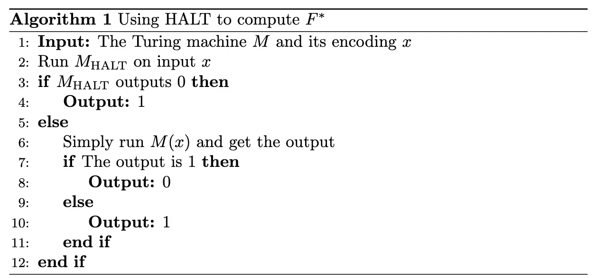
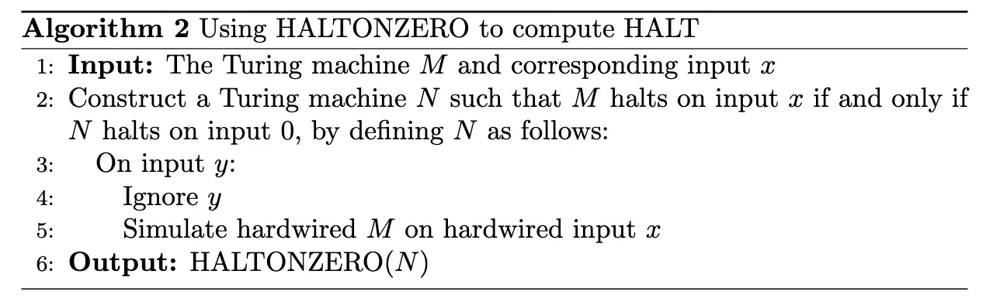
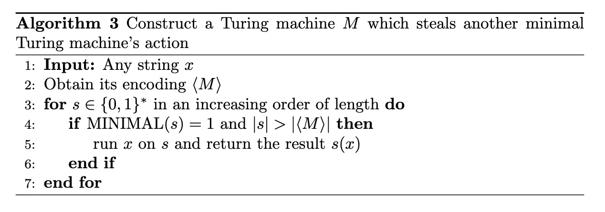

# Part 5: Turing Machines and Decidability

!!! Info "Outline"

    - 找到了一个 Universal Turing Machine，可以接受任意图灵机的编码作为输入，然后模拟这个图灵机在这个输入上的计算过程；
    - Turing Machine 在计算能力上存在边界，存在一些函数是图灵机本质上无法计算出来的，比如停机问题；
    - 规约实际上刻画了两个问题的计算难度关系，$A$ 到 $B$ 的规约意味着存在可计算函数 $R$ 将 $A$ 的输入转化为 $B$ 的输入，从而 $A$ 的计算难度不超过 $B$ 的计算难度；
    - Rice 定理表明了一类不关注实现细节的性质都是不可计算的，这种性质与问题的描述/语义相关，而非具体的实现/语法相关；
    - 递归定理表明了图灵机可以访问自己的编码，从而实现自引用的功能，根据自身的编码来进行计算，比如 Quine 程序；
    - Gödel 不完备定理表明了在任何可靠且足够强大的证明系统中，都存在一些真的但是无法被证明的陈述。

## NAND-RAM

NAND-RAM 相对于 NAND-TM 的优势在于：允许整数类型变量（虽然整体还是有界的），允许任意地址访问数组，不再是只能固定访问一个位置的数组成员，允许自由做加减乘除等算术运算。显然使用 NAND-RAM 实现/模拟 NAND-TM 是相当简单的，因为 NAND-TM 可以看作是 NAND-RAM 的一个特例。

为了避免陷入细节之中，我们给出使用 NAND-TM 实现 NAND-RAM 的一个思路：

- 任意位置数组访问：

## Universal Turing Machine

Church-Turing Thesis 指出：所有有效可计算的函数都是图灵可计算的。似乎图灵机已经捕捉了可计算性的本质，图灵机似乎就是计算的终极模型，所有可以被计算的函数，都可以会被图灵机计算出来。从上个世纪九十年代开始，从打孔的计算机、晶体管计算机到量子计算机，都没有打破可计算性的边界，只不过是提高了计算效率。

接下来我们就计算里面的一些问题进行讨论，比如什么是可以计算的、什么是不可计算的、为了计算这个问题我们需要消耗多少资源、占用多少时间等等。当我们需要证明一些计算性的问题的时候，我们一般会使用图灵机最原本的定义，因为它足够简单，当我们考虑某一个具体的函数是否可以计算的时候，我们一般使用更贴切的计算模型，比如 NAND-RAM 甚至 Python 代码，这样我们可以使用类似伪代码的方式进行描述，从而避免陷入图灵机的细节之中。

可以看见图灵机既是硬件也是软件，一方面和 NAND-RAM 等价，而这描述的就是计算机的硬件层面内容，另一方面又和 $\lambda$-演算等价，这又足够贴切编程语言的语法和语义。我们还不希望专门为了一个问题去设计一个图灵机，而希望**有一个通用的图灵机，可以做任何图灵机能做的事情**，这就是通用图灵机/Universal Turing Machine/UTM。这个图灵机 $U$ 可以接受任意图灵机 $M$ 的描述作为输入，并且接受一个 $M$ 的一个输入 $w$，然后模拟 $M$ 在输入 $w$ 上的计算过程，当 $M$ 是一个合适的图灵机的编码的时候，$U$ 就会输出 $M$ 在输入 $w$ 上的计算结果，否则直接停掉，输出 $M, x$。

证明 UTM 的存在性并不复杂，我们只需要找到一个对图灵机进行编码的合适的方法，证明其实很自然：我们对图灵机的每一部分都进行编码，从字母表到状态到转移函数进行编码后拼接，注意到图灵机的转移函数本质上就是在查表，我们可以把这个表编码成一个字符串。输入给另一个图灵机，这个图灵机只需要查表、模拟就可以了。

但是图灵机编码为字符串的实现细节是不重要的，我们只需要知道：图灵机可以轻松的被编码为字符串，以及给定图灵机的字符串表示和输入，我们可以模拟这个图灵机在这个输入上的计算过程。当然我们可以将每一个字符串都看做是一个图灵机，只需要规定无效的字符串表示一个立即停机的图灵机或者一个简单的机器即可。

!!! Danger "Theorem: Universal Turing Machine"

    存在一个图灵机 $U$，对于任意表示一个图灵机的字符串 $M$ 和任意输入 $x\in \{0,1\}^*$，都有 $U(M,x)=M(x)$。

证明略过，本质上并非困难的构造。在教材的注释部分，我们可以知道可以构造一个二进制字母表的、状态数目为 25 的单带通用图灵机。

## Uncomputable Problems

在前面的章节，我们知道，NAND-CIRC 可以证明任意的有限函数 $f: \{0,1\}^n \to \{0,1\}$，于是我们猜测或许 NAND-TM 也可以证明任意的函数 $f: \{0,1\}^* \to \{0,1\}$，但是事实并非如此，我们会发现存在一些函数是不可计算的，或者说不存在任何一个图灵机可以计算出这个函数的值。

!!! Danger "Theorem: Uncomputable Functions"

    存在布尔函数 $F^*: \{0,1\}^* \to \{0,1\}$，使得其不能被任何图灵机计算。

最简单的想法是使用鸽巢原理，我们在之前对图灵机做了编码，因此图灵机的数目是可数的，而布尔函数的数目是不可数的，这样就一定存在一些布尔函数不能被任何图灵机计算出来。但是这没有触及不可计算性的本质，我们打算看看是否有一些抽象或者具体的问题是不可计算的：我们考虑这样一个函数：

$$
F^*(x) = \begin{cases}
0 & \text{if a Turing machine } M \text{ encoded by } x \text{ and } M(x) = 1 \\
1 & \text{otherwise, i.e., } M(x) \neq 1 \text{ or } x \text{ is not a valid encoding of a Turing machine}
\end{cases}
$$

因此对于任何一个图灵机 $M$，如果 $M(M) = 1$，那么 $F^*(M) = 0$；如果 $M(M) \neq 1$，那么 $F^*(M) = 1$，因此无论 $M$ 在输入 $M$ 上输出什么，$F^*(M)$ 都和 $M(M)$ 不同，所以就没有任何一台图灵机可以计算 $F^*$。这个方法实际上使用了对角化方法。构造方法如下，对于每一个字符串 $x\in \{0,1\}^*$，我们先判断 $x$ 是否是一个图灵机 $M$ 的编码，如果是，那么另 $G(x)$ 为 $M(x)$ 输出的第一位，令 $F^*(x) = 1 - G(x)$；反之则令 $F^*(x) = 1$。这样就完成了 $F^*$ 的定义。形式化制表如下：



我们断言不存在一台可以计算出 $F^*$ 的图灵机，如果存在这样一台图灵机 $M^*$，那么我们就考虑 $M^*$ 在输入 $M^*$ 上的计算过程：显然我们得要求 $M^*$ 在输入 $M^*$ 上停机，那么无论 $M^*(M^*)$ 输出 $0$ 还是 $1$，都会和 $F^*(M^*)$ 不同，从而得到矛盾。因此不存在这样一台图灵机 $M^*$，从而证明了 $F^*$ 是不可计算的。

很多教材和文献使用语言这个术语，对于一个布尔函数 $F: \{0,1\}^* \to \{0,1\}$，我们可以定义一个语言/Language $L_F = \{x \in \{0,1\}^* : F(x) = 1\}$，如果 $F$ 可以被图灵机计算，那么我们就说 $L_F$ 是可判定的/Decidable，否则就是不可判定的/Undecidable。

然而上面这个不可计算的函数 $F^*$ 看起来比较抽象，也没有什么实际价值，一个更具体也更经典的不可计算问题是停机问题/Halting Problem：给定一个图灵机 $M$ 和一个输入 $w$，判断 $M$ 在输入 $w$ 上是否会停机。对应的函数为：

$$
\text{HALT}(M, w) = \begin{cases}
1 & \text{if } M \text{ halts on input } w \\
0 & \text{otherwise}
\end{cases}
$$

下面证明这个函数是不可被计算的。证明的思想是使用反证法/规约/Reduction：希望证明如果 $\text{HALT}$ 可以被计算，那么就可以构造出一个图灵机 $F$ 来计算上面的不可计算函数 $F^*$，从而得到矛盾。我们只需要写一个程序，调用 $\text{HALT}$ 来计算或者实现 $F^*$：



因此，根据 $F^*$ 是不可计算的，我们就知道 $\text{HALT}$ 也是不可计算的。值得指出的是，不存在一个单性的程序可以判断任何程序的停机问题，但是对于某些特定的程序，比如没有循环的程序，我们是可以判断它们是否停机的。这样的特例并不和上面的结论冲突。

基于停机问题的不可计算性，我们可以使用类似的方法来证明更多的问题不可计算：比如下面的 $\text{HALTONZERO}$ 问题：给定一个图灵机 $M$ 和一个输入 $w$，判断 $M$ 在输入 $w$ 上是否会停机。

$$
\text{HALTONZERO}(M) = \begin{cases}
1 & \text{if } M \text{ halts on input } 0 \\
0 & \text{otherwise}
\end{cases}
$$

证明方法一致：我们证明如果 $\text{HALTONZERO}$ 可以被计算，那么 $\text{HALT}$ 也可以被计算，从而得到矛盾。算法如下：



注意到这里的图灵机 $N$ 内的 $M$ 和输入 $x$ 都是固定的，如果 $N$ 在输入 $0$ 上停机，那么说明 $M$ 在输入 $x$ 上停机；如果 $M$ 在输入 $x$ 上停机，那么 $N$ 什么时候都会停机，因此在输入 $0$ 上也会停机。因此我们就完成了规约，证明了 $\text{HALTONZERO}$ 也是不可计算的。

课堂上的练习是：证明下面的函数也是不可计算的：

$$
\text{ZEROFUNC}(M) = \begin{cases}
1 & \text{if } M \text{ is a Turing machine and } M(x) = 0 \text{ for all inputs } x \\
0 & \text{otherwise}
\end{cases}
$$

方法是套路化的，我们只需要证明如果 $\text{ZEROFUNC}$ 可以被计算，那么 $\text{HALT}$ 也可以被计算。提示是我们需要构造一个图灵机 $N$，使得 $N$ 在所有输入上都输出 $0$（计算出 $\text{ZEROFUNC}$ 函数）当且仅当 $M$ 在输入 $w$ 上停机。构造这个 $N$ 的方式也是公式的，这个图灵机忽略所有输入，然后模拟 $M$ 在输入 $w$ 上的计算过程，如果 $M$ 停机了，那么输出固定的 $0$，否则不停机也不输出任何东西。

这样的方法我们称为规约/Reduction：通过一个**可计算**函数 $R: \{0, 1\}^* \to \{0, 1\}^*$，将比如 $\text{HALT}$ 的输入 $(M, w)$ 转化为 $\text{ZEROFUNC}$ 的输入 $N$，使得 $\text{HALT}(M, w) = \text{ZEROFUNC}(R(M, w))$。这样的转换称之为从 $\text{HALT}$ 到 $\text{ZEROFUNC}$ 的规约。

如果按照语言的术语，我们说语言 $A$ 可以被 $f$ 规约到 $B$，如果存在一个可计算函数 $f: \{0, 1\}^* \to \{0, 1\}^*$，使得对于任意字符串 $x$，都有 $x \in A$ 当且仅当 $f(x) \in B$。记作 $A \le_m B$，这里的下标 m 是 Mapping Reducibility 的意思。

!!! Info "Lemma: Reduction"

    如果存在一个从 $F$ 到 $G$ 的规约 $R$，并且 $G$ 是可计算的，那么 $F$ 也是可计算的。

**Proof**：
基本是显然的，对于任意的 $F$ 的输入 $x$，我们先计算 $y = R(x)$，然后计算 $G(y)$，将其作为 $F(x)$ 的输出即可。这样 $R$ 是可计算的，如果 $G$ 可计算，那么 $F$ 也是可计算的。

本质上规约刻画了两个问题的计算难度，如果 $F$ 可以规约到 $G$，那么 $F$ 的计算难度**不超过** $G$ 的计算难度，这完全可以通过上面讲的符号 $F \le_m G$ 看出来，因此如果 $G$ 可以被计算，那么 $F$ 也可以被计算。反之如果 $F$ 不能被计算，那么 $G$ 的计算难度要高于 $F$，因此 $G$ 也不能被计算。

于是我们从停机问题出发，可以规约出更多的不可计算问题，比如上面的 $\text{HALTONZERO}$ 和 $\text{ZEROFUNC}$。得到的两个最重要的结果是 Rice 定理以及 Gödel 不完备定理。Rice 定理表明了所有不关注实现细节的语义性质都是不可计算的，而 Gödel 不完备定理表明了在任何可靠且足够强大的证明系统中，都存在一些真的但是无法被证明的陈述。

!!! Info "Definition: Semantic Properties and Functional Equivalence"

    对于两个图灵机 $M$ 和 $M^{\prime}$，如果对于任意输入 $x$，都有 $M(x) = M^{\prime}(x)$，特别的，如果 $M(x) = \bot$ 那么 $M^{\prime}(x) = \bot$，那么我们称 $M$ 和 $M^{\prime}$ 是功能等价的/Functionally Equivalent。

    如果函数 $F: \{0, 1\}^* \to \{0, 1\}$ 满足对于任意功能等价的图灵机 $M$ 和 $M^{\prime}$，都有 $F(M) = F(M^{\prime})$，那么我们称 $F$ 是一个语义函数/Semantic Function。

语义函数有两个平凡的例子，分别为恒等于 1 的函数和恒等于 0 的函数，分别对应于每一个图灵机都有的性质和都没有的性质。Rice 定理表明，任何非平凡的语义性质都是不可计算的。

!!! Danger "Rice's Theorem"

    对于任何一个非平凡的语义性质 $P$，判断一个图灵机 $M$ 是否具有性质 $P$ 是不可计算的。

**Proof**：
先定义图灵机 $\text{INF}$，其为无论输入为什么，都不停机的图灵机。假设 $P$ 是一个非平凡的语义性质，且 $P(\text{INF}) = 0$（如果 $P(\text{INF}) = 1$，那么我们直接考虑 $P^{\prime}$，其定义为 $P^{\prime}(M) = 1 - P(M)$，显然 $P^{\prime}$ 也是一个非平凡的语义性质），那么根据非平凡性，存在一个图灵机 $M_\text{yes}$ 使得 $P(M_\text{yes}) = 1$。

我们的目标是证明从 $\text{HALT}$ 到 $P$ 存在一个规约：对于 $\text{HALT}$ 的任意输入 $(M, x)$，，我们构造一个图灵机 $N$，其输入是任意字符串 $y$，其行为为：先模拟 $M$ 在输入 $x$ 上的计算过程，然后输出 $M_\text{yes}$ 在输入 $y$ 上的计算结果。

我们证明这确实是一个规约：如果 $\text{HALT}(M, x) = 0$，$M$ 在输入 $x$ 上不停机，那么 $N$ 也不会停机（$M$ 和输入 $x$ 都是作为固件写死的），那么 $N$ 和 $\text{INF}$ 功能等价（这俩都不停机），因此 $P(N) = P(\text{INF}) = 0 = \text{HALT}(M, x)$。如果 $\text{HALT}(M, x) = 1$，$M$ 在输入 $x$ 上停机，那么 $N$ 会停机并且输出 $M_\text{yes}(y)$ 的结果，因此 $N$ 和 $M_\text{yes}$ 功能等价，因此 $P(N) = P(M_\text{yes}) = 1 = \text{HALT}(M, x)$。因此我们完成了规约，于是 $P$ 的计算难度比 $\text{HALT}$ 更难，证明了 $P$ 是不可计算的。

## Recursion Theorem

我们发现，在之前的论证中，我们经常需要让图灵机 $M$ 访问自己的编码 $\langle M \rangle$，从而根据自己的编码来进行计算。这基本是显然的，如果我们写一个简单的函数，但是这个函数和其本身如何实现（自身的编码）无关，那么这种情况下 $M(\langle M \rangle)$ 就是显然的了，因为 $\langle M \rangle$ 是一个固定的字符串，当做输入传递给 $M$ 就可以了。

但是如果这个函数需要根据其本身来做计算，这就不是那么显然了，比如下面这个经典的问题：我们希望写一个 Quine 程序/自复制程序，这个程序的输出是它自己的代码。很容易陷入到鸡生蛋的循环之中：比如程序的第一行是一个 `def f():`，第二行就必须输出 `def f():`，第三行就要继续输出第二行的内容。

对于 Quine，形式化讲我们希望有一个图灵机 $M$，使得对于任意输入 $x$，都有 $M(x) = \langle M \rangle$。比较简单的想法是将这个图灵机分为两个部分 $A$ 和 $B$，其中 $A$ 的功能是输出 $B$ 的代码 $\langle B \rangle$，而 $B$ 的功能是输出 $A$ 的代码 $\langle A \rangle$，然后将这两部分交换，这样 $M$ 跑完就可以生成出 $\langle A \rangle \langle B \rangle = \langle M \rangle$。但是这个想法并不完美，因为 $A$ 和 $B$ 的代码是相互依赖的，我们无法直接写出 $A$ 和 $B$ 的代码。

本质上讲我们需要根据输出内容来生成输出这个内容的代码：也就是需要有一个程序 $q$，其输入是一个字符串 $s$，输出是一个图灵机的编码 $\langle M_s \rangle$，使得对于任意输入 $x$，都有 $M_s(x) = s$。这个要求很容易满足，直接写死一个 `print(s)` 的程序就可以了。

这个程序完成了从输出内容到程序的跨越，从而解决了鸡生蛋的死循环，直接可以根据 $A$ 的输出 $\langle B\rangle$ 来推断 $A$ 的代码 $\langle A \rangle$，这样 $B$ 可以直接构造为：对于任意输入 $x$，先使用 $q$ 来产生生成输入 $x$ 的代码 $q(x)$，将这个内容和纸带上已有的内容互换位置并且拼接起来。$A$ 则直接输出 $B$ 的代码 $\langle B \rangle$。这样 $M$ 就可以正确地输出自己的代码了。这也是经典的 Quine 程序的实现思路。

这个小问题固然有趣，但是它背后的思想却非常重要：图灵机可以访问自己的编码，更进一步地，图灵机可以使用自己的编码作为计算的一部分，从而实现自引用/Self-Reference，这就是递归定理/Recursion Theorem。

!!! Danger "Recursion Theorem"

    对于任意的图灵机 $T$，其输入为一个图灵机 $M$ 的编码 $\langle M \rangle$ 和一个任意输入 $x$，存在一个图灵机 $R$，其输入为 $x$，满足 $R(x) = T(\langle R \rangle, x)$。

**Proof**：
证明梗概是将图灵机 $R$ 分为三部分 $A$、$B$、$T$：纸带上本来就有输入 $x$，第一部分 $A$ 的功能是输出第二部分 $B$ 和第三部分 $T$ 的编码 $\langle B \rangle \langle T \rangle$，第二部分 $B$ 的功能是输出 $A$ 的编码 $\langle A \rangle$ 然后再做重排序为 $\langle A \rangle \langle B \rangle \langle T \rangle x$，可以看见前三部分就已经是 $R$ 的编码 $\langle R \rangle$ 了，然后第三部分 $T$ 就可以使用这个编码和输入 $x$ 来进行计算了。

这个定理并不依赖于任何不可计算的问题，我们可以**将其作为额外的工具**证明停机问题是不可计算的：按如下定义一个图灵机 $M$，输入是一个图灵机的编码和任意的一个字符串输入 $x$：首先其得到自身的编码 $\langle x\rangle$，然后判断 $\text{HALT}(\langle M \rangle, x)$（因为如果 $\text{HALT}$ 可以被计算，那么就有一个图灵机计算出 $\text{HALT}$），如果结果是停机，那么 $M$ 就进入死循环，否则 $M$ 就停机。这样就产生了一个显然的矛盾，因此停机问题是不可计算的。

另一个例子是证明 $\text{MINIMAL}$ 不可被判定，如果 $M$ 是一个图灵机，使得任意与其功能等价的图灵机的编码都不短于 $\langle M \rangle$，那么 $M$ 就是一个最小图灵机，$\text{MINIMAL}(M) = 1$，否则 $\text{MINIMAL}(M) = 0$。根据 Rice 定理，这个问题显然不可判定。下面我们定义一个图灵机 $M$，其盗取一个比它编码长度更长的最小图灵机 $N$ 的功能，构造如下：



由于这个图灵机 $M$ 的编码长度是有限的，但是最小图灵机的数目是无穷的，所以无论怎么回事，我们都可以找到一个最小图灵机 $N$，其长度大于 $M$ 的编码长度。因此 $M$ 和 $N$ 功能等价，但是 $\langle N \rangle$ 比 $\langle M \rangle$ 长，因此 $N$ 不是最小图灵机，因此 $\text{MINIMAL}(N) = 0$，这就产生了矛盾。

我们可以使用递归定理证明一些不是那么 Trivial 的结果，比如图灵机的编码是否可以互相转换而不改变其功能？这就是不动点定理/Fixed Point Theorem，其表明对于任意可计算函数，都存在两个图灵机，使得一个图灵机的编码经过这个函数转换后，得到另一个图灵机的编码，且功能等价。

!!! Danger "Fixed Point Theorem"

    对于任意可计算的函数 $t: \{0, 1\}^* \to \{0, 1\}^*$，存在两个功能等价的图灵机 $F$ 和 $M$ 使得 $t(\langle F \rangle) = \langle M \rangle$。

**Proof**：
证明思路是使用递归定理直接构造图灵机 $F$：其输入为一个字符串 $x$，首先得到自己的编码 $\langle F \rangle$，然后计算 $t(\langle F \rangle)$ 得到一个图灵机的编码 $\langle M \rangle$，然后直接模拟运行 $M$ 在输入 $x$ 上的计算过程。这就无敌了。当然这个定理的前置假设是：无效的编码描述的是一个立即停机的图灵机。

## Gödel's Incompleteness Theorem

简单且不复杂的说，Gödel 不完备定理表明了在任何可靠且足够强大的证明系统中，都存在一个真的但是无法被证明的陈述。


<!-- 这一节的主题是**不可计算性**与**不可证明性**之间的深刻联系：停机问题的不可计算性不仅意味着某些函数无法由任何程序计算，也意味着在任何“有效且可靠”的证明系统里，总会存在一些“真的但无法证明”的陈述。

### Hilbert Program（背景）

20 世纪初 Hilbert 提出“形式化数学”的计划：希望所有数学真理都能从一组公理出发，经由有限、机械可检验的推理规则推出。Gödel 在 1931 年证明这类愿景在足够丰富的系统里不可能完全实现。

!!! Danger "Theorem: Gödel's Incompleteness Theorem (informal)"

    对于每个**可靠(sound)**且能表达足够丰富数学陈述的证明系统 $V$，都存在一个数学陈述：它为真，但在 $V$ 中不可证明。

### Proof Systems（证明系统）

教材采用非常一般的“验证器”视角：把“证明”当作可被算法验证的字符串。

!!! Info "Definition: Proof Systems"

    设 $\mathcal{T} \subseteq \{0,1\}^*$ 表示“真陈述”集合。
    一个证明系统是算法（验证器）$V$，满足：

    1. **Effectiveness（有效性）**：对任意 $x,w\in\{0,1\}^*$，$V(x,w)$ 都停机并输出 $0/1$。
    2. **Soundness（可靠性）**：若 $x\notin\mathcal{T}$，则对任意 $w$ 都有 $V(x,w)=0$。

    若 $x\in\mathcal{T}$ 但对所有 $w$ 都有 $V(x,w)=0$，则称 $x$ 在系统 $V$ 下**不可证明**。
    若不存在不可证明的真陈述，则称 $V$ **完备(complete)**。

!!! Note "Key idea"

    **证明 = 字符串**，其意义由**验证算法**给出。

### Gödel's Theorem：计算版本（由停机不可计算性推出）

令 $\mathcal{H}$ 为所有形如“图灵机 $M$ 在输入 $0$ 上不停机”的陈述（以字符串形式编码）的集合。

!!! Danger "Theorem: Gödel's Incompleteness Theorem (computational variant)"

    不存在关于 $\mathcal{H}$ 的既可靠又完备的证明系统。

**Proof (核心构造)**：
反证。若存在可靠且完备的验证器 $V$，则可以计算 $HALTONZERO$。

思路是并行做两件事：
1) 运行 $M(0)$；2) 枚举所有字符串 $w$ 并用 $V$ 检查它们是否是“$M$ 在 $0$ 上不停机”的证明。

伪代码（教材算法 Halting from proofs 的要点）如下：

```
INPUT: Turing machine M
OUTPUT: 1 if M halts on input 0; 0 otherwise.

for n = 1,2,3,...
    for all w in {0,1}^n
        if V("M does not halt on 0", w) == 1:
            return 0
        simulate M on input 0 for n steps
        if M halts:
            return 1
```

若 $M$ 会在 $N$ 步内停机，则在 $n=N$ 时模拟会发现停机并返回 $1$；可靠性保证不会错误返回 $0$。
若 $M$ 永不停机，则完备性保证存在某个证明 $w$，终将被枚举到并返回 $0$。
因此得到可计算的 $HALTONZERO$，与其不可计算性矛盾。

!!! Info "Remark: Gödel sentence (optional intuition)"

    证明可进一步抽取一个“自指”语句 $x^*$，使其满足
    $$x^* \text{ 为真} \Leftrightarrow x^* \text{ 在 } V \text{ 中没有证明}.$$
    这与固定点/递归定理的精神一致（“把关于自身不可证明性的陈述编码成自身”）。

### Quantified Integer Statements（量化整数陈述）与不完备性

教材把不完备性从“谈论程序”推进到“谈论整数算术”。

!!! Info "Definition: Quantified Integer Statements (QIS)"

    量化整数陈述是没有自由变量的良构公式，允许整数变量、$>,<,\times,+,-,=$，逻辑联结词 $\neg,\wedge,\vee$，以及量词 $\exists_{x\in\N}$、$\forall_{y\in\N}$。

!!! Danger "Theorem: Gödel's Incompleteness for QIS"

    设 $V$ 是一个可计算的“量化整数陈述证明验证器”。则必有其一成立：

    - $V$ **不可靠**：存在假陈述 $x$ 与字符串 $w$ 使 $V(x,w)=1$；或
    - $V$ **不完备**：存在真陈述 $x$ 使对任意 $w$ 都有 $V(x,w)=0$。

这一结论来自于下面的不可计算性：

!!! Danger "Theorem: Uncomputability of QIS"

    定义 $QIS:\{0,1\}^*\to\{0,1\}$：输入为量化整数陈述（的字符串编码），为真输出 $1$，为假输出 $0$。
    则 $QIS$ 不可计算。

### Diophantine 与 MRDP（作为更强背景结论）

!!! Danger "Theorem: MRDP Theorem"

    设 $DIO$ 的输入是一条描述多项式 $P(x_0,\ldots,x_{99})$ 的字符串。
    若存在 $z_0,\ldots,z_{99}\in\N$ 使得 $P(z_0,\ldots,z_{99})=0$ 则输出 $1$，否则输出 $0$。
    则 $DIO$ 不可计算。

### 用两步规约证明 $QIS$ 不可计算：$HALT \Rightarrow QMS \Rightarrow QIS$

#### Step 1：Quantified Mixed Statements（QMS）不可计算

!!! Info "Definition: Quantified Mixed Statements (QMS)"

    量化混合陈述允许既量化整数变量，也量化字符串变量 $a\in\{0,1\}^*$，并允许长度 $|a|$ 与位访问谓词 $a_i$。

!!! Danger "Theorem: Uncomputability of QMS"

    定义 $QMS$：输入量化混合陈述编码，输出其真假（真为 $1$）。则 $QMS$ 不可计算。

**Proof idea（计算历史 / configuration history）**：
把图灵机（或 NAND-TM）的**配置**编码成字符串。单步转移 $NEXT(\alpha,\beta)$ 只依赖局部窗口（类似一维 CA 的局部更新），因此可写成量化混合陈述。
机器在输入 $0$ 上停机当且仅当存在一个“历史字符串” $H$ 编码了从初始配置到停机配置的一串配置，并且每相邻两项满足 $NEXT$。
由此得到从 $HALTONZERO$ 到 $QMS$ 的规约。

#### Step 2：把字符串量词消去：$QMS \le_m QIS$

把字符串 $x\in\{0,1\}^*$ 编码为一对整数 $(X,n)$：$n=|x|$，并能用整数公式判断第 $i$ 位是否为 $1$。

!!! Info "Lemma: Constructible prime sequence"

    存在递增素数序列 $p_0<p_1<p_2<\cdots$，以及一个量化整数陈述 $PSEQ(p,i)$，当且仅当 $p=p_i$ 时为真。

编码方案：
$$X=\prod_{x_i=1} p_i,\qquad n=|x|.$$

定义坐标谓词（第 $i$ 位是否为 $1$）：
$$COORD(X,i) \;:=\; \exists_{p\in\N}\; PSEQ(p,i)\wedge DIVIDES(p,X)$$
其中 $DIVIDES(a,b)$ 可由 $\exists_{c\in\N}\; a\times c=b$ 表达。

这样就能把 $\forall_{a\in\{0,1\}^*}$ 替换为 $\forall_{X\in\N}\forall_{n\in\N}$（存在量词同理），并把 $|a|$ 替换为 $n$、把 $a_i$ 替换为 $COORD(X,i)$。
从而把任意 QMS 公式机械变换成等价的 QIS 公式，得到 $QMS$ 规约到 $QIS$。

**教材对素数序列引理的证明要点**：选取一个足够大的常数 $C$，令 $p_i$ 为区间 $[(i+C)^3+1,(i+C+1)^3-1]$ 内最小素数（已知每个区间都有素数）。
则 $PSEQ(p,i)$ 可以用“$p$ 在该区间内、$p$ 为素数、且在该区间里没有更小素数”来刻画。

!!! Success "Recap"

    - 可靠且完备的证明系统会导致可解停机问题，从而不可能存在。
    - 通过 $HALT\Rightarrow QMS\Rightarrow QIS$，把不完备性从“程序陈述”推进到“纯整数算术陈述”。 -->
