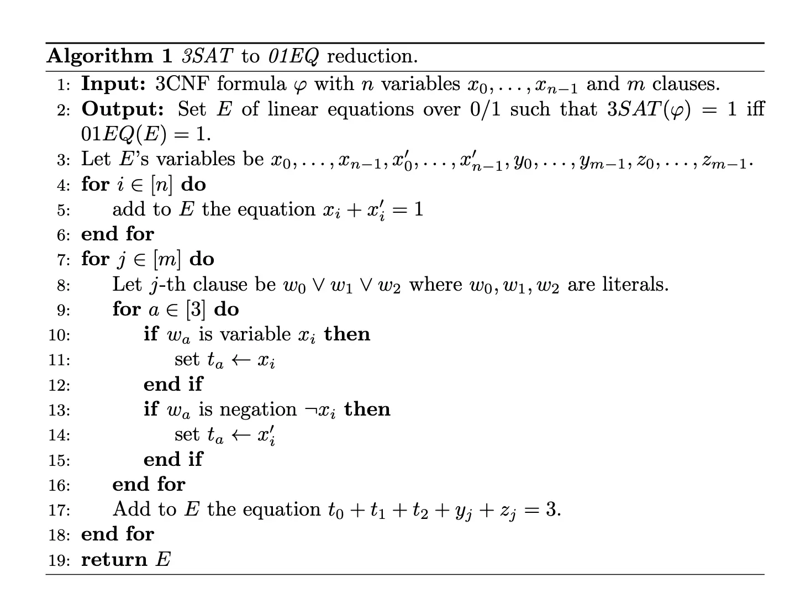

# Part 6: Computational Complexity

!!! Info "Outline"

    - 形式化定义运行时间、复杂度类 $\mathbf{P}$、$\mathbf{EXP}$；
    - 我们证明了使用图灵机计算函数的时间与使用 RAM 机器/NAND-RAM 程序计算的时间在多项式意义上是相关的，实现了双向的模拟，只要我们在图灵机等价的模型上，无论在什么模型上考虑问题的复杂度，其 $\mathbf{P}$ 或者 $\mathbf{EXP}$ 的本质都是不变的；
    - 我们给出了一个高效的通用 NAND-RAM 程序，并用它来建立时间层次定理，表明 $\mathbf{P} \subsetneq \mathbf{EXP}$，如果允许使用更多资源，则可以解决更多的问题；
    - 建模了关于电路规模的复杂度类 $\mathit{SIZE}(T(n))$，并定义了非均匀计算模型，表明 $\mathbf{P} \subsetneq \mathbf{P}_{/\text{poly}}$，并且 $\mathbf{P}_{/\text{poly}}$ 甚至包含不可计算的问题。

## 1. Defining Running Time

!!! Info "Definition: Running Time of Turing Machines"

    令 $T: \mathbb{N} \rightarrow \mathbb{N}$ 为将自然数映射到自然数的函数，$F:\{0,1\}^* \rightarrow \{0,1\}^*$。如果存在一个图灵机 $M$，使得对于**每一个**充分大的 $n$ 和**每一个**输入 $x \in \{0,1\}^n$，当给定输入 $x$ 时，图灵机 $M$ 在执行不超过 $T(n)$ 步后停机并输出 $F(x)$，那么我们说函数 $F$ 是**在 $T(n)$ 图灵机时间内可计算的**。

    并且定义 $\mathit{TIME}_{\mathsf{TM}}(T(n))$ 为所有在 $T(n)$ 图灵机时间内可计算的**布尔函数**的集合。

在这个定义下，我们已经可以见到一些 Hierarchical 的东西了：比如很明显 $\mathit{TIME}_{\mathsf{TM}}(n) \subseteq \mathit{TIME}_{\mathsf{TM}}(2^n)$，因为 $2^n$ 明显比 $n$ 大很多。但是，我们并不能立刻断定 $\mathit{TIME}_{\mathsf{TM}}(n) \subsetneq \mathit{TIME}_{\mathsf{TM}}(2^n)$，找出来一个在 $\mathit{TIME}_{\mathsf{TM}}(2^n) \setminus \mathit{TIME}_{\mathsf{TM}}(n)$ 的函数并不显然，后续我们会根据 Hierarcy Theorem 来证明这个结论。

!!! Info "Definition: Polynomial Time and Exponential Time"

    - 多项式时间可计算：$\mathbf{P} = \cup_{c\in \{1,2,3,\ldots \}} \mathit{TIME}_{\mathsf{TM}}(n^c)$，换句话说，如果一个布尔函数 $F\in \mathbf{P}$，那么存在一个多项式 $p: \mathbb{N} \rightarrow \mathbb{R}$ 和一个图灵机 $M$，使得对于**每一个**输入 $x \in \{0,1\}^*$，当给定输入 $x$ 时，图灵机 $M$ 在执行不超过 $p(|x|)$ 步后停机并输出 $F(x)$。
    - 指数时间可计算：$\mathbf{EXP} = \cup_{c\in \{1,2,3,\ldots \}} \mathit{TIME}_{\mathsf{TM}}(2^{n^c})$，换句话说，这里的不超过 $p(|x|)$ 步被替换成了 $2^{p(|x|)}$ 步。

    这里的*换句话说*基本上是显然的，可以简单的证明两个定义等价，这里省略。

可以比较显然的看出，$\mathbf{P} \subseteq \mathbf{EXP}$，后续会证明这个包含关系是严格的。

一般来讲，我们在算法课上学习的复杂度分析是基于*程序要跑多少步*进行的，而非图灵机要*一步一步挪多少次*的，前面的定义虽然干净但是并不和真实世界的计算架构一致。我们下面定义一下基于 NAND-RAM 程序的运行时间以及复杂度类：

!!! Info "Definition: Running Time of NAND-RAM Programs"

    令 $T:\mathbb{N} \rightarrow \mathbb{N}$ 为将自然数映射到自然数的函数，$F:\{0,1\}^* \rightarrow \{0,1\}^*$，如果存在一个 NAND-RAM 程序 $P$，使得对于**每一个**充分大的 $n$ 和**每一个**输入 $x \in \{0,1\}^n$，当给定输入 $x$ 时，NAND-RAM 程序 $P$ 在执行不超过 $T(n)$ 行后停机并输出 $F(x)$，那么我们说函数 $F$ 是**在 $T(n)$ RAM 时间内可计算的**。

    并且定义 $\mathit{TIME}_{\mathsf{RAM}}(T(n))$ 为所有在 $T(n)$ RAM 时间内可计算的布尔函数的集合。

一个重要的结论是，图灵机和 NAND-RAM 程序在多项式意义下是等价的，图灵机可以在多项式时间内模拟 NAND-RAM 程序，反之亦然，因此我们并不关心究竟使用哪种模型来定义复杂度类 $\mathbf{P}$ 和 $\mathbf{EXP}$，因为无论使用哪种模型，得到的复杂度类的本质都是一样的。

!!! Danger "Theorem: Relating RAM and Turing machines"

    令 $T:\mathbb{N} \rightarrow \mathbb{N}$ 为一个函数，使得对于每一个 $n$，都有 $T(n) \geq n$，并且映射 $n \mapsto T(n)$ 可以被一个图灵机在 $O(T(n))$ 时间内计算出来，而且最好这个函数还单调递增。那么

    $$
    \mathit{TIME}_{\mathsf{TM}}(T(n)) \subseteq \mathit{TIME}_{\mathsf{RAM}}(10\cdot T(n)) \subseteq \mathit{TIME}_{\mathsf{TM}}(T(n)^4)
    $$

这个定理的证明比较技术，思想比证明更加重要，只需要注意到这个定理传达的信息是，图灵机和 NAND-RAM 大致上是等价的就可以，如果我们只关心复杂度类的多项式级别的区别，那么所有合理的计算模型都是等价的，而且 $\mathbf{P}$ 和 $\mathbf{EXP}$ 的定义也不会因为计算模型的不同而不同，是鲁棒的。具体证明就此略去。另外可以知道这个常数 10 和 4 都不是紧的。

在最后，我们知道有一个**通用的 NAND-RAM 程序**，这个程序 $U$ 接受任意 NAND-RAM 程序 $P$ 和输入 $x$，然后模拟 $P$ 在输入 $x$ 上的计算过程，满足 $U(P,x) = P(x)$。这个程序是高效的，只有常数倍的时间开销，如果 $P$ 在 $T$ 步内停机，那么 $U$ 在 $C \cdot T$ 步内停机，其中 $C \leq a \lvert P \rvert^b$，这里的 $a,b$ 是常数，$\lvert P \rvert$ 是程序 $P$ 的长度。

证明也略去。

## 2. Time Hierarchy Theorem

!!! Warning "我感觉这部分考太难的证明不太可能，因为内容实在不简单而且证明复杂…"

这是本章最重要的定理之一，它表明了 $\mathit{TIME}$ 复杂度类之间的严格包含关系，表明了更深刻的思想：如果我们有更多的时间，我们就有机会计算更多的函数。

!!! Danger "Theorem: Time Hierarchy Theorem"

    对于每一个良好的函数 $T:\mathbb{N} \rightarrow \mathbb{N}$（单调、可计算，且 $T(n) \geq n$），存在一个布尔函数 $F:\{0,1\}^* \rightarrow \{0,1\}$，使得 $F \in \mathit{TIME}(T(n)\log n) \setminus \mathit{TIME}(T(n))$。

    这里的 $\log n$ 可以被任何的可以有效计算的、随着 $n$ 增长趋近于无穷的函数替代。

**Proof**：
构造性证明，我们证明有界停机函数 $\mathit{HALT}_T$ 满足定理要求，其输入为 $(P,x)$，其中 $P$ 是一个 NAND-RAM 程序且长度满足要求 $\lvert P \rvert \leq \log \log \lvert x \rvert$，函数定义如下：

$$
\mathit{HALT}_T(P,x) = \begin{cases} 1, & P \text{ halts on } x \text{ within } \leq 100\cdot T(\lvert P \rvert + \lvert x \rvert) \text{ steps} \\ 
0, & \text{otherwise} \end{cases}
$$

只需要证明两个 Claim：

- Claim 1: $\mathit{HALT}_T \in \mathit{TIME}(T(n)\log n)$
- Claim 2: $\mathit{HALT}_T \not\in \mathit{TIME}(T(n))$

关于 Claim 1，证明比较简单，大概分下面四步：

1. 检查输入是否满足格式 $P,x$ 且 $\lvert P \rvert \leq \log \log \lvert x \rvert$，可以在线性时间内完成，时间为 $O(\lvert P \rvert + \lvert x \rvert)$。
2. 计算 $T_0 = T(\lvert P \rvert + \lvert x \rvert)$，时间为 $O(T_0) = O(T(\lvert P \rvert + \lvert x \rvert))$。
3. 使用通用 NAND-RAM 程序模拟 $P$ 在输入 $x$ 上运行 $100 \cdot T_0$ 步，时间为 $a \cdot \lvert P \rvert^b \cdot 100 T_0$，其中 $a,b$ 是常数。
4. 如果 $P$ 在这些步骤内停机则输出 $1$，否则输出 $0$。

最终这些的运行时间就是 $O(\lvert P \rvert^b \cdot T_0)$，由于 $\lvert P \rvert \leq \log \log \lvert x \rvert$，所以 $\lvert P \rvert^b \leq (\log \log \lvert x \rvert)^b = o(\log \lvert x \rvert) = o(\log n)$，因此总的运行时间为 $o(T(\lvert P \rvert + \lvert x \rvert) \log n)$，从而证明了 Claim 1。

关于 Claim 2，这是这个定理的核心，证明思路和停机问题的不可计算性证明非常类似。使用反证法，如果存在一个 NAND-RAM 程序 $P^*$ 可以在 $T(\lvert P \rvert + \lvert x \rvert)$ 步内计算 $\mathit{HALT}_T(P,x)$，我们构造一个程序 $Q^*$，使得当其接受一个 $Q^*$ 的编码加上一串 $1$ 作为输入时，如果其运行时间小于 $T(n)$，那么其**实际运行时间**会大于 $T(n)$，反之亦然（也就是 $\mathit{HALT}_T(Q^*, Q^*1^m)$ 的值无法判定），从而得到矛盾。定义 $Q^*$ 如下：

1. 先判定输入是否满足格式 $z = P1^m$，其中 $P$ 是一个 NAND-RAM 程序且 $\lvert P \rvert < 0.1 \log \log m$，如果不满足则返回 $0$。这一段时间为 $\lvert P \rvert + m$。
2. 计算 $b = P^*(P,z) = \mathit{HALT}_T(P,z)$，时间为 $T(\lvert P \rvert + \lvert z \rvert)$。
3. 如果 $b=1$，则进入死循环，反之则停机。

我们看如何引出矛盾：如果 $\mathit{HALT}_T(Q^*, Q^*1^m) = 1$，那么内层的 $P^*(P, z)$ 一定会返回 1，这样 $Q^*$ 就会进入死循环，无法停机，与 $\mathit{HALT}_T(Q^*, Q^*1^m) = 1$ 矛盾；反之如果 $\mathit{HALT}_T(Q^*, Q^*1^m) = 0$，而前两段一共花的时间为 $T(\lvert P \rvert + \lvert z \rvert) + T(\lvert P \rvert + \lvert z \rvert) = 2T(2\lvert P \rvert + m)$，这就意味着 $Q^*$ 会在 $O(T(n))$ 步内停机，从而与 $\mathit{HALT}_T(Q^*, Q^*1^m) = 0$ 矛盾。

至于 $m$ 要多大，只要保证量级足够大就可以，比如 $m > 2^{2^{1000 \ell}}$，其中 $\ell$ 是 $Q^*$ 的编码长度。

!!! Info "高僧预测：考了这玩意相关的证明我吃八斤。"

!!! Info "Corollary: $\mathbf{P} \subsetneq \mathbf{EXP}$"
    
    这是 Time Hierarchy Theorem 的一个直接推论，令 $T(n) = n^{\log n}$，$T'(n) = n^{\log n / 2}$，我们有 $T(n)/T'(n) = \omega(\log n)$，因此存在一个布尔函数 $F$，使得 $F \in \mathit{TIME}(T(n)) \setminus \mathit{TIME}(T'(n))$。由于对于充分大的 $n$，都有 $2^n > n^{\log n}$，所以 $F \in \mathit{TIME}(2^n) \subseteq \mathbf{EXP}$。另一方面，$F \not\in \mathbf{P}$，因为 $\mathbf{P} \subseteq \mathit{TIME}(T'(n))$，$F\not\in \mathit{TIME}(T'(n))$ 可以得知 $F \not\in \mathbf{P}$。

## 3. Non-Uniform Computation

!!! Info "Definition: Non-Uniform Computation and $\mathit{SIZE}(T(n))$"

    令 $T:\mathbb{N} \rightarrow \mathbb{N}$ 为将自然数映射到自然数的函数，$F:\{0,1\}^* \rightarrow \{0,1\}$ 为一个布尔函数，且 $T$ 是一个 nice 的时间界，对每一个 $n \in \mathbb{N}$，定义 $F_{\upharpoonright n} : \{0,1\}^n \rightarrow \{0,1\}$ 为 $F$ 在输入长度为 $n$ 上的限制。也就是说，$F_{\upharpoonright n}$ 是一个从 $\{0,1\}^n$ 映射到 $\{0,1\}$ 的*有限*函数，使得对于每一个 $x \in \{0,1\}^n$，都有 $F_{\upharpoonright n}(x) = F(x)$。

    我们称函数 $F$ 是**在 $T(n)$ 大小下非均匀可计算的**/Non-uniformly Computable，记作 $F \in \mathit{SIZE}(T)$，如果存在一个 NAND 电路序列 $(C_0, C_1, C_2, \ldots)$，使得：

    - 对于每一个 $n \in \mathbb{N}$，$C_n$ 计算函数 $F_{\upharpoonright n}$；
    - 对于每一个足够大的 $n$，$C_n$ 有不超过 $T(n)$ 个门。

    换句话说，$F \in \mathit{SIZE}(T)$ 当且仅当对于每一个 $n \in \mathbb{N}$，都有 $F_{\upharpoonright n} \in \mathit{SIZE}_n(T(n))$。

$\mathit{SIZE}(T(n))$ 和 $\mathit{TIME}(T(n))$ 本质上有很大的区别，主要在谓词的顺序上：关于时间复杂度，$F \in \mathit{TIME}(T(n))$ 存在**单一的一个**图灵机 $M$，使得对于**每一个**输入 $x$，$M$ 都能在多项式时间内计算出 $F(x)$；而关于大小复杂度，$F \in \mathit{SIZE}(T(n))$ 只要求对于每一个输入长度 $n$，存在**不同的**电路 $C_n$，使得 $C_n$ 能够在多项式大小内计算出 $F$ 在输入长度为 $n$ 上的限制。

关于 $\mathit{SIZE}(T(n))$ 和 $\mathit{TIME}(T(n))$ 的关系，我们有下面的定理：

!!! Info "Theorem: Non-Uniform Computation Contains Uniform Computation"

    存在一个常数 $a \in \mathbb{N}$，使得对于每一个 nice 的函数 $T:\mathbb{N} \rightarrow \mathbb{N}$ 和布尔函数 $F:\{0,1\}^* \rightarrow \{0,1\}$，都有

    $$
    \mathit{TIME}(T(n)) \subseteq \mathit{SIZE}(T(n)^a)
    $$

**Proof Idea**；其实这个 $a$ 取 3 就足够了。NAND-TM 和 NAND-CIRC 的主要区别在于前者有循环，在程序的结尾在于结尾处有一个 `MODANDJUMP` 指令，而后者没有循环，是直接串行执行的。我们要做的事情就是将循环展开，将 NAND—TM 转化为一个没有循环的/遗忘的/Oblivious 的 NAND-CIRC 程序。对于一个 NAND-TM，以及我们知道这个 NAND-TM 有多长、一共跑了多少步，我们就知道这个 NAND-TM 程序需要重复多少遍，然后就可以使用类似于寄存器重命名的方式，展开循环，同时开销并不多。关键定理如下：

!!! Info Danger "Theorem: Making NAND-TM Oblivious"

    令 $T:\mathbb{N} \rightarrow \mathbb{N}$ 为一个函数，且 $F \in \mathit{TIME}_{\mathsf{TM}}(T(n))$。那么存在一个 NAND-TM 程序 $P$，使得 $P$ 在 $O(T(n)^2)$ 步内计算出 $F$，并且满足：对于每一个 $n \in \mathbb{N}$，存在一个序列 $i_0, i_1, \ldots, i_{m-1}$，使得对于每一个 $x \in \{0,1\}^n$，如果在输入 $x$ 上执行程序 $P$，那么在第 $j$ 次循环迭代中，变量 `i` 的值等于 $i_j$。

!!! Info Danger "Theorem: Turing Machine to Circuit Compiler"

    存在一个算法 $\mathit{UNROLL}$ 接受一个图灵机 $M$、数字 $n$ 和时间上界 $T$ 作为输入，$\mathit{UNROLL}(M, 1^T, 1^n)$ 运行 $poly(\lvert M \rvert, T, n)$ 时间，并输出一个 NAND-CIRC 程序 $C$，其有 $n$ 个输入和 $O(T^2)$ 行，且满足如下条件：

    $$
    C(x) = \begin{cases} y , & \text{if } M \text{ halts in } \leq T \text{ steps and outputs } y \text{ on input } x \\
    0, & \text{otherwise} \end{cases}
    $$

接下来定义一个特殊的复杂度类 $\mathbf{P_{/poly}} = \bigcup_{c \in \mathbb{N}} \mathit{SIZE}(n^c)$，也就是所有可以被多项式大小的电路计算出来的布尔函数的集合。根据上面的定理，我们有 $\mathbf{P} \subseteq \mathbf{P_{/poly}}$。

这个复杂度类 $\mathbf{P_{/poly}}$ 巨神奇无比，首先 $\mathbf{P} \subsetneq \mathbf{P_{/poly}}$，因为 $\mathbf{P_{/poly}}$ 甚至包含一些不可计算的函数：

!!! Danger "Theorem: $\mathbf{P_{/poly}}$ Contains Non-Computable Functions"

    存在一个布尔函数 $F:\{0,1\}^* \rightarrow \{0,1\}$，使得 $F \in \mathbf{P_{/poly}}$，但是 $F$ 不是可计算的。

**Proof**：
构造性证明，定义 $S: \mathbf{N} \rightarrow \{0,1\}^*$ 为如下函数，对于输入 $n\in \mathbb{N}$，$S(n)$ 为数字 $n$ 的二进制表示去掉最高位的字符串。定义 $\mathrm{UH}:\{0,1\}^* \rightarrow \{0,1\}$ 为如下函数：输入是一个字符串 $x$，输出为 $\mathrm{HALTONZERO}(S(\lvert x \rvert))$。

我们一方面要证明其不可计算性，方法是将 $\mathrm{HALTONZERO}$ 归约到 $\mathrm{UH}$ 上：对于一个图灵机 $M$，其可以对应一个自然数 $n = \operatorname{StN}(1\langle M \rangle)$，然后我们可以计算出 $\mathrm{UH}(1^n)$ 来判断 $M$ 是否在输入 $0$ 上停机。如果 $\mathrm{UH}$ 可计算，那么 $\mathrm{HALTONZERO}$ 也可计算，从而矛盾。

另一方面，其实 $\mathrm{UH} \in \mathbf{P_{/poly}}$，因为对于每一个 $n$，$\mathrm{UH}_{\upharpoonright n}$ 要么是恒等于 $0$ 的函数，要么是恒等于 $1$ 的函数，因此其可以被一个常数大小的电路计算出来。这就完成了证明。

## 4. Polynomial-Time Reduction

Time Hierarchy Theorem 和 Non-Uniform Computation 只是复杂度理论的冰山一角，理想上我们希望对于任何一个问题，我们立刻就可以知道大概在哪一层，尤其是 $\mathit{TIME}(T(n))$ 的哪一层里面，但是实际上很难做到这一点，就连知道一些问题是否在 $\mathbf{P}$ 里面都是一个悬而未决的问题。考虑下面这些问题：

!!! Info "Definition: 3SAT & 01EQ & Subset Sum"

    - $\mathrm{3SAT}$：给定一个布尔公式 $\varphi$，判断是否存在一个变量赋值使得 $\varphi$ 为真，这里的布尔公式都是以 3-CNF 形式给出的，也就是合取范式且每个子句包含恰好 3 个文字（变量或者变量的否定）。
    - $\mathrm{01EQ}$：给定一个方程组，每一个方程都是形如 $x_i \cdot x_j + x_k = b$ 的形式，其中 $b \in \mathbb{N}$，$x_i \in \{0,1\}$，判断是否存在一个变量赋值使得所有方程都成立。
    - Subset Sum：给定 $n$ 个正整数 $a_1, a_2, \ldots, a_n$ 和一个目标整数 $T$，判断是否存在一个子集 $S \subseteq \{1,2,\ldots,n\}$，使得 $\sum_{i \in S} a_i = T$。

这三个问题都是 NP 完全问题，目前还没有找到多项式时间的算法来解决之，更不用说确定这些算法落在哪一层复杂度类里面了。我们希望有一种方法可以将这些问题联系起来，从而如果我们能解决其中一个问题，那么就能解决其他问题，进而刻画这些问题的复杂度类，这就是**多项式时间归约**的作用。

!!! Info "Definition: Polynomial-Time Reduction"

    令 $F,G:\{0,1\}^* \rightarrow \{0,1\}$ 为两个布尔函数，我们如果存在一个多项式时间可计算的函数 $R:\{0,1\}^* \rightarrow \{0,1\}^*$，使得对于每一个 $x \in \{0,1\}^*$，都有 $F(x) = G(R(x))$，那么我们说 $F$ 多项式时间归约到 $G$，记作 $F \leq_p G$。

!!! Danger "Theorem: Reductions and $\mathbf{P}$"

    如果 $F \leq_p G$ 且 $G \in \mathbf{P}$，那么 $F \in \mathbf{P}$。

**Proof**：
假定存在一个算法 $B$ k 恶意在多项式时间 $p(n)$ 内计算 $G$，那么我们可以构造一个算法 $A$ 来计算 $F$，其在输入 $x$ 上的行为如下：对任何一个输入 $x\in \{0,1\}^*$，首先计算 $y = R(x)$，然后返回 $B(y)$。根据定义，我们有 $G(R(x)) = F(x)$，因此算法 $A$ 确实计算了 $F$。考虑时间复杂度，如果 $R$ 在多项式时间 $q(n)$ 内计算，那么 $\lvert y \rvert \leq q(\lvert x \rvert)$，这是因为输出需要时间，输出的长度显然不会超过整体的计算时间，因此计算 $B(y)$ 需要时间 $p(\lvert y \rvert) \leq p(q(\lvert x \rvert))$，因此算法 $A$ 的总时间为 $q(n) + p(q(n))$，为多项式时间，从而完成了证明。

!!! Danger "Theorem: Transitivity of Polynomial-Time Reductions"

    如果 $F, G, H:\{0,1\}^* \rightarrow \{0,1\}$ 且 $F \leq_p G$ 且 $G \leq_p H$，那么 $F \leq_p H$。

这也是几乎显然的，因为这样的最终的规约就是一个复合而已。

接下来我们考虑一些具体的规约例子：

!!! Info "Example: Reducing 3SAT to Zero One Equations"

    $\mathrm{3SAT} \leq_p \mathrm{01EQ}$

**Proof Idea**：
先给出规约的算法：只考虑一个子句的例子：$x_1 \lor \overline{x_2} \lor x_3$，这个子句可以被转化为一个方程：$x_1 + (1 - x_2) + x_3 \geq 1$，第一件事是要消去系数 -1，这可以引入一个新的变量 $x_2'$，并添加一个方程 $x_2 + x_2' = 1$，从而将原来的不等式转化为等式：$x_1 + x_2' + x_3 \geq 1$，注意到这个等式的左边最大值为 3，因此我们可以引入两个新的变量 $y,z$，并将其转化为等式：$x_1 + x_2' + x_3 + y + z = 3$，这里的 $y,z$ 可以取值为 0 或 1，从而保证等式和不等式等价。对于每一个子句，我们都可以进行类似的转化，最终得到一个 01EQ 方程组，进而完成规约。

准确的证明需要描述规约算法，并证明其正确性（当且仅当 3SAT 可满足，规约到的 01EQ 实例可满足）和多项式时间复杂度。这个实例下正确性证明很简单，省略了。多项式时间可计算也不难，这个规约的算法是线性的。

!!! Info "Example: Reducing 01EQ to Subset Sum"

    $\mathrm{01EQ} \leq_p \mathrm{SUBSETSUM}$

**Proof Idea**：
也不难，举个例子：

$$
\begin{cases}
x_0 + x_1 + x_2 = 0\\
x_0 + x_1 = 1\\
x_1 + x_2 = 2
\end{cases}
\Longrightarrow
\begin{bmatrix}
1 \\ 1 \\ 0
\end{bmatrix} x_0 +
\begin{bmatrix}
1 \\ 1 \\ 1
\end{bmatrix} x_1 +
\begin{bmatrix}
1 \\ 0 \\ 1
\end{bmatrix} x_2 =
\begin{bmatrix}
0 \\ 1 \\ 2
\end{bmatrix}
$$

由于 $x_i$ 是 0-1 变量，所以可以看作是向量化的 Subset Sum 问题，将向量看作是一个大整数，我们希望这些大整数逐位加起来是右侧的大整数，这需要避免加法的进位，我们选择一个足够大的基数 $B$ 来表示这些大整数，可以选为变量个数的二倍 $B = 2n$，这样就不会有进位问题了。进而例子转化为

$$
(011)_6 x_0 + (111)_6 x_1 + (101)_6 x_2 = (012)_6
$$

最后转为十进制即可，这就完成了规约，这显然也是线性的，从而完成证明。

## 5. P and NP

虽然上面提到的这些问题很难求解，但是如果给出一个解，我们可以很容易地验证这个解是否正确，比如对于 3SAT，如果给出一个变量赋值，我们只需要将其代入公式中，检查公式是否为真即可，这个过程甚至是线性的，因此我们可以定义一个新的复杂度类 $\mathbf{NP}$：

!!! Info "Definition: $\mathbf{NP}$"

    令 $F:\{0, 1\}^* \rightarrow \{0,1\}$ 为一个布尔函数，如果存在某个正整数 $a > 0$ 和一个布尔函数 $V:\{0,1\}^* \rightarrow \{0,1\}$，使得 $V \in \mathbf{P}$ 且对于每一个 $x \in \{0,1\}^n$，$F(x) = 1$ 当且仅当存在一个判据/Proof/Certificate 字符串 $w \in \{0,1\}^{n^a}$，使得 $V(xw) = 1$，那么我们说 $F$ 属于复杂度类 $\mathbf{NP}$。

    或者也可以如下定义：令 $F:\{0, 1\}^* \rightarrow \{0,1\}$ 为一个布尔函数，如果存在一个多项式时间的图灵机 $M$ 和一个多项式 $p$，使得对于任意的 $x \in \{0,1\}^n$，都有：$F(x) = 1$ 当且仅当存在一个字符串 $w \in \{0,1\}^*$，使得 $\lvert w \rvert \leq p(\lvert x \rvert)$ 且 $M$ 在输入 $(x,w)$ 上接受 $V(x, w) = 1$，那么我们说 $F$ 属于复杂度类 $\mathbf{NP}$。

简而言之，**$\mathbf{NP}$ 包含所有可以被多项式时间验证的布尔函数**，且这个判据的长度是多项式级别的。

!!! Danger "Theorem: $\mathbf{P}$、$\mathbf{NP}$ and $\mathbf{EXP}$"

    $\mathbf{P} \subseteq \mathbf{NP} \subseteq \mathbf{EXP}$

**Proof**：
$\mathbf{P} \subseteq \mathbf{NP}$ 很显然，因为如果 $F \in \mathbf{P}$，那么存在一个多项式时间的图灵机 $M$ 计算 $F$，我们可以定义一个验证器 $V$，其在输入 $(x,w)$ 上的行为是忽略 $w$ 并返回 $M(x)$，这样对于任何 $x$，都有 $F(x) = 1$ 当且仅当存在一个字符串 $w$ 使得 $V(x,w) = 1$，从而 $F \in \mathbf{NP}$。这个字符串随便构造就行，可以全是 0。

对于另一侧，$\mathbf{NP} \subseteq \mathbf{EXP}$，主要想法是枚举所有可能的判据 $w$，然后使用多项式时间的验证器 $V$ 来检查每一个 $w$ 是否满足 $V(x,w) = 1$。由于 $w$ 的长度是多项式级别的，因此所有可能的 $w$ 的数量是指数级别的，从而整体的时间复杂度是指数级别的，因此 $F \in \mathbf{EXP}$。

这是我们目前可以知道的全部了。注意到我们证明了 $\mathbf{P} \subsetneq \mathbf{EXP}$，因此这两个包含关系之间必须要至少一个是真正的包含关系，但是我们并不知道到底是是哪个还是全部都是。但是大家都猜测 $\mathbf{P} \neq \mathbf{NP} \neq \mathbf{EXP}$，也就是这三个复杂度类都是严格包含关系。

!!! Danger "Theorem: Reduction in $\mathbf{NP}$"

    如果 $F, G:\{0,1\}^* \rightarrow \{0,1\}$ 为两个布尔函数，且 $F \leq_p G$ 且 $G \in \mathbf{NP}$，那么 $F \in \mathbf{NP}$。

**Proof**：
因为 $G \in \mathbf{NP}$，那么存在一个 $V \in \mathbf{P}$ 和一个多项式 $p$，使得对于每一个 $y \in \{0,1\}^*$，都有 $G(y) = 1$ 当且仅当存在一个字符串 $w \in \{0,1\}^*$，使得 $\lvert w \rvert \leq p(\lvert y \rvert)$ 且 $V(y,w) = 1$。由于 $F \leq_p G$，存在一个多项式时间可计算的函数 $R:\{0,1\}^* \rightarrow \{0,1\}^*$，使得对于每一个 $x \in \{0,1\}^*$，都有 $F(x) = G(R(x))$。我们可以据此定义一下 $F$ 的 Verfier：其输入为 $(x,w)$，行为是先计算 $y = R(x)$，然后当且仅当 $\lvert w \rvert \leq p(\lvert y \rvert)$ 且 $V(y,w) = 1$ 时接受。这个验证器里面的 $R$、$p$ 和 $V$ 都是固定的，而且都是多项式时间内可计算的，因此整体的验证器也是多项式时间内可计算的。这就证明了 $F \in \mathbf{NP}$。

在原来的 $\mathbf{P}$ 里面，多项式时间规约意味着求解 $F$ 并不比求解 $G$ 更难，在 $\mathbf{NP}$ 里面，这意味着验证 $F$ 的解并不比验证 $G$ 的解更难。

我们见到了很多 $\mathbf{NP}$ 问题，可以见到，规约一方面刻画了问题之间的复杂度关系，另一方面也提供了将问题转化为其他问题的途径。最好的情况是，我们可以找到一个问题 $G$，使得对于 $\mathbf{NP}$ 里面的每一个问题 $F$，都有 $F \leq_p G$，这样我们只需要解决 $G$ 就可以解决 $\mathbf{NP}$ 里面的所有问题，这就是**NP 完全/难问题**的概念：

!!! Info "Definition: $\mathbf{NP}$-Complete & $\mathbf{NP}$-Hard"

    令 $G:\{0,1\}^* \rightarrow \{0,1\}$ 为一个布尔函数，如果对于每一个 $F \in \mathbf{NP}$，都有 $F \leq_p G$，那么我们说 $G$ 是 **$\mathbf{NP}$-Hard** 的。如果恰巧 $G \in \mathbf{NP}$，那么我们说 $G$ 是 **$\mathbf{NP}$-Complete** 的。

下面这个定理是计算机科学中的最基础、最重要的定理之一，指出了所有 $\mathbf{NP}$ 问题都可以规约到 3SAT 上：

!!! Danger "Theorem: Cook-Levin Theorem"

    对于每一个 $F \in \mathbf{NP}$，都有 $F \leq_p \mathrm{3SAT}$。换句话说，3SAT 是 $\mathbf{NP}$-Complete 的。

**Proof**：
主要想法是完成下面的规约链：

$$
F \leq_p \mathrm{NANDSAT} \leq_p \mathrm{SAT} \leq_p \mathrm{3SAT}
$$

- $\mathrm{NANDSAT}$：指的是给一个 NAND-CIRC 程序 $C$，判断是否存在一个输入 $x$ 使得 $C(x) = 1$。
- $\mathrm{SAT}$：指的是给一个布尔公式 $\varphi$，是否存在一个变量赋值使得 $\varphi$ 为真。这里和 $\mathrm{3SAT}$ 的唯一区别是 $\varphi$ 不一定是 3-CNF 形式，由于布尔公式都可以转化为 CNF 形式，因此我们一般都认为我们考虑的都是 CNF 形式的布尔公式。

关于 $\mathrm{NANDSAT} \leq_p \mathrm{SAT}$，所有 NAND-CIRC 大概都是下面的形式，可以完成下面的转换：

$$
\begin{aligned}
\mathit{temp}_1 & := \operatorname*{NAND} (a_1, b_1) \\
\mathit{temp}_2 & := \operatorname*{NAND} (a_2, b_2) \\
y & := \operatorname*{NAND} (\mathit{temp}_1, \mathit{temp}_2)
\end{aligned} \Rightarrow
\begin{aligned}
& (\mathit{temp}_1 = \operatorname*{NAND}(a_1, b_1)) \land \\
& (\mathit{temp}_2 = \operatorname*{NAND}(a_2, b_2)) \land \\
& (y = \operatorname*{NAND}(\mathit{temp}_1, \mathit{temp}_2)) \land \\
& (y = 1)
\end{aligned}
$$

每一个子句 $a = \operatorname*{NAND}(b,c)$ 可以被转化为 SAT 形式 $(\overline{a} \lor \overline{b} \lor \overline{c}) \land (a \lor b) \land (a \lor c)$，从而完成规约。

这两步都是线性的，显然规约是多项式时间可计算的。

关于 $\mathrm{SAT} \leq_p \mathrm{3SAT}$，我们可以使用引入新变量以及拆分的方法将任意的子句转化为 3-CNF 形式的子句，对于长度小于 3 的子句，比如 $x_1 \lor x_2$，可以引入一个新变量 $y$，将其转化为 $(x_1 \lor x_2 \lor y) \land (x_1 \lor x_2 \lor \overline{y})$，这样无论 $y$ 取什么值，这个子句都等价于原来的子句。对于长度大于 3 的子句，我们期望将其拆分为长度更短的子句，比如 $x_1 \lor x_2 \lor x_3 \lor x_4 \lor x_5$，我们引入变量 $y_1$，先拆分为长度为 4 的子句和长度为 3 的子句：$(x_1 \lor x_2 \lor y_1) \land (\overline{y_1} \lor x_3 \lor x_4 \lor x_5)$，然后对后面的子句继续拆分。这可以递归的做下去，时间只和子句的长度成线性关系（每次拆分都引入一个新的变量，拆出来一个长度为 3 的子句，剩下的较长的子句长度减一），因此整体的规约是多项式时间可计算的。

关于 $F \leq_p \mathrm{NANDSAT}$，我们将**验证**这步进行规约：由于 $F \in \mathbf{NP}$，存在一个 NAND-TM 程序 $P$ 和一个多项式 $p$ 与运行时间的量级多项式 $q$，使得对于每一个 $x \in \{0,1\}^*$，都有 $F(x) = 1$ 当且仅当存在一个字符串 $w \in \{0,1\}^*$，使得 $\lvert w \rvert \leq p(\lvert x \rvert)$ 且 NAND-TM 程序在输入 $(x,w)$ 上接受。对于任意的输入 $x$，我们知道对应的判据 $w$ 的长度上界 $p(\lvert x \rvert)$，这个 NAND-TM 程序的在输入长度上界为 $2 \cdot p(\lvert x \rvert)$ 的时候运行时间上界为 $q(2 \cdot p(\lvert x \rvert))$。在给定运行时间上界和输入长度上界的情况下，我们可以使用前面提到的 Turing Machine to Circuit Compiler 定理，将这个 NAND-TM 程序转化为一个 NAND-CIRC 程序 $C$，输入与对应的 NAND-TM 程序完全一样，使得 $C(x, w) = P(x, w)$，，这个转换的时间上界为多项式级别的，因此整体的规约是多项式时间可计算的。

对于原问题 $F$，我们关注的是存不存在一个判据 $w$，使得 $P(x, w) = 1$，规约算法接受输入 $x$，按照上面的可行的流程，将 $P$ 转化为 NAND-CIRC 程序 $C$，进一步可以将 $x$ 的值固定在 $C$ 内，然后输出这个 NAND-CIRC 程序 $C_x$，我们就判断这个 NAND-CIRC 程序 $C_x$ 是否存在一个输入 $w$ 使得 $C_x(w) = 1$，这就是 NANDSAT 问题了，因此完成了规约。整体上从 $F$ 到 NANDSAT 的规约是多项式时间可计算的。

因此从 $F$ 到 $\mathrm{NANDSAT}$、$\mathrm{SAT}$、$\mathrm{3SAT}$ 的规约都是多项式时间可计算的，从而完成了证明。

当我们证明了 3SAT 是 $\mathbf{NP}$-Complete 的之后，我们就可以使用这个结果证明其他问题也是 $\mathbf{NP}$-Complete$ 的。如果我们要证明某个问题 $G$ 是 $\mathbf{NP}$-Complete 的，我们只需要证明 $G \in \mathbf{NP}$，然后证明 $\mathrm{3SAT} \leq_p G$ 即可，然后利用任何一个 $\mathbf{NP}$ 问题 $F$，我们都有 $F \leq_p \mathrm{3SAT} \leq_p G$，从而 $F \leq_p G$，这就完成了证明。下面给出一个例子，证明图论中的 Idenpendent Set 问题是 $\mathbf{NP}$-Complete 的：

!!! Info "Theorem: Independent Set is $\mathrm{NP}$-Complete"

    Independent Set 问题定义如下：给定一个无向图 $G = (V,E)$ 和一个整数 $k$，判断是否存在一个大小至少为 $k$ 的顶点子集 $S \subseteq V$，使得对于任意的 $u,v \in S$，都有 $(u,v) \not\in E$。也就是说，子集 $S$ 中的任意两个顶点之间都没有边相连。Independent Set 问题是 $\mathbf{NP}$-Complete 的。

**Proof**：
构造如下：构建图：对于 3SAT 的每一个子句 $(l_1 \lor l_2 \lor l_3)$，我们在图中引入三个顶点 $v_{l_1}, v_{l_2}, v_{l_3}$，并将它们两两连接起来，形成一个三角形。接下来，对于任意两个互为否定的文字 $l$ 和 $\overline{l}$，我们将对应的顶点 $v_l$ 和 $v_{\overline{l}}$ 连接起来。最后，我们设置 $k$ 为 3SAT 公式中的子句数量。我们只用证明当且仅当 3SAT 公式可满足时，图中存在一个大小至少为 $k$ 的独立集。

如果 3SAT 公式可满足，那么肯定有一个变量赋值使得每一个子句至少有一个文字为真。对于每一个子句，我们从对应的三角形中选择一个顶点，代表使得该子句为真的文字。由于我们选择的顶点对应的文字不会互为否定，因此就天然没有互相否定的边相连，且自然没有三角形内部的边相连，因此这些顶点构成了一个大小为 $k$ 的独立集。

如果确实构成了一个独立集，首先我们要知道这个图至多有大小为 $k$ 的独立集，因此每个三角形必须有一个顶点被选择，而且相互否定的顶点不能同时被选择，这就整体给了我们一个合法的真假赋值，使得每一个子句至少有一个文字为真，因此每个子句都为真，从而 3SAT 公式可满足。

这就完成了证明，时间复杂度显然是多项式级别的。
