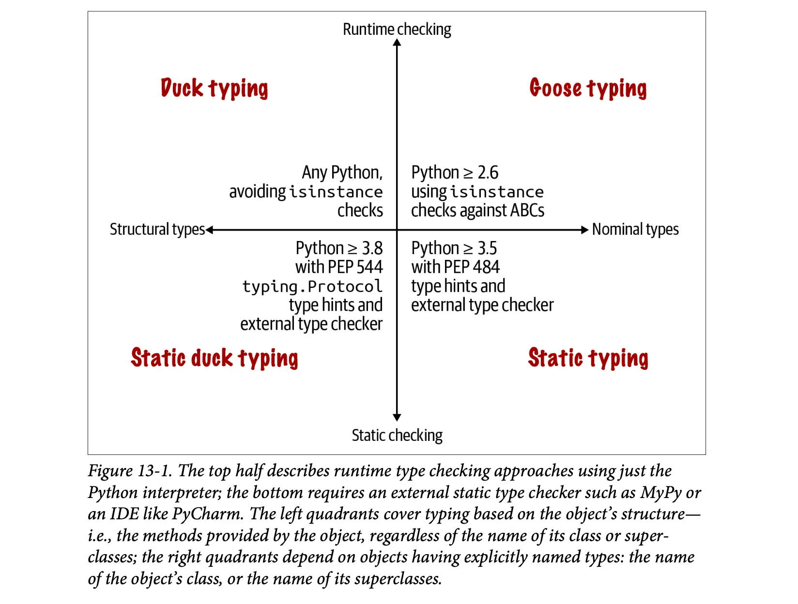

# 第三部分：类和协议

!!! Abstract "Outline"

    - [ ] [十一、Python 风格对象](#python)
    - [ ] [十二、序列的特殊方法](#_2)
    - [ ] [十三、接口、协议和抽象基类](#_3)
    - [ ] [十四、继承](#_4)
    - [ ] [十五、类型提示进阶](#_5)
    - [ ] [十六、运算符重载](#_6)

## 十一、Python 风格对象

???+ Abstract "Outline of Chapter 11"

    - [ ] [11.1 对象表示形式](#111)
    - [ ] [11.2 备选构造函数](#112)
    - [ ] [11.3 `classmethod` 与 `staticmethod`](#113-classmethod-staticmethod)
    - [ ] [11.4 可哈希化](#114)
    - [ ] [11.5 私有属性与覆盖类属性](#115)
    - [ ] [11.6 `__slots__` 优化](#116-__slots__)
    - [ ] [11.7 位置模式匹配](#117)

Python 中用户自定义的行为可以像内置类型一样自然，这得益于鸭子类型而不是继承，只需要用户按照预定行为实现对象所需的方法即可。这一节接续第一节，我们关注如何实现很多 Python 类型中常见的特殊方法，设计类型转换需要的内置函数，可读属性，可哈希化，`__slots__` 优化，以及私有属性、类方法与静态方法等内容。

### 11.1 对象表示形式

先不考虑重载 `*` 等运算符，这些我们会在第 16 节讨论。我们讨论一些常见的特殊方法。首先，回忆一下 `__repr__` 和 `__str__` 方法，它们分别以便于开发者理解的方式返回对象的字符串表示，以及被 `print` 函数调用。

`__bytes__` 方法和 `__str__` 方法类似，只不过是 `bytes()` 函数调用其获取对象的字节序列表示形式。`__format__` 方法被格式化字符串、`format()` 函数和 `str.format()` 方法调用，使用 `obj.__format__(format_spec)` 以特殊的格式化代码显示对象的字符串表示形式。对于之前实现的 `Vector2d` 类，我们接下来实现 `__format__` 方法和 `__bytes__` 方法：

```py
from array import array

class Vector2d:
    typecode = 'd'

    def __init__(self, x, y):
        self.x = float(x)
        self.y = float(y)

    def __eq__(self, other):
        return tuple(self) == tuple(other)

    def __repr__(self):
        class_name = type(self).__name__
        return f"{class_name}({self.x!r}, {self.y!r})"

    def __str__(self):
        return str(tuple(self))

    def __bytes__(self):
        return bytes([ord(self.typecode)]) + bytes(array(self.typecode, self))

    def __format__(self, fmt_spec=''):
        if fmt_spec.endswith('p'):
            fmt_spec = fmt_spec[:-1]
            coords = (abs(self.x), abs(self.y))
            outer_fmt = '<{}, {}>'
        else:
            coords = self
            outer_fmt = '({}, {})'
        components = (format(c, fmt_spec) for c in coords)
        return outer_fmt.format(*components)
```

其中 `__bytes__` 首先将 `typecode` 转换为字节序列，然后迭代这个 `Vector2d` 实例。得到一个数组，再讲数组按照 `typecode` 转换为字节序列。简单看一下 `__format__` 其实也可以发现，这里也对 `Vector2d` 实例进行了迭代，这就要求我们实现 `__iter__` 方法。

```py
class Vector2d:
    ...
    def __iter__(self):
        return (i for i in (self.x, self.y))
        # or yield self.x; yield self.y
```

这样实现的 `Vector2d` 实例就可以被用于拆包和迭代了。

接下来是关于 `__format__` 方法的实现：

### 11.2 备选构造函数

注意到 `Vector2d` 类中，我们定义了转化为 `bytes` 的 `__bytes__` 方法，这个方法实现的目标实现 `bytes` 与 `Vector2d` 实例的相互转化，因而我们希望实现另一边的转化，下面我们实现 `frombytes` 方法，并将这个方法实现成一个类方法：

```py
class Vector2d:
    ...
    @classmethod
    def frombytes(cls, octets):
        typecode = chr(octets[0])
        memv = memoryview(octets[1:]).cast(typecode)
        return cls(*memv)
```

`@classmethod` 装饰器装饰的方法可以直接在类上调用，其第一个参数永远是类本身，习惯性命名为 `cls`，并且 `cls` 一定是一个位置参数。

这样我们就实现了一个备选构造函数，可以用于从 `bytes` 转换为 `Vector2d` 实例。

### 11.3 `classmethod` 与 `staticmethod`

这一部分可以参考十二年前的一个技术博客：[The Definitive Guide on How to Use Static, Class or Abstract Methods on Python](https://dzone.com/articles/definitive-guide-how-use)。简而言之，`@classmethod` 定义的方法是操作类而不是操作实例的方法，其改变了调用方法的方式，因此接收的第一个参数是永远是类本身，而不是实例，第一个参数的名字也应该是 `cls`，代表当前方法所属的类。

`@staticmethod` 定义的方法也会改变方法的调用方式，但是第一个参数没有变化。静态方法就是一般的函数，只是碰巧放在类的定义体中，而不是在模块层面（逻辑上属于类但是不需要类的信息）。作者认为 `@classmethod` 装饰器非常有用，但是 `@staticmethod` 装饰器几乎不存在必须使用的情况。

类方法和静态方法都可以直接通过类调用，当然也可以直接对实例调用，这时候都不需要考虑类方法的 `cls` 参数，需要注意的是，正常实例方法的第一个参数是实例本身，也可以通过 `Class.method(instance)` 显式传入 `self` 参数调用。

下面是一个简单的例子：

???- Info "Simple Example"

    ```py
    >>> class Demo:
    ...     @classmethod
    ...     def klassmeth(*args):
    ...         return args
    ...
    ...     @staticmethod
    ...     def statmeth(*args):
    ...         return args
    ...
    ...     def instmeth(*args):
    ...         return args
    ...
    >>> Demo.klassmeth()
    (<class '__main__.Demo'>,)
    >>> Demo.klassmeth('spam')
    (<class '__main__.Demo'>, 'spam')
    >>> Demo.statmeth()
    ()
    >>> Demo.statmeth('spam')
    ('spam',)
    >>> Demo.instmeth(demo)
    (<__main__.Demo object at 0x1009f4830>,)
    ```

### 11.4 可哈希化

回忆可哈希化的定义，我们需要实现 `__hash__` 方法和 `__eq__` 方法，注意到 `__eq__` 方法我们已经实现过了，只需要实现 `__hash__` 方法。同时我们需要让向量实例不可变，因此我们需要将 `x` 分量和 `y` 分量实现成只读属性，继续修改 `Vector2d` 类，并且加上 `@property` 装饰器：

```py
class Vector2d:
    typecode = 'd'

    def __init__(self, x, y):
        self.__x = float(x)
        self.__y = float(y)

    @property
    def x(self):
        return self.__x

    @property
    def y(self):
        return self.__y

    def __iter__(self):
        return (i for i in (self.x, self.y))

    def __hash__(self):
        return hash((self.x, self.y))
```

我们进行了如下修改：

- 使用两个前导下划线（尾部不能有下划线或者只有一个下划线）将属性标记成私有；
- 使用 `@property` 装饰器将读取方法/getter 标记为**特性/Property**，读值属性与公开属性同名，都是 `x` 和 `y`，但是对应的方法需要直接返回 `__x` 和 `__y` 的值；
- 需要读取 `x` 和 `y` 分量的值的方法可以保持不变，可以通过 `self.x` 和 `self.y` 读取公开特性，而不需要读取私有属性。
- 实现 `__hash__` 方法直接借用了元组可以哈希化的特性。

注意到创建可哈希的类型并不一定需要实现特性，也不一定需要保护实例属性，但是可哈希对象的值一定不应该变化，我们因此提到了只读特性。

### 11.5 私有属性与覆盖类属性

Python 实现了名为**名称改写/Name Mangling** 的语言功能：如果以带有两个前导下划线（尾部没有下划线或者只有一个下划线）的形式命名实例属性，那么 Python 会自动将属性名改写，在前面加上 `_` 和类名，存入实例的 `__dict__` 属性中。比如：

```py
>>> class Demo:
...     def __init__(self, x, y):
...         self.__x = x
...         self.__y = y
...
>>> Demo(12, 13).__dict__
{'_Demo__x': 12, '_Demo__y': 13}
```

因此，如果我们在类中定义了 `__x` 和 `__y` 属性，那么我们无法通过 `Demo().__x` 访问到 `__x` 属性，但是可以通过 `Demo()._Demo__x` 访问。因此我们可以看出来，名称改写其实只能防止意外访问，但是不能阻止蓄意做错事。

很多人不喜欢这样的特殊句法，约定使用一个下划线前缀编写受保护的属性（比如 `self._x`），并且认为应该使用命名约定来避免意外覆盖属性。一般来说，Python 解释器不会对但下划线开头的属性名做特殊处理，但是这是很多 Python 开发者严格遵守的约定，他们不会在类的外部访问这种属性。值得注意的是，在模块中，如果使用 `from my_module import *` 导入模块，那么所有以单下划线开头的名称 `_x` 不会被导入，但是可以 `from my_module import _x` 导入。

总之，无论是单下划线还是双下划线，我们的实现似乎都不是真正的私有和不可变，但这对开发来说已经足够了。

注意一下我们在 `Vector2d` 类中设置了类属性 `typecode`，在 `__bytes__` 方法中使用了这个属性：由于每一个 `Vector2d` 实例本身没有这个属性，所以默认会获取 `Vector2d.typecode` 类属性的值。如果为不存在的实例属性赋值，那么会创建一个新的实例属性，假如我们为一个 `Vector2d` 实例 `v` 赋值 `v.typecode = 'f'`，那么 `v.typecode` 实际上读取的是实例属性 `'f'`，而同名类属性不受影响。

另一种方法是使用继承：

```py
class ShortVector2d(Vector2d):
    typecode = 'f'
```

这样我们将 `ShortVector2d` 类定义为 `Vector2d` 类的子类，并且重写了 `typecode` 类属性，这样 `ShortVector2d` 实例将使用 `'f'` 类型代码。

### 11.6 `__slots__` 优化

### 11.7 位置模式匹配

回忆：

```py
class Vector2d:
    ...
    __match_args__ = ('x', 'y')

def keyword_pattern_demo(v: Vector2d) -> None:
    match v:
        case Vector2d(x=0, y=0):
            print(f'{v!r} is null')
        case Vector2d(x=0):
            print(f'{v!r} is vertical')
        case Vector2d(y=0):
            print(f'{v!r} is horizontal')
        case Vector2d(x=x, y=y) if x==y:
            print(f'{v!r} is diagonal')
        case _:
            print(f'{v!r} is awesome')

def keyword_pattern_lite(v: Vector2d) -> None:
    match v:
        case Vector2d(0, 0):
            print(f'{v!r} is null')
        case Vector2d(0):
            print(f'{v!r} is vertical')
        case Vector2d(_, 0):
            print(f'{v!r} is horizontal')
        case Vector2d(x, y) if x==y:
            print(f'{v!r} is diagonal')
        case _:
            print(f'{v!r} is awesome')
```

第一版的 `keyword_pattern_demo` 使用了关键字类模式匹配，第二版的 `keyword_pattern_lite` 使用了位置模式匹配，支持位置模式匹配需要添加名为 `__match_args__` 的类属性，其值是一个元组，包含所有支持位置模式匹配的属性名，需要按照在位置模式匹配中使用的顺序排列。但是其不需要包含所有公共实例属性，尤其是 `__init__` 方法中包含必须参数和可选参数的时候，在 `__match_args__` 只必须列出必需参数，可选参数就不必列出了。

???- Info "Overall Code for Vector2d"

    ```py
    import math
    from array import array

    class Vector2d:
        __match_args__ = ('x', 'y')

        typecode = 'd'

        def __init__(self, x, y):
            self.__x = float(x)
            self.__y = float(y)

        @property
        def x(self):
            return self.__x

        @property
        def y(self):
            return self.__y

        def __iter__(self):
            return (i for i in (self.x, self.y))

        def __repr__(self):
            class_name = type(self).__name__
            return '{}({!r}, {!r})'.format(class_name, *self)

        def __str__(self):
            return str(tuple(self))

        def __bytes__(self):
            return (bytes([ord(self.typecode)]) +
                    bytes(array(self.typecode, self)))

        def __eq__(self, other):
            return tuple(self) == tuple(other)

        def __hash__(self):
            return hash((self.x, self.y))

        def __abs__(self):
            return math.hypot(self.x, self.y)

        def __bool__(self):
            return bool(abs(self))

        def angle(self):
            return math.atan2(self.y, self.x)

        def __format__(self, fmt_spec=''):
            if fmt_spec.endswith('p'):
                fmt_spec = fmt_spec[:-1]
                coords = (abs(self), self.angle())
                outer_fmt = '<{}, {}>'
            else:
                coords = self
                outer_fmt = '({}, {})'
            components = (format(c, fmt_spec) for c in coords)
            return outer_fmt.format(*components)

        @classmethod
        def frombytes(cls, octets):
            typecode = chr(octets[0])
            memv = memoryview(octets[1:]).cast(typecode)
            return cls(*memv)
    ```

## 十二、序列的特殊方法

???+ Abstract "Outline of Chapter 12"

    - [ ] [12.1 协议与鸭子类型](#121)
    - [ ] [12.2 切片与切片的实现](#122)
    - [ ] [12.3 动态属性读写访问](#123)
    - [ ] [12.4 可哈希与 `==` 的加速](#124)
    - [ ] [12.5 格式化](#125)

???- Info "The Direct Translation from `Vector2d` to `Vector`"

    ```py
    import math
    import reprlib
    from array import array


    class Vector:
        typecode = "d"

        def __init__(self, components):
            self._components = array(self.typecode, components)

        def __iter__(self):
            return iter(self._components)

        def __repr__(self):
            components = reprlib.repr(self._components)
            components = components[components.find("[") : -1]
            return f"Vector({components})"

        def __str__(self):
            return str(tuple(self))

        def __bytes__(self):
            return bytes([ord(self.typecode)]) + bytes(self._components)

        def __eq__(self, other):
            return tuple(self) == tuple(other)

        def __abs__(self):
            return math.hypot(*self)

        def __bool__(self):
            return bool(abs(self))

        @classmethod
        def frombytes(cls, octets):
            typecode = chr(octets[0])
            memv = memoryview(octets[1:]).cast(typecode)  # type: ignore[arg-type]
            return cls(memv)
    ```

### 12.1 协议与鸭子类型

### 12.2 切片与切片的实现

我们已经知道，`[]` 背后的实现是 `__getitem__` 方法，为了实现切片和索引，首先我们需要考虑 `[]` 里面的参数是如何传入到 `__getitem__` 方法中的。简而言之，如果 `[]` 中的参数是一个整数，那么 `__getitem__` 方法接收一个整数参数；如果 `[]` 中的参数是冒号 `:` 分隔的内容，那么 `__getitem__` 方法接收一个切片对象 `slice`，如果 `[]` 中的参数是多个参数，那么 `__getitem__` 方法接收一个元组。只需要依赖下面的代码做一个实验就可以：

```py
class Demo:
    def __getitem__(self, item):
        return item
```

`slice` 是一个内置类型，其包含数据属性 `start`、`stop` 和 `stride`，以及 `indices` 方法。`slice` 对象可以通过 `slice(start, stop, stride)` 创建。对于 `indices` 方法，其参数为 `len`，假设对于一个长度为 `len` 的序列，计算切片 `S` 描述的 `start`、`stop` 索引以及 `stride` 大小，越界的索引会被裁剪。具体用法不表。对于将具体实现交给诸如 `array`、`list`、`tuple` 等内置底层类型的类，不需要 `slice.indices` 方法，否则可以使用这个方法提升处理速度。

我们的代码只需要很简单的实现 `__len__` 方法和 `__getitem__` 方法即可将 `Vector` 表现为序列：

```py
class Vector:
    ...
    def __len__(self) -> int:
        return len(self._components)

    def __getitem__(self, key):
        if isinstance(key, slice):
            cls = type(self)
            return cls(self._components[key])
        index = operator.index(key)
        return self._components[index]
```

在 `__getitem__` 方法中，我们首先判断 `key` 是否是一个切片对象，如果是，那么我们将其传入到 `self._components[key]` 中，返回一个新的 `Vector` 实例；如果不是切片对象，那么我们将其转换为整数索引，直接返回对应的分量。我们实现的 `Vector` 还不支持多维索引，因此索引和切片的元组会引起错误，如果想要支持多维索引，在条件语句那里进行进一步的判断就可以。

这里的 `operator.index()` 是一个内置函数，专门将 `key` 转化为整数索引，只接受纯整数类型（`int` 或者实现了 `__index__` 方法的类型），不允许通过类型转换模糊地获得整数，要求对象可以严格被用作下标或者整数，否则抛出 `TypeError` 异常。这个函数的设计者提出它的目的是允许 NumPy 中的众多整数类型中的任何一种作为索引和切片参数。这里的 `isinstance` 处理切片是合理的用例，过度使用 `isinstance` 是面向对象设计糟糕的标志。

### 12.3 动态属性读写访问

在上面的直接迁移之中，我们失去了诸如 `v.x` 和 `v.y` 这样的直接通过名称访问向量分量的能力，曾经我们使用 `@property` 装饰器提供了只读属性 `x` 和 `y`，当然我们也可以使用其实现类似的方法，但是很繁琐，最好的实践是使用 `__getattr__` 方法动态地访问属性。给定表达式 `obj.x`，当直接的属性查找失败的时候，解释器会调用 `__getattr__` 方法，传入 `self` 和属性名的字符串 `'x'`。下面就是实现的例子：

```py
class Vector:
    ...
    __match_args__ = ("x", "y", "z", "t")

    def __getattr__(self, name):
        cls = type(self)
        try:
            pos = cls.__match_args__.index(name)
        except ValueError:
            pos = -1
        if 0 <= pos < len(self._components):
            return self._components[pos]
        msg = f"{cls.__name__!r} object has no attribute {name!r}"
        raise AttributeError(msg)
```

- 我们允许所有 `__getattr__` 支持的动态属性进行位置模式匹配；
- 当 `name` 在 `__match_args__` 中时，我们返回对应的分量，否则将 `pos` 设置为 `-1`，这样就会抛出 `AttributeError` 异常；

但如果仅仅只支持 `__getattr__` 方法，那么我们就无法使用 `v.x = 1` 这样的语句来**准确**设置向量分量的值，这将造成很奇怪的后果：`v` 将获得新的实例属性 `x`，而再次访问 `v.x` 的时候，我们就直接访问了这个实例属性，而不是通过 `__getattr__` 方法访问 `_components` 数组中的分量。为了避免这种情况，我们需要实现 `__setattr__` 方法，下面是一个简单的实现：

```py
class Vector:
    ...
    def __setattr__(self, name, value):
        cls = type(self)
        if len(name) == 1:
            if name in cls.__match_args__:
                error = 'readonly attribute {attr_name!r}'
            elif name.islower():
                error = "can't set attributes 'a' to 'z' in {cls_name!r}"
            else:
                error = ''

            if error:
                msg = error.format(cls_name=cls.__name__, attr_name=name)
                raise AttributeError(msg)

        super().__setattr__(name, value)
```

这里的实现是为了保证所有单个小写字母的属性都不能被设置，且 `xyzt` 四个属性是只读的。对于其他属性，调用超类的 `__setattr__` 方法设置属性值，这是因为我们的 `Vector` 并没有别的属性需要设置。作者坦白，这里的实现借鉴了内置类型 `complex` 的实现方式。注意到类级别声明 `__slots__` 也是可以防止设置新的实例属性的，虽然使用这个特性很诱人，但是仅仅为了防止实例属性创建而使用 `__slots__` 是很不推荐的，其只应该被用于节省内存，且确实出现内存问题的场景才被使用。

另外，当实现 `__getattr__` 的时候，`__setattr__` 方法也应该被实现。这里我们为了将 `Vector` 变得可哈希，我们设计的 `Vector` 是不可变的，当然我们也可以实现 `__setitem__` 方法，并且使用 `__setitem__` 方法实现 `__setattr__` 方法，这样就可以通过 `v[0] = 1` 的方式设置分量的值了。

### 12.4 可哈希与 `==` 的加速

值得注意的是，`operator` 模块提供了所有 Python 中缀运算符的函数形式功能，减少了对 `lambda` 表达式的需求。

### 12.5 格式化

???- Info "Overall Code for Vector"

    ```py
    import functools
    import itertools
    import math
    import operator
    import reprlib
    from array import array
    from typing import Any, Generator, Iterator, Self, overload


    class Vector:
        typecode = "d"

        def __init__(self, components) -> None:
            self._components = array(self.typecode, components)

        def __iter__(self) -> Iterator:
            return iter(self._components)

        def __repr__(self) -> str:
            components = reprlib.repr(self._components)
            components = components[components.find("[") : -1]
            return f"Vector({components})"

        def __str__(self) -> str:
            return str(tuple(self))

        def __bytes__(self) -> bytes:
            return bytes([ord(self.typecode)]) + bytes(self._components)

        def __eq__(self, other) -> bool:
            return len(self) == len(other) and all(a == b for a, b in zip(self, other))

        def __hash__(self) -> int:
            hashes = (hash(x) for x in self)
            return functools.reduce(operator.xor, hashes, 0)

        def __abs__(self) -> float:
            return math.hypot(*self)

        def __bool__(self) -> bool:
            return bool(abs(self))

        def __len__(self) -> int:
            return len(self._components)

        @overload
        def __getitem__(self, key: slice) -> Self: ...

        @overload
        def __getitem__(self, key: int) -> float: ...

        def __getitem__(self, key):
            if isinstance(key, slice):
                cls = type(self)
                return cls(self._components[key])
            index = operator.index(key)
            return self._components[index]

        __match_args__ = ("x", "y", "z", "t")

        def __getattr__(self, name) -> Any:
            cls = type(self)
            try:
                pos = cls.__match_args__.index(name)
            except ValueError:
                pos = -1
            if 0 <= pos < len(self._components):
                return self._components[pos]
            msg = f"{cls.__name__!r} object has no attribute {name!r}"
            raise AttributeError(msg)

        def angle(self, n: int) -> float:
            r = math.hypot(*self[n:])
            a = math.atan2(r, self[n - 1])
            if (n == len(self) - 1) and (self[-1] < 0):
                return math.pi * 2 - a
            else:
                return a

        def angles(self) -> Generator:
            return (self.angle(n) for n in range(1, len(self)))

        def __format__(self, fmt_spec: str = "") -> str:
            if fmt_spec.endswith("h"):  # hyperspherical coordinates
                fmt_spec = fmt_spec[:-1]
                coords = itertools.chain([abs(self)], self.angles())
                outer_fmt = "<{}>"
            else:
                coords = self
                outer_fmt = "({})"
            components = (format(c, fmt_spec) for c in coords)
            return outer_fmt.format(", ".join(components))

        @classmethod
        def frombytes(cls, octets: bytes) -> Self:
            typecode = chr(octets[0])
            memv = memoryview(octets[1:]).cast(typecode)  # type: ignore[arg-type]
            return cls(memv)
    ```

## 十三、接口、协议和抽象基类

从 Python 3.8 开始，Python 接口的定义和使用方式有如下四种，其中鸭子类型、静态类型我们已经谈过，我们在这里主要探讨大鹅类型和静态鸭子类型。



## 十四、继承

### 14.1 `super()` 函数

### 14.2 内置类型继承

### 14.3 多继承与方法解析顺序/MRO

### 14.4 混入类

## 十五、类型提示进阶

## 十六、运算符重载
