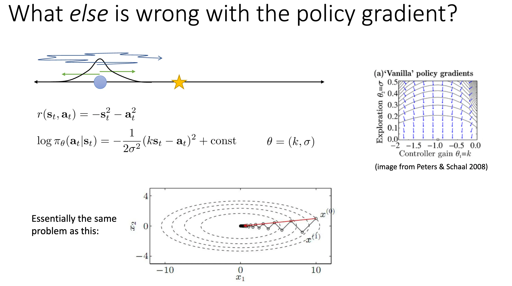

# Model-free Methods

## Lecture 5: Policy Gradients

<!-- # 策略梯度（中文讲稿，对齐幻灯片 8–15）

## 理解策略梯度（Understanding Policy Gradients）

我们已经推导过策略梯度的数学形式。现在换一种直观视角：策略梯度的采样估计器可以看成“沿着轨迹的对数概率梯度之和”，再用该轨迹的回报加权。设策略为参数化分布 π_θ(a|s)，回报定义为 R(τ)，其中 τ = (s_0,a_0,…,s_{T})。目标函数与基本估计式是：

\[
J(\theta) \;=\; \mathbb{E}_{\tau \sim \pi_\theta}\!\big[R(\tau)\big],
\quad
\nabla_\theta J(\theta) \;=\; \mathbb{E}_{\pi_\theta}\!\left[\sum_{t=0}^{T-1}\nabla_\theta \log \pi_\theta(a_t\mid s_t)\,G_t\right],
\]

其中 \(G_t = \sum_{t' = t}^{T-1} r(s_{t'},a_{t'})\) 是从时刻 t 开始的分时回报（reward-to-go）。常见的两种无偏采样近似是：

- 轨迹回报版：
\[
\nabla_\theta J(\theta) \;\approx\; \frac{1}{N}\sum_{i=1}^N\left(\sum_{t=0}^{T-1}\nabla_\theta \log \pi_\theta(a_{i,t}\mid s_{i,t})\right) R(\tau_i).
\]

- 分时回报版：
\[
\nabla_\theta J(\theta) \;\approx\; \frac{1}{N}\sum_{i=1}^N\sum_{t=0}^{T-1}\nabla_\theta \log \pi_\theta(a_{i,t}\mid s_{i,t})\, G_{i,t}.
\]

在离散动作的直觉图景中，可以把 \(\log \pi_\theta(a\mid s)\) 理解为“网络对已选动作的对数概率”，\(\nabla_\theta \log \pi_\theta(a\mid s)\) 则是它对参数的梯度。策略梯度看起来很像在做最大似然，但不同之处在于：它用回报对每个样本（或每个时刻）的梯度做加权，回报高的样本权重大，回报低的样本权重小甚至为负。

## 与最大似然训练的对比（Comparison to Maximum Likelihood）

模仿学习/监督学习的做法是假设数据里的动作是“好”的，然后最大化观测动作的对数似然：

\[
L_{\mathrm{ML}}(\theta) \;=\; \sum_{i,t}\log \pi_\theta(a_{i,t}\mid s_{i,t}), 
\quad 
\nabla_\theta L_{\mathrm{ML}}(\theta) \;=\; \sum_{i,t}\nabla_\theta \log \pi_\theta(a_{i,t}\mid s_{i,t}).
\]

与此相比，策略梯度里的动作是当前策略自己生成的，可能“好”也可能“坏”。于是更新方向不再是“无差别地提高所有观测动作的概率”，而是“回报加权的最大似然梯度”：高回报样本的对数概率被提升，低回报样本的对数概率被压低。这一定性认识对后续基于自动微分库（如 PyTorch、TensorFlow）的实现非常有用。

## 连续动作：高斯策略示例（Example: Gaussian Policies）

在连续动作空间里，常用高斯策略。令策略为多元正态：

\[
\pi_\theta(a\mid s) \;=\; \mathcal{N}\!\big(a;\, \mu_\theta(s),\, \Sigma\big),
\]

其中均值 \(\mu_\theta(s)\) 由神经网络输出，协方差 \(\Sigma\) 可固定或可学习。其对数概率与对数概率的参数梯度为：

\[
\log \pi_\theta(a\mid s) \;=\; -\tfrac{1}{2}(a-\mu_\theta(s))^\top \Sigma^{-1}(a-\mu_\theta(s)) \;-\; \tfrac{1}{2}\log |2\pi \Sigma|,
\]

\[
\nabla_\theta \log \pi_\theta(a\mid s) \;=\; \Big(\tfrac{\partial \mu_\theta(s)}{\partial \theta}\Big)^\top \Sigma^{-1}\,\big(a-\mu_\theta(s)\big).
\]

实际实现中，先计算
\[
\delta \;=\; \Sigma^{-1}\big(a-\mu_\theta(s)\big),
\]
再把 \(\delta\) 作为“误差信号”通过产生 \(\mu_\theta(s)\) 的网络反向传播，即可得到对 \(\theta\) 的梯度。注意这里没有 \(-\tfrac{1}{2}\) 的因子，方向是 \(a-\mu_\theta(s)\)。

## 我们刚刚做了什么？——试错学习的形式化（What did we just do?）

把上面的式子收紧记号，轨迹级写法是：

\[
\nabla_\theta J(\theta) \;=\; \mathbb{E}_{\tau\sim\pi_\theta}\!\big[\nabla_\theta \log \pi_\theta(\tau)\, R(\tau)\big],
\quad
\log \pi_\theta(\tau) \;=\; \sum_{t=0}^{T-1}\log \pi_\theta(a_t\mid s_t).
\]

直观上，这就是“沿着高回报轨迹提高对数概率，沿着低回报轨迹降低对数概率”。因此，策略梯度把“试错学习”的直觉精确化为一次可微、可计算的梯度上升过程：好的行为更可能发生，坏的行为更不可能发生。

## 部分可观测性（Partial Observability）

马尔可夫性质成立于“状态”，但通常不成立于“观测”。在策略梯度的推导中，并未用到马尔可夫性本身，因此在部分可观测情形（POMDP）下，只需把策略改为条件于观测 \(\pi_\theta(a\mid o)\)，同样得到：

\[
\nabla_\theta J(\theta) \;=\; \mathbb{E}\!\left[\sum_{t=0}^{T-1}\nabla_\theta \log \pi_\theta(a_t\mid o_t)\, G_t\right].
\]

形式不变，只是把 \(s_t\) 换成 \(o_t\)。这意味着在 POMDP 中可以直接使用策略梯度（当然，表现仍受限于策略的表达能力与优化噪声）。

## 策略梯度的问题：高方差（What is wrong with the policy gradient? High variance）

用一个一维“轨迹-回报”的示意思考：若某一次采样中出现一个“大负回报”的点，它会强烈推动策略远离该点；而把奖励整体加上常数（如所有奖励都平移为正），虽然不改变最优策略，但会改变有限样本下的更新量级与方向。这正体现了估计器的高方差。

从期望上看，加入常数并不引入偏差，因为
\[
\mathbb{E}_{\pi_\theta}\!\left[\sum_{t=0}^{T-1}\nabla_\theta \log \pi_\theta(a_t\mid s_t)\right] \;=\; 0,
\]
但在有限样本时，多出来的常数项会放大方差，使学习变得不稳定。极端时，如果某些样本的奖励为 0，它们对梯度“没有贡献”，进一步加剧数据利用低效的问题。

因此，在实际应用中，策略梯度的核心工程挑战是“降方差”。后续内容（不在本段字幕覆盖内）会讨论诸如 reward-to-go、基线（baseline，含最优基线的分析）等方差缩减技巧。

## 小结（Review）

本段内容用统一记号梳理了策略梯度的直观解释：把“对数概率的梯度”用回报加权，从而提升好行为、抑制坏行为；给出离散与连续（高斯策略）的可计算公式；说明了在部分可观测环境下公式结构不变；并指出策略梯度在有限样本下的高方差问题——这也是实践中必须重点解决的难点。

# 策略梯度（Part 3）：降低方差——因果性、Reward-to-Go 与基线

在实践中，策略梯度的核心难点是高方差。我们将利用“因果性”这一始终成立的事实来重写估计式，并由此得到“reward-to-go”形式的无偏估计器；随后进一步通过“基线（baseline）”降低方差，并推导可使方差最小化的最优基线。

首先回顾记号。策略为参数化分布 π_θ(a|s)，回报 R(τ)=∑_{t=0}^{T-1} r(s_t,a_t)，目标为
\[
J(\theta)=\mathbb{E}_{\tau\sim\pi_\theta}[R(\tau)].
\]
经典的 REINFORCE 估计器可写为
\[
\nabla_\theta J(\theta)=\mathbb{E}\!\left[\sum_{t=0}^{T-1}\nabla_\theta\log \pi_\theta(a_t\mid s_t)\; \sum_{t'=0}^{T-1} r(s_{t'},a_{t'})\right].
\]

因果性指出，“现在的动作不会改变过去的奖励”。在上式中，项 r(s_{t'},a_{t'}) 当 t'<t 时与 a_t 独立（条件于历史），因此
\[
\mathbb{E}\big[\nabla_\theta\log \pi_\theta(a_t\mid s_t)\; r(s_{t'},a_{t'})\big]=0,\quad \forall\, t'<t,
\]
由此可将对所有时刻的求和“截断”为对未来的求和，得到无偏且更低方差的 reward-to-go 形式
\[
\nabla_\theta J(\theta)=\mathbb{E}\!\left[\sum_{t=0}^{T-1}\nabla_\theta\log \pi_\theta(a_t\mid s_t)\; G_t\right],\qquad 
G_t=\sum_{t'=t}^{T-1} r(s_{t'},a_{t'}).
\]
在采样近似中，对第 i 条轨迹第 t 步的单样本估计常记为 \(\hat{Q}_{i,t}\equiv G_{i,t}\)，从而
\[
\nabla_\theta J(\theta)\;\approx\;\frac{1}{N}\sum_{i=1}^N\sum_{t=0}^{T-1}\nabla_\theta\log \pi_\theta(a_{i,t}\mid s_{i,t})\;\hat{Q}_{i,t}.
\]
reward-to-go 的降方差直观解释很直接：丢弃与 a_t 无关的“过去奖励”项，等式仍无偏，但方差更小。

仅有 reward-to-go 仍不足以应对“整体平移奖励”造成的剧烈方差震荡。为此我们再引入基线（baseline）b，将权重从 \(G_t\) 改为 \(G_t-b\)。不妨先从常数基线出发：
\[
\nabla_\theta J(\theta)=\mathbb{E}\!\left[\sum_{t=0}^{T-1}\nabla_\theta\log \pi_\theta(a_t\mid s_t)\;(G_t-b)\right].
\]
该改写保持无偏，关键在于恒等式
\[
\mathbb{E}_{a\sim\pi_\theta(\cdot\mid s)}\big[\nabla_\theta \log \pi_\theta(a\mid s)\big]
=\sum_a \pi_\theta(a\mid s)\nabla_\theta\log \pi_\theta(a\mid s)
=\sum_a \nabla_\theta \pi_\theta(a\mid s)
=\nabla_\theta \!\sum_a \pi_\theta(a\mid s)
=\nabla_\theta 1
=0.
\]
于是对任意与 a_t 无关的 b（可为常数、可依赖 t 或 s_t）都有
\[
\mathbb{E}\!\left[\nabla_\theta\log \pi_\theta(a_t\mid s_t)\;b\right]=0,
\]
从而减去基线不改变期望梯度，仅改变方差。直观上，选择“合理”的 b 能把“好于平均”的样本权重变为正、“差于平均”的变为负，使更新更贴合“提升好行为、压制坏行为”的直觉。

进一步地，我们可以推导使方差最小化的最优基线。令轨迹级梯度和
\[
g(\tau)=\sum_{t=0}^{T-1}\nabla_\theta\log \pi_\theta(a_t\mid s_t),
\]
考虑用轨迹回报 R(τ) 的简化情形（对 reward-to-go 可作同样推导），带基线的随机梯度为
\[
\hat{G}(\tau)=g(\tau)\,\big(R(\tau)-b\big).
\]
它的方差满足
\[
\mathrm{Var}[\hat{G}]=\mathbb{E}\!\left[\,\|g(\tau)\|^2\,(R(\tau)-b)^2\,\right]-\big\|\mathbb{E}[g(\tau)R(\tau)]\big\|^2.
\]
第二项与 b 无关，最小化方差等价于最小化第一项。对标量基线 b 求导并令其为零，有
\[
\frac{\mathrm{d}}{\mathrm{d}b}\,\mathbb{E}\!\left[\,\|g\|^2\,(R-b)^2\,\right]
=-2\,\mathbb{E}\!\left[\,\|g\|^2 R\,\right]
+2b\,\mathbb{E}\!\left[\,\|g\|^2\,\right]
=0,
\]
解得最优标量基线
\[
b^\star=\frac{\mathbb{E}\!\left[\,\|g(\tau)\|^2\,R(\tau)\,\right]}{\mathbb{E}\!\left[\,\|g(\tau)\|^2\,\right]}.
\]
若按参数维度逐分量最小化，每一维 j 的最优分量基线为
\[
b_j^\star=\frac{\mathbb{E}\!\left[g_j(\tau)^2\,R(\tau)\right]}{\mathbb{E}\!\left[g_j(\tau)^2\right]},
\]
这表明“最优基线不是简单的平均回报”，而是按梯度幅度对回报进行再加权的期望。在工程上，最常用的是易实现的近似，如“批次平均回报”或“状态依赖基线” b_t=b(s_t)（例如用一个值函数近似器），它们同样保持无偏，且能显著降方差。

将以上两种技巧合并，实践中常用的无偏、低方差策略梯度更新可写为
\[
\nabla_\theta J(\theta)\;\approx\;\frac{1}{N}\sum_{i=1}^N\sum_{t=0}^{T-1}\nabla_\theta\log \pi_\theta(a_{i,t}\mid s_{i,t})\;\big(\hat{Q}_{i,t}-b_t\big),
\]
其中 \(\hat{Q}_{i,t}=G_{i,t}\) 是单样本 reward-to-go，b_t 可取时间或状态依赖的基线；若实现为监督学习的“加权负对数似然”，则相当于用“优势” \(\hat{A}_{i,t}=\hat{Q}_{i,t}-b_t\) 作为样本权重进行反向传播。

总结：本部分利用因果性将策略梯度改写为 reward-to-go 形式，无偏且方差更小；随后通过基线进一步降低方差，并给出最优（标量或分量）基线的解析式。实践中，reward-to-go 与简单可行的基线（如平均回报或状态值函数）已能显著提升策略梯度的稳定性与样本效率。

# 策略梯度（Part 4）——离策略与重要性采样

本部分讨论如何把策略梯度从“在策略（on-policy）”推广到“离策略（off-policy）”。核心困难在于：策略梯度的期望是相对于当前策略诱导的轨迹分布取的，一旦参数更新，旧数据便与新的分布不匹配，导致必须“重新采样”。这在深度强化学习里尤其昂贵，因为神经网络每次梯度更新只能改动很小的一点点，我们往往需要进行很多次小步长的梯度上升；如果每一步都得用新策略重新在系统里跑一批轨迹（真实系统或昂贵仿真），代价会非常高。反过来说，如果生成样本很便宜，策略梯度因其简单直接而依然是很好用的工具。

在记号上，令轨迹分布
\[
p_\theta(\tau)=p(s_0)\,\prod_{t=0}^{T-1}\pi_\theta(a_t\mid s_t)\,p(s_{t+1}\mid s_t,a_t),
\]
目标函数与在策略梯度为
\[
J(\theta)=\mathbb{E}_{\tau\sim p_\theta}[R(\tau)],\qquad 
\nabla_\theta J(\theta)=\mathbb{E}_{\tau\sim p_\theta}\!\big[\nabla_\theta\log p_\theta(\tau)\,R(\tau)\big].
\]
这正是“每次更新都要用最新策略采样”的根源。

为了复用来自旧策略或外部来源（如示范）的数据，我们引入重要性采样。对任意函数 f，有
\[
\mathbb{E}_{x\sim p}[f(x)]
=\mathbb{E}_{x\sim q}\!\left[\frac{p(x)}{q(x)}\,f(x)\right],
\]
这是精确无偏的重加权恒等式，只是可能改变方差。将其用于 RL 目标，若手头样本来自某分布 \(\bar p(\tau)\)（如旧策略 \(\bar\pi\)），则
\[
J(\theta')
=\mathbb{E}_{\tau\sim \bar p}\!\left[\frac{p_{\theta'}(\tau)}{\bar p(\tau)}\,R(\tau)\right].
\]
利用轨迹分解，且初始分布与环境转移在同一 MDP 中相同，重要性权重仅由策略概率比给出：
\[
\frac{p_{\theta'}(\tau)}{\bar p(\tau)}
=\prod_{t=0}^{T-1}\frac{\pi_{\theta'}(a_t\mid s_t)}{\bar\pi(a_t\mid s_t)}.
\]
这很关键，因为 \(p(s_0)\) 与 \(p(s_{t+1}\mid s_t,a_t)\) 通常未知，而策略概率是我们可计算的。

把同样的思想用于梯度，记“方便恒等式”
\[
p_{\theta'}(\tau)\,\nabla_{\theta'}\log p_{\theta'}(\tau)=\nabla_{\theta'}p_{\theta'}(\tau),
\]
则离策略的策略梯度可写为
\[
\nabla_{\theta'} J(\theta')
=\mathbb{E}_{\tau\sim p_\theta}\!\left[\frac{p_{\theta'}(\tau)}{p_\theta(\tau)}\,\nabla_{\theta'}\log p_{\theta'}(\tau)\,R(\tau)\right].
\]
将 \(\log p_{\theta'}(\tau)=\sum_{t=0}^{T-1}\log \pi_{\theta'}(a_t\mid s_t)\) 代入并展开，可得到一眼能看出的“三因子”结构：时间上的重要性权重连乘、梯度项的求和、奖励的求和
\[
\nabla_{\theta'} J(\theta')
=\mathbb{E}_{\tau\sim p_\theta}\!\left[
\left(\prod_{t=0}^{T-1}\rho_t\right)
\left(\sum_{t=0}^{T-1}\nabla_{\theta'}\log \pi_{\theta'}(a_t\mid s_t)\right)
\left(\sum_{t=0}^{T-1} r_t\right)
\right],\quad
\rho_t=\frac{\pi_{\theta'}(a_t\mid s_t)}{\pi_\theta(a_t\mid s_t)}.
\]
一个有用的检验是“局部一致性”：当在 \(\theta'=\theta\) 处评估时，\(\rho_t\equiv1\)，就退化回原始在策略的策略梯度。

如同在策略情形，我们还可以利用因果性把回报重写为“从当前到末端”的 reward-to-go，并把权重分配到对应时间步上。直观上，时刻 \(t\) 的梯度项将乘上“到达该处的概率比”的连乘（过去权重），再乘上“面向未来的回报加权和”（未来权重加权的 \(G_t\)）：
\[
\sum_{t=0}^{T-1}\left[
\left(\prod_{t'=0}^{t}\rho_{t'}\right)\nabla_{\theta'}\log \pi_{\theta'}(a_t\mid s_t)
\cdot
\underbrace{\sum_{t'=t}^{T-1}\big(\text{若保留}\ \rho\ \text{则含有未来的比值}\big)\,r_{t'}}_{\text{未来回报的加权和}}
\right].
\]
问题也随之清晰：过去权重的连乘 \(\prod_{t'=0}^{t}\rho_{t'}\) 会随 \(t\) 呈指数式衰减或放大，导致方差指数爆炸。策略梯度本就高方差，再乘上这串比值，估计会极不稳定。一个可操作的观察是：若忽略“乘在奖励上的那些未来权重”，可以得到一种策略迭代（policy iteration）式的过程——它不再是梯度，但可以证明仍然单调改进策略；我们会在后续专讲策略迭代时详细说明。需要强调的是，不能忽略“过去连乘”的那一项，它才是方差指数问题的根源。

为进一步理解并控制这种方差，我们将重加权从“整条轨迹”迁移到“状态-动作边际”。定义时间步 \(t\) 的边际分布
\[
d_\theta(s_t,a_t)=d_\theta(s_t)\,\pi_\theta(a_t\mid s_t),
\]
则可把离策略梯度改写为对边际的重加权期望：
\[
\nabla_{\theta'} J(\theta')
\approx \mathbb{E}_{(s_t,a_t)\sim d_\theta}\!\left[
\underbrace{\frac{d_{\theta'}(s_t,a_t)}{d_\theta(s_t,a_t)}}_{\text{边际比}}
\,\nabla_{\theta'}\log \pi_{\theta'}(a_t\mid s_t)\,\widehat{Q}(s_t,a_t)
\right].
\]
进一步用链式法则拆分边际比
\[
\frac{d_{\theta'}(s_t,a_t)}{d_\theta(s_t,a_t)}
=\underbrace{\frac{d_{\theta'}(s_t)}{d_\theta(s_t)}}_{\text{状态边际比}}
\cdo
\underbrace{\frac{\pi_{\theta'}(a_t\mid s_t)}{\pi_\theta(a_t\mid s_t)}}_{\text{动作条件比 }\,\rho_t}.
\]
真正难的是状态边际比，因其隐含初始分布与环境转移，无法直接评估；且即使能估，这一项随时间耦合仍会带来方差放大。一个一阶、但非常实用的近似就是忽略状态边际比，仅保留动作条件比：
\[
\nabla_{\theta'} J(\theta')
\approx \mathbb{E}_{(s_t,a_t)\sim d_\theta}\!\left[
\rho_t\,\nabla_{\theta'}\log \pi_{\theta'}(a_t\mid s_t)\,\widehat{Q}(s_t,a_t)
\right],\qquad 
\rho_t=\frac{\pi_{\theta'}(a_t\mid s_t)}{\pi_\theta(a_t\mid s_t)}.
\]
这不再是精确的离策略梯度，但当 \(\theta'\) 与 \(\theta\) 接近（也就是我们每次参数只“改动一点点”，做很多小步的梯度更新）时，忽略 \(\tfrac{d_{\theta'}(s)}{d_\theta(s)}\) 带来的误差是有界且可控的，同时避免了时间上的指数连乘，因此能显著抑制方差爆炸。正因如此，这个“只保留动作比”的第一性近似，成为一批实用离策略策略梯度方法的关键出发点。直观上可以把它理解为：仍然用 reward-to-go 做信号，但只用“当前动作在新旧策略下的相对可能性”修正每一步的对数似然梯度，既保留了“回报加权的监督学习”直觉，又不会把方差拖入指数深渊。

小结。基础策略梯度之所以在策略，是因为期望取在 \(p_\theta(\tau)\) 下，导致每一步都需用新策略重采样；重要性采样提供了无偏的重加权，把旧数据转化为对新策略有用的期望。直接在轨迹级做重要性采样会引入随时间指数增长的方差；结合因果性可以把结构拆得更清楚，但并不能消除“过去权重连乘”的根问题。将重加权移到状态-动作边际，并在一阶近似下忽略状态边际比，只保留动作条件比 \(\rho_t\)，在“参数每次只改动一点点、需要很多步”的深度强化学习常见设定下，是一种既稳健又高效的工程化做法。

-->

有关重要性采样的方法可以参考 Levine & Koltun (2013) 这篇论文。

策略梯度法还有哪些问题？如果从梯度下降方法的角度上看，我们考虑下面这个问题：下面这个环境设定下，reward 不仅和当前状态相关，还对动作添加了一个惩罚项，策略可以看作一个高斯策略。

最优解应该在 $\sigma = 0$，$k = -1$ 处。从右面梯度图示可以看出，梯度方向事实上没有严格指向最优点，这是因为随着 $\sigma$ 变小，关于 $\sigma$ 的梯度量级急剧变大，而关于 $k$ 的梯度相对来说很小，结果是更新几乎被挤压到减小 $\sigma$ 上，向最优 $k$ 的推进变得极慢。这种问题在优化上是 ill-conditioned 的，就好像优化一个特征值极大的二次函数一样困难。接下来介绍可以缓解这个问题的 Covariant/Natural Policy Gradient 方法。

在 Deep RL 下，我们的策略是一个神经网络，很可能有某些参数对策略的影响量级差别巨大，直觉上应当对影响策略小的参数用更大的步，对影响策略大的参数用更小的步。我们也可以使用约束优化的角度来看这个问题，优化目标是 $J(\theta)$ 的泰勒展开：

$$
\theta^{\prime} \leftarrow \operatorname*{\arg\max}_{\theta'} (\theta' - \theta)^T \nabla_\theta J(\theta) \quad \text{s.t.} \quad \lVert \theta' - \theta \rVert_2^2 \le \varepsilon.
$$ 

可以看作要求 $\theta'$ 在 $\theta$ 的 $\varepsilon$ 邻域内，找到最大化目标线性更新的参数值。但是直接在参数空间下进行约束比较困难，可以在策略空间下参数化这个过程。

$$
\theta^{\prime} \leftarrow \operatorname*{\arg\max}_{\theta'} (\theta' - \theta)^T \nabla_\theta J(\theta) \quad \text{s.t.} \quad D (\pi_{\theta'}, \pi_\theta) \le \varepsilon.
$$

这里的 $D$ 是一个和参数化无关的散度度量，比较常见的是 KL 散度：$D_{\text{KL}}(\pi_{\theta'} \| \pi_\theta) = \mathbb{E}_{\pi_{\theta'}} [\log \pi_{\theta} - \log \pi_{\theta'}] \approx (\theta' - \theta)^T \mathbf{F} (\theta' - \theta)$，$F(\theta)$ 是 Fisher Information Matrix，其值为 $\mathbf{F} = \mathbb{E}_{\pi_\theta} [\nabla_\theta \log \pi_\theta (a \mid s) \nabla_\theta \log \pi_\theta (a \mid s)^T]$。于是优化问题可以转化为：

$$\begin{aligned}
\theta^{\prime} \leftarrow \operatorname*{\arg\max}_{\theta'} (\theta' &- \theta)^T \nabla_\theta J(\theta) \quad \text{s.t.} \quad \lVert \theta' - \theta \rVert_F^2 \le \varepsilon.\\
\theta &\leftarrow \theta + \alpha \mathbf{F}^{-1} \nabla_\theta J(\theta).
\end{aligned}$$

这就是我们的 Covariant/Natural Policy Gradient 方法，其可以很好缓解我们之前情景下的问题。比如 TRPO 的现代方法很多都收到自然策略梯度的启发，使用共轭梯度下降等优化手法。

## Lecture 6: Actor-Critic Algorithms

## Lecture 7: Value Function Methods

## Lecture 8: Deep RL with Q-Functions

## Lecture 9: Advanced Policy Gradients
