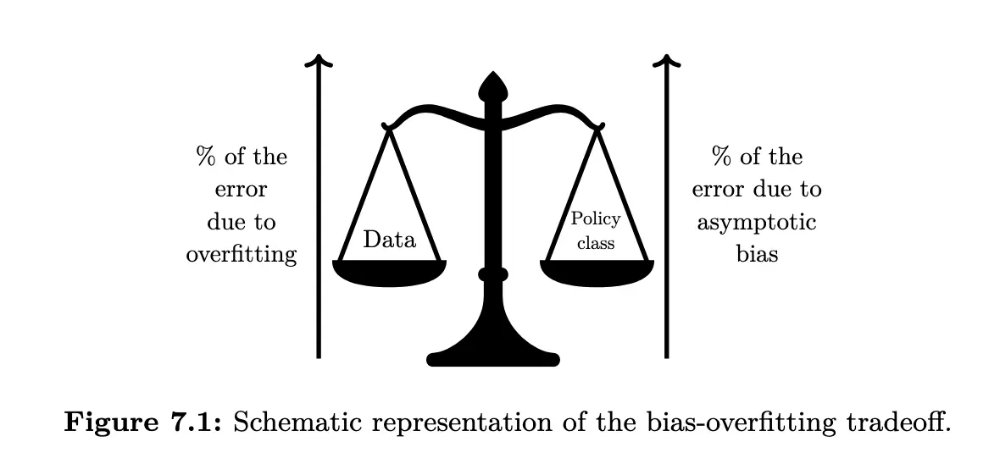
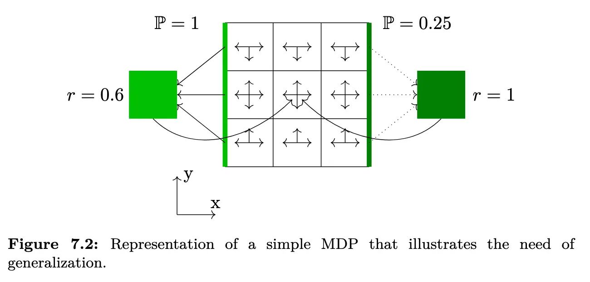
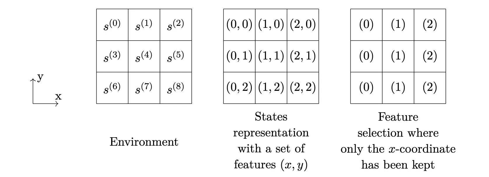

# Chapter 7: The Concept of Generalization

## 7.0 Introduction

泛化/Generalization 是机器学习中的核心概念，在强化学习里也没有例外。这里的泛化可以指：

- 在**训练数据有限**的环境中仍能取得良好性能的能力；
- 在**相关环境中迁移**并获得良好性能的能力。

在前一种情形里，Agent 必须学会在一个与训练环境**完全一致**的测试环境中表现良好，这时，泛化的思想与**样本效率**/Data Efficiency 直接相关，比如当状态-动作空间太大而无法完全覆盖的情况。在后一种情形里，测试环境与训练环境有共同模式，但是环境的动态和奖励可能不同，例如底层动态可能相同，但观测出现了变换，这种变换可能是加入了噪声或者特征偏移等。这种情形与**迁移学习**/Transfer Learning 以及**元学习**/Meta Learning 高度相关。

在 Online 设定下，每一步都会做一个 mini-batch 梯度更新，这种情况下，社区有时也把样本效率指代算法的学习速度，这通常在给定步数下学习性能（学习步数就是观察到的转移的数目）。然而，这个结果由许多因素决定：学习算法本身、探索和利用的平衡、以及实际的泛化能力。本章将只注重研究泛化能力，并不考虑学习速度。在我们考虑的设定下，测试环境和训练环境的任务完全相同，我们获得这个任务下一个有限的训练数据集 $D$。形式化地，我们定义数据集 $D$ 为四元组集合 $\langle s,a,r,s^{\prime} \rangle \in \mathcal{S}\times\mathcal{A}\times\mathcal{R}\times\mathcal{S}$，这些数据是独立同分布采样得到的，记为 $D \sim \mathcal{D}$，其中 $\mathcal{D}$ 可以看作训练集数据的分布。采样是按照如下方式：

- 从某个固定的分布下抽取一定数目的状态-动作对 $(s,a)$，满足 $\mathbb{P}(s,a)>0$，$\forall (s,a)\in\mathcal{S}\times\mathcal{A}$；
- 下一状态 $s^{\prime} \sim T(s,a,\cdot)$；
- 回报 $r = R(s,a,s^{\prime})$。

记 $D_\infty$ 为一个四元组数量趋于无穷的极限情形的数据集。

我们可以将一个学习算法看作一个将数据集 $D$ 映射到策略 $\pi_D$ 的映射，无论它是否使用模型。此时，期望回报的次优性可以分解为：

$$\begin{align}
\mathbb{E}_{D\sim \mathcal{D}} \left[\,V^{\pi_\ast}(s) - V^{\pi_D}(s)\,\right]
&= \mathbb{E}_{D\sim \mathcal{D}} \left[\,V^{\pi_\ast}(s)-V^{\pi_{D_\infty}}(s)+V^{\pi_{D_\infty}}(s)-V^{\pi_D}(s)\,\right] \\ 
&= \underbrace{V^{\pi_\ast}(s)-V^{\pi_{D_\infty}}(s)}_{\text{Asymptotic Bias}}
\;+\; \underbrace{\mathbb{E}_{D\sim \mathcal{D}} \left[\,V^{\pi_{D_\infty}}(s)-V^{\pi_D}(s)\,\right]}_{\text{Error due to the finite data}}.
\end{align}$$

这样的分解点明了两个不同的误差来源：

- $V^{\pi_\ast}(s)-V^{\pi_{D_\infty}}(s)$ 是渐近偏差，和数据量无关；
- $\mathbb{E}_{D\sim \mathcal{D}} \left[\,V^{\pi_{D_\infty}}(s)-V^{\pi_D}(s)\,\right]$ 是过拟合项，由于样本有限、分布稀疏或有偏，算法可能过拟合到噪声或偶然性上，导致评估/部署性能下降，这一步应该随着数据量增加或者数据质量提高而减小。

从数据集上学到的策略 $\pi_D$ 的目标是让总体次优性最小。要做到这一点，RL 算法应当与任务/任务集合良好匹配。

如上图所示，提升泛化性能可以看作一种权衡：一方面，完全信任频率学派假设（也就是将有限数据的频率当做概率）带来误差；另一方面，为了降低过拟合而引入的偏差/Bias 也会带来误差/Error，比如引入某种函数逼近结构本身就是强制泛化的一种手段，但可能引入偏差，使用一些正则化技术也是类似的手段。

当数据质量差的时候，算法应该更偏向于更加鲁棒的策略类，也就是更小、更具有泛化力的策略集合；当数据质量提高的时候，过拟合风险降低，算法可以更信任数据，从而降低渐近偏差。这种在渐进偏差和过拟合之间做取舍的权衡，我们称之为**偏差-过拟合权衡**/Bias-Overfitting Tradeoff。在 Deep RL 中，影响泛化的关键因素有这些：

- 状态表征/State Representation；
- 学习算法/Learning Algorithm，比如 Function Approximator 以及 Model-based 或者 Model-free；
- 目标函数/Objective Function，比如回报塑形/Reward Shaping 和训练时折扣因子调参；
- 分层学习/Hierarchical Learning。

本章内，我们都会使用下面的简单 MDP 进行辅助说明：

如果 Agent 完全了解环境，其最佳策略就应该是永远向左，每三步获得一次 $0.6$ 的奖励。现在假设我们只收集到有限的信息，有不小的概率会出现右侧某条转移看起来可以确定性得到 $r=1$ 的奖励，无论采用基于模型还是无模型的方法，若学习算法在经验 MDP 上找到“最优策略”，它在真实环境上的泛化反而会变差。

<!-- ### 5) 实务中的“抗过拟合/促泛化”思路（预告本章后续）

* **状态表征**（§7.1）：**抽取对任务有用的抽象因素**、去除虚假相关（但别过度压缩导致信息缺失）。深度网络前层（卷积、注意力等）本身就是一种**隐式特征选择**。
* **算法与函数逼近器的选择**（§7.2）：当模型类**太弱**→偏差高；**太强**→过拟合。可用**辅助任务**（预测像素变化、即时回报、特征激活等）提升特征质量，降低过拟合风险。
* **修改目标函数**（§7.3）：

  * **回报塑形**：在稀疏回报下给中间引导，提升稳定性。
  * **训练用折扣因子 $\gamma$**：**有意调低** $\gamma$ 可减少**远期误差的放大**（尤其在模型/估计误差可积累的情形），属于“用偏差换稳定/泛化”。
* **层级化学习**（§7.4）：用**期延动作/选项**减少长视野决策的难度，提高可迁移性与泛化。 -->

## 7.1 Feature Selection

为手头的任务选择合适的特征，是机器学习领域的一个重要话题，在强化学习领域也十分常见，选用恰当级别的抽象在偏差-过拟合权衡之中起着关键的作用，使用小而丰富的表征的一个优势就是可以提升泛化能力。

**过拟合**：当在很多特征上来决定策略的时候，强化学习算法可能会考虑假相关/Spurious Correlations，从而导致过拟合。比如在 Grid World 的例子中，Agent 很可能会错误的推断 $y$ 坐标会改变期望回报，进而只选择 $y$ 坐标来决定策略，这显然是不对的。

**渐进偏差**：移除那些在强化学习动态里面扮演区分性角色以区分不同状态的特征，会引入渐进偏差。事实上，无法区分的状态会被强制采用同一策略，因此得到一个次优策略。

在 Deep RL 中，一种方法是先从观测中推断出一组因子化的生成变量/A Factorized Set of Generative Factors。这可以使用编码器-解码器架构的变体。这些特征可以被用作强化学习算法的输入。所学到的表征在某种程度上可以极大有助于泛化，因为其提供了更加简洁/Succinct、更加不易过拟合的表示。

然而，自编码器经常是一种过强的约束，一方面，很多特征可能因为其对重建观测很重要而被保留在抽象表示中，但它们对当前任务其实无关紧要，比如自动驾驶场景中汽车的颜色；另一方面，场景中的关键信息也可能在潜在表示中被丢弃，尤其当该信息 $x$ 在像素空间中仅占很小比例时。需要注意的是，在深度 RL 设定下，抽象表示与深度学习的使用是交织在一起的。

### 4) 深度表征学习：自编码器为何“过强”？

  * **前向/逆向动力学**预测：学习能**预测 $s'$ 与 $r$** 的表示，更对齐“与决策相关”的因素；
  * **对比式/时序一致性**目标（如 InfoNCE/时序对比）：鼓励表征对**任务不变因素**保持稳定；
  * **双模拟度量/状态抽象**：直接用“相同的未来回报与转移分布”来约束表示，减少别名化带来的偏差。

### 5) 实操建议（在离线/有限数据场景尤其有用）

* **先小后大**：数据少时优先使用**更强先验/更小模型/更保守策略类**（例如正则更强、值函数/策略网络更浅、行动空间做离散化或选项化）。数据增多再**逐步放宽**。
* **任务一致的正则**：

  * 对 $Q$/模型加入**平滑性**与**L2/Lipschitz**约束，减小对噪声的响应；
  * **数据增强**（几何、颜色不变形）以压制与任务无关的像素因素；
  * **奖励塑形/调低训练折扣因子**以减少长视野误差的放大（用轻微偏差换更稳健的估计）。
* **评估要覆盖 OOD**：将验证集设计为**不同种子/不同观测扰动/轻度动力学变化**，专门检查是否“学到了 $y$ 这样的伪相关”。

## 7.2 Choice of Algorithm and Function Approximator

### Auxiliary Tasks

<!-- # 7.2 Choice of the learning algorithm and function approximator selection

## 译文（忠于原文）

深度学习中的**函数逼近器**决定了特征将如何被处理为更高层次的抽象（因而它可以对某些特征给予更多或更少的权重）。例如，若一个深度神经网络的前几层中带有**注意力机制**，那么由这些前层构成的映射就可以看作是一种**特征选择机制**。

一方面，若用于**价值函数**和/或**策略**和/或**模型**的函数逼近器**过于简单**，就可能出现**渐近偏差**。另一方面，当函数逼近器的**泛化能力较差**时，由于数据集规模有限就会产生**较大的误差（过拟合）**。在前述示例中，一个特别合适的“基于模型或无模型的方法 + 函数逼近器”的组合，能够**推断**出：与 $x$ 坐标相比，**状态的 $y$ 坐标不那么重要**，并将这种结论推广到策略之中。

**根据具体任务**，要想找到一个性能良好的函数逼近器，有时在**无模型**框架中更容易，有时在**基于模型**框架中更容易。因此在二者之间**更倚重哪一类方法**，也是提升泛化能力的关键因素（参见 §6.2）。

缓解**非信息性特征**的一种做法，是**迫使智能体**学习到一组**适配任务的符号化规则**，并在**更抽象的层面**上进行推理。这种抽象层面的推理和改进的泛化能力，有潜力引出更高层的认知功能，如**迁移学习**与**类比推理**（Garnelo *et al*., 2016）。例如，函数逼近器可以**嵌入关系学习结构**（Santoro *et al*., 2017），从而承接**关系强化学习**（Džeroski *et al*., 2001）的思想。

### 7.2.1 辅助任务（Auxiliary tasks）

在深度强化学习背景下，Jaderberg *et al*.（2016）表明：在**联合学习的表征**内，给深度 RL 智能体**增添辅助任务**，可以显著提升**样本效率**。做法是**同时最大化**许多“伪奖励”函数，例如：**即刻回报预测**（$\gamma=0$）、**下一个观测的像素变化预测**、或**智能体神经网络某个隐藏单元的激活预测**。其论点是：学习**相关任务**会引入一种**归纳偏置**，促使模型在神经网络中构建出对一系列任务都有用的特征（Ruder, 2017）。因此，这种**更有意义的特征形成**会带来**更少的过拟合**。

在深度 RL 中，可以构建一种**抽象状态**：它同时为**内部有意义的动力学**拟合与**最优策略期望价值**估计提供足够信息。通过在**状态表征**中**显式学习**无模型部分与基于模型部分，并配合一个**近似的熵最大化正则**，CRAR 智能体（François-Lavet *et al*., 2018）展示了如何学习到**低维任务表示**。此外，这种方法可以**直接融合**无模型与基于模型两类思想，并在**更小的潜在状态空间**中进行**规划**。

---

## 讲解与补充（关键要点与实操建议）

### 1) 函数逼近器的容量与“偏差–过拟合”权衡

* **容量过小** → 表达力不足，$\Rightarrow$ **渐近偏差**高（即使 $D\to\infty$ 也到不了最优）。
* **容量过大**、数据有限 → 方差高、$\Rightarrow$ **过拟合**严重。
* 目标是最小化式（7.1）的**总误差**：在给定数据规模下选择**合适的容量与先验**。

> 实务启示：小数据时宜选**更强先验/更保守结构**（窄/浅网络、参数共享、权重衰减、早停、数据增强）；数据增多后再**逐步放宽**容量。

### 2) “函数逼近器 = 可学习的特征选择器”

* **卷积/注意力/门控**在前层会**抑制无关因素**、突出**与控制相关**的部分（相当于**软特征选择**）。
* 这解释了为何“同一观测，用不同网络/损失”会得出**不同的泛化**：你**训练什么**，网络就会**提取什么**。

### 3) 何时更偏向**无模型**或**基于模型**？

* **无模型**：当真实动力学**复杂**或难以精确建模时；依赖**值函数/策略**直接逼近，通常**短期内样本效率低**、但**建模负担小**。
* **基于模型**：当可学到**足够准确的世界模型**时，可进行**规划/想象采样**，在**小数据**下往往更强；但**模型偏差**会在长视野被放大。
* 综合做法：**学习潜在空间模型**并在其中规划（如 CRAR、PlaNet、Dreamer 系列），能在小维度上**减噪与压缩**，降低过拟合。

### 4) 辅助任务为何能稳泛化？

* **多任务归纳偏置**：同时学习相关任务会迫使共享表示捕获**跨任务不变因素**，减少对噪声/伪相关的依赖。
* 常见辅助目标（选择与任务强相关者）：

  * **即时回报预测**（$\gamma=0$）：鼓励表示与**奖励生成因素**对齐。
  * **前向/逆向动力学**：预测 $s'$ 或 $a$，逼迫表示刻画**控制相关因果结构**。
  * **像素变化/对比式时序一致性**：让表征**随时间稳定**，对观测扰动更鲁棒。
  * **价值/优势头（dueling, distributional）**：在头部解耦不同信号，稳定学习。
* **注意**：辅助任务不当会引入**不对齐的偏置**。经验法则：优先选择能**提升控制信号可分性**的任务，避免与主任务**目标冲突**。

### 5) 熵正则与“更鲁棒的策略类”

* 在策略优化中加入**熵最大化**正则（或温度化的 KL 约束）能缓解过拟合与过早确定性：

  $$
  \mathcal{L}
  \;=\;
  \mathcal{L}_{\text{RL}}
  \;-\;
  \alpha \,\mathbb{E}_{s\sim D}\!\left[\mathcal{H}\!\left(\pi(\cdot\mid s)\right)\right],
  \qquad
  \mathcal{H}(\pi)=-\sum_a \pi(a\mid s)\log \pi(a\mid s).
  $$

  * $\alpha$ 大 → **更平滑、更保守**的策略（偏差↑、过拟合↓）；
  * $\alpha$ 小 → **更贴合数据**（偏差↓、但可能过拟合↑）。

### 6) 关系学习与符号化推理的价值

* 在复杂任务（组合式目标、可变数量对象、长程依赖）中，**关系结构/图网络**与**简化的符号规则**能显著提升**组合泛化**与**样本效率**：

  * 将观察解析为**对象–关系图**；
  * 在图上做**消息传递/注意力**，学习**可复用的规则**；
  * 对新组合/新布局具有更强 OOD 表现。

### 7) 一套可执行的**选型流程**

1. **数据规模/噪声评估**：小数据、高噪声 → 先强先验（小网络、权重衰减、数据增强、熵正则）。
2. **世界可建模性评估**：若动力学可被低维结构良好近似 → 采用**潜在模型+规划**。
3. **选择对齐的辅助任务**：优先前向/回报/价值相关目标，少用“纯重建”。
4. **逐步增大容量**：随数据增长提高宽度/深度，放松正则与熵系数。
5. **OOD 验证**：跨种子、扰动、轻度动力学变化评测，防止“只记住训练轨迹”。

---

### 小结

* **函数逼近器**既决定“能表达什么”，也隐含“在学什么特征”。
* **容量与先验**直接控制**渐近偏差**与**过拟合**的权衡。
* **辅助任务 + 熵正则 + 潜在空间模型/规划**是提升样本效率与泛化的三大利器。
* 在实践中，围绕数据规模与任务结构，动态地在**无模型/基于模型**、**容量大小**与**正则强度**之间做选择，往往能得到最稳健的泛化表现。
 -->

## 7.3 Modification of the Objective Function

### Reward Shaping

### Discount Factor

<!-- # 7.3 Modifying the objective function

## 译文（忠于原文）

为了改进深度 RL 算法学到的策略，可以优化一个**偏离真实目标**的目标函数。这样做通常会**引入偏差**，但在某些情况下能**帮助泛化**。修改目标函数的主要方式有两类：(i) **修改任务的奖励**以便于学习（**奖励塑形**），或 (ii) **在训练时调节折扣因子**。

### 7.3.1 Reward shaping（奖励塑形）

奖励塑形是一种**加速学习的启发式**。在实践中，它通过**为导致期望结果的行为提供中间奖励**来利用先验知识。通常形式化为在原始 MDP 的奖励函数 $R(s,a,s')$ 上**加上一个函数** $F(s,a,s')$（Ng *et al*., 1999）。该技术在深度强化学习中被广泛用于**稀疏或延迟奖励**的设定，以改进学习过程（如 Lample and Chaplot, 2017）。

### 7.3.2 Discount factor（折扣因子）

当智能体可用的**模型**是从**数据**估计出来时，使用**更短规划视野**找到的策略，实际上有时会**优于**用真实视野学到的策略（Petrik and Scherrer, 2009；Jiang *et al*., 2015b）。一方面，**人为缩短**规划视野会引入偏差，因为**目标函数被改变**了。另一方面，当瞄准**较长规划视野**（折扣因子 $\gamma$ 接近 1）时，**过拟合风险更高**。直观上，这种过拟合可理解为：与实际的转移与回报概率相比，**从数据估计**的转移与回报中的**误差会沿时间积累**。在上面的示例（图 7.2）中，如果仅凭有限数据看来**右上或右下**状态**似乎确定**能到达 $r=1$，则应考虑到**需要更多步数**，因而对转移（与回报）存在**更多不确定性**。在这种情况下，**较小的训练折扣因子**会**减小时间上较远的奖励**的影响。在该例中，折扣因子接近 0 会比**两步后**的奖励更强地折扣**三步后**的奖励，从而在实践中**几乎忽略**了通过**拐角**获得的潜在奖励，相比之下，只需要沿 **x 轴**移动就能获得的奖励会更受青睐。

除了“偏差–过拟合权衡”之外，**较大的折扣因子**还需要在**值迭代**类算法中特别留意，因为它可能导致**收敛不稳定**。其原因在于值迭代算法中使用的**自举（bootstrapping）**映射（例如 Q-learning 的式 4.2），在 $\gamma$ 较大时会更强地传播误差。Gordon（1999）在**非扩张/扩张映射**的概念下讨论了该问题。当在深度 RL 的值迭代算法中使用自举时，**不稳定与过高估计**的风险在折扣因子**接近 1**时在经验上更强（François-Lavet *et al*., 2015）。

---

## 讲解与补充（要点精析与实操建议）

### A. 为什么“改目标”能促泛化？

式（7.1）表明总误差由**渐近偏差**与**有限数据误差（过拟合）**组成。**改目标**（奖励塑形、调 $\gamma$）的本质是：**刻意引入少量偏差**，换取**显著降低过拟合/不稳定**，从而**总误差更小**。

---

### B. 奖励塑形：正确打开方式与陷阱

**1) 规范做法：基于势函数的塑形（policy-invariant）**
Ng *et al.*（1999）指出，若

$$
F(s,a,s') \;=\; \gamma\,\Phi(s') \;-\; \Phi(s),
$$

则在**表格型** MDP 中，加入 $F$ **不改变任何最优策略**（称**势函数塑形**）。$\Phi$ 是人为设计的“势能”，例如到目标的势能递减。这样既提供**密集信号**，又避免改变最优解。

**2) 何时有效？何时有害？**

* **有效**：导航/稀疏奖励、探索困难时，$\Phi$ 反映“到达进度、能量、距离、可行性”等**与任务一致**的度量。
* **有害**：

  * $\Phi$ 与目标**不对齐**（会激励“刷分”而非完成任务）；
  * 产生**循环收益**（来回刷势差）。对策：使用**势能单调下降**或在访问频次上**惩罚重复**。
  * 在**函数逼近**与**偏置估计**下，塑形仍可能改变学习动态，需**配合验证**与**消融**。

**3) 实用小贴士**

* 先从**势函数塑形**起步；
* 控制塑形权重 $\alpha$：用 $R'(s,a,s')=R(s,a,s')+\alpha F(s,a,s')$ 并通过验证集调 $\alpha$；
* 与**熵正则**、**辅助任务**联合使用，进一步稳住学习曲线。

---

### C. 折扣因子：视野、误差传播与稳定性

**1) 直觉与计算**
回报为

$$
G_t=\sum_{k=0}^{\infty}\gamma^{k}r_{t+k+1}.
$$

$\gamma$ 越大，**规划视野**越长（常以 $\dfrac{1}{1-\gamma}$ 近似）。
当模型/回报估计每步有误差 $\varepsilon$ 时，**远期项的加权**与**自举**会把误差**层层传递**。粗略地，误差上界常随 $\dfrac{\gamma}{(1-\gamma)^2}$ 放大（仅作直觉参考）。因此在**小数据/模型偏差**明显时，**适当减小 $\gamma$** 可显著降噪。

**2) 回到方格示例（图 7.2）**
右侧“看似确定”的 $r=1$ 实际要**更多步数**且**更不确定**；训练时取较小 $\gamma$ 会给**近端、确定性**的奖励（沿 $x$ 轴移动）更高权重，从而**避免被远期噪声误导**。这就是“**用偏差（短视）换稳健**”的典型例子。

**3) 稳定性与“非扩张/扩张映射”**

* 真实贝尔曼算子 $T$ 是 $\gamma$-**收缩**（$\|T v - T w\|_\infty \le \gamma\|v-w\|_\infty$），保证收敛。
* 但**投影+自举+函数逼近**得到的是组合映射 $\Pi T$；它可能**不是收缩**，尤其当 $\gamma$ 很大时可变成**扩张**，导致震荡/发散（与 **deadly triad** 相关）。
* 经验上，$\gamma\!\to\!1$ 时更易出现**不稳定与过高估计**（Q-learning/深度价值法尤甚）。

**4) 实操建议（训练 $\gamma$）**

* **小数据/模型不准/高噪声**：从**较小 $\gamma$**（如 0.90–0.97）开始；随数据增多**逐步提高**（schedule）。
* **评估 $\gamma$** 可与训练不同：可用 $\gamma_{\text{train}}<\gamma_{\text{eval}}$。
* 与**n-step/TD(λ)** 结合：用多步回报降低自举偏差，同时避免太长视野。
* 价值法：配合 **双 Q / 目标网络 / 悬停更新间隔**，减轻高 $\gamma$ 下的过高估计与震荡。
* 策略梯度/actor–critic：把 $\gamma$ 与**熵正则**、**优势归一化**、**学步长**一起调；必要时降低 $\gamma$ 先**稳定优势估计**。

---

### D. 小结

* **奖励塑形**与**调折扣**都是“**以偏换稳**”的工具：**故意引入少量偏差**来**显著减少过拟合/不稳定**。
* **势函数塑形**在理论上**不改最优策略**（表格设定），是安全首选；配合权重与验证把控副作用。
* **训练时取较小 $\gamma$** 能在小数据/模型误差场景下**抑制远期噪声放大**，随后再逐步拉大视野。
* 始终配套**OOD 验证与消融实验**，确保“改目标”的收益确实来自**泛化提升**而非偶然对训练集的迎合。
 -->

## 7.4 Hierarchical Learning

<!-- 

学习**时间延展的动作**（相对只持续一个时间步的原子动作）的可能性，被在 **options** 框架下形式化（Sutton *et al*., 1999）。相近思想在文献中也被称为**宏动作**（macro-actions, McGovern *et al*., 1997）或**抽象动作**（abstract actions, Hauskrecht *et al*., 1998）。在需要在**很长时间尺度**上工作、同时又希望**发展泛化能力**并使不同策略之间的**迁移学习更容易**的任务中，使用 options 是强化学习的一项重要挑战。近年的若干工作在**完全可微（因此在深度 RL 语境中可学习）**的 options 发现方面给出了有趣结果。Bacon *et al*.（2016）的工作中提出了**option-critic** 架构，它能够同时学习 options 的**内部策略**与**终止条件**，以及**跨 options 的策略**（policy over options）。
Vezhnevets *et al*.（2016）的工作中，深度循环神经网络由两个主要模块构成：第一个模块生成一个**动作计划**（对未来动作的随机计划），第二个模块维护一个**承诺计划（commitment-plan）**，决定何时需要**更新或终止**该动作计划。许多此类方法的变体同样值得关注（如 Kulkarni *et al*., 2016；Mankowitz *et al*., 2016）。总体来说，构建一个能够进行**分层学习**的学习算法，是一种**约束/偏好**具有某些有趣性质的策略、从而**改进泛化**的好方法。

---

## 讲解与补充（系统化说明）

### 1) Options 的标准定义与 SMDP 视角

一个 **option** 通常定义为三元组

$$
o \;=\; \bigl(\mathcal{I}_o,\;\pi_o(\cdot\mid s),\;\beta_o(s)\bigr),
$$

其中 $\mathcal{I}_o$ 是**启动集合**，$\pi_o$ 是在 option 执行期间的**内部策略**，$\beta_o(s)\in[0,1]$ 是**终止概率**。在高层，智能体按**options 级别**选择，形成一个**跨-option 的策略** $\mu(o\mid s)$。执行层面是一个**半马尔可夫决策过程（SMDP）**：一个 option 从启动到终止跨越随机时长 $\tau$。

SMDP 的**option 价值**可写为

$$
Q(s,o)\;=\;\mathbb{E}\!\left[\;\sum_{k=0}^{\tau-1}\gamma^{k}\,r_{t+k+1}\;+\;\gamma^{\tau}\,V(s_{t+\tau})\;\biggm|\;s_t=s,\;o_t=o\right],
$$

$$
V(s)\;=\;\sum_{o}\mu(o\mid s)\,Q(s,o)\quad\text{（或取 }\max_o\text{，视算法而定）}.
$$

由于每次高层决策相当于“**跃迁**”了 $\tau$ 个基础步，options 能显著**缩短有效地平线**，降低误差传播与信用分配难度，从而**有利于泛化**和样本效率。

### 2) Option-critic（可微分的 option 学习）

**option-critic** 直接端到端学习 $\pi_o,\beta_o,\mu$。其关键梯度（以期望回报 $J$ 为目标）为：

* **option 内策略梯度**

$$
\nabla_{\theta}J\;=\;\mathbb{E}\!\left[\;\nabla_{\theta}\log\pi_{\theta}(a\mid s,o)\;\,Q_U(s,o,a)\;\right],
$$

其中 $Q_U$ 是**intra-option 的动作价值**。

* **终止函数梯度**

$$
\nabla_{\eta}J\;=\;\mathbb{E}\!\left[\,-\,\nabla_{\eta}\beta_{\eta}(s,o)\;\underbrace{\bigl(Q(s,o)-V(s)\bigr)}_{\displaystyle A(s,o)}\;\right],
$$

即当当前 option 的**优势 $A(s,o)$ 为负**时，更倾向于**终止**；为正时倾向**继续**（形成**承诺**，减少抖动）。

* **跨-option 策略梯度**

$$
\nabla_{\phi}J\;=\;\mathbb{E}\!\left[\;\nabla_{\phi}\log\mu_{\phi}(o\mid s)\;Q(s,o)\;\right].
$$

这些更新由一个“critic”（估计 $Q_U,Q,V$）支撑，可与深度网络一起**端到端训练**。

### 3) 计划-承诺式分层（以 STRAW 为例，Vezhnevets *et al*., 2016）

* **动作计划（action-plan）**：对**未来多步**动作的随机计划（如通过注意力读写的时序模版）。
* **承诺计划（commitment-plan）**：学习**何时更新/终止**当前计划（避免每步重规划导致的**抖动与高方差**）。
  该思路同样体现了“**时间抽象 + 承诺**”的原则：**更少切换、长时结构** → 更稳定的学习与更强的泛化。

### 4) 为什么分层学习能提升泛化？

* **结构先验 = 受约束的策略类**：限制策略在高层先选“技能/子目标”，在低层细化 → **偏差略升**，但**方差与过拟合显著下降**。
* **可复用技能**：在不同状态/任务间**重用** option（如“开门”“抓握”“转弯”），天然利于**迁移**与 OOD。
* **有效缩短地平线**：每次高层决策跨越多步，减少**误差积累**与**信用分配**难度。
* **分解复杂性**：把长程问题拆为“**选子目标** → **到达**”两层，学习信号更密集。

### 5) 发现/训练 options 的常见技巧

* **终止正则**：对 $\beta$ 加惩罚，避免**过短 option**；或设置**最短/最长持续时间**。
* **熵与多样性**：对 $\mu$ 与 $\pi_o$ 加熵正则；鼓励**不同 options 的差异性**（如互信息/可辨识性，DIAYN/VIC 风格）。
* **子目标信号**：内在奖励（到达子目标、状态变化、信息增益）帮助学出**有用技能**。
* **规划于潜在空间**：先学低维抽象再做分层控制，减少观测噪声与维度灾难。
* **承诺机制**：对频繁切换加代价或门控（commitment），稳定高层决策。

### 6) 适用场景与潜在陷阱

* **尤其适用**：回报稀疏、长视野机器人/导航、组合式任务、POMDP。
* **常见问题**：

  * **option 崩塌**（全走一个技能）：需多样性/互斥正则；
  * **过早终止/过晚终止**：需调 $\beta$ 的正则与温度；
  * **发现不稳**：可先用**手工子目标/演示**热启动，再转自动发现；
  * **层次错配**：高层更换过于频繁 → 加强承诺；高层过慢 → 提高更新频率或减弱惩罚。

---

### 小结

* **分层学习/时间抽象**（options、宏动作、抽象动作）通过**约束策略类**、**缩短有效地平线**与**复用技能**，在偏差–过拟合权衡中**以小偏差换显著稳健性与可迁移性**。
* **option-critic** 提供了一个**端到端、可微分**的通路来同时学习**内部策略、终止函数与跨-option 策略**；计划-承诺式方法（如 STRAW）则强调**少切换的长期计划**。
* 在实践中，把**分层结构**与前文的**特征学习、辅助任务、奖励塑形、训练折扣**等结合，往往能在**有限数据**与**复杂任务**上带来明显的**泛化提升**。

 -->

## 7.5 Obtain the Best Bias-Overfitting Tradeoff

<!-- # 7.5 How to obtain the best bias–overfitting tradeoff

## 译文（忠于原文）

从前述各节可以清楚地看到，**大量的算法选择与超参数**都会影响“**偏差–过拟合权衡**”（包括在**基于模型**与**无模型**方法之间的取舍）。对这些要素进行整体上的合理组合，能带来**较低的总体次优性**。

在**给定一组算法参数**且其他条件不变时，**恰当的复杂度**是在**偏差的增加**与**过拟合的减少**（或等价地，过拟合的增加与偏差的减少）**相当**的点。然而在实践中，通常**没有解析方法**去同时对所有算法选择与参数做出“最佳”权衡。尽管如此，仍有一系列**可操作的策略**可以采用。下面分别讨论**批（离线）**与**在线**两种设定。

### 7.5.1 Batch setting（批处理设定）

在批处理设定中，只要能从**未参与训练**的数据子集（即**验证集**）上估计出性能指标，那么**选择策略参数以平衡偏差–过拟合**就可以像监督学习中那样进行（例如**交叉验证**）。

一种做法是**用回归**（或仅用**频率统计**）把数据拟合成一个**MDP 模型**（针对有限的状态–动作空间），从而得到一个**经验 MDP**以评估策略。这种**纯基于模型**的估计器有不需要显式拟合模型的替代方案：一种可能性是在**不显式引用模型**的情况下，通过从数据中**生成人工轨迹**来做一次**策略评估**步骤，于是得到**类无模型蒙特卡洛（MFMC）**的估计器（Fonteneau *et al*., 2013）。另一种方法是使用**重要性采样**思想，从**行为策略** $\beta\neq \pi$ 产生的轨迹估计 $V^\pi(s)$（假设 $\beta$ 已知；Precup, 2000）。该方法**无偏**，但其方差通常随**地平线呈指数式增长**，当数据量较少时便不适用。还可以把**基于回归**与**重要性采样**混合起来（Jiang and Li, 2016；Thomas and Brunskill, 2016）；其思想是使用一种\*\*双重稳健（doubly-robust）\*\*估计器，既无偏、又比纯重要性采样的方差更小。

需要注意，存在一种特殊情形：环境的**动力学已知**，但包含对某个**外生信号**的依赖（例如交易市场中的趋势、天气相关的动力学）。在这种情况下，可以把外生信号拆分为**训练时间序列**与**验证时间序列**（François-Lavet *et al*., 2016b）。这允许在带有训练时间序列的环境上训练，并在带有验证时间序列的环境上**评估任意策略**。

### 7.5.2 Online setting（在线设定）

在在线设定中，智能体**持续收集新经验**。“偏差–过拟合权衡”在学习过程的**每一阶段**都起关键作用，以实现**良好的样本效率**。事实上，从给定数据中学到一个性能良好的策略，是**高效探索/利用权衡**解的一部分。为此，随着数据的增加**逐步拟合更强的函数逼近器**，可以被理解为在整个学习过程中获得良好“偏差–过拟合权衡”的一种方式。以同样逻辑，**逐步增大折扣因子**也可以通过学习来优化该权衡（François-Lavet *et al*., 2015）。此外，优化该权衡也提示我们可以**动态地自适应**特征空间与/或函数逼近器。例如，可以通过**特设正则化**来实现，或通过**调整神经网络结构**（如 **NET2NET** 变换；Chen *et al*., 2015）。

---

## 讲解与补充（要点精析与可落地做法）

### A. “最佳权衡”的可操作定义

在固定数据规模下，记总误差

$$
\mathcal{E} \;=\; \underbrace{\text{Bias}}_{\text{结构/方法造成}}\;+\;\underbrace{\text{Overfitting}}_{\text{有限数据造成}}.
$$

**最佳复杂度**是使 $\dfrac{\partial\,\text{Bias}}{\partial\,\text{Complexity}} \approx - \dfrac{\partial\,\text{Overfitting}}{\partial\,\text{Complexity}}$ 的点。现实中无法解析求解，只能**验证驱动**寻找。

---

### B. 批处理（离线 RL）中的策略选择与 OPE（离线评估）

1. **验证拆分 / 交叉验证**

   * 将轨迹按**回合**切分为训练/验证（尽量保证独立性）。
   * 用验证性能选模型容量（网络宽深、正则、熵系数）、$\gamma$、奖励塑形权重等。

2. **经验 MDP / 回归建模**

   * 频率估计：

     $$
     \hat T(s'|s,a)=\dfrac{N(s,a,s')}{N(s,a)},\qquad
     \hat R(s,a)=\dfrac{1}{N(s,a)}\sum r.
     $$
   * 在 $\hat T,\hat R$ 上解策略并评估。优点：低方差；风险：**模型偏差**（小数据时尤甚）。

3. **MFMC（无显式模型的合成回放）**

   * 通过最近邻匹配把数据**串接**成“模拟轨迹”，近似在真实数据流形上评估策略。
   * 适合**连续状态**但注意**分布外拼接**的误差。

4. **重要性采样（IS）与其改进**

   * 逐步权重：$w_t=\prod_{k=0}^{t}\dfrac{\pi(a_k|s_k)}{\beta(a_k|s_k)}$。
   * 估计：$\hat V=\dfrac{1}{n}\sum_i \sum_t \gamma^t w_t^{(i)} r_t^{(i)}$。
   * **方差爆炸**随地平线增长；常用**自归一（WIS）**、**裁剪/截断**、**逐步 IS**缓解。

5. **双重稳健（DR）**

   * 结合回归与 IS，典型形式（逐步 DR）：

     $$
     \hat V_{\text{DR}}
     = \dfrac{1}{n}\sum_{i=1}^{n}\Bigg[
     \hat V(s_0^{(i)}) + \sum_{t=0}^{T-1}\gamma^t w_t^{(i)}\Big(r_t^{(i)} - \hat Q(s_t^{(i)},a_t^{(i)}) + \gamma \hat V(s_{t+1}^{(i)}) - \hat V(s_t^{(i)})\Big)
     \Bigg].
     $$
   * **无偏**且方差通常低于纯 IS，是离线选择中的首选之一。

6. **外生时序依赖**

   * 若环境依赖外生变量 $z_t$，将 $z_t$ 序列**切分为训练/验证时间段**；在“训练段环境”上学习，在“验证段环境”上评估，避免**时序泄漏**与**过拟合特定周期**。

> 实务清单：OPE 组合（WIS/DR/FQE）+ 置信区间（Bootstrap）+ 早停；优先选择**鲁棒**而非“验证均值*最高*但方差*巨大*”的模型。

---

### C. 在线设定中的“动态权衡”

1. **容量调度（capacity schedule）**

   * 随数据量增大，**逐步加宽/加深**网络、放松正则/熵约束：

     $$
     \text{小数据}\Rightarrow \text{小模型+强正则},\quad
     \text{大数据}\Rightarrow \text{大模型+弱正则}.
     $$
   * 这就是文中“**逐步拟合更强的逼近器**”的含义。

2. **折扣因子调度（$\gamma$-schedule）**

   * 先以**较小 $\gamma$** 降低远期噪声与不稳定；随经验增多**提升 $\gamma$**，扩大视野。
   * 可与 **TD($\lambda$) / n-step** 结合平衡偏差与方差。

3. **探索–利用与权衡**

   * 选择“当前数据可学到的**性能足够好**的策略”本身就是**高效探索**的一部分（更鲁棒、回报更稳定的策略更利于持续收集高质量数据）。

4. **动态适配表示/结构**

   * **特设正则**（权重衰减、谱/梯度惩罚、Lipschitz 约束）、**数据增强**（与任务一致）。
   * **结构生长**：用 **NET2NET**、层/宽度增长、蒸馏把旧策略迁移到新网络，避免“从零开始”导致的不稳。

---

### D. 常见陷阱与建议

* **验证泄漏**：同一回合同时出现在训练与验证；或用**相近时间段**评估外生序列 → 过乐观。
* **仅看均值**：忽视 OPE 方差/置信区间；建议报告**均值±区间**与**保守准则**。
* **过早大模型/大 $\gamma$**：导致不稳定与过拟合；遵循**循序渐进**的调度策略。
* **忽略 OOD**：务必在**不同种子/扰动/轻度动力学变化**下作验证以检查泛化。

---

### 小结

* “最佳权衡”没有解析解，**验证驱动**是王道。
* **离线**：交叉验证 + 经验 MDP / MFMC / IS / DR（优先 DR/FQE 类）来可靠评估与选型。
* **在线**：随数据增长**渐增容量与折扣因子**，并**动态自适应**表征与结构。
* 贯穿始终：把偏差当作**可控的工具**来换取更低的过拟合与更强的泛化。
 -->
