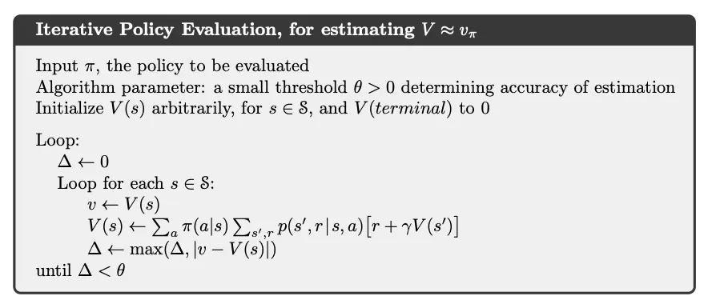

# Chapter 4: Dynamic Programming

动态规划指的是在给予环境的完美模型的情况下，可以计算出最优策略的算法。经典的 DP 算法在强化学习中的应用比较有限，一方面是由于其对模型完整性的依赖太强，另一方面是计算量太大。但是 DP 算法仍然具有重要的理论意义，也为本书其余算法提供了重要的基础。

这里我们假设环境是一个有限 MDP，这意味着其状态空间、动作空间和奖励集合都是有限的，且所有动态都通过 $p(s^{\prime}, r \mid s, a)$ 完全给出，显然 $p$ 的集合也是有限的。尽管这里的设置意味着 DP 也可以处理连续状态和动作空间的问题，但只有特殊情况下才可以得到确切的解/Exact Solution。一个方法就是将连续状态和动作空间离散化，然后对有限 MDP 使用 DP 算法，但是这样只会得到近似解。

总的来讲，DP 以及一般的强化学习的核心思想是使用价值函数来结构化并且组织对优秀策略的搜索。在这章内，我们介绍如何使用 DP 算法计算价值函数，一旦我们得到最优的价值函数 $v_*$ 或者动作价值函数 $q_*$，我们就可以很容易地得到最优策略 $\pi_*$。

## 4.1 Policy Evaluation (Prediction)

**策略评估/Evaluation** 或者说**预测/Prediction** 指的是对任意一个策略 $\pi$，计算其价值函数 $v_\pi$。

$$\begin{align}
    v_\pi(s) &= \mathbb{E}_\pi[G_t \mid S_t = s] \\
    &= \mathbb{E}_\pi[R_{t+1} + \gamma G_{t+1} \mid S_t = s] \\
    &= \mathbb{E}_\pi[R_{t+1} + \gamma v_\pi(S_{t+1}) \mid S_t = s] \\
    &= \sum_a \pi(a \mid s) \sum_{s^{\prime}, r} p(s^{\prime}, r \mid s, a) [r + \gamma v_\pi(s^{\prime})]
\end{align}$$

如果环境的动态完全已知，那么上述等式构成一个 $\lvert \mathcal{S} \rvert$ 个未知数的线性方程组，因此可以直接求解，尽管计算非常复杂。对我们来讲，迭代式求解方法是比较适合的，考虑一个近似值函数序列 $v_0, v_1, \ldots$，每一个 $v_k$ 均为 $\mathcal{S}^+ \mapsto \mathbb{R}$ 的函数，初始值 $v_0$ 可以任意选择，然后根据 $v_\pi$ 的贝尔曼方程进行迭代式更新：

$$\begin{align}
    v_{k+1}(s) &\doteq \mathbb{E}_\pi[R_{t+1} + \gamma v_k(S_{t+1}) \mid S_t = s] \\
    &= \sum_a \pi(a \mid s) \sum_{s^{\prime}, r} p(s^{\prime}, r \mid s, a) [r + \gamma v_k(s^{\prime})]
\end{align}$$

显然 $v_\pi$ 是这个迭代规则的不动点。在保证 $v_\pi$ 存在的条件下，序列 $\{v_k\}$ 会收敛到 $v_\pi$。这个算法被称为**迭代策略评估/Iterative Policy Evaluation**。其对每个状态采用相同的操作，描述为：根据给定的策略，得到所有可能的单步转移之后的即时收益和 $s$ 的每一个后继状态的就得价值函数，利用二者的期望值来更新 $s$ 的新的价值函数，这种方法为**期望更新/Expected Update**。

为了用顺序执行的计算机程序来实现迭代策略评估，我们使用两个数组：一个用于存储旧的价值函数 $v_k(s)$，另一个用于存储新的价值函数 $v_{k+1}(s)$。这样，在旧的价值函数不变的情况下，新的价值函数可以一个接一个地被计算出来。或者我们也可以使用一个数组，每次直接用新的价值函数替换旧的价值函数，进而实现就地/In-place 更新。就地更新依然可以收敛到 $v_\pi$，而且一般情况下还收敛更快。我们讲，一次更新是对整个状态空间的一次遍历，对于就地更新算法，遍历的顺序对收敛的速率有着很大的影响。在之后我们讨论 DP 算法时，一般指的是就地更新版本。

迭代策略评估的算法形式化如下：

对于动作价值函数 $q_\pi$，我们也有类似的更新规则：

$$\begin{align}
    q_\pi (s, a) &= \mathbb{E}_\pi [G_t \mid S_t = s, A_t = a] \\
    &= \mathbb{E}_\pi [R_{t+1} + \gamma G_{t+1} \mid S_t = s, A_t = a] \\
    &= \mathbb{E}_\pi [R_{t+1} + \gamma \sum_{s^{\prime}, a^{\prime}} q_\pi(s^{\prime}, a^{\prime}) \pi(a^{\prime} \mid s^{\prime}) \mid S_t = s, A_t = a] \\
    &= \sum_{s^{\prime}, r} p(s^{\prime}, r \mid s, a) [r + \gamma \sum_{a^{\prime}} \pi(a^{\prime} \mid s^{\prime}) q_\pi(s^{\prime}, a^{\prime})]
\end{align}$$

以及

$$
q_{k+1}(s, a) \doteq \sum_{s^{\prime}, r} p(s^{\prime}, r \mid s, a) [r + \gamma \sum_{a^{\prime}} \pi(a^{\prime} \mid s^{\prime}) q_k(s^{\prime}, a^{\prime})]
$$

## 4.2 Policy Improvement

计算一个给定策略之下的价值函数的目的之一，就是为了寻找更好的策略。对于一个确定的策略 $\pi$，我们已经确定其价值函数 $v_\pi$，对于状态 $s$，我们想知道是否应该选择一个不同于给定策略的行动 $a \neq \pi(s)$。如果还是使用现有策略，那么最后的结果就是 $v_\pi(s)$。如果确定性选择一个新的动作 $a \neq \pi(s)$，且之后继续遵循现有的策略 $\pi$，那么最后的结果就是

$$\begin{align}
    q_\pi(s, a) &\doteq \mathbb{E} [R_{t+1} + \gamma v_\pi(S_{t+1}) \mid S_t = s, A_t = a] \\
    &= \sum_{s^{\prime}, r} p(s^{\prime}, r \mid s, a) [r + \gamma v_\pi(s^{\prime})]
\end{align}$$

如果 $q_\pi(s, a) > v_\pi(s)$，那么我们就可以认为选择动作 $a$ 之后继续遵循策略 $\pi$ 比遵循策略 $\pi$ 更好。这就是**策略改进定理/Policy Improvement Theorem** 的一个特例。一般来讲，如果 $\pi$ 和 $\pi'$ 是两个确定性策略，且对于所有状态 $s \in \mathcal{S}$，有

$$
q_\pi(s, \pi^{\prime}(s)) \geq v_\pi(s)
$$

那么就称策略 $\pi^{\prime}$ 相对于策略 $\pi$ 是一样好或者更好，也就是说，对于所有状态 $s \in \mathcal{S}$，有

$$
v_{\pi^{\prime}}(s) \geq v_\pi(s)
$$

这样一定可以得到一样或者更好的期望回报。并且，如果上式是严格不等的，那么期望回报就一定是严格增加的。策略改进定理的想法是很容易理解的。简单证明如下：

$$\begin{align}
    v_\pi(s) &\leq q_\pi(s, \pi^{\prime}(s)) = \mathbb{E}[R_{t+1} + \gamma v_\pi(S_{t+1}) \mid S_t = s, A_t = \pi^{\prime}(s)] \\
    &= \mathbb{E}_{\pi^{\prime}} [R_{t+1} + \gamma v_\pi(S_{t+1}) \mid S_t = s] \\
    &\leq \mathbb{E}_{\pi^{\prime}} [R_{t+1} + \gamma q_\pi(S_{t+1}, \pi^{\prime}(S_{t+1})) \mid S_t = s] \\
    &= \mathbb{E}_{\pi^{\prime}} [R_{t+1} + \gamma \mathbb{E}_{\pi^{\prime}} [R_{t+2} + \gamma v_\pi(S_{t+2}) \mid S_{t+1}] \mid S_t = s] \\
    &= \mathbb{E}_{\pi^{\prime}} [R_{t+1} + \gamma R_{t+2} + \gamma^2 v_\pi(S_{t+2}) \mid S_t = s] \\
    &\ldots \\
    &\leq \mathbb{E}_{\pi^{\prime}} [R_{t+1} + \gamma R_{t+2} + \gamma^2 R_{t+3} + \ldots \mid S_t = s] \\
    &= v_{\pi^{\prime}}(s)
\end{align}$$

所以，改进后的策略 $\pi^{\prime}$ 确实会更好。因此，**给定一个策略以及价值函数，我们可以很容易评估一个状态中某一个特定的动作的改变会产生什么样的后果，自然而然可以延伸到所有的

<!-- 到 ⽬ 前 次 ⽌ 我 们 已 经 看 到 了 ， 给 定 ⼀ 个 策 略 及 其 价 值 函 数 ， 我 们 可 以 很 容 易 评 估 ⼀ 个
状 态 中 某 个 特 定 动 作 的 改 变 会 产 ⽣ 怎 样 的 后 果 。 我 们 可 以 很 ⾃ 然 地 延 伸 到 所 有 的 状 态 和 所
有 可 能 的 动 作 ， 即 在 每 个 状 态 下 根 据 q r （ 8 , a ） 选 择 ⼀ 个 最 优 的 。 换 ⾔ 之 ， 考 虑 ⼀ 个 新 的 贪
⼼ 策 略 ボ 、 満 ⾜
'(s) = argmax q*(s, a)
= argmax E[Ru+1 + yv, (St+1) | S+=s, A+=a]
= a r g m a x p(s', 718,a) [r+non(s)],
(4.9)
这 ⾥ a r g m a x 。 表 ⽰ 能 够 使 得 表 达 式 的 值 最 ⼤ 化 的 a （ 如 果 相 等 则 任 取 ⼀ 个 ） 。 这 个 贪 ⼼ 策
略 采 取 在 短 期 内 看 上 去 最 优 的 动 作 ， 即 根 据 0 向 前 单 步 搜 索 。 这 样 构 造 出 的 贪 ⼼ 策 略
满 ⾜ 策 略 改 进 定 理 的 条 件 （ 见 式 4 . 7 ） ， 所 以 我 们 知 道 它 和 原 策 略 相 ⽐ ⼀ 样 好 ， 甚 ⾄ 更 好 。
这 种 根 据 原 策 略 的 价 值 函 数 执 ⾏ 贪 ⼼ 算 法 ， 来 构 造 ⼀ 个 更 好 策 略 的 过 程 ， 我 们 称 为 策 略
改 进 。
假 设 新 的 贪 ⼼ 策 略 ' 和 原 有 的 策 略 ⼀ 样 好 ， 但 不 是 更 好 。 那 么 ⼀ 定 有 0 = 0 ，
再 通 过 式 （ 4 . 9 ） 我 们 可 以 得 到 ， 对 任 意 s € S
UT (s) = max E[R++1 + YUn (St+1) | S, =s, At=a]
= m a x p(s',r/s,a) [r+ yum(s)].
但 这 和 贝 尔 曼 最 优 ⽅ 程 （ 4 . 1 ） 完 全 相 同 ， 因 此 0 ，
⼀ 定 与 2 、 相 同 ， ⽽ 且 不 与 ’ 均 必 须 为
最 优 策 略 。 因 此 在 除 了 原 策 略 即 为 最 优 策 略 的 情 况 下 ， 策 略 改 进 ⼀ 定 会 给 出 ⼀ 个 更 优 的
结 果 。
到 ⽬ 前 为 ⽌ ， 我 们 考 虑 的 都 是 ⼀ 种 特 情 况 ， 即 确 定 性 策 略 。
⼀ 般 来 说 ，
⼀ 个 随 机 策
略 指 定 了 在 状 态 s 采 取 a 的 概 率 r （ a l s ） 。 我 们 不 会 再 对 此 做 详 细 说 明 ， 但 事 实 上 本 节
的 ⽅ 法 可 以 很 容 易 地 扩 展 到 随 机 策 略 中 。 特 别 地 ， 策 略 改 进 定 理 在 随 机 策 略 的 情 况 下 也 是
成 ⽴ 的 。 另 外 ， 在 类 似 式 （ 4 . 9 ） 的 策 略 改 进 步 骤 中 如 果 出 现 了 相 等 的 情 况 ， 即 有 多 个 动 作
都 可 以 得 到 最 ⼤ 值 ， 那 么 在 随 机 情 况 下 我 们 不 需 要 从 中 选 取 ⼀ 个 。 相 反 ， 在 新 的 贪 ⼼ 策 略
中 ， 每 ⼀ 个 最 优 的 动 作 都 能 以 ⼀ 定 概 率 被 选 中 。 这 只 要 满 ⾜ 所 有 其 他 ⾮ 最 优 动 作 的 概 率 和
为 零 即 可 。
图 4 . 1 的 最 后 ⼀ ⾏ 展 ⽰ 了 随 机 策 略 的 策 略 改 进 。 这 ⾥ 初 始 的 策 略 ⽰ 为 等 概 率 随 机 策
略 ， 新 策 略 ’ 是 相 对 于 0 - 的 贪 ⼼ 策 略 。 价 值 函 数 0 . 的 值 显 ⽰ 在 了 左 下 图 中 ， ⽽ ' 的 -->

## 4.3 Policy Iteration

## 4.4 Value Iteration

## 4.5 Asynchronous Dynamic Programming

## 4.6 Generalized Policy Iteration

## 4.7 Efficiency of Dynamic Programming

