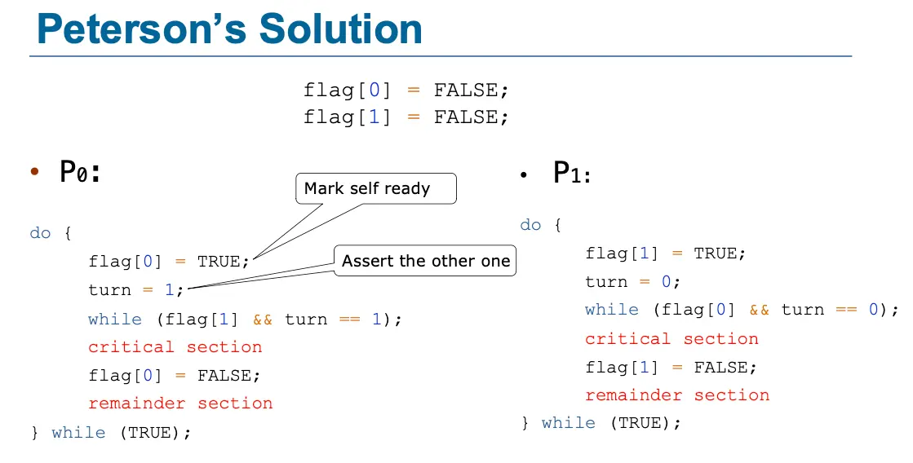
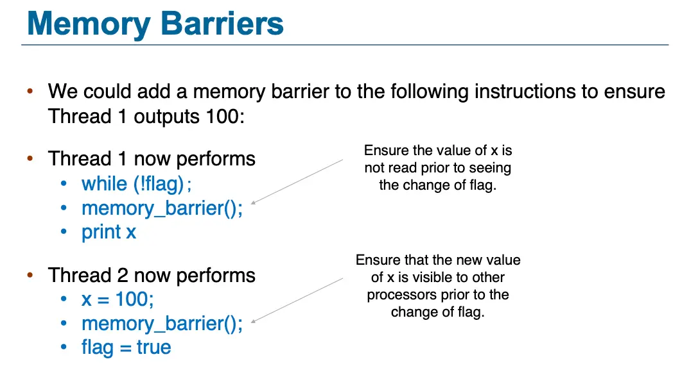
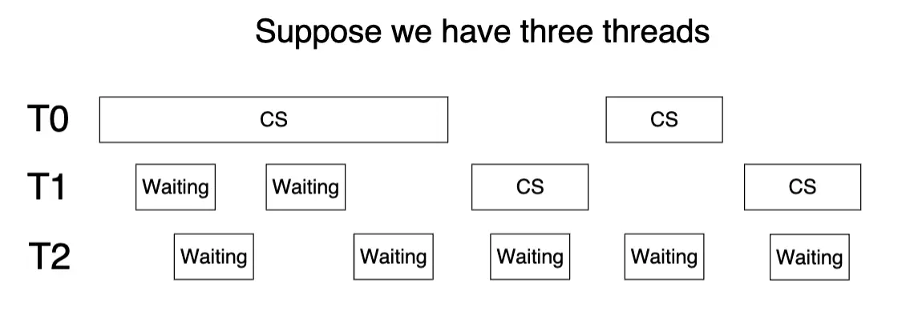
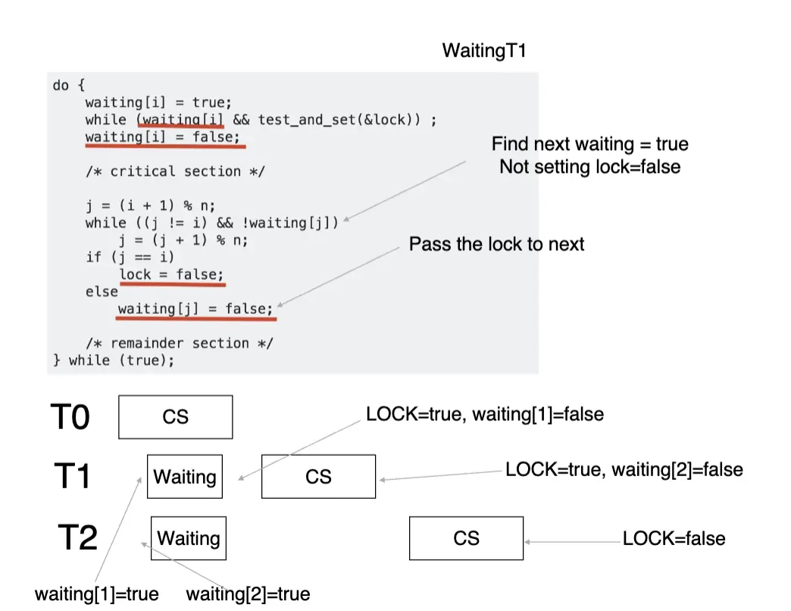
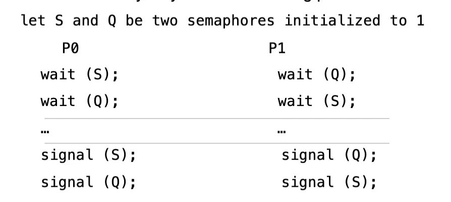
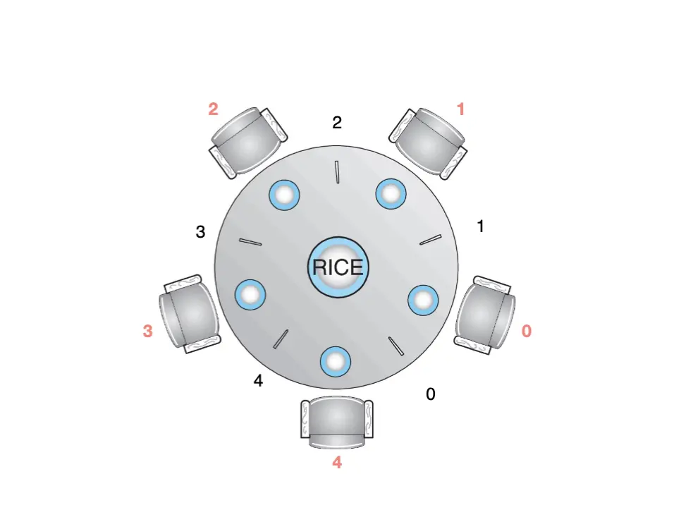

# Synchronization

!!! Abstract "Outline"

    - [x] 为什么我们需要同步：[竞争条件和临界区问题](#_1)
    - [x] 简单的同步解决：[Peterson 方案](#peterson)
    - [x] 硬件同步支持：[单处理器、内存屏障、硬件指令](#_2)
    - [x] 互斥锁与信号量：[Mutex Locks and Semaphores](#mutex-locks)
    - [x] 信号量与锁在解决同步问题的应用：[Applications of Semaphores and Locks](#_3)

## 竞争条件与临界区问题

并发或并行执行会影响多个进程共享数据的完整性。举一个有界缓冲区的例子：

这是由于生产者进程和消费者进程并发执行语句 `count++` 和 `count--`，虽然在 C 语言中看来，这是一个原子操作，但是在汇编层面看来，这其实是三条指令：

```asm
load R1, count
operate R1, 1
store R1, count
```

这三条指令并不是原子的，这六条指令甚至可以以几乎任意的顺序执行，导致 `count` 的值可以为 4、5、6 这三个值之一（若原来的值为 5），但显然只有 5 这个值是正确的。

这种**多个进程并发访问和操作同一数据并且执行结果与特定访问顺序有关**的情况被称为**竞争条件/Race Condition**。为了防止竞争条件，需要确保一次只有一个进程可以操作变量 `count`，为了实现这个目的，我们需要进程按照一定方式进行同步。

我们将多个进程并发访问同一数据这个问题抽象成**临界区/Critical Section** 问题，临界区是每个进程中访问至少一个与其他进程共享的数据的代码，具有临界区问题的系统具有以下特征：当一个进程在临界区内执行的时候，其他进程不允许进入其临界区。也就是说，没有两个进程可以在它们各自的临界区内同时执行。

**临界区问题/Critical Section Problem** 的目标是设计一个协议，使得多个进程可以并发执行且通过合作共享数据。在进入临界区之前，每一个进程应该请求许可，这段代码称为**进入区/Entry Section**。在进入临界区之后，进程应该执行临界区代码，在退出临界区的时候，进程可能根据协议完成特定的操作，这段代码称为**退出区/Exit Section**。退出区之后，进程可以执行其他代码，这段代码称为**剩余区/Remainder Section**。

解决临界区问题的方法必须满足下面三条要求：

1. Mutual Exclusion/互斥访问：在同一时刻，只有一个进程可以执行临界区；
2. Progress/空闲让进：当没有线程在执行临界区代码时，必须在申请进入临界区的线程中选择一个线程，允许其执行临界区代码，保证程序执行的进展；
3. Bounded Waiting/有限等待：当一个进程申请进入临界区后，必须在有限的时间内获得许可并进入临界区，不能无限等待。

## Peterson 方案

Peterson 方案对两个进程的情况给出了一个简单的解决方案，它有下面假设与要求：

- 假设 `LOAD` 指令和 `STORE` 指令是原子的；
- 所有指令被顺序执行，不存在指令重排序；
- 要求两个进程共享下面变量：一个整型 `turn`，指示哪个进程可以进入临界区，比如 `turn = 0` 表示进程 0 可以进入临界区；以及一个布尔变量 `flag[2]`，表示进程是否想要进入临界区，比如 `flag[0] = true` 表示进程 0 想要进入临界区。

算法形式化如下：



可以自行证明 Peterson 方案满足临界区问题的三条要求，这里不多赘述。

尽管 Peterson 方案确实是一个经典且有用的算法，但是不能保证其适用于现代的计算机体系结构，这主要出于 Peterson 方案的要求：正如 [Computer Architecture: Instruction Level Parallelism](../CAQA/3%20ILP.md) 内所讲，为了提升性能，现代的编译器和处理器会对指令进行重排序，对于单线程应用而言，这样的重排序不会影响程序的正确性，但是对于多线程应用而言，这样的重排序就很可能导致不一致性或者错误。

## 硬件同步支持

### 1. 单处理器：禁止中断

在单处理器上，我们可以通过禁用中断来防止当前运行的代码被抢占。然而，这种方法在多处理器系统上通常效率太低，因为需要禁用所有核心上的所有中断，这过于低效，且其他核心可能仍然会访问临界区，无法实现互斥。因此，使用这种方法的操作系统不具备可扩展性。

### 2. 内存屏障

> How a computer architecture determines what memory guarantees it will provide to an application program is known as its **memory model**.

计算机体系结构确定基于应用程序哪些内存的模型就是内存模型，这部分可以参考 [Computer Architecture: Thread Level Parallelism](../CAQA/5%20TLP.md) 内对缓存一致性以及存储器一致性的介绍。在操作系统的角度下可以分为下面两类：

- 强排序/Strongly Ordered：一个处理器的内存修改对所有其他处理器立即可见；
- 弱排序/Weakly Ordered：一个处理器的内存修改可能不对所有其他处理器立即可见。

内存模型因处理器的类型而异，具体还可能和缓存设计相关，相对比较硬件，因此操作系统内核开发人员无法对共享内存多处理器上内存修改的可见性做任何假设。为了解决这个问题，计算机体系结构提供了可以**强制**将内存中的任何修改传播到所有其他处理器的指令，从而确保内存修改对其他处理器上的运行线程可见。这类指令被称为**内存屏障/Memory Barrier** 或者**内存栅栏/Memory Fence**。

当执行内存屏障指令的时候，系统确保在任何执行后续加载或者存储操作之前，完成所有加载和存储，这样，即使指令被重排序，内存屏障也能确保存储操作在内存之中完成，并且在未来的加载或存储操作执行之前，对其他处理器可见。



x86 系统提供读内存屏障和写内存屏障：

- 写内存屏障/Store Memory Barrier：在指令后插入 Store Barrier，能让写入缓存中最新数据更新写入内存中，让其他线程可见。强制写入内存，这种显示调用，不会让 CPU 去进行指令重排序。
- 读内存屏障/Load Memory Barrier：在指令后插入 Load Barrier，可以让高速缓存中的数据失效，强制重新从内存中加载数据。也是不会让 CPU 去进行指令重排。

### 3. 硬件指令

很多现代操作系统提供特殊硬件指令，用于检测和修改字的内容，或者作为**不可中断的指令 *原子地/Atomically/Uninterruptably* 交换两个字**，我们可以通过使用这些特殊指令，相对简单地解决临界区问题。这里使用指令 `test_and_set()` 和 `compare_and_swap()` 抽象了这些指令背后的主要概念。

`test_and_set()` 可以按照下面的代码来理解其功能：返回 `target` 的值，并将其修改成 `true`。

```C
bool test_and_set(bool *target) {
    bool rv = *target;
    *target = true;
    return rv;
}
```

可以利用 `test_and_set()` 来实现互斥：

```C
do {
    // Entry section
    while (test_and_set(&lock))
        ;   // Do nothing
    // Critical section
    // Exit section
    lock = false;
    // Remainder section
} while (true);
```

如果在 Entry Section 的时候，`lock` 已经被设置为 `true`，那么 `test_and_set()` 就会返回 `true`，并且将 `lock` 的值保持 `true` 不变，这样就会一直循环等待。直到 `lock` 被设置为 `false`，`test_and_set()` 返回 `false`，并且顺手将 `lock` 设置为 `true`，进入临界区，不让别的线程进入。之后退出临界区，将 `lock` 设置为 `false`，让别的线程进入。

倘若某个时刻 `lock` 为 `false`，很可能有不止一个线程调用了 `test_and_set()`，但是由于 `test_and_set()` 是原子的，所以只可能有一个线程返回 `false`。

但是 `test_and_set()` 并不能确保有限等待，下面就是一个例子：



谁也不知道 T2 会等到哪里去（这取决于调度），我们可以这样修改代码，这里共用的数据结构是 `#!C bool waiting[n]` 和 `#!C int lock`：

```C
do {
    waiting[i] = true;
    while (waiting[i] && test_and_set(&lock)) ;
    waiting[i] = false;

    // Critical section
    // Exit section
    j = (i + 1) % n;
    while ((j != i) && !waiting[j])
        j = (j + 1) % n;
    if (j == i)
        lock = false;
    else
        waiting[j] = false;

    // Remainder section
} while (true);
```

我们首先将 `waiting[i]` 置为 `true`，然后检查 `lock`，如果 `waiting[i]` 被释放**或者** `lock` 为 `false`，那么就进入临界区，同时上锁（第 3 行）。在退出临界区的时候，我们向下检查后面的线程，寻找下一个正在等待的线程（第 8 到 10 行），若是没有找到（`j == i`），那么就释放锁，这是因为没有线程在等待（第 11 行和第 12 行）；否则，就将 `waiting[j]` 置为 `false`，释放该线程，继续循环，让其进入临界区（第 14 行）。

???- Info "Illustration of Bounded Waiting for Test-and-Set Lock"
    

`compare_and_swap()` 也是以原子的方式对两个字进行操作，但是是使用基于交换两个字的内容的机制：

```C
int compare_and_swap(int *value, int expected, int new_value) {
    int temp = *value;
    if (*value == expected)
        *value = new_value;
    return temp;
}
```

只有当 `*value` 的值等于 `expected` 的时候，才会将 `*value` 设置为 `new_value`，并且返回 `*value` 的原始值。

互斥的实现也是类似的，但是这里 `#!C compare_and_swap(&lock, 0, 1)` 和 `#!C test_and_set(&lock)` 的逻辑是反的，需要注意一下，但是两条指令**并没有本质区别**。

```C
while (true) {
    while (compare_and_swap(&lock, 0, 1) != 0)
        ;   // Do nothing
    // Critical section
    // Exit section
    lock = 0;
    // Remainder section
}
```

加上有限等待的实现，这里共用的数据结构是 `#!C bool waiting[n]` 和 `#!C int lock`：

```C
while (true) {
    waiting[i] = true;
    key = 1;
    while (waiting[i] && key == 1) 
        key = compare_and_swap(&lock, 0, 1);
    waiting[i] = false;

    // Critical section
    // Exit section
    j = (i + 1) % n;
    while ((j != i) && !waiting[j])
        j = (j + 1) % n;
    if (j == i)
        lock = 0;
    else
        waiting[j] = false;

    // Remainder section
}
```

x86 实现了 `cmpxchg` 这个指令，可以实现 `compare_and_swap()` 的功能，为了强制执行原子执行，可以使用 `lock` 前缀，使得在目标操作数更新的时候**锁定总线**。汇编的一般形式是 `#!asm lock cmpxchg <destination operand>, <source operand>`。ARM 也有类似的指令。

### 4. 原子变量

通常，指令 `compare_and_swap()` 并不直接用来实现互斥，而是作为实现别的工具的基本构建块。原子变量可以提供对基本数据类型的原子操作。有界缓冲区问题可以通过实现对整型变量的原子递增递减来解决：

```C
void increment(atomic_int *v) {
    int temp;
    do {
        temp = *v;
    } while (temp != compare_and_swap(v, temp, temp + 1));
}
```

我们不断地读取 `v` 的值，直到 `compare_and_swap()` 成功，这就保证了 `temp + 1` 的值确实是 `*v + 1`，也就是说递增操作正确。

## 互斥锁/Mutex Locks

上面提到的解决方案不但复杂，而且还很难被程序员使用。最简单的高层软件工具就是**互斥锁/Mutex Locks**，我们使用互斥锁保护临界区并且防止竞争条件。一个进程在进入临界区之前必须**申请/Acquire** 锁，退出临界区的时候必须**释放/Release** 锁。

```C
while (true) {
    acquire();
    // Critical section
    release();
    // Remainder section
}
```

每个互斥锁都有一个布尔变量 `available`，这个值表明这个锁是否可用，如果锁可用，调用 `acquire()` 就会成功，并将 `available` 设置为 `false`。如果一个进程尝试获取不可用的锁，那么这个进程就会**被阻塞**，直到锁可用。

另外，我们要求调用 `acquire()` 和 `release()` 都必须是原子的，这一般通过硬件的原子指令来实现，我们将使用 `compare_and_swap()` 来实现这两个函数。

```C
void acquire() {
    while (compare_and_swap(&available, 1, 0) != 1)
    // equal to compare_and_swap(&available, 0, 1)
        ;   // Do nothing, busy waiting
}

void acquire_naive() {
    while (available == 0)
        ;   // Do nothing, busy waiting
    available = 0;
}

void release() {
    available = 0;
}
```

这里的 `compare_and_swap(&available, 1, 0)` 会返回 `available` 的原始值，如果 `available` 的值为 `1`（可用），那么就将其设置为 `0`，并且返回 `1`，这样就可以进入临界区。如果 `available` 的值为 `0`（不可用），那么就会一直循环等待，直到 `available` 的值为 `1`。

我们这里实现的锁也被称为**自旋锁/Spinlock**，因为进程在等待锁可用的时候会一直自旋。自旋锁的缺点是需要**忙等待/Busy Waiting**，忙等待的时间是从申请锁到释放锁的时间。当有一个进程在临界区的时候，任何其他进程在进入临界区的时候必须要连续循环调用 `acquire()`。考虑有 N 个线程使用一个 CPU 的情况：只有一个线程可以进入临界区，其他 N - 1 个线程即使被分配到了 CPU，但都在自旋等待，这样会浪费大约 N-1/N 的 CPU 时间。

在保持互斥锁的结构不变的情况下，我们可以减少忙等待，只需要让别的等待的线程释放 CPU 就好了：

```C
void acquire() {
    while (compare_and_swap(&available, 1, 0) != 1)
        yield(); // give up CPU
}
```

实现方法：添加一个队列，当别的线程发现锁是不可用的时候，将这个线程的进程状态调到 SLEEP，将其加到这个队列中，并且调用 `schedule()` 函数。

自旋锁被认为当**锁定时间很短**的时候，多处理器系统锁定机制的首选。

锁要么是**争用的/Contended**，要么是**非争用的/Uncontended**。如果线程在尝试获取锁的时候被阻塞，那么认为这个锁是争用的；如果线程在尝试获取锁的时候有可用锁，那么认为这个锁是非争用的。争用锁可以遇到**高争用/High Contention**（相对大量的线程尝试获取锁）或者**低争用/Low Contention**（尝试获取锁的线程很少）。一般高争用的锁会降低并发程序的整体性能。

> "Contended" describes a lock that different threads are trying to acquire at the same time, "Heavily-contended" if numerous threads are all trying to acquire the same lock, "uncontended" describing cases where a thread doesn't have any competition to acquire a lock.

从后面的案例来看，互斥锁实现了对被保护资源的互斥/原子访问。

## 信号量/Semaphores

> Dijkstra 提出来的。

### 1. 定义与使用案例

互斥锁被认为是最简单的同步工具，信号量提供了一种更复杂/强大的同步工具。**信号量/Semaphore** 包含着一个整型变量，除了初始化之外，这个整型变量只可以被两个**原子操作** `wait()` 和 `signal()` 访问。

可以通过下面的方式定义 `wait()` 和 `signal()`：

```C
void wait(int s) {
    while (s <= 0)
        ;   // Do nothing, busy waiting
    s--;
}

void signal(int s) {
    s++;
}
```

信号量分为**二进制信号量/Binary Semaphores**和**计数信号量/Counting Semaphores**。二进制信号量的值只能是 0 或者 1，最类似于互斥锁，在没有互斥锁的系统上，可以使用二进制信号量来提供互斥。计数信号量的值不受限值，可以用于控制访问拥有多个实例的某种资源，信号量的初始值可以作为可用资源的数量，当该进程需要资源的时候，就会调用 `wait()`，当资源被释放的时候，就会调用 `signal()`。

考虑下面的并发问题：有两个并发进程，`P1` 需要执行语句 `S1`，`P2` 需要执行语句 `S2`，但是要求只有在 `S1` 执行之后才能执行 `S2`。我们创建信号量 `sem` 并且将其初始化为 `0`。`P1` 执行 `S1` 之后调用 `signal(sem)`，`P2` 在执行 `S2` 之前调用 `wait(sem)`。这样就可以保证 `S2` 在 `S1` 之后执行。

> Can implement a counting semaphore as a binary semaphore.

这样的信号量其实也具有忙等待的问题，我们可以通过这样的想法来修改 `wait()` 和 `signal()` 的定义：当一个进行执行操作 `wait()` 并且发现信号量的值不为正值的时候，就必须等待；然而，这个进程不是忙等待而是阻塞自己，将这个进程放到与信号量相关的进程队列中，并且将该进程状态切换成等待状态，然后调用 `schedule()`。

这样我们就修改信号量的数据结构，添加一个**等待队列**，并且修改 `wait()` 和 `signal()` 的定义：

```C
typedef struct {
    int value;
    struct process *wating_queue;
} semaphore;

void wait (semaphore *s) {
    s->value--;
    if (s->value < 0) {
        add_to_list(s->wating_queue, current_process);
        block();
    }
}

void signal (semaphore *s) {
    s->value++;
    if (s->value <= 0) {
        process *p = remove_from_list(s->wating_queue);
        wakeup(p);
    }
}
```

这里的实现其实也可以看出**为什么我们需要将 `wait()` 和 `signal()` 实现成原子操作**，因为这两个操作都会修改信号量的值，若是很多个进程同时调用 `wait()` 和 `signal()`，那么就会出现竞争条件。实现方法其实也很直接，使用互斥锁就可以。 

这里的 `block()` 操作将调用 `wait()` 的进程放在合适的等待队列中；`wakeup()` 操作将等待队列中的一个合适的进程移动到就绪队列中。下面是一个 demo 程序，可以看到虽然有 `while (true)` 循环，但是几乎没有忙等待了，只在 `wait()` 和 `signal()` 的时候才会有少量的忙等待：

```C
semaphore sem = {1, NULL};
do {
    wait(sem);      // have busy waiting
    // Critical section, with no busy waiting
    signal(sem);    // have busy waiting
    // Remainder section
} while (true);
```

???- Info "课上的例子"

    ```C
    typedef struct __lock_t {
        int flag;   // i.e. value
        int guard;  // i.e. spinlock
        queue_t *q;
    } lock_t;

    void lock_init(lock_t *m) {
        m->flag = 0;
        m->guard = 0;
        queue_init(m->q);
    }

    void lock(lock_t *m) {
        while (TestAndSet(&m->guard, 1) == 1)
            ;   // Acquire guard lock by spinning
        if (m->flag == 0) {
            m->flag = 1;
            m->guard = 0;   // release the spinlock
        } else {
            queue_add(m->q, gettid());
            m->guard = 0;
            park();    // Block until awaken and park() is schedule() indeed
        }
    }

    void unlock(lock_t *m) {
        while (TestAndSet(&m->guard, 1) == 1)
            ;   // Acquire guard lock by spinning
        if (queue_empty(m->q))
            m->flag = 0;
        else
            unpark(queue_remove(m->q));
        m->guard = 0;
    }
    ```

    简单解释一下这段代码实现的锁的功能：
    
    - `guard` 其实是一个互斥锁，用来保护 `flag` 的访问，若是其为 1 表示当前互斥锁没被占用，允许进程访问 `flag`，同时访问的时候会将 `guard` 设置为 `1`，防止其他进程访问 `flag`；
    - `flag` 为 0 表示锁是可用的。当一个进程调用 `lock()` 的时候，若通过互斥锁且发现 `flag` 为 0，就将 `flag` 设置为 1，释放互斥锁，`lock()` 返回，进程进入临界区；若是 `flag` 为 1，就将进程加入等待队列，然后调用 `park()`，进程被阻塞，安心睡去。
    - 若是一个进程完成临界区的执行，调用 `unlock()`，如果队列为空，那么就将 `flag` 设置为 0，期待下一个进程调用 `lock()，释放互斥锁，`unlock()` 返回` 使用锁；如果队列不为空，那么就将队列中的一个进程唤醒，然后操作互斥锁 。

    这个程序的 21 行和 22 行不能互换，倘若互换了，就会出现下面的情况：某个进程执行到 `park()`，被调度后安心 `sleep()`，但是这时互斥锁 `guard` 还是 1，其他进程就一直会停在第 14 行，这样持锁 sleep，就也会出现 Infinite Blocking。 

另外，当临界区长度较短的时候，使用互斥锁比使用信号量更佳高效。具体而言，当临界区的长度小于线程切换的消耗时，临界区长度一定就是短的，这时候使用互斥锁更好。

### 2. 饥饿与死锁

使用信号量的系统也有可能遇见死锁：两个或多个线程各自在无穷等待别的正在等待的进程持有的资源/产生的事件。下面是一个简单的例子：



`P1` 持有 `S` 等待 `Q`，`P2` 持有 `Q` 等待 `S`。

使用信号量的系统也有可能遇见饥饿：无限期的阻塞/Indefinite Blocking，具体而言就是一个进程很可能永远不会从信号量的等待队列中取出。

死锁一定会导致饥饿，但是饥饿不一定会导致死锁。

### 3. 优先级反转/Priority Inversion

考虑有三个优先级不同的进程 `P_H`、`P_M` 和 `P_L`，`P_M` 持有资源 `R`，`P_H` 和 `P_L` 都在等待 `R`。这时候哪个进程都没法执行：虽然 `P_H` 优先级最高，但是由于 `P_M` 持有 `R`，`P_H` 会被阻塞，需要一直等待锁；`P_L` 当然是不配拥有 `R` 的，因为其优先级最低，需要等待 `P_M` 释放 `R` 且 `P_H` 执行完；`P_M` 也不能执行，因为其优先级在 `P_H` 和 `P_L` 之间，轮不到它拥有 CPU，因此一直不能释放 `R`。

这就产生了优先级反转：一个高优先级的进程**间接地**被一个低优先级的进程抢占。解决方法是**优先级继承/Priority Inheritance**：当一个低优先级的进程持有一个高优先级的进程需要的资源的时候，操作系统会将低优先级的进程的优先级提升到高优先级的进程的优先级，直到低优先级的进程释放资源。

## 经典同步案例

### 1. Bounded-Buffer Problem

**问题**：两个进程，一个是生产者/Producer，另一个是消费者/Consumer，它们共享 n 个缓冲区，生产者生成数据并且放进缓冲区，消费者通过从缓冲区取出数据使用数据。我们的目标是保证生产者不会向满的缓冲区中放数据，消费者不会从空的缓冲区中取数据。

**解决方法**：

- 定义信号量 `mutex` 并将其初始化为 1，这是为了保护对缓冲区的原子访问；
- 定义信号量 `full_slots` 并将其初始化为 0；
- 定义信号量 `empty_slots` 并将其初始化为 n；
- 生产者进程：

    ```C
    do {
        // produce an item
        wait(empty_slots);
        wait(mutex);
        // add the item to the buffer
        signal(mutex);
        signal(full_slots);
    } while (true);
    ```

- 消费者进程：

    ```C
    do {
        wait(full_slots);
        wait(mutex);
        // remove an item from buffer
        signal(mutex);
        signal(empty_slots);
    } while(true);
    ```

无论如何，都需要在向缓冲区读写之前调用 `wait(mutex)`，在读写之后调用 `signal(mutex)`，这是为了保证对缓冲区的原子访问，具体原因可以看最开头的讨论。

其次，在 `wait(empty_slots)` 和 `wait(full_slots)` 之后的对 `mutex` 的操作不能调到外边，这是由于 `empty_slots` 和 `full_slots` 是带有队列的信号量，当 `empty_slots` 变成空的之后的 `wait()` 会令当前进程进入等待队列，这也就形成了带锁 sleep 的情况。这其实也很自然，我们总是需要先知会操作系统和别的线程：我们要向缓冲区写入数据了！如果不能写，那就等到可以写，如果可以写，那就先拿到互斥锁再往缓冲区写。

### 2. Readers-Writers Problem

**问题**：一个数据集被一些并发的进程共同使用，这些进程分为读进程/Readers 和写进程/Writers。读进程只是读取数据，并不更新数据，但是写进程可以读和写。Readers-Writers Problem 的目标是保证：

- 允许多个读进程同时读数据：Shared Access；
- 但是只允许一个写进程**访问**共享的数据（要么写进程不访问数据，要么只有一个写进程访问数据）：Exclusive Access。

**解决方法**：

- 定义信号量 `mutex` 并将其初始化为 1，这是为了保护对 `read_count` 的互斥访问；
- 定义信号量 `write` 并将其初始化为 1，这是为了控制写进程的访问；
- 定义整型变量 `read_count` 并将其初始化为 0，通过 `read_count` 的值来判断有多少进程正在读数据，并且控制写进程的访问；
- 写进程：

    ```C
    do {
        wait(write);
        // writing data
        signal(write);
    } while (true);
    ```

- 读进程：

    ```C
    do {
        wait(mutex);
        read_count++;
        if (read_count == 1)    // first reader
            wait(write);        // block writers
        signal(mutex);

        // reading data

        wait(mutex);
        read_count--;
        if (read_count == 0)    // no reader reads the data
            signal(write);      // release the lock, let writers
        signal(mutex);
    } while (true);
    ```

变种问题：

- **Reader First**：我们解决的就是 Reader First 的问题，即读进程优先于写进程。也就是除非写进程正在跟新数据，否则没有读进程等待；若是读进程正在读数据，写进程被阻塞但不影响别的读进程读数据。
- **Writer First**：若是写进程准备好写入数据，其将立即执行写操作；若是数据被某个读进程持有，新来的读进程必须等待，直到被当前读进程阻塞的写进程完成写操作。

两种变种都会存在饥饿的问题，假设我们还是对原来的描述处理（也就是对 Reader First 的处理），若是有一个写进程在写数据/临界区，剩下 n 个读进程就只能在等待，其中一个进程在 `wait(write)`，剩下 n - 1 个进程在 `wait(mutex)`，这样就会出现饥饿的问题。因此就会有更多的变种问题，在此不多叙述。

申老师的课上有这样的问题：若是读进程在读数据的时候被中断然后调度了，那该是什么情况？但其实不需要担心这个问题，既然都有读进程开始读数据了，那么就意味着上面的第 5 行已经被执行了，那么后续的写进程就一定会被阻塞/或者被加到信号量 `write` 的 `waiting_queue` 中，写进程是 Ready 状态，根本不被调度，而读进程就算被调度也不会影响整个问题的正确性，所以不必担心。

### 3. Dining-Philosophers Problem

> 还是 Dijkstra 提出来的。

哲学家们围坐在一个圆桌旁边，他们只干两件事情，一件事是思考，另一件事就是干饭。但是哲学家们都互不干扰。每两个哲学家中间有一根筷子，哲学家们偶尔会拿起筷子吃饭，一次拿一根筷子，只有同时两根亏阿兹在手上才能吃饭，吃完了之后会将两根筷子逐一放下。



哲学家吃饭问题是一个经典的多资源同步问题。一个朴素的解法是：

```C
vector<semaphore> chopstick(5, 1);  // initialize semaphores to all 1

philosopher(int i) {
    do {
        wait(chopstick[i]);
        wait(chopstick[(i + 1) % 5]);
        eat();
        signal(chopstick[i]);
        signal(chopstick[(i + 1) % 5]);
        think();
    } while (true);
}
```

但是这个算法会出现死锁的情况：可能某时刻每个人同时拿起左边的筷子，这就炸缸了。一种直接的方法是：只允许同时拿起两根筷子，也就是轮流询问每个人是否能够拿起两根筷子，如果能则拿起，如果不能则需要等待那些筷子放下。这在上面的第 5 行和第 6 行上下加一个互斥锁就可以了。

令一个巧妙的方法是：让奇数号的哲学家先拿左边的筷子，再拿右边的筷子；让偶数号的哲学家先拿右边的筷子，再拿左边的筷子，这样就不会出现死锁的情况。

还有一种破坏问题的方法：踢走一个哲学家，只允许 4 个哲学家同时坐在桌子旁边。
