# Main Memory

!!! Abstract "Outline"

## 背景：内存

一个典型的指令执行周期首先从内存中读取指令，接着这条指令会被解码，也可能从内存中读取操作数

## Partition

### 1. Simplest Implementation

- 每个进程有自己的 base 和 limit 寄存器，每次进程切换时，OS 都会将 base 和 limit 寄存器的值更新为当前进程的值。
- 加载 Base Register 和 Limit Register 的指令必须是特权指令。
- 内置安全、执行快、上下文切换迅速，只需要更新 Base Register 和 Limit Register 的值、程序加载的时候不需要 Relocation。

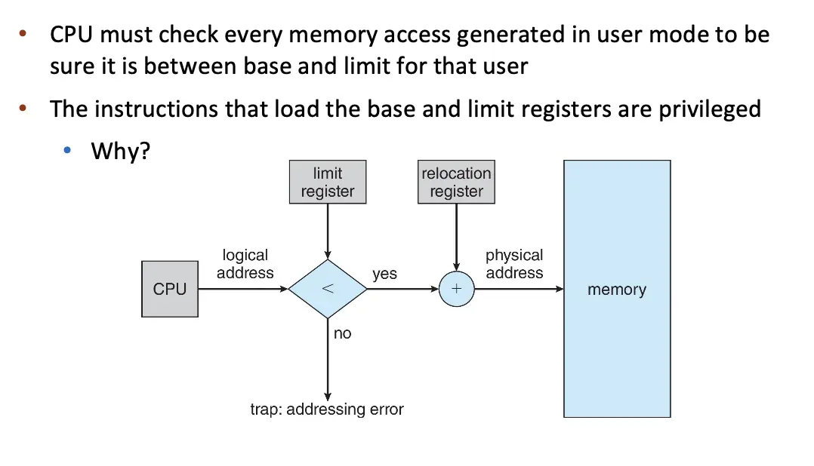

### 2. Fixed Partition

- 除了 OS，将内存分成相等大小的块，多道程序的度就是分割的块数；
- 每一个块都要放一个程序，所以每个进程的内存大小不能超过一个块的大小；
- 但是会引起 Internal Fragmentation，因为每个进程的内存大小不能超过一个块的大小，所以在块内会有一些内存空间被浪费。
- Size 太大，内部空间浪费太多；Size 太小又放不下。

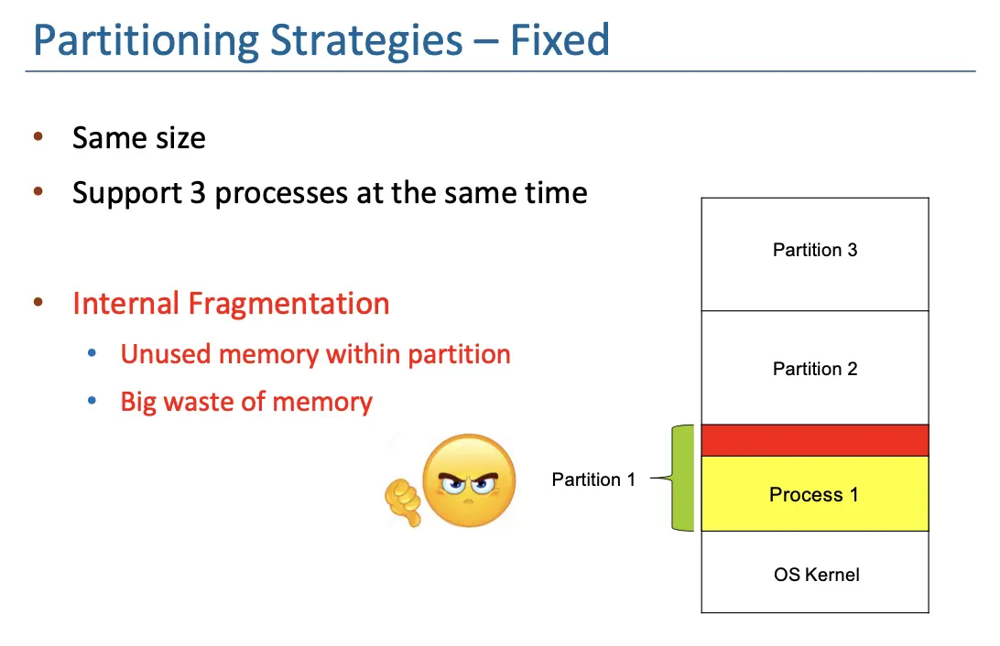

### 3. Variable Partition

- 分出来的内存长度可以不一致，内存管理问题更复杂，需要数据结构来跟踪空闲和已使用的内存；
- 新进程分配内存的时候，从空闲空间中找到一个足够大的 Hole 放进去，所谓 Hole 就是内存中空闲的内存块，不同大小的 Hole 分布在内存中；
- 虽然没有内部碎片，但是会引起 External Fragmentation，在 Partition 之间会存在无法被任何进程使用的不连续的空闲空间。
- 至于分配到哪一个 Hole 里边，有很多算法，比如 First-Fit、Best-Fit、Worst-Fit。

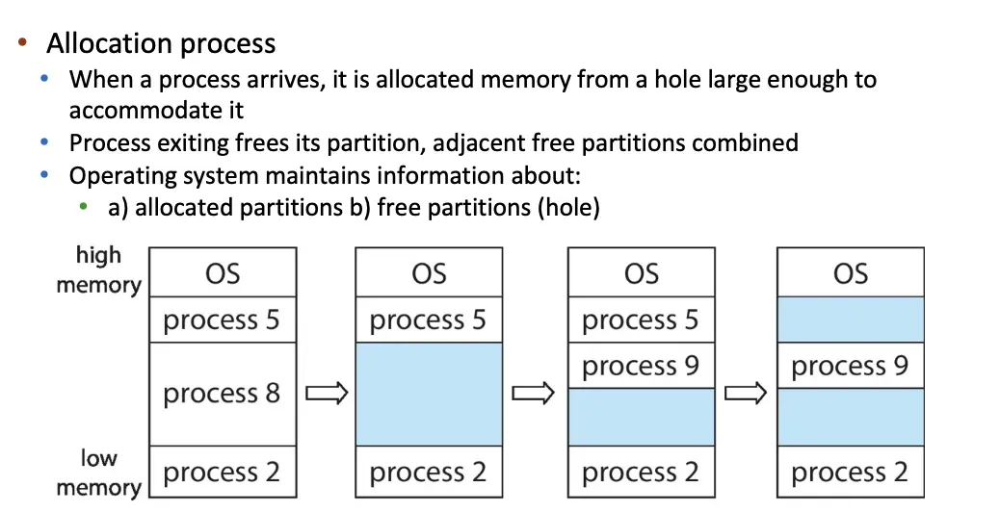

## Segmentation

### 1. 基本方法

回忆：ELF 分成不同的 Section：注意这里 `.data` 和 `.bss` 都是对于全局变量来讲的，对于局部变量，在栈上分配。

Segmentation 机制参考了这部分实现，我们将程序分为一系列的段，每个段可以看作是一个 Variable Partition，每个段都有其名称和长度。构造一个 Segment Table 保存每个段的 Base Address 和 Limit，逻辑地址定义为 `<segment-number, offset>`，根据 number 在 table 里找到对应的 base 和 limit，然后加上 offset 就得到了真正的物理地址。

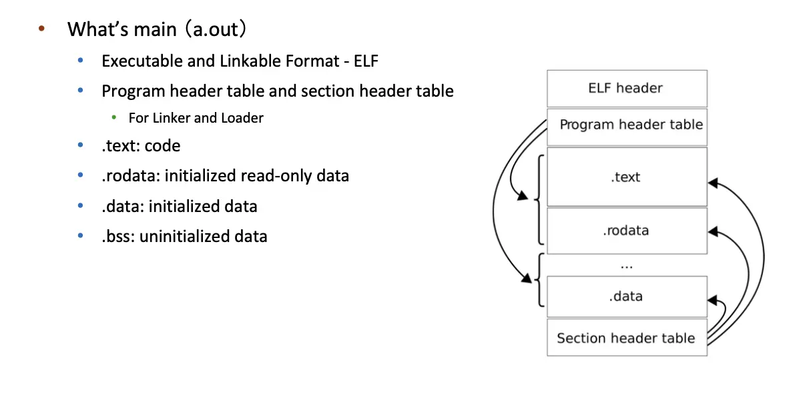

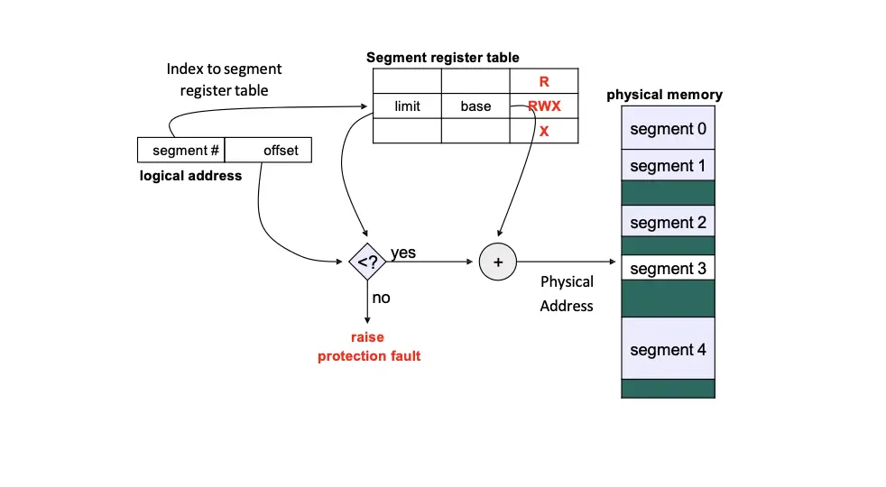

每一个进程都有自己的 Segment Table，否则就会互相访问。进程切换除了切换 PCB 还需要切换 Segment Table，通过切换其 Segment Base Register 来实现。这里的 MMU 也可能加入权限检查。

优点是添加硬件很少，在 Unix 很普遍实现，Intel 和 Linux 都支持。但是由于使用了 Variable Partition，所以没有 Internal Fragmentation，但是会引起 External Fragmentation，在 Segment 之间会存在无法被任何进程使用的不连续的空闲空间。

### 2. Address Binding & Address Definition

- 在程序的不同阶段，地址有不同的表现形式：
    - 源代码阶段的地址一般是符号化的，比如变量名；
    - 编译阶段的地址是相对地址，比如 `14 bytes from beginning of this module`；
    - 链接阶段的地址是绝对地址，比如 `0x1000`。
- 地址绑定出现在三个阶段：
    - 编译时：如果事先知道内存位置，可以生成绝对代码；但如果起始地址变了，必须重新编译。
    - 加载时：如果在编译时不知道内存位置，必须生成可重定位代码，加载时再确定地址。
    - 运行时：如果程序在运行过程中可能会从一个内存区域移动到另一个，需要等运行时再绑定地址，但是这样必须有对应的硬件支持，比如 Base Register 和 Limit Register。
- 逻辑地址/Logical Address：由 CPU 生成，也称为虚拟地址/Virtual Address，CPU 看不到物理地址，只用逻辑地址，需要经过特定的部件转化为物理地址。
- 物理地址/Physical Address：由内存单元生成，是内存单元能够理解的地址。
- 内存管理单元/Memory Management Unit/MMU：负责将逻辑地址转化为物理地址。

## Paging

### 1. 主要方法

- 程序的物理地址空间可以不连续，只要物理空间有位置就可以分配内存；
- 将物理地址空间分成大小相同的**帧/Frame**，大小一般是 2 的幂；
- 将逻辑地址分为同样大小的**页/Page**，页和帧一样大；
- 跟踪所有空闲帧，运行一个大小为 N 页的程序，需要找到 N 个空闲帧并加载程序；
- 设置一个映射，将逻辑地址转化为物理地址，这个映射称为**页表/Page Table**。
- 操作系统掌握物理内存的分配情况，维护一个帧表，记录哪些帧是空闲的，哪些帧已经被分配了，分配的帧指出对应的进程。
- 以前页很小，但是随着内存变得便宜，页逐渐变大。

想法非常好，现在还在用，避免了 External Fragmentation，但是会引起 Internal Fragmentation，这是因为有可能程序的一部分只占用页的一部分。

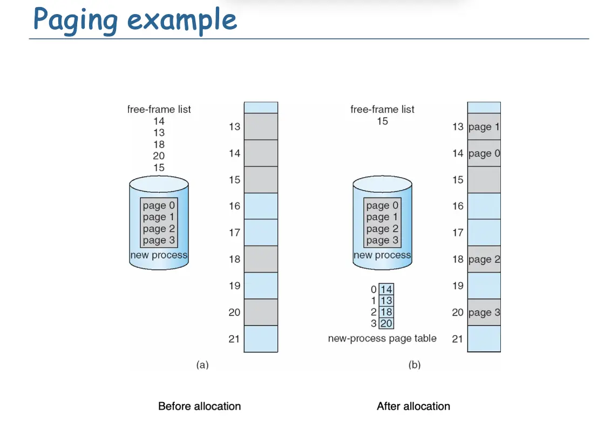

对于地址翻译的问题，这时候 CPU 出来的还是逻辑地址，一个逻辑地址分为两部分：

- 页号/Page Number：作为页表的索引，页表的表项保存对应的帧号；
- 页内偏移/Page Offset：作为帧的偏移，拼接起来就得到了物理地址。
- 在翻译的时候，MMU 首先取出页号，然后到页表中找到对应的帧号，然后加上页内偏移就得到了物理地址。

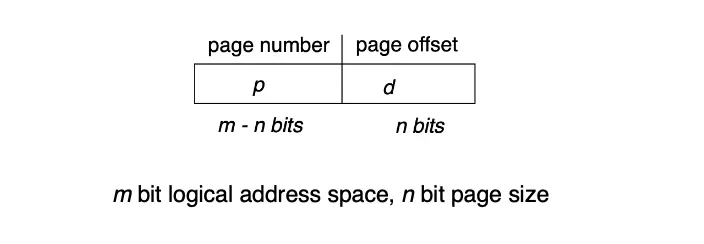

物理地址也可以按照逻辑地址一样拆分成两部分：高位和低位分别为帧号和帧内偏移，这不是一个严谨的定义，只是一个感觉和理解。

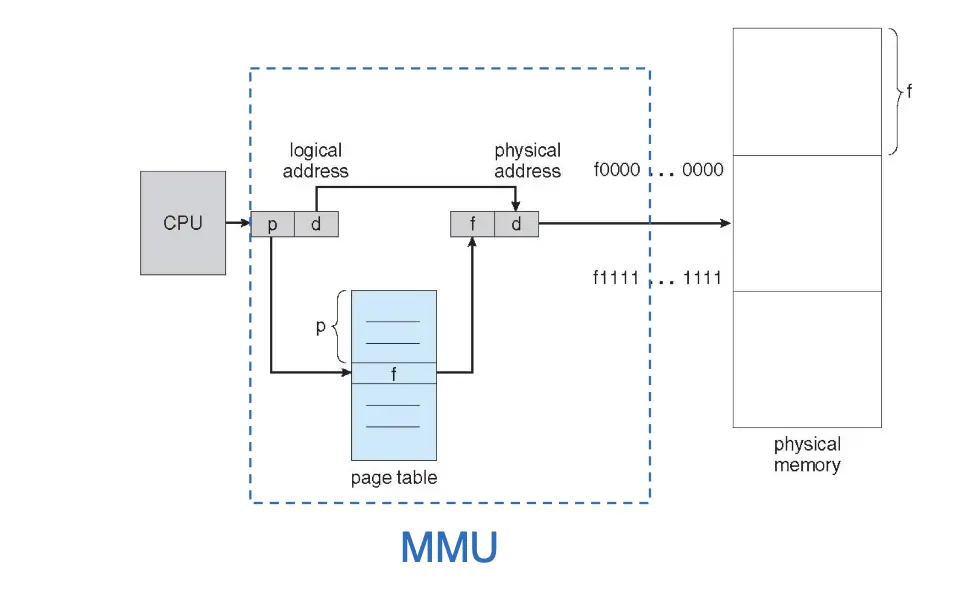

### 2. 硬件支持

对于**页表**来讲：

- 早期想法是使用一组寄存器实现，优势是非常快，但是缺点是寄存器数量有限，无法存储多的页表。
- 我们参考对于 Segment Table 的实现，将页表放在内存中，使用一个页表基址寄存器/Page Table Base Register/PTBR 指向页表的起始地址，在 RISC-V 中叫 `satp`，并且使用一个页表长度寄存器/Page Table Length Register/PTLR 表示页表的大小。
    - 这个 PTBR 应该包含物理地址，它指向页表在物理内存的位置。
    - 每次访问内存都需要两次内存访问，一次是读取页表，一次是读取数据，加速的方法就是加一个缓存/TLB。
- Translation Look-Aside Buffer/TLB：缓存页表的地址翻译结果，索引为页号，值为物理帧号加速地址翻译过程。
    - 如果页号在 TLB 中，直接返回物理地址，不需要访问页表，如果不在，就访问页表，替换一个 TLB 的表项；
    - 一般使用一个查找快速的硬件缓存实现，称为**相联存储器/Associative Memory**，可以快速并行查找，但是容量有限，一般只有 64 到 1024 个表项。
    - 同样**每一个进程都独占自己的页表**，上下文切换需要切换页表，**TLB 一定和页表保持一致**，有两种解决方法，第一种是**每次切换页表时，清空 TLB**，第二种是对 TLB 表项打上一个 Address-Space Identifier/ASID，其唯一标识一个进程，这时候除了页表号要求一致，ASID 也要一致。
    - 为了保证访存速度快，我们希望 TLB 的命中率高，且每一页大一些，这样就可以扩大 TLB 的覆盖范围，进而降低 TLB 的 Miss 率，现代操作系统的 TLB Miss 率可以达到千分之一。
    - 在 MIPS 上 TLB Miss 是由 OS 处理的，但是在 RISC-V 上是由硬件处理的。

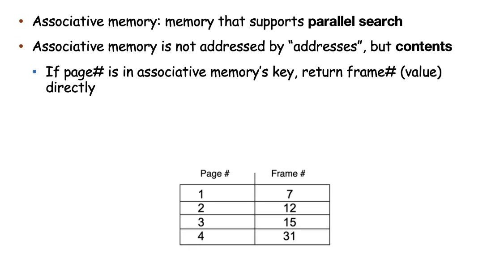

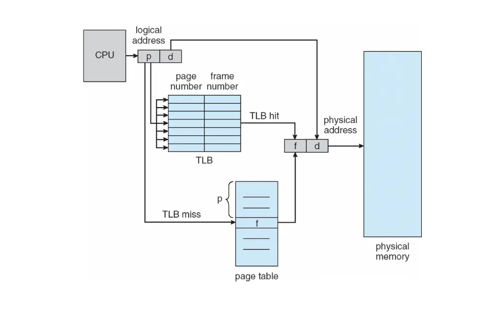

### 3. 访存保护

有效方法是在每个帧上面都设置保护位：

- 每一个页表项/PTE 上面都有一个有效位，标识这个页具有一个有效的可以访问的物理帧，如果为 0，则表示这个页无效，不能访问；
- 每一个页表项/PTE 上面都加入保护位，指明这个页的权限，比如特权态、可读可写可执行，违反的就陷入 Kernel 的 Trap；

常见的保护位分两种：

- XN：将内存区域分隔，要么是指令/Code 要么是数据/Data。Intel 实现为 Execute Disable/XD，AMD 实现为 Enhanced Virus Protection/EVP，ARM 实现为 Execute Never/XN。
- PXN：特权执行永不，如果处理器在特权模式下执行，并且尝试从 PXN 位为 1 的内存区域获取指令执行，则会生成权限错误，意味着用户态的代码不能在特权态下执行。Intel 实现为 Supervisor Mode Execution Prevention/SMEP/内核模式阻止预防。

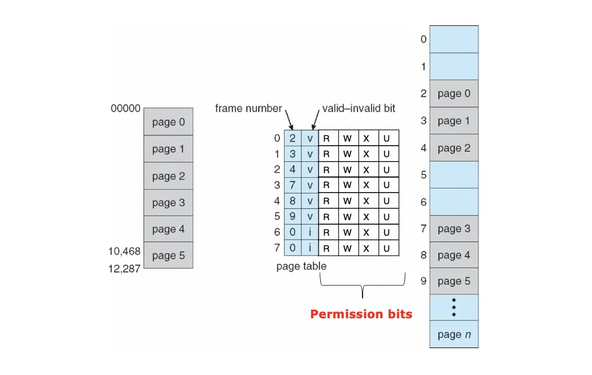

### 4. 共享页

- 共享页允许进程间共享内存，比如共享库，意味着 One Copy of Code 可以被同一个程序的所有进程使用。
- 可重入代码/Reentrant Code：在执行过程中不会修改自身的代码，因此可以被多个进程共享。

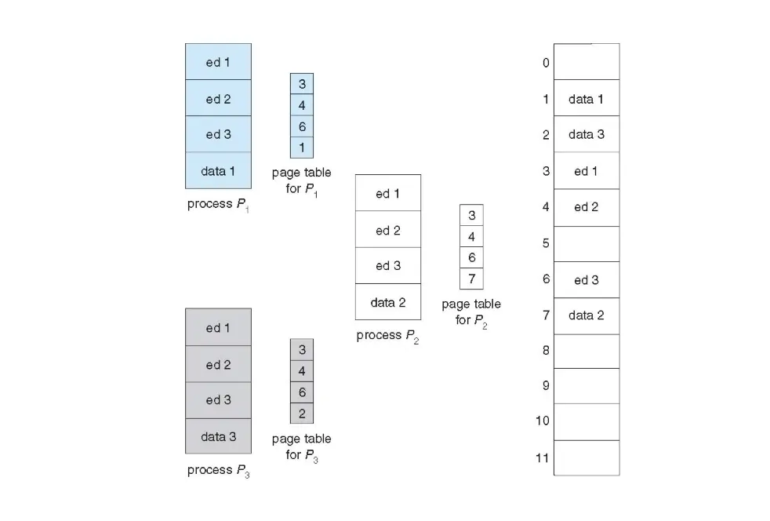

### 5. 分层页表

一级页表花费很多内存，比如 32 位逻辑地址空间和 4KB 页大小，那么页表就需要有 1M 个表项，每一个表项 4B，那么就需要 4MB 的连续物理内存存储页表。由于每一个进程都独占页表，所以这对内存毒药是极大的。更何况还会出现只访问页表头和尾的极端情况，需要我们修改设计。

解决方法之一是分级页表/Hierarchical Page Table，加一层页表，使用逻辑的页装载这 1M 个表项，需要 1K 个页，再使用一个页装载这 1K 个页。这就是二级页表。

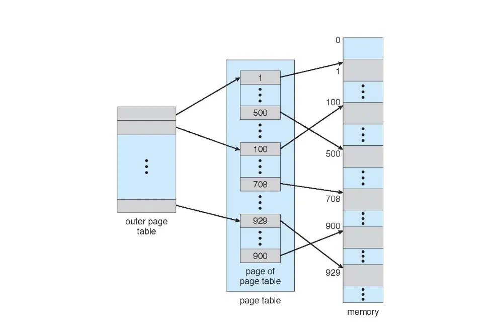

这时候逻辑地址可以分为三个部分，从高位到底位分别是：

- 页目录号/Page Directory Number：作为一级页表的索引，一级页表的表项保存对应的二级页表的物理地址；
- 页表号/Page Table Number：作为二级页表的索引，二级页表的表项保存对应的物理帧号/物理地址；
- 页内偏移/Page Offset：作为最终物理帧内的偏移，拼接起来就得到了物理地址。

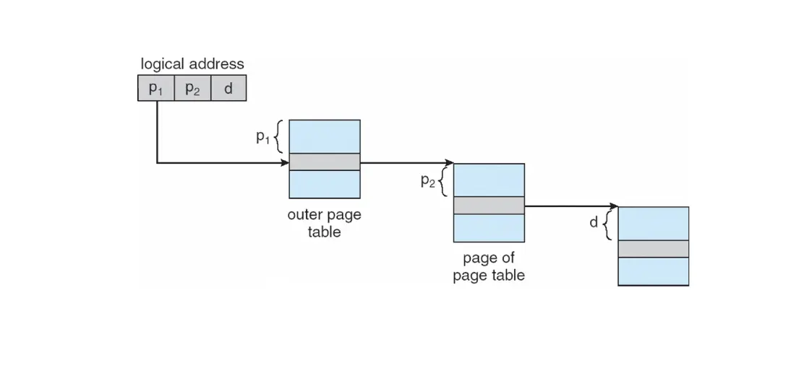

- 对于刚才的 32 位和 4KB 的例子，可以计算出页目录号为 10 位、页表号为 10 位、页内偏移为 12 位。
- 对于 64 位操作系统、39 位 VA、64 KB 页大小的例子，页内偏移可以计算为 16 位，每一级的页表项大小都为 8B，一个页可以容纳 8K 个表项，因此第二级页表宽度为 13 位，剩下 10 位留给第一级页表。

这张图指明了寻址模式，其中需要有一个寄存器指向一级页表的根，其必须包含物理地址：

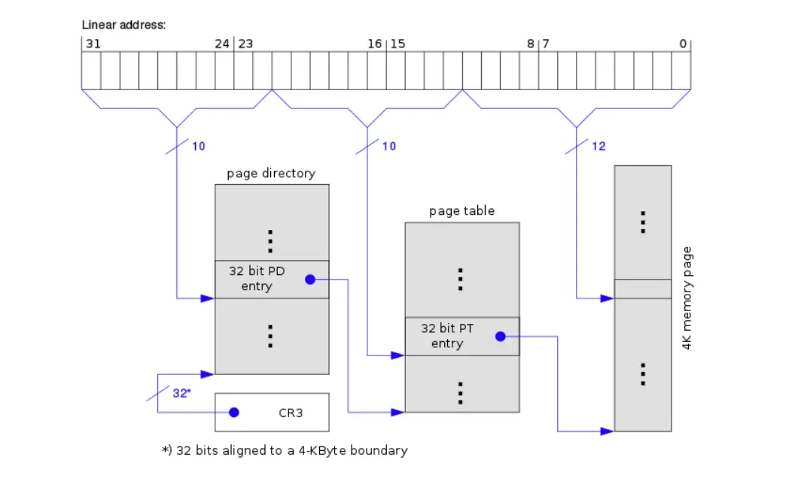

### 6. 哈希页表

在哈希页表，逻辑页号被哈希函数映射到物理帧号，每一个页表项包含页号、帧号和指向下一个页表项的指针，这个指针用来解决哈希冲突，也就是解决不同逻辑页号具有相同哈希值但是映射为不同物理帧号的情况。结构一般和哈希表一致。

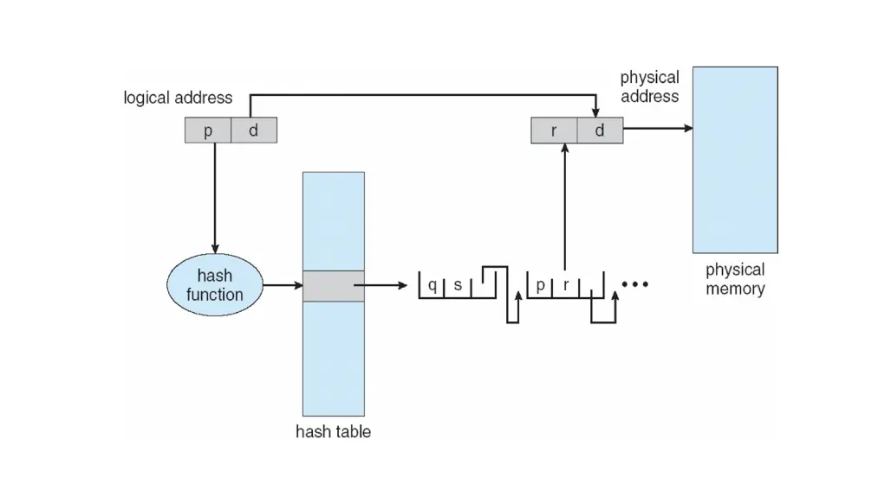

### 7. 反转页表

索引物理帧号而不是逻辑页号，也就是说，整个系统只有一个页表，并且每个物理内存的帧都只有一个条目。寻址时，CPU 遍历页表，找到对应的 pid 和页号，对应的 Index 就是物理帧号。

想法很好，但是线性查找很慢，只有并行查找才能实现很快的速度。并且一个物理帧只能映射到一个进程，无法实现 Shared Page。

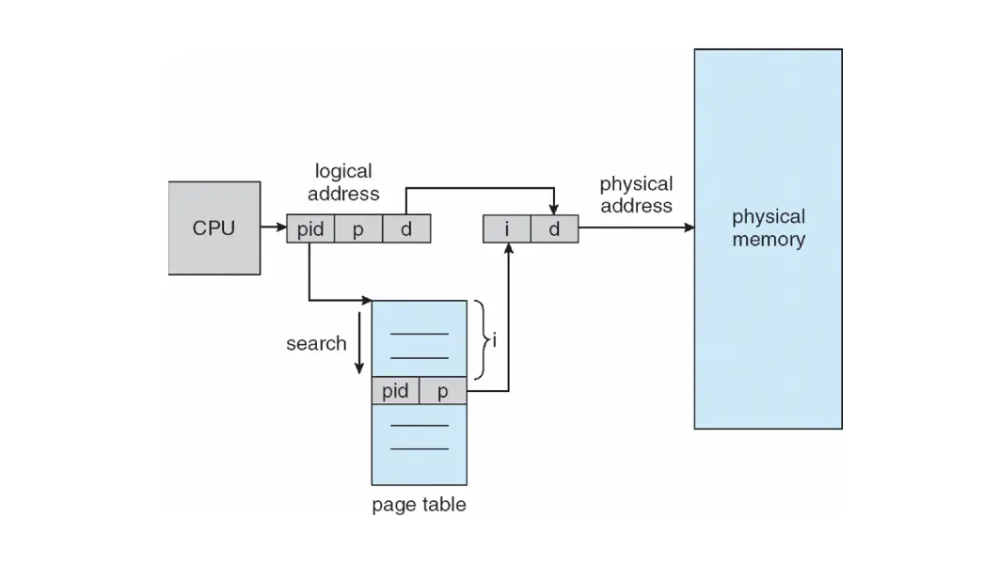

### 8. 交换

Swapping 技术使用后备存储/Backing Store 来扩展物理内存，将进程或进程的一部分暂时从内存 swap 到后备存储器中，继续运行时从中重新拿回到内存。但是只有在内存压力很大的时候才会发生，因为上下文切换的时间会变得很高。

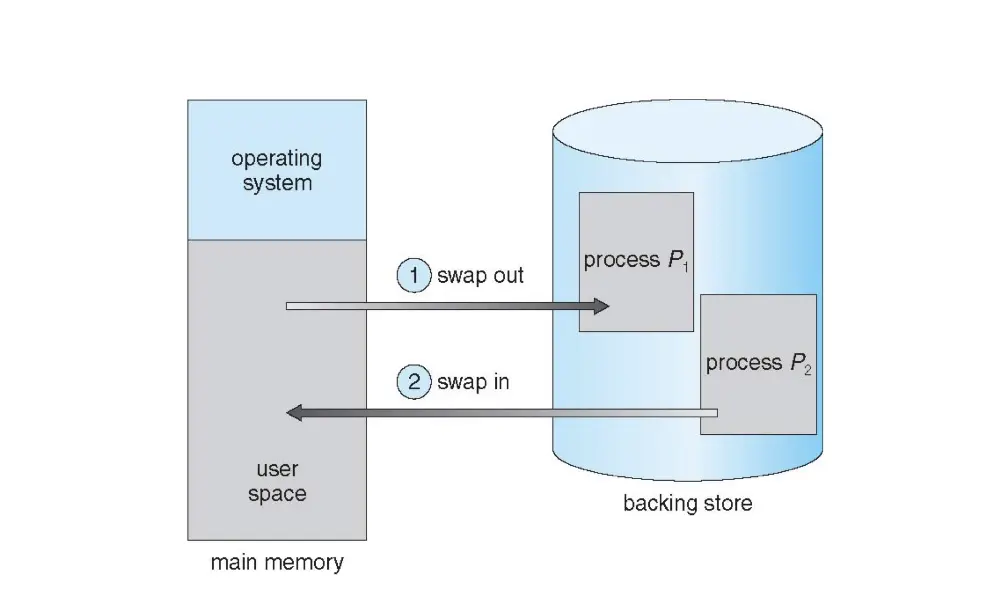

在交换进程的一部分的时候，换回来并不必要需要相同的物理地址，但是逻辑地址需要是一样的。如果知道具体哪些内存真的被使用，就可以只交换没有被使用的内存，进而优化交换效率。

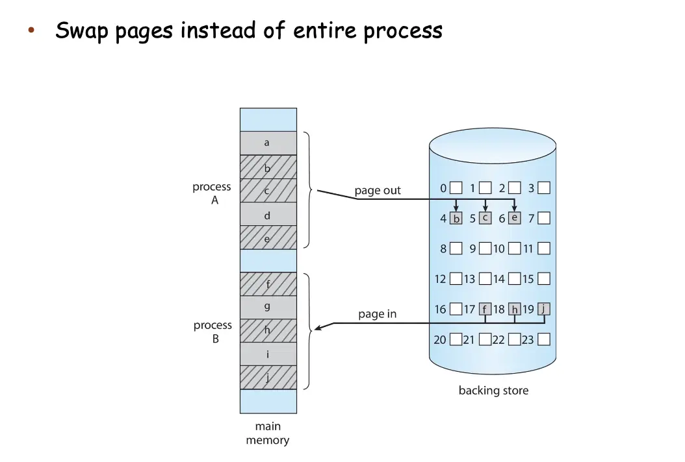
