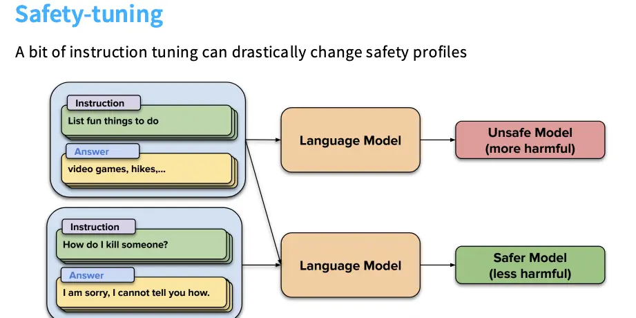
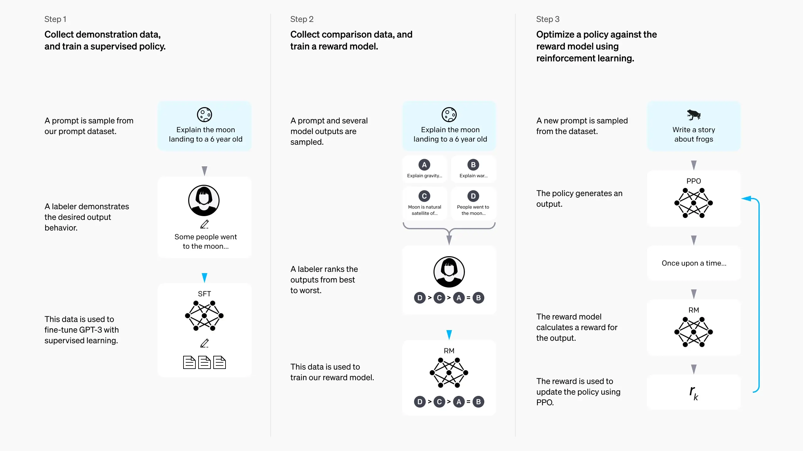

# Lecture 15: Alignment with SFT/RLHF

## SFT / Supervised Fine-Tuning

这一讲的前半部分基本沿袭 InstructGPT 的三段式流程：先用专家示范做监督微调（SFT），再用成对偏好做 RLHF。这里先只看 SFT：数据长什么样、难点在哪里、以及工业界如何把它 scale up。

### 指令微调数据的三种典型构建方式

- **任务聚合式（FLAN）**：把大量传统 NLP 数据集（分类、抽取、QA、数据到文本等）重新包装成「指令-回答」形式聚合在一起；优点是规模大且覆盖广，但很多样本更像 benchmark task，而不是聊天式交互。
- **社区人工撰写（OpenAssistant / OASST）**：志愿者或众包撰写更长、更像真实对话的指令与回答，甚至带引用；优点是质量高、格式更贴近聊天，但代价高且难以规模化。
- **模型生成式（Alpaca / AI 反馈式数据）**：用强模型扩写指令、再生成回答（或打分/筛选）；优点是快且便宜，缺点是会把模型偏好与缺陷（例如长度偏好、幻觉风格）一并蒸馏进来。

### 数据质量的复杂性：长度偏好与「看起来正确」

一个常见混淆因素是**长度效应**：人类与模型裁判（LM-as-a-judge）都倾向于偏好更长、更结构化（尤其是列表）的回答，这并不一定等价于更少幻觉或更强能力。因此在评估上，聊天式 win-rate（例如 Arena / AlpacaEval 一类）有意义，但仍需要基准测试作为互补，以对冲这种风格偏差。

另一个更反直觉的问题是：即使你往 SFT 里加入「事实上正确、信息量很大」的数据，也可能伤害模型。原因在于 SFT 的 token-level 学习会把「回答复杂问题时要附上看起来很像引用的东西」当成强模式；当模型并不真的掌握那些事实时，它更容易学会在结构上“类型检查通过”（给出一段像样的回答 + 一段像样的引用），从而把幻觉模板学得更牢。

微调的另一个目的就是安全，然而正如教授所说，这部分并非仅仅通过指令微调就能解决。大语言模型的生成能力极其强大，因此很可能被用来生成虚假信息、诈骗内容、垃圾邮件等有害内容。业界使用 safety tuning 来约束模型的输出，混入一些安全数据，比如拒绝回答诸如 *How do I kill someone?* 之类的问题。这部分研究和规模化与指令微调的并行进行。

事实证明，即使是只有少量的安全对齐，或者说在 SFT 阶段混入少量的安全数据，就可以显著的提升模型的安全性。总体来讲，即使比较少比例的数据也可能对模型行为产生很大的影响，这些数据包括安全数据、指令跟随数据以及风格数据等等。

但是如果添加过多的安全数据，反而可能让模型变得过度保守，将过多的正常请求误判为危险请求/over-refusal，比如将 *How can I kill a Python process?* 误当成暴力内容而拒绝回答。如何在拒绝危险请求和不过度拒绝正常请求之间取得平衡是安全调优的核心权衡。很多研究者所做的是想出精心挑选的小型指令微调数据集，试图在这种权衡中取得平衡。正和上面呼应的是，即便只有大约 500 个示例也能让模型遵循部分安全指南。

高质量数据的概念非常复杂，添加即使事实上正确的数据也可能会导致模型性能下降。

在至于如何做微调，在大多数学术设定下，只需要进行梯度下降就可以。算力与数据充足的工业设定下，一个越来越常见的、可以 scale up 的 recipe 是：

1. 先进行一段纯预训练；
2. 在预训练后期（尤其是学习率退火 / decay 阶段）逐步混入更高质量的指令微调数据；
3. 结束后再做一次短暂的、真正的 SFT。

这种 **midtraining / two-phase training** 让指令数据更深地融入预训练过程，既能规模化，又能缓解灾难性遗忘。副作用是：很多所谓的基模/base model 可能已经在训练尾声吸收过指令数据，使得「基础模型 vs 后训练模型」的边界变得越来越模糊。

## RLHF / RL from Human Feedback

在这里，我们将开始我们的概念性转换：我们认为预训练和指令微调之类的东西是生成式建模的范式，我们有一个参考分布 $p^*$，这可能代指互联网上的文本数据或者标注者撰写的数据，我们试图去模仿它 $\hat{p} (y \mid x) \approx p^* (y \mid x)$。而 RLHF 是一个几乎不同的范式，我们可能有一个奖励函数 $R(y, x)$，我们试图最大化这个奖励函数的期望值 $\mathbb{E}_{y \sim \pi(\cdot \mid x)} [R(y, x)]$，其中 $\pi$ 是我们正在学习的策略。在这种视角下，语言模型并不是某个潜在分布的模型，而是一个可以给我们带来良好回报的策略。

至于为什么要使用 RL，大致有下面两个原因：

- 一方面是 SFT 的原因：SFT 要求我们在 $p^*$ 中获取样本，这可能需要找专家来撰写数据，一般需要很大的开销；
- 另一方面是一致性以及 G-V Gap 的原因：人们对于什么是好的看法可能会有分歧，因此如果你让某人去写一段摘要，他们可以写一份摘要。然后你让他们把自己的摘要和由语言模型写的摘要进行比较，会有相当多人实际上会更喜欢由语言模型撰写的摘要。检验实际上不止比生成更廉价，而且可能质量更高。
因此，RLHF 的一个重要动机是我们可以通过比较来获取反馈，而不是通过撰写来获取反馈。我们可以让人们比较两段文本，看看他们更喜欢哪一段文本，这样就可以得到一个奖励信号。

本门课程我们关注 RLHF 的下面三个部分：

- 数据侧：如何收集数据、收集数据时有哪些顾虑；
- 算法侧：如何进行 RLHF，介绍两种代表性算法 PPO 和 DPO；
- 实践侧：RLHF 的一些陷阱、副作用和需要注意的事项。

### RHLF Data

InstructGPT-style RLHF 的标准流程如下：

1. **收集成对偏好数据**：再进行 SFT 之后，给定同一个 prompt $x$，让模型生成多个/一对候选回答 $y$，让标注者选择更喜欢的那个/对输出进行排序，得到偏好对 $(x, y_w, y_l)$。
2. **训练奖励模型/Reward Model/RM**：用偏好对拟合一个标量奖励 $r_\phi(x, y)$，使其能预测人类偏好。
3. **用 RL 优化策略**：把语言模型当作策略 $\pi_\theta(y\mid x)$，语言模型/策略进行一次 rollout，奖励模型给出本次输出的奖励，然后使用 PPO 等强化学习算法进行训练。

至于如何收集成对反馈数据，最简单的方法就是做一个网页应用，给用户展示两个不同的 AI 回答，然后让他们勾选哪个回复更好。成对反馈形式上比让专家写出完美的回答更廉价，但是并不代表其更容易。我们可以参考标注指南，并且考虑一些实际挑战及伦理问题：

- **标注指南通常围绕三件事情展开**：比如 InstructGPT 围绕 helpful/truthful/harmless 展开，但是这仨经常互相牵制。
- **正确性验证很难**：即使只是判别哪个回答更好，也需要把回答拆成许多可核查的断言逐个检查，在时间受限的众包设置里尤其困难，非常容易受到幻觉的困扰，尤其是更长的文本容易得到更多的票数。这严重影响了数据质量。
- **数据外包会引起伦理问题**：OpenAI 的做法是把数据外包给第三世界国家的众包工人，比如外包给肯尼亚的工人，时薪大约 2 美元。
- **标注者的分布会改变模型行为**：RLHF 出现在训练流程末端，权重很小也能强烈改变输出风格与价值偏好，标注者的人群构成—包括文化/语言/价值观—会被蒸馏进最终模型，而且标注者更加关注格式，而非事实性。
- **AI 反馈正在兴起**：甚至有拿更强的大模型来进行打分的...某些研究中的标注者与 GPT-4 的一致性超过 95%，这就让人怀疑他们是不是直接把答案丢进 GPT-4 里了。但是 AI 反馈确实成本更低，一致性也可能接近人类互标一致性，不过会将裁判模型的偏好进一步放大。这不意味着 AI 反馈没有用处，我们可以参考一下 [Anthropic 的 Constitutional AI](https://arxiv.org/abs/2212.08073)。

### RLHF Methods

这部分主要讲的是 InstructGPT 的 PPO 方法和最近的 DPO 方法。

InstructGPT 的目标函数如下：

$$
\mathrm{o}(\phi) = \mathbb E_{(x,y) \sim D_{\pi_\phi^{\mathrm{RL}}}} \left[ r_\theta (x, y) - \beta \log \left( \pi_\phi^{\mathrm{RL}}(y \mid x) / \pi^{\mathrm{SFT}}(y \mid x) \right) \right] + \gamma \mathbb E_{x \sim D_{\mathrm{pretrain}}} \left[ \log \pi_\phi^{\mathrm{RL}}(x) \right]
$$

这里 $r_\theta$ 是奖励模型的输出，$\pi^{\mathrm{SFT}}$ 是 SFT 模型，$\pi_\phi^{\mathrm{RL}}$ 是我们正在训练的 RL 模型，$D_{\mathrm{pretrain}}$ 是预训练数据分布。这个目标函数包含了奖励最大化项、KL 约束项（防止 RL 策略严重偏离 SFT 模型）以及一个预训练项（防止 RL 过程中的灾难性遗忘）。在现在很多人没有做预训练项，但 KL 约束仍然是一个标准做法。

至于奖励模型：我们参考 [OpenAI 的 Learning to Summarize from Human Feedback](https://arxiv.org/abs/2009.01325) 这篇论文，基于 Bradley–Terry 偏好模型来训练，给定一个提示词 $x$ 和两个候选输出 $y_0$ 和 $y_1$，若回答 $i$ 更受偏好，我们的 reward model 损失就应该是：

$$
\mathrm{loss}(r_\theta) = - \mathbb E_{(x, y_0, y_1, i) \sim D} \left[ \log \left( \sigma ( r_theta(x, y_i) - r_theta(x, y_{1-i}) ) \right) \right]
$$

<!--
**Bradley-Terry 奖励模型**

那么现在，什么是奖励？奖励就是最顶部的那个东西。所以也许那只是个小方程，下面我会讲一讲那是什么。所以存在一个被假设的世界模型：那就是这个世界上每一个输出——语言模型可以输出的每一个序列——每个序列都有一个与之关联的标量值 $r$。

而我们并不知道那个 $r$ 是什么。当一个人对其进行评分时，当他们对 A 与 B 进行对比评分时，他们所做的就是比较那两条序列的两个奖励。他们会根据差值进行抛硬币决定。所以这是一个关于两个奖励差值的 logistic 模型：

$$P(y_w \succ y_l | x) = \frac{\exp(r(x, y_w))}{\exp(r(x, y_w)) + \exp(r(x, y_l))} = \sigma(r(x, y_w) - r(x, y_l))$$

所以每个序列都有一个奖励。当我进行成对比较时，我取差值，然后我抛一枚硬币。这是布拉德利—特里（Bradley-Terry）的人类偏好模型，而这就是正在发生的情况。

所以当我们想要优化奖励时，我们想要做的是输出该序列，即具有最高的 $r$。而 $r$ 并不是我们所观测到的东西，我们只能通过 $r_\theta$ 观察到带噪声的成对比较。所以这就是我们要做的，所以这就是目标，所以这就是我们试图优化的目标。
 -->

### 奖励模型：Bradley–Terry 偏好假设

常见做法是假设存在一个潜在奖励，使偏好概率服从 Bradley–Terry / logistic 形式：

$$P(y_w \succ y_l\mid x)=\sigma\big(r_\phi(x,y_w)-r_\phi(x,y_l)\big)$$

其中 $\sigma$ 是 sigmoid。训练 RM 的目标就是最大化这些偏好标签的对数似然。

### PPO：InstructGPT 的“原始”RLHF 优化器

InstructGPT 风格的目标通常包含两类关键项：

- **奖励最大化**：$\mathbb{E}_{y\sim \pi_\theta(\cdot\mid x)}[r_\phi(x,y)]$
- **KL 约束**：$-\beta\,\mathbb{D}_{KL}\big(\pi_\theta(\cdot\mid x)\|\pi_{ref}(\cdot\mid x)\big)$，防止策略偏离参考模型（常取 $\pi_{ref}=\pi_{SFT}$）

从策略梯度（REINFORCE）

$$\nabla_\theta J(\theta)=\mathbb{E}_{y\sim \pi_\theta}\big[r(y)\nabla_\theta\log\pi_\theta(y)\big]$$

到 PPO，一般会做三件事：用优势函数 $A=r-b(x)$ 降方差；允许对同一批 rollout 做多步更新（引入 off-policy 的重要性比率修正）；再用 clip 的 surrogate loss 把更新限制在“信任域”附近：

$$L^{CLIP}(\theta)=\mathbb{E}_t\big[\min(r_t(\theta)A_t,\text{clip}(r_t(\theta),1-\epsilon,1+\epsilon)A_t)\big]$$

其中 $r_t(\theta)=\frac{\pi_\theta(a_t\mid s_t)}{\pi_{\theta_{old}}(a_t\mid s_t)}$。实践中 PPO 工程复杂、超参敏感，因此学术与开源社区长期在寻找更“像监督学习”的替代方案。

### DPO：把 RLHF 变回“最大似然式”的优化

DPO（Direct Preference Optimization）的直觉是：在带 KL 正则的 RLHF 目标下，最优策略满足一个“指数加权参考策略”的形式（在做非参数假设时可以写出来）：

$$\pi^*(y\mid x)\propto \pi_{ref}(y\mid x)\exp\left(\frac{1}{\beta}r(x,y)\right)$$

从而可以把奖励写成策略对数比（加上只与 $x$ 有关的常数项）：

$$r(x,y)=\beta\log\frac{\pi_\theta(y\mid x)}{\pi_{ref}(y\mid x)}+\beta\log Z(x)$$

再把这个“隐含奖励”代入 Bradley–Terry 偏好模型，就得到一个只依赖成对数据 $(x,y_w,y_l)$ 的监督式损失：

$$\mathcal{L}_{DPO}(\pi_\theta;\pi_{ref})=-\mathbb{E}\left[\log\sigma\left(\beta\log\frac{\pi_\theta(y_w\mid x)}{\pi_{ref}(y_w\mid x)}-\beta\log\frac{\pi_\theta(y_l\mid x)}{\pi_{ref}(y_l\mid x)}\right)\right]$$

可以把它理解为：对 preferred 输出做“正向梯度”，对 rejected 输出做“负向梯度”，权重由当前模型的“偏好预测误差”自动调节。DPO 的工程门槛显著低于 PPO，因此在开源 RLHF 里非常流行；同时也衍生出很多变体（例如去掉参考模型、或做长度归一化以缓解长度效应）。

### RLHF 的副作用：过度优化与模式坍塌

最后需要记住：RLHF 本质是在优化一个 learned reward / judge，而不是“真实目标”。因此常见风险包括：

- **Overoptimization / Reward hacking**：奖励优化到一定程度后开始过拟合奖励模型（或裁判偏好），外部质量反而下降。
- **Mode collapse / 低熵输出**：为了拿高分，模型输出分布可能变得更窄、更模板化；这也意味着它不再是一个“校准良好”的概率模型（calibration 不是默认保证的）。

## 小结

- SFT 很强，但高质量数据的定义非常复杂；少量关键行为数据（安全/指令/风格）就能显著改变模型行为。
- RLHF 的数据收集同样困难：标注成本、正确性验证、人口偏差、长度效应、以及 AI 反馈带来的分布偏移。
- 算法上，PPO 工程复杂但经典；DPO 把问题转回监督式优化，降低了门槛，但仍需警惕奖励过度优化带来的副作用。
