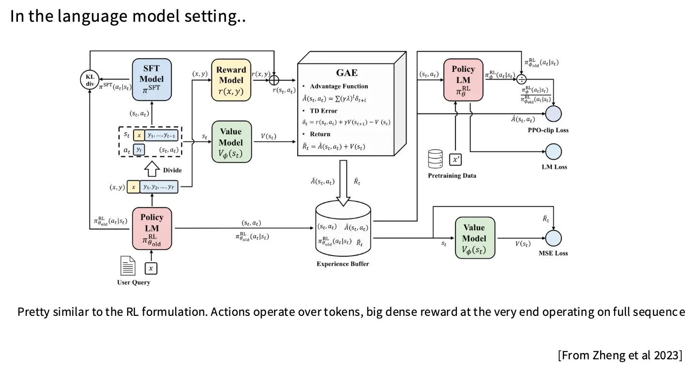
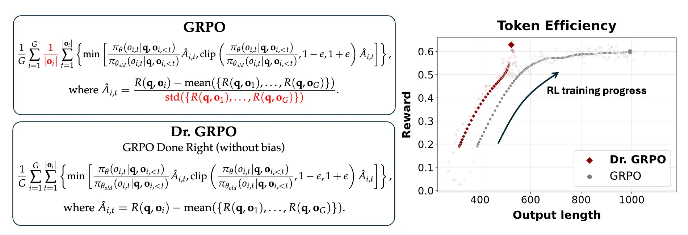
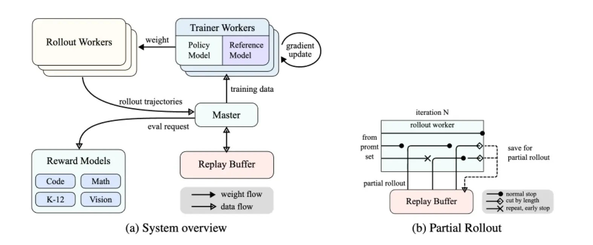
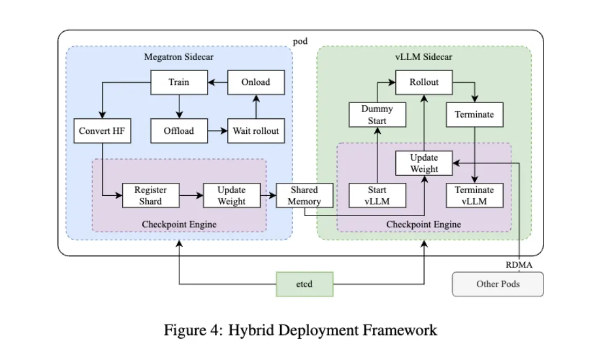

# Lecture 16: Reinforcement Learning from Verifiable Rewards

!!! Abstract "Outline"

    这一讲先回顾 DPO 及其变体，讨论 RLHF 的常见陷阱（过度优化与模式崩塌），然后转向 RLVR 范式，从 PPO 到 GRPO 的演进，最后通过 DeepSeek R1、Kimi k1.5 和 Qwen 3 三个案例研究展示工业级 RL 训练的实际流程与工程细节。

    - [x] [1. Review: DPO with Its Variants](#review-dpo-with-its-variants)
    - [x] [2. Pitfalls of RLHF](#1-pitfalls-of-rlhf)
    - [x] [3. From RLHF to RLVR](#2-from-rlhf-to-rlvr)
    - [x] [4. Case Studies](#3-case-studies)

## Review: DPO with Its Variants

我们提到说，DPO 的设计初衷是简化 PPO，去掉 Reward Model 和 on-policy rollout，直接在成对数据上做监督学习，对于好的回复做正向梯度，对坏的回复做负向梯度。上一节介绍了 DPO 的损失函数为：

$$
\mathcal L_{\mathrm{DPO}}(\pi_\theta; \pi_{\mathrm{ref}}) = - \mathbb E_{(x, y_w, y_l) \sim \mathcal D} \left[ \log \sigma \left( \beta \log \frac{\pi_\theta(y_w \mid x)}{\pi_{\mathrm{ref}}(y_w \mid x)} - \beta \log \frac{\pi_\theta(y_l \mid x)}{\pi_{\mathrm{ref}}(y_l \mid x)} \right) \right]
$$

这中间的推导环节大概是：使用非参数估计的知识，在闭式解的形势下将 $\pi_\theta$ 和 $r$ 联系起来，通过策略参数化奖励，然后代入 Bradley–Terry 偏好模型的损失函数中，得到 DPO 的损失函数。其策略梯度如下：

$$
\nabla_\theta \mathcal L_{\mathrm{DPO}}(\pi_\theta; \pi_{\mathrm{ref}}) = - \beta \mathbb E_{(x, y_w, y_l) \sim \mathcal D} \left[ \sigma(\hat{r}_\theta(x, y_l) - \hat{r}_\theta(x, y_w))\left[ \nabla_\theta \log \pi(y_w \mid x) - \nabla_\theta \log \pi(y_l \mid x) \right] \right]
$$

DPO 一度主导开源模型后训练，Chris Manning 展示的排行榜上早期顶级开源 RLHF 模型几乎全用 DPO。

DPO 之后涌现大量 `*PO` 变体，两个被广泛使用：

- **SimPO**（无参考策略）：(1) 去掉 $\pi_{\mathrm{ref}}$；(2) 按回答长度归一化更新步长。

$$
\mathcal L_{\mathrm{SimPO}}(\pi_\theta) = - \mathbb E \left[ \log \sigma \left( \frac{\beta}{|y_w|} \log \pi_\theta(y_w \mid x) - \frac{\beta}{|y_l|} \log \pi_\theta(y_l \mid x) - \gamma \right) \right]
$$

- **Length-normalized DPO**：保留参考策略但按长度归一化。

$$
\max_{\pi_\theta} \mathbb E_{y_c, y_r \sim \mathcal D} \left[ \log \sigma \left( \frac{\beta}{|y_c|} \log \frac{\pi_\theta(y_c \mid x)}{\pi_{\mathrm{ref}}(y_c \mid x)} - \frac{\beta}{|y_r|} \log \frac{\pi_\theta(y_r \mid x)}{\pi_{\mathrm{ref}}(y_r \mid x)} \right) \right]
$$

这两个算法在 AI2 TULU3 中被广泛尝试。但是值得注意的是：RL 结论高度依赖实验设置（比如环境设置、基模的选择）。AI2 早期发现 PPO > DPO；但 TULU3 发现好的 SFT 会吃掉 PPO/DPO 的增益，唯一有优势的反而是 Length-normalized DPO。**不要将单篇 RL 论文的结论奉为绝对真理，要小心阅读过多的笼统结论。**

## 1. Pitfalls of RLHF

**过度优化 / Over-optimization**：

- 本质上是 RL 领域的过拟合：随着对测录的的优化加深，Proxy Reward 得分上升，但与真实人类偏好偏离，性能呈**倒 U 型下降**（Reward Hacking）。
- 在 Expert Iteration、Best-of-$n$、PPO 中均被验证。
- 但用无噪声的 LM 偏好（如 single-prompt GPT-4 评分）时过度优化消失，说明**根源在于奖励信号的噪声**。

**模式崩塌 / Mode Collapse**：

- 预训练/SFT 是概率建模（分布匹配），RLHF 是优化 Policy，底层不再有客观数据分布。
- 多篇论文（Anthropic、GPT-4、学界）显示 RLHF 后模型**校准性大幅下降**、过度自信，输出熵显著降低。

## 2. From RLHF to RLVR

人类反馈难以大规模优化。那参考一下 RL 在围棋/AlphaGo、蛋白质折叠/AlphaFold 中的成功经验：在奖励真实且可被快速验证的领域，RL 能够全面释放其潜力。能不能在语言模型中也找到这样的领域？答案是几乎可以的。使用预训练、SFT 以及 RLHF 可以将模型提升到 GPT-3.5 级别的水准，而 RLVR/Reinforcement Learning from Verifiable Rewards 则是通往 o1/R1 级别的必经之路。

### 2.1 From PPO to GRPO

理解 GRPO 前必须先理解 PPO。从最简单的策略梯度一步步到 PPO：

- 使用策略梯度方法对策略进行直接优化；
- 使用优势函数和 TRPO 来降低方差并允许多次更新同一批数据；
- PPO 用裁剪策略比值代替 TRPO 的 KL 约束，新策略偏离旧策略太远时，梯度被截断在 $1 \pm \epsilon$，自然限制更新步幅。

最后得到的损失函数是：

$$
L^{\mathrm{CLIP}}(s, a, \theta_k, \theta) = \min \left( \frac{\pi_\theta(a \mid s)}{\pi_{\theta_k}(a \mid s)} A^{\pi_{\theta_k}}(s, a), \operatorname{clip} \left( \frac{\pi_\theta(a \mid s)}{\pi_{\theta_k}(a \mid s)}, 1 - \epsilon, 1 + \epsilon \right) A^{\pi_{\theta_k}}(s, a) \right)
$$

对于传统的面向控制和游戏的领域，ICLR 的博客列出了 [*PPO 的 37 个实现细节*](https://iclr-blog-track.github.io/2022/03/25/ppo-implementation-details/)，下面这张图简单概述了 Language Model RL 中 PPO 的训练流程：



以 AlpacaFarm PPO 实现为例，关键工程细节：

- **奖励重塑/Reward Shaping**：LM RL 更像 Contextual Bandit 而非多步 MDP。序列末尾给 terminal reward，将 reward model 输出的整句的奖励放到最后一个有效 token 上。并且对每个 token 给逐 token 的 KL 惩罚，防止偏离参考模型太远。实践中对 KL 散度做 clamp，当散度是负的时候，这时候不因为模型更不自信而给予奖励，帮助训练稳定性。

    ```py
    kl = torch.clamp(logprobs - ref_logprobs, min=0.0)
    non_score_rewards = -self.kl_ctl.value * kl
    shaped_rewards = non_score_rewards.clone()

    terminal_positions = (responses != self.tokenizer.pad_token_id).sum(dim=-1) - 1
    shaped_rewards[batch_idx, terminal_positions] += rewards
    ```

- **广义优势估计/GAE**：主要是为了降低方差，并且改善由于 reward model 给出的奖励集中在最后一个 token 上导致的稀疏奖励问题，改善 token-level 的 credit assignment 问题。

    $$
    \hat{A}_t^{\mathrm{GAE}(\gamma, \lambda)} := \sum_{l=0}^{\infty} (\gamma \lambda)^l \delta_{t+l}^V \quad \text{where} \quad \delta_t^V = r_t + \gamma V(s_{t+1}) - V(s_t)
    $$

    PPO 用优势估计而非绝对奖励。由于 LM RL 本质是 bandit 问题，$\gamma = \lambda = 1$ 时 GAE 退化为 reward-to-go 减 value。

### 2.2 GRPO

GRPO/Group Relative Policy Optimization 以及新算法的提出主要是为了解决 PPO 和 DPO 的一些实际问题：

- PPO：实现复杂，价值模型占大量显存，甚至和原来的 Policy 一样大，也需要额外调参。
- DPO：数据不天然成对（数学题看正误而非偏好），且是离线算法。 

GRPO 保留 PPO 的裁剪框架，**砍掉 GAE 和 Reward Model**，代之以**组内 Z-Score**。

给定输入问题，让策略模型生成 $G$ 个回答（一个 Group）。对第 $i$ 个回答的优势估计：

$$
A_i = \frac{r_i - \mathrm{mean}(\{r_1, \cdots, r_G\})}{\mathrm{std}(\{r_1, \cdots, r_G\})}
$$

使用可以**可以验证的分数** $A_i$ 代替 PPO 中通过训练出来的 Reward Model 计算的优势估计，这就是 RLVR 名字的来源。GRPO 的完整目标函数如下：

$$
\begin{aligned}
\mathcal J_{\mathrm{GRPO}} & (\theta) = \mathbb E [q \sim P(Q), \{o_i\}_{i=1}^G \sim \pi_{\theta_{\mathrm{old}}}(O \mid q)] \\
& \biggl[ \frac{1}{G} \sum_{i=1}^{G} \biggl( \min \biggl( \frac{\pi_\theta(o_i \mid q)}{\pi_{\theta_{\mathrm{old}}}(o_i \mid q)} A_i, \; \mathrm{clip}\biggl( \frac{\pi_\theta(o_i \mid q)}{\pi_{\theta_{\mathrm{old}}}(o_i \mid q)}, 1-\epsilon, 1+\epsilon \biggr) A_i \biggr) - \beta \mathbb D_{\mathrm{KL}}(\pi_\theta \| \pi_{\mathrm{ref}}) \biggr) \biggr]
\end{aligned}
$$

这里面 KL 散度不是经典的实现，而是修改成了下面的形式为了降低方差：

$$
\mathbb D_{\mathrm{KL}}(\pi_\theta \| \pi_{\mathrm{ref}}) = \frac{\pi_{\mathrm{ref}}(o_i \mid q)}{\pi_{\theta}(o_i \mid q)} - \log \frac{\pi_{\mathrm{ref}}(o_i \mid q)}{\pi_{\theta}(o_i \mid q)} - 1
$$

对于在线训练，GRPO 退化为极简策略梯度：比同组更好的加权，低于平均的降权。GRPO 的实现非常精简，这有很大程度上归功于不需要价值函数。可以参考 [*McGill-NLP/nano-aha-moment 的实现*](https://github.com/McGill-NLP/nano-aha-moment/blob/main/nano_r1_script.py#L567)。大概流程是：对每一个 rollout 计算奖励，计算每个组的均值和标准差，计算 KL 散度，最后计算 GRPO 的损失并更新。

至于为什么 GRPO 可以 work，不同题目难度不同。同组平均奖励是题目难度的天然 baseline，减去它就能剔除难度影响，实现方差缩减。但是 [*Dr. GRPO*](https://arxiv.org/abs/2503.20783) 指出 GRPO 的两个数学缺陷：

**缺陷一：除以标准差破坏基线无偏性**：

策略梯度定理中可以减去任何与动作无关的基线 $b(s)$，无偏性来源于 $\sum_a b(s) \nabla \pi(a \mid s, \theta) = b(s) \nabla 1 = 0$。减均值保持无偏，但**除以标准差**是非线性操作，破坏无偏性。在实践中，题目太简单或太难时标准差极小，除以它给过易/过难题赋予极高梯度权重，阻碍学习中等难度题。Dr. GRPO 通过直接减去组内奖励的均值来修正这个问题：

$$
\hat{A}_{i,t} = R(\mathbf{q}, \mathbf{o}_i) - \mathrm{mean}(\{R(\mathbf{q}, \mathbf{o}_1), \ldots, R(\mathbf{q}, \mathbf{o}_G)\})
$$

**缺陷二：长度归一化的恶意动机**：

GRPO 早期实现将奖励除以回答长度，导致：

- 模型预测自己无法答对（负奖励）时，疯狂增加废话长度来稀释惩罚；
- 正确回答则尽量极短。

去掉长度归一化后性能相同甚至更好，回答长度自然趋于稳定。这表明**推理模型中的极长 CoT 有一部分可能只是算法奖励偏置的副产物**，比如原来的 GRPO 可能在无意中激励了模型生成冗长的 CoT 来规避惩罚。



## 3. Case Studies

### 3.1 DeepSeek R1

DeepSeek R1 证明简单的 Outcome-based Rewards + GRPO 足以追平 o1。不需要 MCTS，不需要 PRM。

**R1-Zero**：

- 奖励：准确率（对错）+ 格式（`<think>` 标签）；
- 基模：DeepSeek-V3（未经 SFT），直接 RL；
- 结果：只是比 o1 略差一些；
- 现象：训练过程中 CoT 长度持续增长，出现 "aha moment" 式的回溯/自我反思。但争议认为 CoT 长度变长是为了弥补回答不出问题引起的负面奖励，aha moment 可能是基座预训练数据中已有的特性被诱导出来。

**R1**：基座模型 DeepSeek-V3 $\rightarrow$ Reasoning SFT $\rightarrow$ RL(GRPO) $\rightarrow$ General SFT/RLHF。和 R1-Zero 相比，R1 增加了 Reasoning SFT 的训练，对 CoT 也增加了一致性的奖励，也加了一些 Non-verifiable 奖励。

1. **Reasoning SFT**：直接进行 RL 训练生层的 CoT 数据质量不高，并且冷启动时期训练也不稳定。所以使用少量高质量的 CoT 数据对模型进行微调，这些数据的来源包括：few-shot prompting、直接提示模型，产生带反思的详细答案，以及别的数据。这步提升了模型回答的可解释性。**即使一小部分高质量的 CoT 数据也能显著提升从从基模开始训练的稳定性和最终性能**。
2. **推理 RL**：和 R1-Zero 基本相同，但是增加了语言一致性奖励/Language Consistency Reward，计算 CoT 中目标语言词汇比例。监管这样的对齐导致模型性能的略微下降，但提升了可读性，和人类偏好对齐。
3. **通用 SFT**：一般跑两轮。推理数据（比如写一个证明）用不可验证任务，DeepSeek V3 做裁判，非推理数据用 DeepSeek V3 的 SFT 数据集增强。
4. **RLHF**：可验证任务复用 R1-zero 的 RLVR，不可验证任务用 DeepSeek V3 RLHF pipeline，但是这部分使用 GRPO 而不是 DPO 之类的。

**蒸馏**：DeepSeek R1 生成八十万条 CoT traces，SFT 蒸馏到 Qwen 2.5 系列。效果非常棒。

**失败尝试**：

- **PRM/Process Reward Model**：细粒度步骤难定义，中间推理步骤是否正确也很难确定，也很容易被 Reward Hacking。
- **MCTS**：很难 Scale up。

### 3.2 Kimi k1.5

与 R1 同期，路径略不同，数据把控更精细。

**数据清洗**：

- 标准的数据收集：覆盖 STEM、竞赛、通用推理，按领域学科分类确保均衡，甚至不止覆盖了纯文本推理，还有图片文本问答。
- 剔除选择题和判断题：这是为了防止假阳性。
- **Best-of-N 难度筛选**：基座模型高温采样 10 次，按 pass rate 衡量难度，过滤简单题。

**RL 算法**

采用基于参考的奖励模型：

$$
\max_\theta \mathbb E_{(x, y^*) \sim \mathcal D} \left[ \mathbb E_{(y,z) \sim \pi_\theta} [r(x, y, y^*)] - \tau \mathrm{KL}(\pi_\theta(x) \| \pi_{\theta_i}(x)) \right]
$$

中间可以知道：

$$
\begin{aligned}
r(x, y, y^*) &- \tau \log Z = \tau \log \frac{\pi^* (y, z \mid x)}{\pi_{\theta_i}(y, z \mid x)}. \\ 
L(\theta) = \mathbb E_{(x, y^*) \sim \mathcal D} \biggl[ \mathbb E_{(y, z) \sim \pi_{\theta_i}} & {} \biggl[ \left( r(x, y, y^*) - - \tau \log Z - \tau \log \frac{\pi_\theta(y, z \mid x)}{\pi_{\theta_i}(y, z \mid x)}\right)^2 \biggl] \biggr].
\end{aligned}
$$

进而得出 Baselined Policy Gradient with KL Regularization 的更新公式：

$$
\frac{1}{k} \sum_{j=1}^{k} \left( \nabla_\theta \log \pi_\theta(y_j, z_j \mid x)(r(x, y_j, y^*) - \bar{r}) - \frac{\tau}{2} \nabla_\theta \left( \log \frac{\pi_\theta(y_j, z_j \mid x)}{\pi_{\theta_i}(y_j, z_j \mid x)} \right)^2 \right)
$$

这就很像是 GRPO 了，说明正确运用基线和正则化后，不同 RL 算法殊途同归。

**长度控制**：为了避免出现和原 GRPO 一样的长度奖励偏置，Kimi 设计了一个基于长度的奖励：

$$
\mathrm{len\_reward}(i) = \begin{cases} \lambda & \text{if } r(x, y_i, y^*) = 1 \\ \min(0, \lambda) & \text{if } r(x, y_i, y^*) = 0 \end{cases}, \quad \lambda = 0.5 - \frac{\mathrm{len}(i) - \mathrm{min\_len}}{\mathrm{max\_len} - \mathrm{min\_len}}
$$

$\lambda \in [-0.5, 0.5]$，较长序列 $\lambda$ 更负。效果为：答对鼓励短 CoT，答错鼓励长度贴近且比同批次平均更短）。此机制在训练后期才启用。

**其他**：这里更重要的是 Kimi 的刘你问提到了 RL Infra 的细节与要求

- **课程学习**：标注难度从易到难，按 $(1 - \text{success\_rate})$ 采样避免重复已解决的题。
- **奖励设计**：代码题用 ground truth 生成新测试用例；数学题用 800k 样本训练一个 CoT Reward Model 用于做等价性判断。
- **RL Infra**：
    - RL 训练阶段比正常的训练阶段更难将 GPU 完全利用起来，一方面是因为 rollout 其实就是 inference 的过程，这部分本来就是比较慢的；另一方面是必须在 rollout 和训练之间频繁的切换，inference 阶段必须将输出轨迹传回训练节点，训练节点又要将新的权重传回推理节点，通信开销也是巨大的。另一方面，长的 CoT 也会导致 batch 内样本的长度差异很大，导致 GPU 利用率不高。
    - RL 训练节点与推理框架（vLLM）分离。Training Phase 完成后 Megatron offload GPU 到共享内存，vLLM 加载权重做 rollout，完成后释放回 Megatron。通过 NCCL/RDMA 通信权重。





### 3.3 Qwen 3

**Pipeline**：和前面的基本相同，从基模开始，先做 Long-CoT 的冷启动，接着是 Reasoning RL，Thinking Mode Fusion，最后是 General RL，得到旗舰模型。然后再使用 Strong-to-Weak Distillation 将旗舰模型蒸馏到轻量级模型。

**SFT + Reasoning RL**：和前面类似，先用少量高质量的 CoT 数据微调模型，提升模型的推理能力和训练稳定性。这部分的数据筛选包括：使用 best-of-n 筛选难题，移除不实用 CoT 就可以得到正确答案的题目，移除和验证集过于相似的题目，以及进行人工筛选。Qwen 的 Reasoning RL 阶段和 R1 类似，使用 GRPO 进行训练，但是甚至只是用了 3995 条数据就达到了不错的效果。

**Thinking Mode Fusion**

训练好思考模型后，构造带 `/think` 和 `/no_think` 标签的数据微调。Thinking Mode 下模型在 `<think>...</think>` 中输出完整推理；Non-Thinking Mode 下 `<think></think>` 为空，直接给答案。

模型在**同一参数集合**里无缝切换 System 1/快思考和 System 2/慢思考。

**动态截断思考**：推理时插入特殊字符串（如 "Considering the limited time by the user, I have to give the solution based on the thinking directly now.\n</think>.\n\n"），模型中止思考并直接作答。这不是显式训练的能力，而是 Thinking Mode Fusion 的自然涌现。

Thinking budget 从 1K → 32K tokens，AIME'24/25、LiveCodeBench、GPQA Diamond 的 pass@1 持续提升，始终高于 Non-Thinking 基线。

**RL 的 Trade-off**

各阶段消融实验：

- Stage 2/Reasoning RL：大幅提升数学/代码推理
- Stage 3/Thinking Mode Fusion：灵活思考/不思考切换
- Stage 4/General RL：提升通用任务能力（ArenaHard、Agent、IF），但是在思考模式下，损害了数学/STEM/代码能力，反而在非思考模式下提升了这些能力。

这意味着通才 vs 专才的权衡、思考与非思考的权衡在后训练中不可避免。
